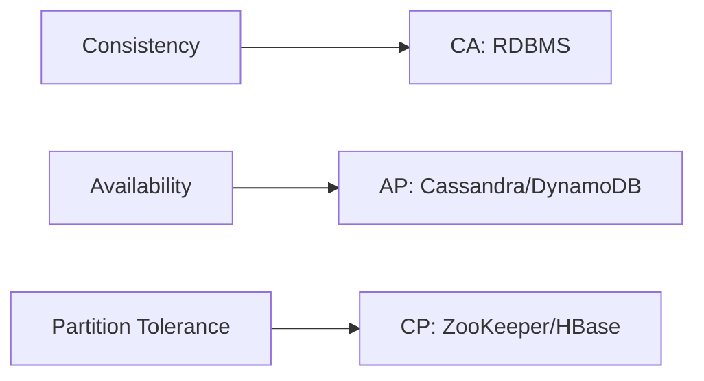
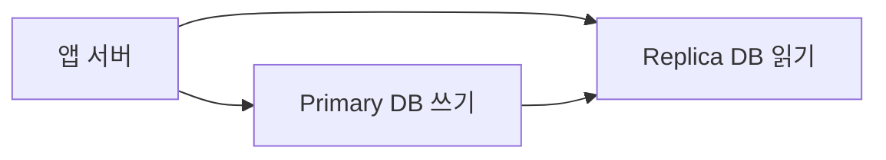
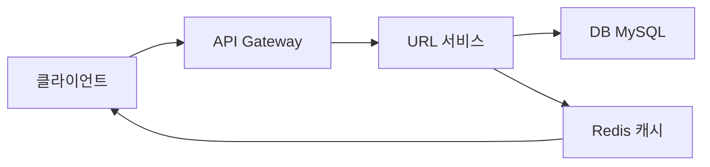
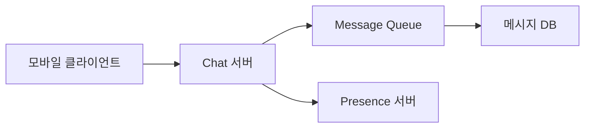
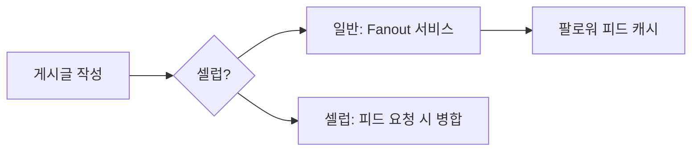
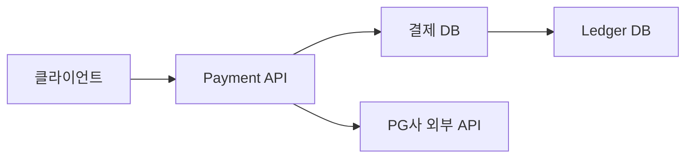
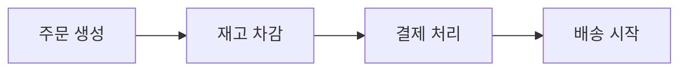

시스템 디자인 면접은 정답이 없습니다. 면접관은 **"당신이 어떻게 생각하는가"** 를 봅니다. 요구사항을 명확히 하고, 트레이드오프를 인지하며, 단계적으로 확장하는 사고 과정을 평가합니다. 이 글은 검증된 답변 프레임워크와 실전 문제 5개를 통해 시스템 디자인 면접을 완벽히 준비합니다.

---

## 1. 답변 프레임워크 — RESHADED

시스템 디자인 면접에서 체계적으로 답변하는 프레임워크입니다.

| 단계 | 의미 | 소요 시간 |
|---|---|---|
| **R**equirements | 요구사항 명확화 | 3~5분 |
| **E**stimation | 규모 추정 | 3~5분 |
| **S**torage | 저장소 선택 | 3~5분 |
| **H**igh-Level Design | 고수준 설계 | 5~10분 |
| **A**PI Design | API 설계 | 5분 |
| **D**etailed Design | 세부 설계 | 10~15분 |
| **E**dge Cases | 엣지 케이스 | 5분 |
| **D**iscuss Bottlenecks | 병목 토론 | 5분 |

> **비유:** RESHADED는 건물 설계 순서와 같습니다. 용도 파악(Requirements) → 면적 계산(Estimation) → 자재 선정(Storage) → 도면(High-Level) → 출입구 위치(API) → 내부 구조(Detailed) → 비상구(Edge Cases) → 내진 설계(Bottlenecks)

### 요구사항 명확화 핵심 질문

면접관에게 반드시 물어야 할 질문들:

```
1. 기능 요구사항 (Functional Requirements)
   - "가장 중요한 기능 3가지는 무엇인가요?"
   - "사용자가 할 수 있는 액션은 무엇인가요?"
   - "어떤 기능은 스코프 밖인가요?"

2. 비기능 요구사항 (Non-Functional Requirements)
   - "예상 DAU(일일 활성 사용자)는 얼마인가요?"
   - "허용 지연 시간(Latency)은 얼마인가요?"
   - "가용성(Availability)은 몇 9s가 목표인가요?" (99.9% vs 99.99%)
   - "읽기/쓰기 비율은 어떻게 되나요?"
   - "데이터 일관성이 중요한가요, 가용성이 더 중요한가요?"
```

### 규모 추정 — 자주 쓰이는 숫자들

| 항목 | 대략적 수치 |
|---|---|
| 초당 쓰기 가능 HDD | 100MB/s |
| 초당 쓰기 가능 SSD | 500MB/s |
| 메모리 읽기 속도 | ~10GB/s |
| 1GB 메모리 | ~10억 바이트 |
| 1일 = 86,400초 | ≈ 100,000초 |
| 1MB 텍스트 | 약 100만 자 |
| 평균 이미지 크기 | ~300KB |
| 트윗 하나 | ~300B |

**QPS 계산 예시 (Twitter 규모):**
- DAU: 3억
- 사용자당 하루 읽기 10회: 30억 읽기/일
- 30억 / 86400초 ≈ **35,000 QPS**
- 쓰기 QPS: 읽기의 약 1/10 = **3,500 QPS**

---

## 2. 핵심 개념 — 면접에서 반드시 나오는 이론

### CAP 정리

분산 시스템에서 **Consistency(일관성)**, **Availability(가용성)**, **Partition tolerance(분단 내성)** 중 동시에 3가지를 보장할 수 없습니다.



실제 분산 시스템에서 네트워크 분단(Partition)은 불가피합니다. 따라서 실질적 선택은 **CP vs AP** 입니다.

- **CP 선택**: 금융 거래, 재고 관리 (데이터 정확성 우선)
- **AP 선택**: SNS 피드, 장바구니 (가용성 우선)

> **비유:** ATM 기기 네트워크가 끊겼을 때 — CP는 "연결이 복구될 때까지 거래 불가", AP는 "일단 돈은 주고 나중에 정산"

### BASE vs ACID

| 속성 | ACID (RDB) | BASE (NoSQL) |
|---|---|---|
| 일관성 | 강한 일관성 | 결과적 일관성 |
| 가용성 | 낮음 | 높음 |
| 확장성 | 수직 확장 중심 | 수평 확장 |
| 사용 예 | 금융, ERP | SNS, 로그, 캐시 |

### 로드 밸런싱 알고리즘

| 알고리즘 | 설명 | 적합 환경 |
|---|---|---|
| Round Robin | 순서대로 분배 | 서버 사양 동일 |
| Weighted Round Robin | 가중치 기반 분배 | 서버 사양 다름 |
| Least Connections | 연결 수 가장 적은 서버 | 처리 시간 가변 |
| IP Hash | 클라이언트 IP 기반 | 세션 유지 필요 |
| Random | 무작위 | 간단한 시스템 |

### 캐싱 전략

**읽기 전략:**
- **Cache-Aside (Lazy Loading)**: 캐시 미스 시 DB에서 읽어 캐시에 저장. 가장 일반적
- **Read-Through**: 캐시가 DB 읽기를 투명하게 처리
- **Refresh-Ahead**: TTL 만료 전 미리 갱신

**쓰기 전략:**
- **Write-Through**: 캐시와 DB 동시 쓰기. 일관성 높음, 지연 있음
- **Write-Behind (Write-Back)**: 캐시에만 쓰고 비동기로 DB 반영. 성능 높음, 데이터 유실 위험
- **Write-Around**: 캐시 건너뛰고 DB 직접 쓰기. 자주 읽지 않는 데이터에 적합

> **비유:** Cache-Aside는 책이 필요할 때 서재에 가져오는 것, Read-Through는 사서가 알아서 준비해두는 것, Write-Through는 노트에 쓰면서 동시에 칠판에도 쓰는 것

### 데이터베이스 분리 전략

**읽기/쓰기 분리 (Read Replica):**



**샤딩(Sharding):**
수평 파티셔닝. 데이터를 여러 DB 서버에 분산.

- **Range Sharding**: ID 범위로 분할 (핫스팟 위험)
- **Hash Sharding**: 해시값으로 균등 분산 (범위 쿼리 어려움)
- **Directory Sharding**: 별도 매핑 테이블 사용 (유연하지만 복잡)

**샤딩 단점:** Cross-Shard 조인 불가, 재샤딩 어려움, 트랜잭션 복잡.

### 일관성 수준 (Consistency Levels)

분산 DB에서의 읽기/쓰기 일관성 옵션:

- **Strong Consistency**: 모든 노드에서 동일한 최신 데이터 읽음
- **Eventual Consistency**: 시간이 지나면 모든 노드 동일 (일시적 불일치 허용)
- **Read-Your-Writes**: 쓴 사람은 즉시 읽을 수 있음
- **Monotonic Reads**: 같은 클라이언트는 이전보다 오래된 데이터를 보지 않음

---

## 3. 실전 문제 1 — URL Shortener (bit.ly)

### 요구사항 명확화

**기능 요구사항:**
- 긴 URL을 받아 짧은 URL 생성
- 짧은 URL 접속 시 원본으로 리다이렉트
- 링크 만료 기간 설정 (선택)
- 클릭 통계 조회 (선택)

**비기능 요구사항:**
- 쓰기 QPS: 1,000/초
- 읽기 QPS: 100,000/초 (읽기:쓰기 = 100:1)
- 저장 기간: 10년
- 가용성 99.9%

### 규모 추정

- 10년간 쓰기: 1,000 × 86,400 × 365 × 10 = **315억 건**
- URL당 평균 저장 크기: 500B
- 총 저장 용량: 315억 × 500B ≈ **15TB**
- QPS 읽기: 100,000/초

### 고수준 설계



**URL 생성 흐름:**
1. 클라이언트가 긴 URL 전송
2. URL 서비스가 7자리 단축 코드 생성
3. DB에 저장 (원본 URL, 단축 코드, 만료일)
4. 단축 URL 반환

**리다이렉트 흐름:**
1. 클라이언트가 단축 URL 접속
2. Redis 캐시 조회 → 히트 시 301/302 리다이렉트
3. 미스 시 DB 조회 → 캐시 저장 → 리다이렉트

### API 설계

```
POST /api/v1/shorten
Request: { "original_url": "https://...", "expire_date": "2027-01-01" }
Response: { "short_url": "https://bit.ly/3kZx9aP" }

GET /{short_code}
Response: 302 Location: https://original-long-url.com
```

### 핵심 설계 포인트 — 단축 코드 생성

**방법 1: 해시 (MD5/SHA-256)**

```
MD5("https://example.com/long-path") → 긴 해시값 → 앞 7자리 사용
```

문제: 해시 충돌 가능성, 중복 URL 처리 복잡.

**방법 2: Base62 인코딩 (권장)**

62진수(0-9, a-z, A-Z) 사용. 7자리 = 62^7 ≈ 3.5조 가지.

```
1. DB Auto-Increment ID 생성 (분산이면 Snowflake ID)
2. ID를 Base62로 인코딩
3. 인코딩 결과를 단축 코드로 사용
```

장점: 충돌 없음, 예측 불가능하게 하려면 ID를 섞어서 사용.

**301 vs 302 리다이렉트:**
- **301**: 영구 리다이렉트 (브라우저가 캐시 → 이후 서버 미거침, 클릭 통계 불가)
- **302**: 임시 리다이렉트 (매번 서버 거침 → 클릭 통계 가능, 트래픽 증가)

통계가 중요하면 **302** 선택.

### 세부 설계 — 데이터베이스 스키마

```sql
CREATE TABLE url_mappings (
    id          BIGINT PRIMARY KEY AUTO_INCREMENT,
    short_code  VARCHAR(7) UNIQUE NOT NULL,
    original_url TEXT NOT NULL,
    user_id     BIGINT,
    created_at  DATETIME DEFAULT NOW(),
    expire_at   DATETIME,
    click_count BIGINT DEFAULT 0,
    INDEX idx_short_code (short_code),
    INDEX idx_expire_at (expire_at)
);
```

**만료 처리:** 배치 잡으로 주기적으로 만료 URL 삭제. 조회 시에도 만료 여부 확인.

**클릭 통계 고성능 처리:**
매 클릭마다 DB 업데이트는 병목. Redis의 `INCR`로 카운트 후 주기적 DB 동기화.

### 병목 분석

<details>
<summary>면접 포인트 펼치기</summary>

**병목 1: 단일 DB 부족**
읽기 100,000 QPS → Read Replica 추가. 쓰기는 Primary 한 대로 충분 (1,000 QPS).

**병목 2: 캐시 없을 때 DB 과부하**
Redis 캐시로 인기 URL을 메모리에. 캐시 히트율 목표 99%.

**병목 3: 분산 환경 ID 생성**
Auto-Increment는 단일 DB 종속. Snowflake ID (Twitter 방식) 또는 DB 별도 분리(Ticket Server).

**엣지 케이스:**
- 악성 URL 필터링: 구글 세이프 브라우징 API 연동
- 만료된 URL 접근: 404 반환
- 동일 URL 중복 요청: 기존 단축 URL 반환 (幂等성)

</details>

---

## 4. 실전 문제 2 — 채팅 시스템 (WhatsApp)

### 요구사항 명확화

**기능 요구사항:**
- 1:1 채팅 및 그룹 채팅 (최대 500명)
- 텍스트, 이미지, 파일 전송
- 읽음 확인, 온라인 상태 표시
- 메시지 푸시 알림

**비기능 요구사항:**
- DAU: 5,000만
- 메시지 지연: 100ms 이하
- 가용성 99.99%
- 메시지 순서 보장

### 핵심 기술 선택 — 실시간 통신

**HTTP Polling:** 클라이언트가 주기적으로 새 메시지 요청. 지연 높음, 서버 부하 높음. 비추천.

**Long Polling:** 서버가 새 메시지 있을 때까지 연결 유지. 상태 관리 복잡.

**WebSocket (권장):** 양방향 지속 연결. 채팅에 최적. 서버 메모리 증가.

**Server-Sent Events (SSE):** 서버 → 클라이언트 단방향. 알림 전용에 적합.

### 고수준 설계



**채팅 서버:** WebSocket 연결 관리. 서버당 ~10만 연결 유지.

**메시지 흐름:**
1. 클라이언트 A → Chat 서버 A (WebSocket)
2. Chat 서버 A → Message Queue (Kafka)
3. Message Queue → Chat 서버 B (수신자가 연결된 서버)
4. Chat 서버 B → 클라이언트 B (WebSocket)
5. Message Queue → Message DB (영구 저장)

**사용자 오프라인 시:**
메시지를 DB에 저장 + 푸시 알림(FCM/APNs) 전송.

### 세부 설계 — 메시지 저장

**메시지 DB 선택:** Cassandra 권장.

이유:
- 수평 확장 용이
- 쓰기 성능 우수
- 시계열 데이터(시간순 메시지) 적합
- Facebook Messenger, Discord 실제 사용

**스키마 설계 (Cassandra):**

```
-- 채팅방별 메시지 (파티션 키: channel_id)
CREATE TABLE messages (
    channel_id  UUID,
    message_id  TIMEUUID,  -- 시간 기반 UUID로 순서 보장
    sender_id   UUID,
    content     TEXT,
    type        TEXT,      -- text/image/file
    created_at  TIMESTAMP,
    PRIMARY KEY (channel_id, message_id)
) WITH CLUSTERING ORDER BY (message_id DESC);
```

### 핵심 설계 포인트

**메시지 순서 보장:**

글로벌 유일 ID + 시간 순서를 동시에 보장해야 합니다.

- Snowflake ID: 타임스탬프(41bit) + 서버ID(10bit) + 시퀀스(12bit)
- TIMEUUID: UUID에 시간 정보 내장 (Cassandra에서 사용)

**읽음 확인 구현:**

```
-- 사용자별 마지막 읽은 메시지 저장
last_read_message_id 업데이트 시 ack 발생
상대방에게 WebSocket으로 읽음 이벤트 전송
```

**온라인 상태 (Presence):**
- Redis에 `user:{id}:online` 키 저장, TTL 30초
- 클라이언트가 30초마다 heartbeat 전송
- TTL 만료 = 오프라인

### 병목 분석

<details>
<summary>면접 포인트 펼치기</summary>

**병목 1: Chat 서버 수평 확장**
WebSocket은 상태(stateful) 연결. 특정 서버에 연결된 사용자끼리만 직통 가능.
해결: ZooKeeper 또는 Redis Pub/Sub으로 서버 간 메시지 라우팅.

**병목 2: 대규모 그룹 채팅**
500명 그룹에서 메시지 하나 = 500개 WebSocket 전송.
해결: Fanout 서비스 분리, 사용자가 연결되어 있는 서버에만 전달.

**병목 3: 메시지 재전송**
네트워크 불안정 시 중복 전송 방지.
해결: 클라이언트가 UUID 메시지 ID 생성, 서버가 멱등 처리.

**엣지 케이스:**
- 오프라인 중 메시지 수신: DB 저장 + 재접속 시 미읽은 메시지 동기화
- 미디어 파일: 별도 S3 저장, URL만 메시지에 포함
- 메시지 삭제: Soft Delete (deleted_at 필드), 실제 데이터는 보관

</details>

---

## 5. 실전 문제 3 — 뉴스 피드 시스템 (Instagram/Facebook Feed)

### 요구사항 명확화

**기능 요구사항:**
- 팔로우하는 사람의 게시글이 피드에 노출
- 피드는 최신순 (또는 알고리즘 순)
- 게시글 작성, 좋아요, 댓글

**비기능 요구사항:**
- DAU: 1억
- 유명인(셀럽): 수천만 팔로워
- 피드 로딩 지연: 500ms 이하
- 일관성: 몇 초 지연 허용 (결과적 일관성)

### 핵심 설계 — Fanout 전략

뉴스 피드의 핵심 문제는 **Fanout(전파)** 입니다. 한 사람이 게시글을 올리면 팔로워 전원에게 전달해야 합니다.

**Fanout-on-Write (Push 모델):**

게시글 작성 시 팔로워의 피드 캐시에 미리 저장.

장점: 읽기 빠름. 단점: 셀럽(팔로워 1000만) 게시글 = 1000만 건 쓰기.

**Fanout-on-Read (Pull 모델):**

피드 요청 시 팔로우 목록 조회 후 게시글 합산.

장점: 쓰기 비용 없음. 단점: 읽기 느림, 팔로우 수 많으면 느려짐.

**하이브리드 모델 (Instagram 방식):**
- 일반 사용자: Fanout-on-Write (사전 계산)
- 셀럽: Fanout-on-Read (요청 시 합산)



### 고수준 설계

**게시글 작성 흐름:**
1. 사용자 → API 서버 → 게시글 DB 저장
2. Message Queue(Kafka)에 이벤트 발행
3. Fanout 서비스가 이벤트 소비
4. 팔로워 목록 조회 → 각 팔로워의 피드 캐시(Redis)에 post_id 삽입

**피드 조회 흐름:**
1. 클라이언트 → API 서버
2. Redis에서 사용자 피드 캐시 조회 (post_id 목록)
3. post_id로 실제 게시글 데이터 조회 (Redis 또는 DB)
4. 셀럽 팔로우 시: 셀럽 게시글 별도 조회 후 병합 + 정렬
5. 결과 반환

### 세부 설계 — 데이터 모델

```sql
-- 게시글
CREATE TABLE posts (
    post_id     BIGINT PRIMARY KEY,  -- Snowflake ID
    user_id     BIGINT NOT NULL,
    content     TEXT,
    media_urls  JSON,
    created_at  DATETIME,
    INDEX idx_user_created (user_id, created_at DESC)
);

-- 팔로우 관계
CREATE TABLE follows (
    follower_id  BIGINT,
    followee_id  BIGINT,
    created_at   DATETIME,
    PRIMARY KEY (follower_id, followee_id),
    INDEX idx_followee (followee_id)
);
```

**Redis 피드 캐시 구조:**

```
Key: feed:{user_id}
Type: Sorted Set (score = timestamp, member = post_id)
TTL: 7일

ZADD feed:123 1716000000 "post_456"
ZREVRANGE feed:123 0 19  # 최신 20개
```

### 병목 분석

<details>
<summary>면접 포인트 펼치기</summary>

**병목 1: 셀럽 게시글 Fanout**
1000만 팔로워 × 1건 게시글 = 1000만 Redis 쓰기. Fanout 서비스 수평 확장 + 비동기 처리 필수.

**병목 2: 피드 캐시 미스**
신규 사용자 또는 캐시 만료 시 콜드 스타트 문제.
해결: 캐시 미스 시 DB에서 최근 게시글 가져와 캐시 워밍업.

**병목 3: 게시글 업데이트/삭제**
이미 Fanout된 게시글이 수정/삭제될 때.
해결: 피드 캐시에는 post_id만 저장. 실제 게시글 조회 시 DB에서 최신 데이터 반환. 삭제된 게시글은 조회 시 필터링.

**알고리즘 피드:**
단순 시간순 대신 ML 스코어를 Sorted Set score로 사용. 정기적으로 스코어 재계산하여 캐시 업데이트.

</details>

---

## 6. 실전 문제 4 — 검색 자동완성 시스템 (Google Search)

### 요구사항 명확화

**기능 요구사항:**
- 타이핑 중 실시간 검색어 제안 (Top 5)
- 인기 검색어 기반 제안
- 사용자 맞춤 제안 (선택)

**비기능 요구사항:**
- 응답 시간: 100ms 이하
- DAU: 5,000만
- 검색어 수: 수십억 개

### 핵심 자료구조 — Trie

자동완성의 핵심은 **Trie(트라이)** 자료구조입니다.

> **비유:** Trie는 사전 색인과 같습니다. "sea"를 찾으면 s → e → a 순서로 경로를 따라가고, 그 아래 모든 단어(sea, search, season)를 빠르게 찾을 수 있습니다.

```
        root
         |
    s ── e ── a(빈도:100)
    │         └── r ── c ── h(빈도:50)
    e ── r ── v ── e ── r(빈도:200)
```

각 노드에 **상위 K개 검색어**를 미리 저장하면 조회 O(접두사 길이)로 제안이 가능합니다.

### 고수준 설계

**데이터 수집 파이프라인:**
1. 검색 로그 수집 (Kafka)
2. 배치 처리로 검색어 빈도 집계 (Spark/Hadoop)
3. Trie 재빌드 (주 1회 또는 일 1회)
4. Trie를 Redis 또는 CDN에 배포

**자동완성 조회 흐름:**
1. 사용자 타이핑 → 디바운싱(300ms) → API 호출
2. CDN 캐시 확인 (인기 접두사는 엣지에 캐시)
3. 캐시 미스 → Trie 서버 조회
4. Top 5 검색어 반환

### 세부 설계 — Trie 최적화

**메모리 최적화:**
완전한 Trie 대신 압축 Trie(PATRICIA Trie) 또는 접미사만 저장.

**분산 저장:**
알파벳 첫 글자로 샤딩. a-f 서버, g-l 서버, m-s 서버, t-z 서버 등.

**실시간 반영:**
배치 외에 검색 빈도 실시간 업데이트:
- Redis Sorted Set으로 실시간 인기어 관리
- 일정 주기로 Trie에 반영

```
ZADD trending:search 1000 "코딩 면접"
ZINCRBY trending:search 1 "시스템 디자인"
ZREVRANGE trending:search 0 4  # Top 5
```

<details>
<summary>면접 포인트 펼치기</summary>

**병목 1: Trie 크기**
전체 Trie를 메모리에 유지하기 어려울 때. 해결: 인기 접두사만 캐시, 나머지는 DB에서 조회.

**병목 2: 다국어 지원**
한국어, 중국어 등은 조합 문자. 초성 기반 검색, 음절 단위 Trie 구성 등 언어별 전처리 필요.

**병목 3: 악성 검색어 필터링**
실시간 인기어에 스팸/비속어 유입 방지. 인기어 필터 목록 유지, 자동화 + 수동 검수.

**개인화:**
쿠키/로그인 기반으로 사용자 최근 검색어를 로컬에 저장하고 글로벌 제안과 병합.

</details>

---

## 7. 실전 문제 5 — 결제 시스템 (Payment Gateway)

### 요구사항 명확화

**기능 요구사항:**
- 결제 처리 (카드, 간편결제)
- 결제 취소/환불
- 결제 이력 조회
- 이중 결제 방지

**비기능 요구사항:**
- 정확성: 금액 오차 절대 불허
- 가용성: 99.99% (연 52분 이하 다운타임)
- 처리량: 최대 1,000 TPS
- 감사 추적(Audit Trail): 모든 트랜잭션 기록

### 핵심 설계 원칙

결제 시스템은 **정확성(Correctness)이 성능보다 우선**합니다.

> **비유:** 결제 시스템은 금고와 같습니다. 조금 느려도 됩니다. 하지만 돈이 잘못 들어가거나 나오면 절대 안 됩니다.

**멱등성(Idempotency):**
같은 결제 요청을 여러 번 보내도 한 번만 처리되어야 합니다.

```
클라이언트가 idempotency_key 생성 (UUID)
서버가 동일 key 재요청 시 이전 결과 반환
```

### 고수준 설계



**결제 처리 흐름:**
1. 클라이언트 → 결제 요청 (idempotency_key 포함)
2. DB에 결제 의도(Payment Intent) 생성 (PENDING 상태)
3. PG사(Payment Gateway) API 호출
4. PG사 응답에 따라 COMPLETED / FAILED 상태 업데이트
5. Ledger(원장)에 거래 기록

**이중 결제 방지:**

```sql
-- idempotency_key에 UNIQUE 제약
CREATE TABLE payments (
    payment_id      BIGINT PRIMARY KEY,
    idempotency_key VARCHAR(64) UNIQUE NOT NULL,
    user_id         BIGINT,
    amount          DECIMAL(19, 4),  -- 소수점 정확도
    currency        CHAR(3),
    status          ENUM('PENDING', 'COMPLETED', 'FAILED', 'REFUNDED'),
    created_at      DATETIME,
    updated_at      DATETIME
);
```

### 세부 설계 — 이중 장부 (Double-Entry Ledger)

금융 시스템의 핵심: 모든 거래는 **차변(Debit)과 대변(Credit)으로 기록**.

```sql
CREATE TABLE ledger_entries (
    entry_id    BIGINT PRIMARY KEY,
    payment_id  BIGINT NOT NULL,
    account_id  BIGINT NOT NULL,
    type        ENUM('DEBIT', 'CREDIT'),
    amount      DECIMAL(19, 4) NOT NULL,
    balance     DECIMAL(19, 4) NOT NULL,  -- 거래 후 잔액 스냅샷
    created_at  DATETIME NOT NULL
);
-- 모든 entry의 DEBIT 합계 = CREDIT 합계 (항상 균형)
```

**소수점 처리:** 부동소수점 대신 `DECIMAL` 또는 최소 단위(원, 센트)로 정수 저장.

**결제 상태 기계:**

```
PENDING → PROCESSING → COMPLETED
                     → FAILED
COMPLETED → REFUND_PENDING → REFUNDED
```

### 결제 실패 재시도 전략

PG사 API 실패 시 무조건 재시도는 이중 결제를 유발합니다.

**Idempotent Retry:**
1. 같은 `idempotency_key`로 재시도
2. PG사가 멱등 처리를 지원하면 중복 차단
3. Exponential Backoff + Jitter로 재시도 간격 조절

**결제 상태 동기화:**
PG사와 내부 DB 상태가 불일치할 때(네트워크 장애 등):
- **Webhook**: PG사가 결과를 능동적으로 전송
- **Polling**: 일정 간격으로 PG사에 상태 조회
- 두 방법 병행 권장

<details>
<summary>면접 포인트 펼치기</summary>

**병목 1: DB 트랜잭션 성능**
결제는 ACID 트랜잭션 필수. MySQL InnoDB 권장. 샤딩보다는 수직 확장 우선.

**병목 2: PG사 외부 API 지연**
PG사 응답이 3~5초 걸릴 수 있음. 비동기 처리 + 사용자에게 "처리 중" 응답 후 Webhook으로 결과 통보.

**병목 3: 감사 추적**
모든 상태 변경을 별도 감사 로그 테이블에 기록. 원본 데이터 수정 금지 (INSERT-only 패턴).

**엣지 케이스:**
- 환불 후 재환불 시도: payment_id + 환불 상태 체크
- 부분 환불: 남은 금액 추적
- 통화 환율: 결제 시점 환율 고정 저장
- 카드 한도 초과: PG사 에러 코드 파싱 후 사용자 친화적 메시지

</details>

---

## 8. 면접관이 보는 포인트 — 점수를 올리는 방법

### 면접관이 평가하는 5가지 기준

**1. 요구사항 명확화 능력**

문제를 받자마자 설계를 시작하는 지원자는 감점입니다. 반드시 3~5분 요구사항을 명확히 해야 합니다. 좋은 지원자는 면접관도 생각 못한 질문을 합니다.

**2. 트레이드오프 인식**

"이 방법은 이런 장점이 있지만 이런 단점이 있습니다"를 자연스럽게 말해야 합니다. 정답이 없는 문제에서 자신의 선택 이유를 설명하는 능력이 핵심입니다.

**3. 규모 감각**

"약 35,000 QPS로 추정됩니다" vs "많은 요청이 예상됩니다". 전자가 훨씬 높은 점수를 받습니다. 기본 수치를 외우고 빠르게 계산하는 연습이 필요합니다.

**4. 단계적 확장**

처음부터 완벽한 시스템을 설계하려 하지 마세요. MVP를 빠르게 그리고 병목을 찾아 개선하는 과정을 보여주세요. "일단 단일 DB로 시작하고, QPS가 늘면 Read Replica를 추가합니다"

**5. 실제 사례 언급**

"Twitter는 이 문제를 이렇게 해결했습니다", "Cassandra를 선택한 이유는 Facebook Messenger가 사용하는 것과 같은 이유로..."

> **비유:** 시스템 디자인 면접은 건축가 심사와 같습니다. 도면의 완성도보다 "왜 이 구조를 선택했는가"와 "어떤 위험을 미리 고려했는가"를 봅니다.

### 흔한 실수 Top 5

1. **요구사항 확인 없이 바로 설계 시작** — 면접관이 의도한 범위를 놓침
2. **고수준 없이 세부 설계로 돌입** — 큰 그림을 못 보는 인상
3. **숫자 없는 추상적 설명** — "빠르다", "많다"는 의미 없음
4. **완벽한 설계를 한 번에 그리려는 시도** — 시간 부족, 소통 부재
5. **DB 선택 이유 없이 MySQL 또는 MongoDB 지정** — 왜 그 DB인지가 중요

### 권장 학습 자료

- System Design Interview (Alex Xu) 1, 2권
- Designing Data-Intensive Applications (Martin Kleppmann)
- High Scalability (highscalability.com)
- Engineering Blog: Netflix, Uber, Airbnb, LinkedIn

---

## 9. 보조 개념 정리 — 면접에서 자주 등장하는 키워드

### CDN (Content Delivery Network)

정적 자원(이미지, JS, CSS, 영상)을 사용자에 가까운 엣지 서버에서 제공합니다.

> **비유:** CDN은 전국에 분산된 편의점 창고입니다. 서울 본사 창고에서 부산까지 배달하는 대신, 부산 창고에서 바로 꺼내줍니다.

**Push CDN vs Pull CDN:**
- **Push**: 컨텐츠 업로드 시 CDN에 직접 업로드. 자주 변경되지 않는 정적 자원에 적합.
- **Pull**: 첫 요청 시 원본 서버에서 가져와 캐시. 이후 요청은 CDN에서 반환. 운영이 간편하고 가장 일반적.

**TTL(Time-To-Live) 설정:**
- 자주 바뀌는 콘텐츠: 짧은 TTL (수 분)
- 정적 자산(버전 포함 파일명): 긴 TTL (1년), 변경 시 파일명 변경으로 캐시 무효화

---

### 메시지 큐 — Kafka vs RabbitMQ

| 기준 | Kafka | RabbitMQ |
|---|---|---|
| 패러다임 | Pub/Sub + Log | 전통적 메시지 큐 |
| 메시지 보관 | 디스크 영구 저장 (TTL 설정) | 소비 후 삭제 (기본) |
| 처리량 | 매우 높음 (수백만 msg/s) | 중간 (수만 msg/s) |
| 순서 보장 | 파티션 내 순서 보장 | 큐 내 순서 보장 |
| 적합 환경 | 이벤트 스트리밍, 로그 | 작업 큐, RPC |

> **비유:** Kafka는 신문사 인쇄기입니다. 한 번 인쇄하면 여러 독자(Consumer Group)가 각각 읽습니다. RabbitMQ는 우체국 — 편지는 받는 사람이 가져가면 없어집니다.

**Kafka 핵심 개념:**
- **Topic**: 메시지 분류 채널
- **Partition**: Topic 내 병렬 처리 단위. Consumer 수만큼 파티션이 있어야 병렬 소비 가능
- **Consumer Group**: 같은 그룹 내 Consumer는 파티션을 나눠 소비 (부하 분산)
- **Offset**: Consumer가 읽은 위치 기록. 장애 후 재처리 가능

<details>
<summary>면접 포인트 펼치기</summary>

**꼬리질문:** Kafka에서 메시지 중복 처리를 방지하는 방법은?

정확히 한 번(Exactly-Once) 처리를 위해:
1. 멱등 Producer (`enable.idempotence=true`)
2. 트랜잭션 API로 Produce + Offset Commit 원자적 처리
3. Consumer 측에서 idempotency_key로 중복 확인

**꼬리질문:** Consumer Lag이 쌓이면 어떻게 대응하나요?

1. Consumer 수 증가 (파티션 수 이하로)
2. 파티션 수 증가 (이미 운영 중이면 리밸런싱 주의)
3. Consumer 처리 로직 최적화
4. 배치 처리로 전환

</details>

---

### 분산 ID 생성 — Snowflake ID

분산 시스템에서 DB Auto-Increment는 단일 장애점입니다. Twitter의 Snowflake ID는 다음 구조로 전역 유일 ID를 생성합니다.

```
63비트 = 타임스탬프(41) + 데이터센터ID(5) + 서버ID(5) + 시퀀스(12)
```

- **타임스탬프 41비트**: 밀리초 단위, 약 69년치
- **데이터센터+서버 10비트**: 1024개 서버 조합
- **시퀀스 12비트**: 동일 밀리초 내 4096개 ID 생성 가능

장점: DB 불필요, 시간순 정렬 가능, 초당 수백만 ID 생성.

---

### 일관성 패턴 — Saga 패턴

마이크로서비스에서 분산 트랜잭션 대안. 각 서비스가 로컬 트랜잭션을 수행하고, 실패 시 보상 트랜잭션(Compensating Transaction)을 실행합니다.



**실패 시 역방향 보상:**
결제 실패 → 재고 복구 → 주문 취소

**Choreography vs Orchestration:**
- **Choreography**: 각 서비스가 이벤트를 구독하여 스스로 반응. 결합도 낮음, 추적 어려움.
- **Orchestration**: 중앙 오케스트레이터가 순서를 지휘. 가시성 높음, 단일 장애점 위험.

---

### 데이터베이스 인덱스 설계 원칙

면접에서 DB 설계 시 인덱스 전략을 설명하면 차별화됩니다.

**복합 인덱스 순서:**
선택도(Cardinality)가 높은 컬럼을 앞에 배치합니다. `WHERE status = 'ACTIVE' AND created_at > '2026-01-01'` → `INDEX (created_at, status)` (created_at이 더 선택적).

**커버링 인덱스:**
쿼리에 필요한 모든 컬럼이 인덱스에 포함되면 테이블 접근 없이 인덱스만으로 결과 반환. 성능 대폭 향상.

```sql
-- 이 쿼리를 위한 커버링 인덱스
SELECT user_id, created_at FROM orders WHERE status = 'COMPLETED';
-- INDEX (status, user_id, created_at) → 테이블 I/O 없음
```

**인덱스 설계 체크리스트:**
- WHERE, JOIN ON, ORDER BY, GROUP BY 컬럼 파악
- 쓰기가 많은 테이블은 인덱스 최소화 (쓰기 시 인덱스 갱신 비용)
- `EXPLAIN` / `EXPLAIN ANALYZE`로 실행 계획 확인

<details>
<summary>면접 포인트 펼치기</summary>

**꼬리질문:** 인덱스가 있는데 풀 테이블 스캔이 일어나는 경우는?

1. 함수 적용: `WHERE YEAR(created_at) = 2026` → 인덱스 무효
2. 암묵적 타입 변환: `WHERE user_id = '123'` (user_id가 INT면)
3. 선행 컬럼 생략: 복합 인덱스 `(a, b)`에서 `WHERE b = 1`
4. 부정 조건: `WHERE status != 'ACTIVE'`
5. 데이터 비율이 높을 때: 옵티마이저가 Full Scan을 선택

</details>

---

### 레이트 리미팅 (Rate Limiting)

API 남용, DDoS 방어를 위한 필수 설계 요소입니다.

**알고리즘 비교:**

| 알고리즘 | 특징 | 버스트 허용 |
|---|---|---|
| Fixed Window | 고정 시간 창 | 가능 (창 경계 문제) |
| Sliding Window Log | 정확, 메모리 높음 | 없음 |
| Sliding Window Counter | Fixed + Sliding 절충 | 부분 |
| Token Bucket | 버스트 허용, 평균 속도 제한 | 예 |
| Leaky Bucket | 일정 출력 속도 | 아니오 |

**Redis를 이용한 Token Bucket:**

```
MULTI
GET tokens:{user_id}
DECRBY tokens:{user_id} 1
EXPIRE tokens:{user_id} 60
EXEC
```

주기적으로 토큰을 보충하여 분당 최대 N회 허용을 구현합니다.

**분산 환경 레이트 리미팅:**
각 서버가 독립적으로 카운트하면 서버 수만큼 실제 허용량이 늘어납니다. Redis 중앙화 또는 스티키 세션으로 해결합니다.

---

## 마무리 — 합격하는 답변의 공식

1. **명확화** (3~5분): 기능 요구사항, 비기능 요구사항, 스코프 확인
2. **추정** (3~5분): 사용자 수 → QPS → 저장 용량 계산
3. **MVP 설계** (5분): 가장 단순한 버전 먼저
4. **병목 발견** (5분): 어디가 느리고, 어디가 끊어질까
5. **개선** (10분): 캐시, 샤딩, 비동기, CDN 등 추가
6. **트레이드오프 정리** (5분): 내 설계의 한계와 대안

시스템 디자인 면접의 진짜 목적은 **"이 사람과 함께 어려운 기술적 문제를 풀 수 있는가"**를 확인하는 것입니다. 정답을 말하는 것보다 **함께 생각하는 과정**을 보여주세요.
