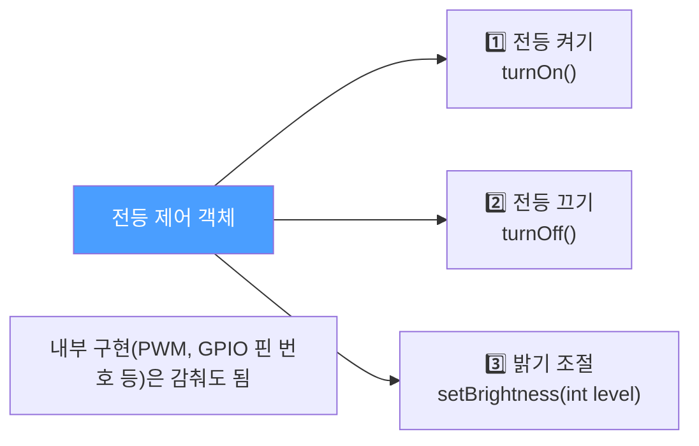
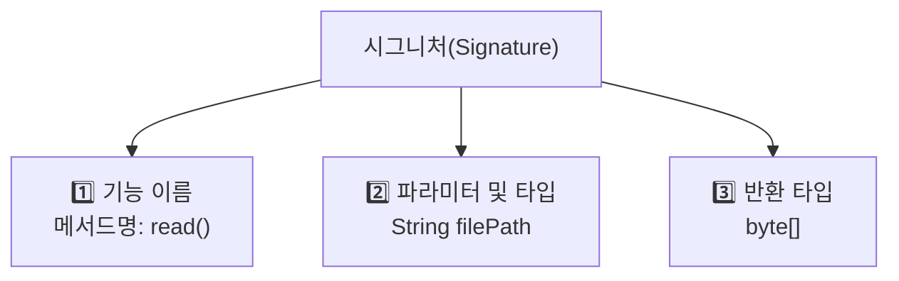
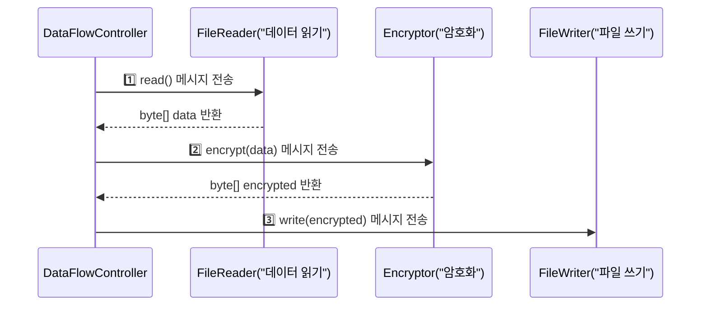
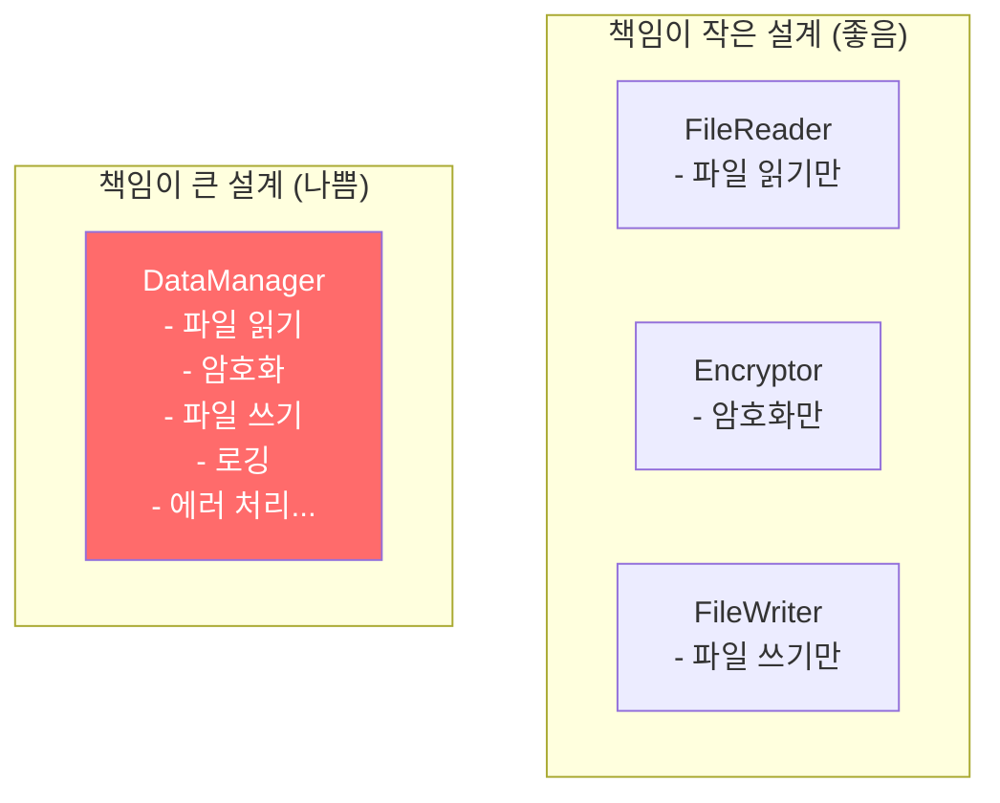
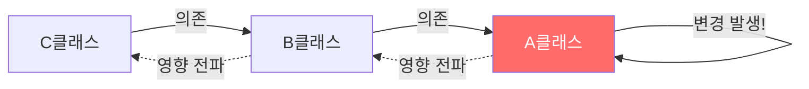
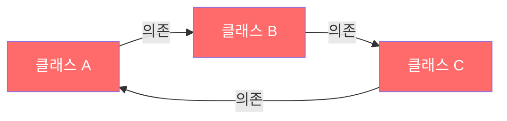
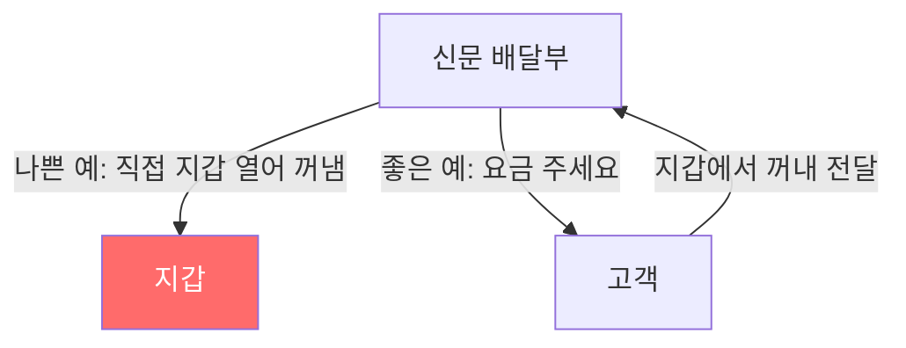
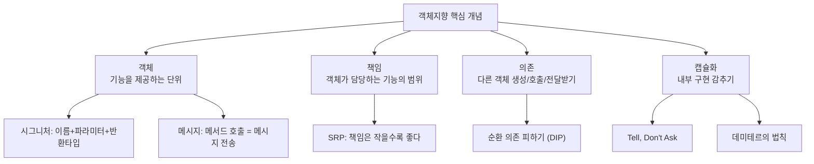

"객체지향으로 짜라"는 말은 많이 들었는데, 막상 어떻게 짜야 하는지 막막하다면 이 글이 도움이 됩니다. 객체란 무엇인지, 왜 책임·의존·캡슐화 같은 개념이 중요한지 현실적인 비유로 풀어봅니다.

---

## 1. 객체의 핵심은 "기능 제공"이다

### 동작 원리

객체지향의 첫 번째 오해는 "객체 = 데이터 묶음"이라는 생각입니다. 하지만 실제로 객체를 정의할 때 기준은 **이 객체가 외부에 어떤 기능을 제공하는가**입니다. 내부 구현(필드 타입, 알고리즘)은 외부에 감춰도 됩니다.

비유하자면, 자동판매기를 사용할 때 안에 모터가 있는지 스프링이 있는지 알 필요가 없습니다. "돈 넣고 버튼 누르면 음료 나온다"는 기능만 알면 됩니다. 객체도 마찬가지입니다.



```java
// 외부에서 보는 전등 제어 객체
public class LightController {
    public void turnOn()  { /* 내부 구현 감춤 */ }
    public void turnOff() { /* 내부 구현 감춤 */ }
    public void setBrightness(int level) { /* 내부 구현 감춤 */ }
}

// 사용하는 쪽은 내부 구현을 전혀 몰라도 됨
LightController light = new LightController();
light.turnOn();
light.setBrightness(80);
```

**만약 이걸 안 하면?** 내부 데이터 구조(예: 밝기를 `int`로 저장하다 `double`로 바꿈)가 바뀔 때마다 사용하는 모든 코드를 수정해야 합니다. 기능 중심으로 설계하면 내부를 바꿔도 외부 코드는 건드릴 필요가 없습니다.

---

## 2. 시그니처(Signature)

### 동작 원리

객체가 제공하는 각 기능은 **오퍼레이션(Operation)** 이라고 하며, 오퍼레이션을 식별하는 세 가지 정보를 묶어 **시그니처**라고 합니다.



```java
// 시그니처 = 메서드명 + 파라미터(타입·순서) + 반환 타입
public byte[] read(String filePath);
//      ↑반환  ↑이름  ↑파라미터

// 시그니처가 같은 생성자는 하나만 존재 가능 → 정적 팩토리 메서드 필요
public class Car {
    public Car(String name) { ... }    // OK
    // public Car(String engine) { }   // 컴파일 에러! 시그니처 중복
}
```

---

## 3. 메시지 (Message)

### 동작 원리

여러 객체가 협력해서 하나의 기능을 완성할 때, 객체끼리 오퍼레이션 실행을 요청합니다. 이 요청을 **메시지를 보낸다**고 표현하며, 자바에서는 메서드 호출이 곧 메시지 전송입니다.



```java
public class DataFlowController {
    public void process() {
        FileDataReader reader = new FileDataReader();
        byte[] data = reader.read();               // 메시지 전송 1

        Encryptor encryptor = new Encryptor();
        byte[] encrypted = encryptor.encrypt(data); // 메시지 전송 2

        FileDataWriter writer = new FileDataWriter();
        writer.write(encrypted);                    // 메시지 전송 3
    }
}
```

---

## 4. 객체의 책임과 크기

### 동작 원리

객체마다 "이 기능은 내가 담당한다"는 **책임(Responsibility)** 이 있습니다. 핵심 원칙은 하나입니다.

> **객체가 갖는 책임의 크기는 작을수록 좋다.**

비유하자면, 요리사 한 명이 주문 받기·요리·계산·청소까지 다 하면 한 사람이 바빠지면 전체가 마비됩니다. 역할을 나누면 각자 독립적으로 일할 수 있습니다.



**만약 이걸 안 하면?** `DataManager` 하나가 수십 개의 기능을 담당하면 암호화 알고리즘만 바꿔도 `DataManager` 전체를 다시 테스트해야 합니다. 이것이 절차 지향과 같은 구조로 퇴화하는 이유입니다.

이 원칙의 공식 이름은 **단일 책임 원칙(Single Responsibility Principle, SRP)** 입니다.

---

## 5. 의존(Dependency)

### 동작 원리

한 객체가 다른 객체를 생성하거나 메서드를 호출하거나, 파라미터로 받을 때 **의존**이 발생합니다. 의존의 핵심 위험은 **전파**입니다. A가 변경되면 A에 의존하는 B도 바뀔 가능성이 생기고, B에 의존하는 C도 영향을 받습니다.



```java
// 의존의 세 가지 형태

// 1. 객체 생성 — 직접 의존
public class DataFlowController {
    public void process() {
        FileDataReader reader = new FileDataReader(); // FileDataReader에 의존
    }
}

// 2. 메서드 호출
public void process(FileDataReader reader) {
    reader.read(); // 파라미터를 통한 의존
}

// 3. 파라미터로 전달받음
public void process(ByteEncryptor encryptor) {
    // encryptor.encrypt() 호출 가능성 → 의존
}
```

**순환 의존의 위험:**



A·B·C 중 하나만 바뀌어도 나머지 모두가 영향을 받는 최악의 구조입니다. 이를 해결하는 원칙이 **의존 역전 원칙(DIP)** 입니다.

---

## 6. 캡슐화(Encapsulation)

### 동작 원리

캡슐화는 객체가 내부 구현을 감추고 기능만 외부에 노출하는 것입니다. "어떻게 하는지"를 숨기고 "무엇을 할 수 있는지"만 노출합니다.

비유하자면, TV 리모컨은 "볼륨 높이기" 버튼만 있고 내부 회로가 어떻게 동작하는지는 감춰져 있습니다. 제조사가 내부 회로를 바꿔도 우리는 같은 버튼으로 볼륨을 높일 수 있습니다.

**캡슐화를 위한 두 가지 규칙:**

### Tell, Don't Ask

"데이터를 꺼내서 내가 처리하지 말고, 객체에게 처리를 시켜라"는 규칙입니다.

```java
// 나쁜 예 — 데이터를 꺼내서 외부에서 판단 (Ask)
if (member.getExpiredDate().compareTo(now) < 0) {
    // 만료 처리
}

// 좋은 예 — 객체에게 처리를 시킴 (Tell)
if (member.isExpired()) {
    // 만료 처리
}
// isExpired() 내부 구현이 바뀌어도 호출 코드는 그대로
```

**만약 이걸 안 하면?** `getExpiredDate()`에 의존하는 코드가 애플리케이션 전체에 퍼져 있을 때, 만료 날짜 계산 방식이 바뀌면 전부 수정해야 합니다.

### 데미테르의 법칙 (Law of Demeter)

메서드에서 호출하는 객체는 **직접 아는 객체**에만 한정하라는 규칙입니다.

- 메서드에서 직접 생성한 객체
- 파라미터로 받은 객체
- 자신의 필드로 참조하는 객체

```java
// 나쁜 예 — "기차 충돌" (train wreck): 여러 객체를 연쇄 호출
String city = customer.getAddress().getCity().toUpperCase();
//                     ↑모름         ↑더 모름

// 좋은 예 — 직접 아는 객체에게만 메시지 전송
String city = customer.getCityName();  // customer만 알면 됨
```

**신문 배달부와 지갑 비유:** 신문 배달부가 요금을 받을 때, 고객의 지갑을 직접 열어 돈을 꺼내서는 안 됩니다. 고객에게 "요금 주세요"라고 말하면 됩니다. 배달부는 고객만 알고, 지갑의 구조는 몰라야 합니다.



---

## 7. 전체 요약



---

> 참조: 개발자가 반드시 정복해야 할 객체지향과 디자인패턴 (최범균)
