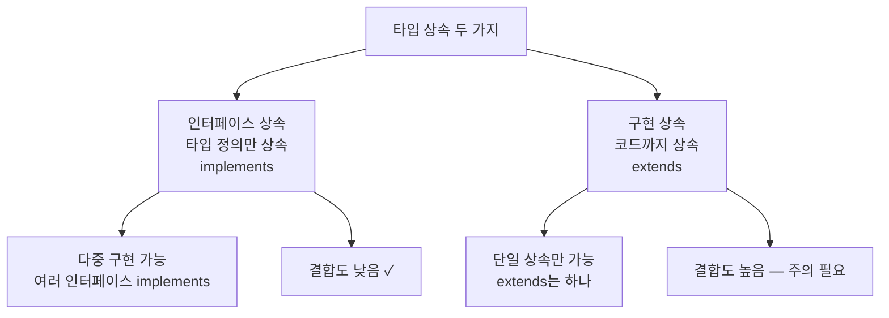
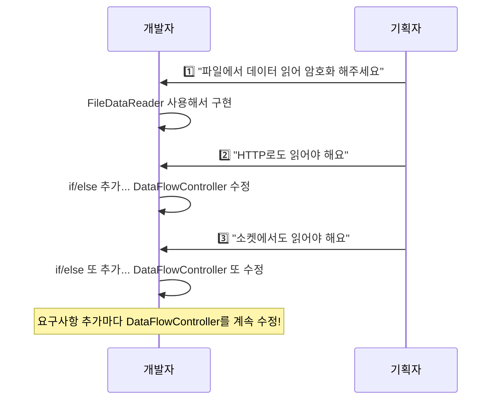
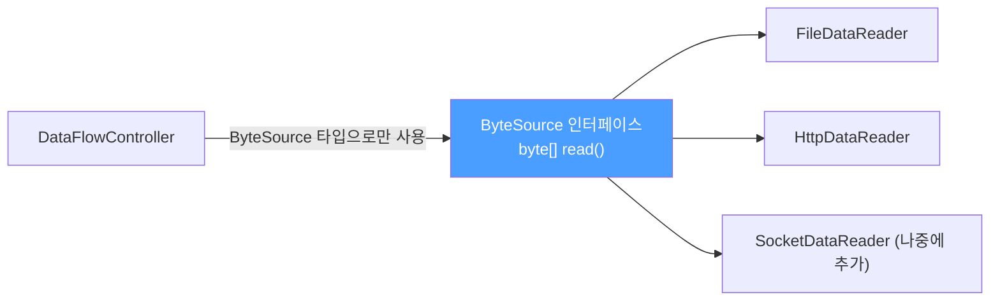
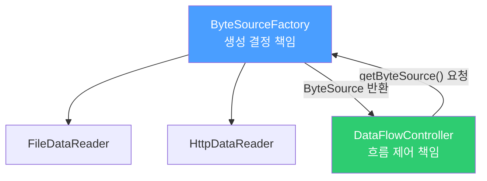
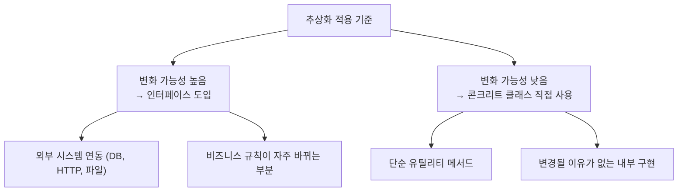
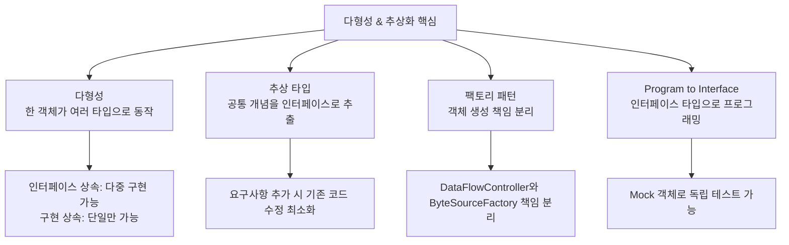

Part 1에서 객체·책임·의존·캡슐화를 다뤘습니다. 이번에는 객체지향이 진짜 힘을 발휘하는 순간, **다형성과 추상화**를 봅니다. "왜 인터페이스를 쓰는가?"라는 질문에 답하는 글입니다.

---

## 1. 다형성 (Polymorphism)

### 동작 원리

다형성은 "한 객체가 여러 타입으로 동작할 수 있다"는 개념입니다. 비유하자면, 한 사람이 회사에서는 "직원", 집에서는 "부모", 병원에서는 "환자"라는 역할을 하는 것과 같습니다. 실제 사람은 하나지만 상황에 따라 다른 타입으로 취급됩니다.

Java에서는 **타입 상속**으로 다형성을 구현합니다.



```java
// 인터페이스 상속 — 타입만 상속
interface Flyable  { void fly(); }
interface Swimmable { void swim(); }

// 한 클래스가 여러 인터페이스 구현 → 다형성
class Duck implements Flyable, Swimmable {
    @Override public void fly()  { System.out.println("날다"); }
    @Override public void swim() { System.out.println("수영"); }
}

// 동일한 Duck 인스턴스가 두 타입으로 사용됨
Flyable flier  = new Duck();  // Duck을 Flyable 타입으로
Swimmable swimmer = new Duck(); // Duck을 Swimmable 타입으로
```

---

## 2. 추상 타입과 유연함

### 왜 추상화가 필요한가?

"콘크리트 클래스만 직접 써도 되는 거 아닌가?" 라는 의문이 드는 것은 자연스럽습니다. 처음에는 문제가 없습니다. 그러나 **요구사항이 변하는 순간** 추상화의 필요성이 드러납니다.

**요구사항 시나리오:**



```java
// 콘크리트 클래스 직접 사용 — 요구사항 추가마다 수정 필요
public class DataFlowController {
    public void process() {
        byte[] data;
        if (isHttp) {
            HttpDataReader httpReader = new HttpDataReader();
            data = httpReader.read();
        } else if (isSocket) {
            SocketDataReader socketReader = new SocketDataReader();
            data = socketReader.read();
        } else {
            FileDataReader fileReader = new FileDataReader();
            data = fileReader.read();
        }
        // ...
    }
}
```

**만약 이걸 안 고치면?** 새 데이터 소스가 추가될 때마다 `DataFlowController`를 열어 if/else를 늘려야 합니다. 테스트도 매번 다시 해야 하고, 버그 위험도 증가합니다.

---

## 3. 추상 타입으로 해결

### 동작 원리

공통점을 찾아 추상 타입으로 만들면, `DataFlowController`는 "어디서 읽는지"를 몰라도 됩니다. 새 데이터 소스가 추가돼도 `DataFlowController`는 전혀 수정하지 않습니다.



```java
// 1단계: 공통 개념 추상화
public interface ByteSource {
    byte[] read();
}

// 2단계: 각 구현체가 인터페이스 구현
public class FileDataReader implements ByteSource {
    @Override
    public byte[] read() { /* 파일 읽기 */ return new byte[0]; }
}

public class HttpDataReader implements ByteSource {
    @Override
    public byte[] read() { /* HTTP 읽기 */ return new byte[0]; }
}

// 3단계: DataFlowController는 ByteSource만 알면 됨
public class DataFlowController {
    private final ByteSource byteSource;

    // 생성자 주입 — 어떤 구현체인지 몰라도 됨
    public DataFlowController(ByteSource byteSource) {
        this.byteSource = byteSource;
    }

    public void process() {
        byte[] data = byteSource.read();  // ByteSource만 사용
        // 암호화, 쓰기...
    }
}
```

이제 `SocketDataReader`가 추가돼도 `DataFlowController`는 한 줄도 바꿀 필요가 없습니다.

---

## 4. 팩토리 패턴으로 객체 생성 책임 분리

### 동작 원리

추상화를 적용했지만 아직 if/else가 남아 있습니다. 어디선가 "어떤 구현체를 만들지" 결정해야 하기 때문입니다. 이 결정 책임을 **Factory** 객체로 분리하는 것이 팩토리 패턴입니다.



```java
// 객체 생성 책임을 Factory로 분리
public class ByteSourceFactory {

    public static ByteSource getByteSource() {
        String type = System.getProperty("datasource.type", "file");
        return switch (type) {
            case "http"   -> new HttpDataReader();
            case "socket" -> new SocketDataReader();
            default       -> new FileDataReader();
        };
    }
}

// DataFlowController는 생성 방법을 전혀 모름
public class DataFlowController {
    public void process() {
        ByteSource source = ByteSourceFactory.getByteSource();
        byte[] data = source.read();
        // ...
    }
}
```

`SocketDataReader`가 추가되면 `ByteSourceFactory`만 수정하면 됩니다. `DataFlowController`는 여전히 건드릴 필요가 없습니다.

**책임 분리 전후 비교:**

| 역할 | 변경 전 | 변경 후 |
|------|---------|---------|
| 흐름 제어 | DataFlowController | DataFlowController |
| 객체 생성 결정 | DataFlowController (if/else) | ByteSourceFactory |
| 새 소스 추가 시 수정 파일 | DataFlowController | ByteSourceFactory만 |

---

## 5. 인터페이스에 대고 프로그래밍하기

### 동작 원리

"Program to interface, not implementation" — 콘크리트 클래스가 아닌 인터페이스 타입으로 변수를 선언하고 파라미터를 정의하라는 원칙입니다.

```java
// 나쁜 예 — 콘크리트 클래스에 의존
FileDataReader reader = new FileDataReader();   // FileDataReader에 고정

// 좋은 예 — 인터페이스에 의존
ByteSource reader = new FileDataReader();       // ByteSource 타입으로
ByteSource reader2 = new HttpDataReader();      // 언제든 교체 가능
```

### 인터페이스 이름은 사용하는 쪽 관점으로

```java
// 나쁜 이름: 특정 구현에 종속된 이름
interface SocketDataReaderIF { byte[] read(); }
// → 나중에 FileDataReader가 이 인터페이스를 구현하면 이름이 어색해짐

// 좋은 이름: 역할을 표현하는 이름
interface ByteSource { byte[] read(); }
// → 어떤 구현체든 자연스럽게 이 인터페이스를 구현 가능
```

---

## 6. 인터페이스와 테스트 (Mock 객체)

### 동작 원리

인터페이스를 쓰면 실제 구현체가 완성되지 않아도 **Mock(가짜) 객체**로 테스트할 수 있습니다. 비유하자면, 항공기 조종사를 실제 비행기로만 훈련시키면 너무 위험하고 비쌉니다. 비행 시뮬레이터(Mock)로 먼저 훈련합니다.

```java
// MockByteSource — 실제 파일/네트워크 없이 테스트용 데이터 제공
class MockByteSource implements ByteSource {
    @Override
    public byte[] read() {
        return "test data".getBytes();  // 하드코딩된 테스트 데이터
    }
}

// HttpDataReader 구현이 완료되지 않아도 테스트 가능
@Test
void testDataFlowController() {
    ByteSource mock = new MockByteSource();          // Mock 사용
    DataFlowController controller = new DataFlowController(mock);
    controller.process();  // 실제 HTTP 없이도 테스트 통과
}
```

**만약 인터페이스가 없다면?** `DataFlowController`가 `HttpDataReader`에 직접 의존하면, `HttpDataReader` 구현이 완료될 때까지 아무것도 테스트할 수 없습니다. 팀 작업에서 병렬 개발도 불가능해집니다.

---

## 7. 추상화 주의사항

추상화는 복잡도를 높입니다. 인터페이스, 팩토리 클래스가 늘어나면 코드 추적이 어려워집니다. **변화 가능성이 높은 곳에만** 추상화를 적용하는 것이 중요합니다.



---

## 8. 전체 요약



**핵심 원칙 요약:**
- 변화 가능성이 있는 곳에 인터페이스를 도입하라
- 콘크리트 클래스가 아닌 인터페이스 타입으로 변수를 선언하라
- 객체 생성 책임을 Factory로 분리하면 변경 범위가 좁아진다
- 인터페이스 이름은 사용하는 쪽의 관점으로 짓는다

---

> 참조: 개발자가 반드시 정복해야 할 객체지향과 디자인패턴 (최범균)
