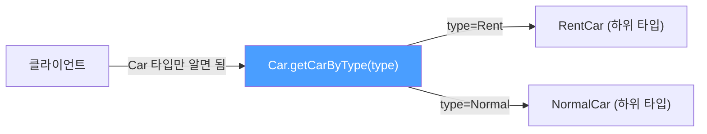
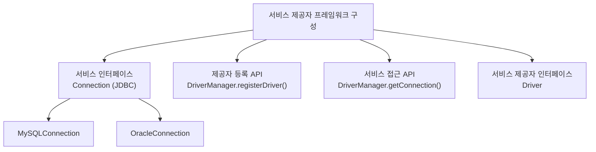
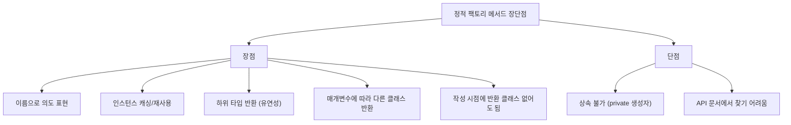

`new SomeClass()`가 디폴트로 보이지만, 실제로는 정적 팩토리 메서드가 훨씬 더 많은 정보를 전달하고 더 유연합니다. 왜 그런지, 언제 쓰는지 비유와 함께 풀어봅니다.

---

## 1. 정적 팩토리 메서드란?

클래스 인스턴스를 `new` 생성자가 아닌 `static` 메서드로 반환하는 패턴입니다. 디자인 패턴의 팩토리 메서드 패턴과는 다릅니다.

```java
// 가장 유명한 예 — Boolean.valueOf()
public static Boolean valueOf(boolean b) {
    return b ? Boolean.TRUE : Boolean.FALSE;
}

// 사용
Boolean t = Boolean.valueOf(true);   // new Boolean(true) 대신
Boolean f = Boolean.valueOf(false);
```

`Boolean.TRUE`, `Boolean.FALSE`는 미리 만들어진 인스턴스를 재사용합니다. `new Boolean(true)`를 쓰면 매번 새 객체가 생깁니다.

---

## 2. 장점 1: 이름을 가질 수 있다

### 왜 중요한가?

생성자는 클래스 이름과 동일해야 합니다. 같은 타입의 파라미터를 받는 생성자가 둘 이상 필요하면 구별할 방법이 없습니다.

```java
// 문제: 시그니처가 같은 생성자는 두 개 이상 불가
public class Car {
    public Car(String name)   { ... }  // OK
    // public Car(String engine) { }   // 컴파일 에러! 시그니처 중복
}
```

정적 팩토리 메서드는 이름이 있어서 의도를 명확히 표현합니다.

```java
// 어느 쪽이 "소수인 BigInteger"를 반환하는지 바로 알 수 있나요?
BigInteger b1 = new BigInteger(int, int, Random);   // 모호함
BigInteger b2 = BigInteger.probablePrime(bitLength, random); // 명확!

// Car 예시
public class Car {
    private String name;
    private String engine;

    public static Car withName(String name) {
        Car c = new Car(); c.name = name; return c;
    }
    public static Car withEngine(String engine) {
        Car c = new Car(); c.engine = engine; return c;
    }
}

Car sportsCar = Car.withEngine("V8");      // 의도가 명확
Car namedCar  = Car.withName("Sonata");
```

---

## 3. 장점 2: 호출할 때마다 인스턴스를 새로 만들 필요가 없다

### 동작 원리

비유하자면 카페 메뉴판과 같습니다. "아메리카노"는 매번 새로 만들지만, "오늘의 메뉴판"은 하루 종일 한 장만 존재합니다. 정적 팩토리는 인스턴스를 캐싱하거나 미리 만들어 놓고 반환할 수 있습니다.

```java
// Boolean.FALSE, Boolean.TRUE — JVM 시작 시 딱 2개만 생성, 이후 재사용
public static Boolean valueOf(boolean b) {
    return b ? Boolean.TRUE : Boolean.FALSE;  // 새 객체 생성 없음!
}

// 직접 캐싱 예시
public class Connection {
    private static final Connection INSTANCE = new Connection();

    private Connection() {}

    public static Connection getInstance() {
        return INSTANCE;  // 항상 같은 인스턴스 반환
    }
}
```

이런 클래스를 **인스턴스 통제(instance-controlled) 클래스**라 합니다. 싱글톤, 인스턴스화 불가, 동치 인스턴스 보장 등이 모두 이 방식으로 구현됩니다.

**만약 이걸 안 하면?** 무거운 DB 커넥션이나 파서 객체를 요청마다 `new`로 생성하면 성능이 폭락합니다.

---

## 4. 장점 3: 반환 타입의 하위 타입 객체를 반환할 수 있다

### 동작 원리

비유하자면 "택시 앱"입니다. 앱(정적 팩토리)은 "택시"(인터페이스)를 배차하는데, 실제로는 일반 택시, 모범 택시, SUV 택시 중 하나가 옵니다. 이용자는 어떤 종류인지 몰라도 탑승할 수 있습니다.



```java
public class Car {
    public static Car getCarByType(String type) {
        return switch (type) {
            case "Rent"   -> new RentCar();    // Car의 하위 타입
            case "Normal" -> new NormalCar();  // Car의 하위 타입
            default       -> new Car();
        };
    }
}

// 사용 — 실제 타입이 무엇인지 몰라도 됨
Car car = Car.getCarByType("Rent");
```

이것이 `java.util.Collections`의 핵심 기술입니다. `unmodifiableList`, `synchronizedList` 등 수십 가지 유틸리티 구현체를 단 하나의 클래스(Collections)에서 정적 팩토리로 제공하고, 구현 클래스를 숨깁니다.

---

## 5. 장점 4: 입력 매개변수에 따라 다른 클래스 객체를 반환할 수 있다

장점 3의 응용입니다. `EnumSet`은 원소 수가 64개 이하면 `RegularEnumSet`(long 비트 벡터)을, 65개 이상이면 `JumboEnumSet`(long 배열)을 반환합니다. 클라이언트는 이를 알 필요가 없고, JDK 구현팀은 성능을 개선한 새 클래스를 언제든 추가하거나 교체할 수 있습니다.

```java
// EnumSet 내부 (실제 JDK 코드 유사)
public static <E extends Enum<E>> EnumSet<E> noneOf(Class<E> elementType) {
    Enum<?>[] universe = getUniverse(elementType);
    if (universe.length <= 64)
        return new RegularEnumSet<>(elementType, universe);  // long 1개
    else
        return new JumboEnumSet<>(elementType, universe);    // long 배열
}
```

---

## 6. 장점 5: 정적 팩토리 메서드 작성 시점에 반환할 클래스가 없어도 된다

JDBC가 대표적인 예입니다. `DriverManager.getConnection()`은 어떤 DB Driver가 등록될지 모르는 상태에서 작성되었지만, MySQL·Oracle·PostgreSQL 드라이버가 나중에 `Driver` 인터페이스를 구현하면 그것을 반환합니다. 이것이 **서비스 제공자 프레임워크(Service Provider Framework)** 의 핵심입니다.



---

## 7. 단점

### 단점 1: 상속하려면 public/protected 생성자가 필요하다

정적 팩토리만 있고 생성자가 `private`이면 하위 클래스를 만들 수 없습니다. 다만 이는 **컴포지션(합성)을 유도**하고 **불변 클래스**로 만드는 제약으로도 볼 수 있어 반드시 단점은 아닙니다.

### 단점 2: 프로그래머가 찾기 어렵다

`new`를 쓰면 IDE가 생성자를 자동 제안하지만, 정적 팩토리는 API 문서에서 찾아야 합니다. 이를 완화하는 **명명 관례**를 따르는 것이 중요합니다.

---

## 8. 정적 팩토리 메서드 명명 관례

```java
// from — 단일 매개변수, 형변환
Date d = Date.from(instant);

// of — 여러 매개변수, 집계
Set<Rank> cards = EnumSet.of(JACK, QUEEN, KING);

// valueOf — from과 of의 더 자세한 버전
BigInteger prime = BigInteger.valueOf(Integer.MAX_VALUE);

// instance / getInstance — 같은 인스턴스를 반환, 보장 없음
StackWalker luke = StackWalker.getInstance(options);

// create / newInstance — 매번 새 인스턴스를 반환
Object arr = Array.newInstance(classObject, arrayLen);

// getType — 다른 클래스에 팩토리 메서드를 정의할 때
FileStore fs = Files.getFileStore(path);

// newType — 다른 클래스에서 새 인스턴스
BufferedReader br = Files.newBufferedReader(path);

// type — getType / newType의 간결 버전
List<Complaint> litany = Collections.list(legacyLitany);
```

---

## 9. 요약



> 정리: 생성자와 정적 팩토리의 장단점을 이해하고 선택하되, 선택 매개변수가 많거나 인스턴스 통제가 필요한 상황에서는 정적 팩토리를 적극 활용하세요.

---

> 참조: 이펙티브 자바 3/E — 조슈아 블로크
