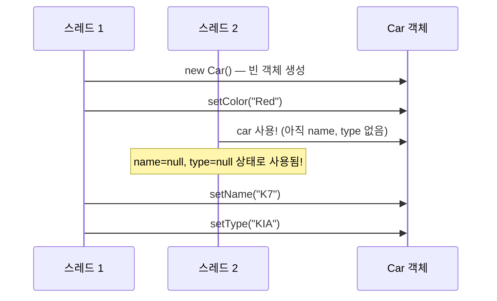
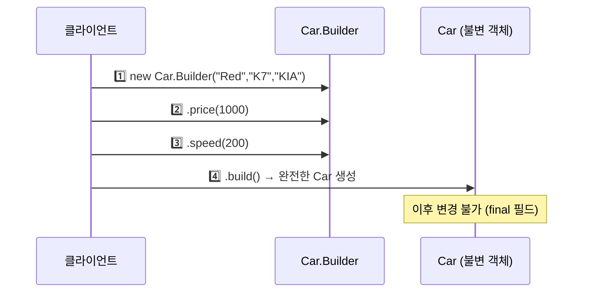
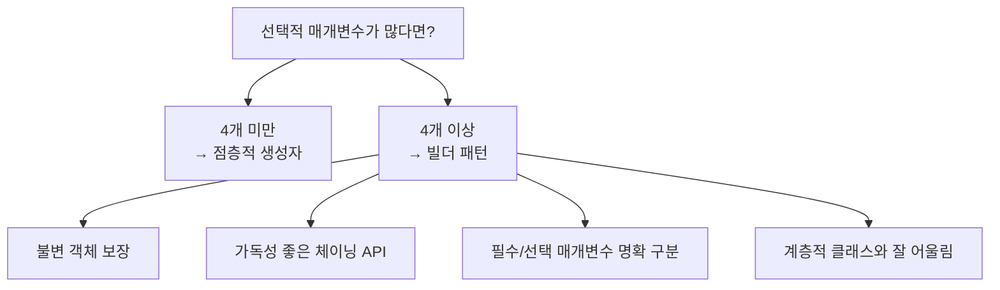

매개변수가 4개 이상인 클래스를 만든다면, 세 가지 패턴 중 하나를 선택해야 합니다. 어느 것을 고를지 비유로 먼저 이해하고 코드로 확인해 봅니다.

---

## 1. 문제: 선택적 매개변수가 많을 때

`Car` 클래스에 색상·이름·종류는 필수이고, 가격·속도는 선택적입니다. 매개변수 5개인데, 선택 매개변수가 늘어날수록 어떤 문제가 생기는지 세 가지 패턴으로 살펴봅니다.

---

## 2. 패턴 1: 점층적 생성자 패턴 (Telescoping Constructor)

### 동작 원리

필수 매개변수만 받는 생성자부터 시작해 선택 매개변수를 하나씩 늘려가며 생성자를 추가하는 방식입니다. 비유하자면 러시아 마트료시카 인형처럼 생성자 안에 생성자를 중첩합니다.

```java
public class Car {
    private final String color;   // 필수
    private final String name;    // 필수
    private final String type;    // 필수
    private final int    price;   // 선택
    private final int    speed;   // 선택

    public Car(String color, String name, String type) {
        this(color, name, type, 0);
    }
    public Car(String color, String name, String type, int price) {
        this(color, name, type, price, 0);
    }
    public Car(String color, String name, String type, int price, int speed) {
        this.color = color;
        this.name  = name;
        this.type  = type;
        this.price = price;
        this.speed = speed;
    }
}
```

**문제점:**

```java
// 호출 시 무슨 숫자인지 알 수 없음
Car car = new Car("Red", "K7", "KIA", 1000, 0);
//                                     ↑가격? ↑속도? 헷갈림!
```

**만약 매개변수가 10개라면?** 생성자가 10개 이상 나열되고, 어느 위치에 어떤 값을 넣는지 컴파일러가 알려주지 않아 순서 실수가 런타임 버그로 이어집니다.

---

## 3. 패턴 2: 자바빈즈 패턴 (JavaBeans)

### 동작 원리

기본 생성자로 객체를 만들고 setter로 값을 채우는 방식입니다. 마치 택배 박스를 먼저 꺼내고 물건을 하나씩 담는 것과 같습니다.

```java
public class Car {
    private String color;
    private String name;
    private String type;
    private int    price;
    private int    speed;

    public Car() {}

    public void setColor(String color) { this.color = color; }
    public void setName (String name)  { this.name  = name;  }
    public void setType (String type)  { this.type  = type;  }
    public void setPrice(int price)    { this.price = price; }
    public void setSpeed(int speed)    { this.speed = speed; }
}

// 사용 — 읽기는 쉬움
Car car = new Car();
car.setColor("Red");
car.setName("K7");
car.setType("KIA");
car.setPrice(1000);
```

**치명적 문제 — 일관성(consistency) 깨짐:**



객체 생성이 완료되기 전에 다른 스레드가 사용할 수 있어 **불완전한 객체**가 노출됩니다. 또한 `final` 필드를 쓸 수 없어 **불변(immutable) 클래스**를 만들 수 없습니다.

---

## 4. 패턴 3: 빌더 패턴 (Builder) — 권장

### 동작 원리

비유하자면 **주문서 작성 후 제조**입니다. 점층적 생성자의 안전성(불변 객체)과 자바빈즈의 가독성(이름 있는 메서드)을 모두 얻습니다.



```java
public class Car {
    private final String color;   // 필수
    private final String name;    // 필수
    private final String type;    // 필수
    private final int    price;   // 선택 (기본값 0)
    private final int    speed;   // 선택 (기본값 0)

    // 외부에서 직접 생성 불가 — Builder를 통해서만
    private Car(Builder builder) {
        this.color = builder.color;
        this.name  = builder.name;
        this.type  = builder.type;
        this.price = builder.price;
        this.speed = builder.speed;
    }

    // Static Nested Builder
    public static class Builder {
        // 필수 매개변수
        private final String color;
        private final String name;
        private final String type;
        // 선택 매개변수 — 기본값 초기화
        private int price = 0;
        private int speed = 0;

        public Builder(String color, String name, String type) {
            this.color = color;
            this.name  = name;
            this.type  = type;
        }

        // 선택 매개변수 설정 — this를 반환해 메서드 체이닝 가능
        public Builder price(int price) {
            this.price = price;
            return this;
        }

        public Builder speed(int speed) {
            this.speed = speed;
            return this;
        }

        // 최종 객체 생성
        public Car build() {
            return new Car(this);
        }
    }
}

// 사용 — 읽기 쉽고 안전하다
Car car = new Car.Builder("Red", "K7", "KIA")
    .price(1000)
    .speed(200)
    .build();
```

### 계층적 빌더 패턴

추상 클래스와 빌더를 함께 쓰면 계층 구조에서도 유연하게 작동합니다.

```java
public abstract class Pizza {
    public enum Topping { HAM, MUSHROOM, ONION, PEPPER }
    final Set<Topping> toppings;

    abstract static class Builder<T extends Builder<T>> {
        EnumSet<Topping> toppings = EnumSet.noneOf(Topping.class);

        public T addTopping(Topping topping) {
            toppings.add(topping);
            return self();
        }

        abstract Pizza build();
        protected abstract T self();  // 하위 클래스에서 this 반환
    }

    Pizza(Builder<?> builder) {
        toppings = builder.toppings.clone();
    }
}

public class NyPizza extends Pizza {
    public enum Size { SMALL, MEDIUM, LARGE }
    private final Size size;

    public static class Builder extends Pizza.Builder<Builder> {
        private final Size size;

        public Builder(Size size) { this.size = size; }

        @Override public NyPizza build()  { return new NyPizza(this); }
        @Override protected Builder self() { return this; }
    }

    private NyPizza(Builder builder) {
        super(builder);
        this.size = builder.size;
    }
}

// 사용
NyPizza pizza = new NyPizza.Builder(SMALL)
    .addTopping(HAM)
    .addTopping(MUSHROOM)
    .build();
```

---

## 5. 세 패턴 비교

| 항목 | 점층적 생성자 | 자바빈즈 | 빌더 |
|------|-------------|---------|------|
| 가독성 | 낮음 (매개변수 순서) | 높음 | 높음 |
| 불변 객체 | 가능 | 불가 | 가능 |
| 스레드 안전 | 가능 | 주의 필요 | 가능 |
| 일관성 보장 | 가능 | 보장 안 됨 | 가능 |
| 매개변수 4개 미만 | 적합 | - | 과도할 수 있음 |

---

## 6. 빌더 패턴의 단점

- 빌더 객체를 별도로 만들어야 해서 코드량이 늘어납니다.
- 매개변수가 4개 미만이면 점층적 생성자가 더 간결할 수 있습니다.
- 성능에 매우 민감한 상황에서는 빌더 객체 생성 비용이 문제가 될 수 있습니다 (일반적으로 무시할 수준).

---

## 7. 요약



> 매개변수 중 다수가 선택적이거나 같은 타입이라면 빌더를 선택하세요. 점층적 생성자보다 읽고 쓰기 편하며, 자바빈즈보다 안전합니다.

---

> 참조: 이펙티브 자바 3/E — 조슈아 블로크
