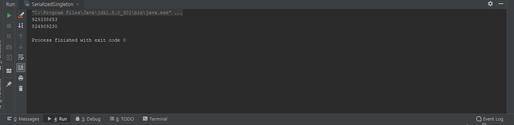

<hr>

**싱글톤(Singleton)** 이란 인스턴스를 오직 하나만 생성할 수 있는 클래스를 말한다.

무상태 객체나 설계상 유일해야 하는 시스템 컴포턴트가 싱글턴의 전형적인 예다.

***하지만 싱글톤클래스는 이를 사용하는 클라이언트를 테스트하기 어렵다는 단점이 있다.***

<hr>

싱글톤을 만드는 세세한 방법들은 아래의 블로깅에 아주 정리가 잘 되어있다.

https://yjkim2015.github.io/designpattern/Singleton/


이번 블로깅에서는 ***큰 틀에서의 싱글톤을 만드는 방식***에 대해 살펴볼 것이다.


## Step 1 : public static 멤버가 final 필드인 방식

**이 방식의 장점은 해당 클래스가 싱글턴임이 API에 명백히 드러난다는 것**

**[public static 필드가 final이니 절대로 다른 객체를 참조 할 수 없음]과 간결함이다.**

<div class="colorscripter-code" style="color:#010101;font-family:Consolas, 'Liberation Mono', Menlo, Courier, monospace !important; position:relative !important;overflow:auto"><table class="colorscripter-code-table" style="margin:0;padding:0;border:none;background-color:#fafafa;border-radius:4px;" cellspacing="0" cellpadding="0"><tr><td style="padding:6px;border-right:2px solid #e5e5e5"><div style="margin:0;padding:0;word-break:normal;text-align:right;color:#666;font-family:Consolas, 'Liberation Mono', Menlo, Courier, monospace !important;line-height:130%"><div style="line-height:130%">1</div><div style="line-height:130%">2</div><div style="line-height:130%">3</div><div style="line-height:130%">4</div><div style="line-height:130%">5</div><div style="line-height:130%">6</div><div style="line-height:130%">7</div><div style="line-height:130%">8</div></div></td><td style="padding:6px 0;text-align:left"><div style="margin:0;padding:0;color:#010101;font-family:Consolas, 'Liberation Mono', Menlo, Courier, monospace !important;line-height:130%"><div style="padding:0 6px; white-space:pre; line-height:130%"><span style="color:#ff3399">public</span>&nbsp;<span style="color:#ff3399">class</span>&nbsp;Car&nbsp;{</div><div style="background-color:#f0f0f0; padding:0 6px; white-space:pre; line-height:130%">&nbsp;</div><div style="padding:0 6px; white-space:pre; line-height:130%">&nbsp;&nbsp;&nbsp;&nbsp;<span style="color:#ff3399">public</span>&nbsp;<span style="color:#ff3399">static</span>&nbsp;<span style="color:#ff3399">final</span>&nbsp;Car&nbsp;INSTANCE&nbsp;<span style="color:#0086b3"></span><span style="color:#ff3399">=</span>&nbsp;<span style="color:#ff3399">new</span>&nbsp;Car();</div><div style="background-color:#f0f0f0; padding:0 6px; white-space:pre; line-height:130%">&nbsp;&nbsp;&nbsp;&nbsp;</div><div style="padding:0 6px; white-space:pre; line-height:130%">&nbsp;&nbsp;&nbsp;&nbsp;<span style="color:#ff3399">private</span>&nbsp;Car()&nbsp;{&nbsp;...&nbsp;}</div><div style="background-color:#f0f0f0; padding:0 6px; white-space:pre; line-height:130%">&nbsp;&nbsp;&nbsp;&nbsp;</div><div style="padding:0 6px; white-space:pre; line-height:130%">}</div><div style="background-color:#f0f0f0; padding:0 6px; white-space:pre; line-height:130%">&nbsp;</div></div><div style="text-align:right;margin-top:-13px;margin-right:5px;font-size:9px;font-style:italic"><a href="http://colorscripter.com/info#e" target="_blank" style="color:#e5e5e5text-decoration:none">Colored by Color Scripter</a></div></td><td style="vertical-align:bottom;padding:0 2px 4px 0"><a href="http://colorscripter.com/info#e" target="_blank" style="text-decoration:none;color:white"><span style="font-size:9px;word-break:normal;background-color:#e5e5e5;color:white;border-radius:10px;padding:1px">cs</span></a></td></tr></table></div>

위 코드에서 private 생성자는 public static final 필드인 CAR.INSTANCE를 초기화 할 때 딱 한번만 호출된다. 

public이나 protected 생성자가 없으므로 Car 클래스가 초기화 될 때 만들어진 인스턴스가 전체 시스템에서 하나뿐임이 보장된다.

<hr>
<span style="color:red;">예외는 단 한가지</span>, 권한이 있는 클라이언트는 리플렉션 API인 AcccesibleObject.setAccessible을 사용해 private 생성자를 호출 할 수 있다. 아래의 코드가 그 예시이다.

<div class="colorscripter-code" style="color:#010101;font-family:Consolas, 'Liberation Mono', Menlo, Courier, monospace !important; position:relative !important;overflow:auto"><table class="colorscripter-code-table" style="margin:0;padding:0;border:none;background-color:#fafafa;border-radius:4px;" cellspacing="0" cellpadding="0"><tr><td style="padding:6px;border-right:2px solid #e5e5e5"><div style="margin:0;padding:0;word-break:normal;text-align:right;color:#666;font-family:Consolas, 'Liberation Mono', Menlo, Courier, monospace !important;line-height:130%"><div style="line-height:130%">1</div><div style="line-height:130%">2</div><div style="line-height:130%">3</div><div style="line-height:130%">4</div><div style="line-height:130%">5</div><div style="line-height:130%">6</div><div style="line-height:130%">7</div><div style="line-height:130%">8</div><div style="line-height:130%">9</div><div style="line-height:130%">10</div><div style="line-height:130%">11</div><div style="line-height:130%">12</div><div style="line-height:130%">13</div><div style="line-height:130%">14</div><div style="line-height:130%">15</div><div style="line-height:130%">16</div><div style="line-height:130%">17</div><div style="line-height:130%">18</div><div style="line-height:130%">19</div><div style="line-height:130%">20</div><div style="line-height:130%">21</div><div style="line-height:130%">22</div><div style="line-height:130%">23</div></div></td><td style="padding:6px 0;text-align:left"><div style="margin:0;padding:0;color:#010101;font-family:Consolas, 'Liberation Mono', Menlo, Courier, monospace !important;line-height:130%"><div style="padding:0 6px; white-space:pre; line-height:130%"><span style="color:#ff3399">public</span>&nbsp;<span style="color:#ff3399">class</span>&nbsp;Reflection&nbsp;{</div><div style="background-color:#f0f0f0; padding:0 6px; white-space:pre; line-height:130%">&nbsp;</div><div style="padding:0 6px; white-space:pre; line-height:130%">&nbsp;&nbsp;&nbsp;&nbsp;<span style="color:#ff3399">public</span>&nbsp;<span style="color:#ff3399">static</span>&nbsp;<span style="color:#ff3399">void</span>&nbsp;main(<span style="color:#0099cc">String</span>[]&nbsp;args)&nbsp;{</div><div style="background-color:#f0f0f0; padding:0 6px; white-space:pre; line-height:130%">&nbsp;&nbsp;&nbsp;&nbsp;&nbsp;&nbsp;&nbsp;&nbsp;<span style="color:#ff3399">try</span>&nbsp;{</div><div style="padding:0 6px; white-space:pre; line-height:130%">&nbsp;&nbsp;&nbsp;&nbsp;&nbsp;&nbsp;&nbsp;&nbsp;&nbsp;&nbsp;&nbsp;&nbsp;Constructor<span style="color:#0086b3"></span><span style="color:#ff3399">&lt;</span>Singleton<span style="color:#0086b3"></span><span style="color:#ff3399">&gt;</span>&nbsp;declaredConstructor&nbsp;<span style="color:#0086b3"></span><span style="color:#ff3399">=</span>&nbsp;<span style="color:#0099cc">null</span>;</div><div style="background-color:#f0f0f0; padding:0 6px; white-space:pre; line-height:130%">&nbsp;&nbsp;&nbsp;&nbsp;&nbsp;&nbsp;&nbsp;&nbsp;&nbsp;&nbsp;&nbsp;&nbsp;declaredConstructor&nbsp;<span style="color:#0086b3"></span><span style="color:#ff3399">=</span>&nbsp;Singleton.<span style="color:#ff3399">class</span>.getDeclaredConstructor();</div><div style="padding:0 6px; white-space:pre; line-height:130%">&nbsp;&nbsp;&nbsp;&nbsp;&nbsp;&nbsp;&nbsp;&nbsp;&nbsp;&nbsp;&nbsp;&nbsp;declaredConstructor.setAccessible(<span style="color:#308ce5">true</span>);</div><div style="background-color:#f0f0f0; padding:0 6px; white-space:pre; line-height:130%">&nbsp;&nbsp;&nbsp;&nbsp;&nbsp;&nbsp;&nbsp;&nbsp;&nbsp;&nbsp;&nbsp;&nbsp;Singleton&nbsp;singleton&nbsp;<span style="color:#0086b3"></span><span style="color:#ff3399">=</span>&nbsp;declaredConstructor.newInstance();</div><div style="padding:0 6px; white-space:pre; line-height:130%">&nbsp;&nbsp;&nbsp;&nbsp;&nbsp;&nbsp;&nbsp;&nbsp;&nbsp;&nbsp;&nbsp;&nbsp;<span style="color:#0099cc">System</span>.<span style="color:#0099cc">out</span>.<span style="color:#0099cc">println</span>(singleton<span style="color:#0086b3"></span><span style="color:#ff3399">=</span><span style="color:#0086b3"></span><span style="color:#ff3399">=</span>Singleton.INSTANCE);</div><div style="background-color:#f0f0f0; padding:0 6px; white-space:pre; line-height:130%">&nbsp;</div><div style="padding:0 6px; white-space:pre; line-height:130%">&nbsp;&nbsp;&nbsp;&nbsp;&nbsp;&nbsp;&nbsp;&nbsp;&nbsp;&nbsp;&nbsp;&nbsp;<span style="color:#999999">//fasle&nbsp;같은&nbsp;객체가아님&nbsp;싱글톤이&nbsp;깨진다.</span></div><div style="background-color:#f0f0f0; padding:0 6px; white-space:pre; line-height:130%">&nbsp;&nbsp;&nbsp;&nbsp;&nbsp;&nbsp;&nbsp;&nbsp;}&nbsp;<span style="color:#ff3399">catch</span>&nbsp;(NoSuchMethodException&nbsp;e)&nbsp;{</div><div style="padding:0 6px; white-space:pre; line-height:130%">&nbsp;&nbsp;&nbsp;&nbsp;&nbsp;&nbsp;&nbsp;&nbsp;&nbsp;&nbsp;&nbsp;&nbsp;e.printStackTrace();</div><div style="background-color:#f0f0f0; padding:0 6px; white-space:pre; line-height:130%">&nbsp;&nbsp;&nbsp;&nbsp;&nbsp;&nbsp;&nbsp;&nbsp;}&nbsp;<span style="color:#ff3399">catch</span>&nbsp;(IllegalAccessException&nbsp;e)&nbsp;{</div><div style="padding:0 6px; white-space:pre; line-height:130%">&nbsp;&nbsp;&nbsp;&nbsp;&nbsp;&nbsp;&nbsp;&nbsp;&nbsp;&nbsp;&nbsp;&nbsp;e.printStackTrace();</div><div style="background-color:#f0f0f0; padding:0 6px; white-space:pre; line-height:130%">&nbsp;&nbsp;&nbsp;&nbsp;&nbsp;&nbsp;&nbsp;&nbsp;}&nbsp;<span style="color:#ff3399">catch</span>&nbsp;(InstantiationException&nbsp;e)&nbsp;{</div><div style="padding:0 6px; white-space:pre; line-height:130%">&nbsp;&nbsp;&nbsp;&nbsp;&nbsp;&nbsp;&nbsp;&nbsp;&nbsp;&nbsp;&nbsp;&nbsp;e.printStackTrace();</div><div style="background-color:#f0f0f0; padding:0 6px; white-space:pre; line-height:130%">&nbsp;&nbsp;&nbsp;&nbsp;&nbsp;&nbsp;&nbsp;&nbsp;}&nbsp;<span style="color:#ff3399">catch</span>&nbsp;(InvocationTargetException&nbsp;e)&nbsp;{</div><div style="padding:0 6px; white-space:pre; line-height:130%">&nbsp;&nbsp;&nbsp;&nbsp;&nbsp;&nbsp;&nbsp;&nbsp;&nbsp;&nbsp;&nbsp;&nbsp;e.printStackTrace();</div><div style="background-color:#f0f0f0; padding:0 6px; white-space:pre; line-height:130%">&nbsp;&nbsp;&nbsp;&nbsp;&nbsp;&nbsp;&nbsp;&nbsp;}</div><div style="padding:0 6px; white-space:pre; line-height:130%">&nbsp;</div><div style="background-color:#f0f0f0; padding:0 6px; white-space:pre; line-height:130%">&nbsp;&nbsp;&nbsp;&nbsp;}</div><div style="padding:0 6px; white-space:pre; line-height:130%">}</div></div><div style="text-align:right;margin-top:-13px;margin-right:5px;font-size:9px;font-style:italic"><a href="http://colorscripter.com/info#e" target="_blank" style="color:#e5e5e5text-decoration:none">Colored by Color Scripter</a></div></td><td style="vertical-align:bottom;padding:0 2px 4px 0"><a href="http://colorscripter.com/info#e" target="_blank" style="text-decoration:none;color:white"><span style="font-size:9px;word-break:normal;background-color:#e5e5e5;color:white;border-radius:10px;padding:1px">cs</span></a></td></tr></table></div>

## Step 2 : 정적 팩토리 메서드를 public static 멤버로 제공

이 방식의 장점은 아래와 같다. 이러한 장점들이 굳이 필요하지 않다면 위의 public 필드 방식이 좋다.

* API를 바꾸지 않고도 싱글톤이 아니게 변경 할 수 있다는 점이다. 유일한 인스턴스를 반환하던 정적 팩토리 메소드가 호출하는 스레드별로 다른 인스턴스를 넘겨주게 할 수 있다.

*  정적 팩토리 메소드를 제네릭 싱글톤 팩토리로 만들수 있다
*  정적 팩토리 메소드 참조를 공급자(Supplier)로 사용할 수 있다

<div class="colorscripter-code" style="color:#010101;font-family:Consolas, 'Liberation Mono', Menlo, Courier, monospace !important; position:relative !important;overflow:auto"><table class="colorscripter-code-table" style="margin:0;padding:0;border:none;background-color:#fafafa;border-radius:4px;" cellspacing="0" cellpadding="0"><tr><td style="padding:6px;border-right:2px solid #e5e5e5"><div style="margin:0;padding:0;word-break:normal;text-align:right;color:#666;font-family:Consolas, 'Liberation Mono', Menlo, Courier, monospace !important;line-height:130%"><div style="line-height:130%">1</div><div style="line-height:130%">2</div><div style="line-height:130%">3</div><div style="line-height:130%">4</div><div style="line-height:130%">5</div><div style="line-height:130%">6</div><div style="line-height:130%">7</div><div style="line-height:130%">8</div><div style="line-height:130%">9</div></div></td><td style="padding:6px 0;text-align:left"><div style="margin:0;padding:0;color:#010101;font-family:Consolas, 'Liberation Mono', Menlo, Courier, monospace !important;line-height:130%"><div style="padding:0 6px; white-space:pre; line-height:130%"><span style="color:#ff3399">public</span>&nbsp;<span style="color:#ff3399">class</span>&nbsp;Car&nbsp;{</div><div style="background-color:#f0f0f0; padding:0 6px; white-space:pre; line-height:130%">&nbsp;&nbsp;&nbsp;&nbsp;<span style="color:#ff3399">private</span>&nbsp;<span style="color:#ff3399">static</span>&nbsp;<span style="color:#ff3399">final</span>&nbsp;Car&nbsp;INSTANCE&nbsp;<span style="color:#0086b3"></span><span style="color:#ff3399">=</span>&nbsp;<span style="color:#ff3399">new</span>&nbsp;Car();</div><div style="padding:0 6px; white-space:pre; line-height:130%">&nbsp;</div><div style="background-color:#f0f0f0; padding:0 6px; white-space:pre; line-height:130%">&nbsp;&nbsp;&nbsp;&nbsp;<span style="color:#ff3399">private</span>&nbsp;Car()&nbsp;{}</div><div style="padding:0 6px; white-space:pre; line-height:130%">&nbsp;&nbsp;&nbsp;&nbsp;&nbsp;&nbsp;&nbsp;&nbsp;</div><div style="background-color:#f0f0f0; padding:0 6px; white-space:pre; line-height:130%">&nbsp;&nbsp;&nbsp;&nbsp;<span style="color:#ff3399">public</span>&nbsp;<span style="color:#ff3399">static</span>&nbsp;Car&nbsp;getInstance()&nbsp;{</div><div style="padding:0 6px; white-space:pre; line-height:130%">&nbsp;&nbsp;&nbsp;&nbsp;&nbsp;&nbsp;&nbsp;&nbsp;<span style="color:#ff3399">return</span>&nbsp;INSTANCE;&nbsp;&nbsp;&nbsp;&nbsp;</div><div style="background-color:#f0f0f0; padding:0 6px; white-space:pre; line-height:130%">&nbsp;&nbsp;&nbsp;&nbsp;}</div><div style="padding:0 6px; white-space:pre; line-height:130%">}</div></div><div style="text-align:right;margin-top:-13px;margin-right:5px;font-size:9px;font-style:italic"><a href="http://colorscripter.com/info#e" target="_blank" style="color:#e5e5e5text-decoration:none">Colored by Color Scripter</a></div></td><td style="vertical-align:bottom;padding:0 2px 4px 0"><a href="http://colorscripter.com/info#e" target="_blank" style="text-decoration:none;color:white"><span style="font-size:9px;word-break:normal;background-color:#e5e5e5;color:white;border-radius:10px;padding:1px">cs</span></a></td></tr></table></div>

Car.getInstance는 항상 같은 객체의 참조를 반환하므로 제2의 Car 인스턴스란 결코 만들어지지 않는다.(하지만 위의 코드에서 봤듯이 리플렉션을 통한 예외는 똑같이 적용된다.)

<hr>

또한 위 두가지 방법 중 하나의 방식으로 만든 싱글톤 클래스를 **직렬화할 때** 또 다시 싱글톤이 깨질 수 있는 위기에 당면하게 된다.

예시를 보자.

<div class="colorscripter-code" style="color:#010101;font-family:Consolas, 'Liberation Mono', Menlo, Courier, monospace !important; position:relative !important;overflow:auto"><table class="colorscripter-code-table" style="margin:0;padding:0;border:none;background-color:#fafafa;border-radius:4px;" cellspacing="0" cellpadding="0"><tr><td style="padding:6px;border-right:2px solid #e5e5e5"><div style="margin:0;padding:0;word-break:normal;text-align:right;color:#666;font-family:Consolas, 'Liberation Mono', Menlo, Courier, monospace !important;line-height:130%"><div style="line-height:130%">1</div><div style="line-height:130%">2</div><div style="line-height:130%">3</div><div style="line-height:130%">4</div><div style="line-height:130%">5</div><div style="line-height:130%">6</div><div style="line-height:130%">7</div><div style="line-height:130%">8</div><div style="line-height:130%">9</div><div style="line-height:130%">10</div><div style="line-height:130%">11</div><div style="line-height:130%">12</div><div style="line-height:130%">13</div><div style="line-height:130%">14</div><div style="line-height:130%">15</div><div style="line-height:130%">16</div></div></td><td style="padding:6px 0;text-align:left"><div style="margin:0;padding:0;color:#010101;font-family:Consolas, 'Liberation Mono', Menlo, Courier, monospace !important;line-height:130%"><div style="padding:0 6px; white-space:pre; line-height:130%"><span style="color:#ff3399">package</span>&nbsp;Item03;</div><div style="background-color:#f0f0f0; padding:0 6px; white-space:pre; line-height:130%">&nbsp;</div><div style="padding:0 6px; white-space:pre; line-height:130%"><span style="color:#ff3399">import</span>&nbsp;java.io.Serializable;</div><div style="background-color:#f0f0f0; padding:0 6px; white-space:pre; line-height:130%">&nbsp;</div><div style="padding:0 6px; white-space:pre; line-height:130%"><span style="color:#ff3399">public</span>&nbsp;<span style="color:#ff3399">class</span>&nbsp;Singleton&nbsp;<span style="color:#ff3399">implements</span>&nbsp;Serializable&nbsp;{</div><div style="background-color:#f0f0f0; padding:0 6px; white-space:pre; line-height:130%">&nbsp;</div><div style="padding:0 6px; white-space:pre; line-height:130%">&nbsp;&nbsp;&nbsp;&nbsp;<span style="color:#ff3399">private</span>&nbsp;<span style="color:#ff3399">static</span>&nbsp;<span style="color:#ff3399">final</span>&nbsp;Singleton&nbsp;INSTANCE&nbsp;<span style="color:#0086b3"></span><span style="color:#ff3399">=</span>&nbsp;<span style="color:#ff3399">new</span>&nbsp;Singleton();</div><div style="background-color:#f0f0f0; padding:0 6px; white-space:pre; line-height:130%">&nbsp;</div><div style="padding:0 6px; white-space:pre; line-height:130%">&nbsp;&nbsp;&nbsp;&nbsp;<span style="color:#ff3399">private</span>&nbsp;Singleton()&nbsp;{};</div><div style="background-color:#f0f0f0; padding:0 6px; white-space:pre; line-height:130%">&nbsp;</div><div style="padding:0 6px; white-space:pre; line-height:130%">&nbsp;&nbsp;&nbsp;&nbsp;<span style="color:#ff3399">public</span>&nbsp;<span style="color:#ff3399">static</span>&nbsp;Singleton&nbsp;getInstance()&nbsp;{</div><div style="background-color:#f0f0f0; padding:0 6px; white-space:pre; line-height:130%">&nbsp;&nbsp;&nbsp;&nbsp;&nbsp;&nbsp;&nbsp;&nbsp;<span style="color:#ff3399">return</span>&nbsp;INSTANCE;</div><div style="padding:0 6px; white-space:pre; line-height:130%">&nbsp;&nbsp;&nbsp;&nbsp;}</div><div style="background-color:#f0f0f0; padding:0 6px; white-space:pre; line-height:130%">&nbsp;</div><div style="padding:0 6px; white-space:pre; line-height:130%">}</div><div style="background-color:#f0f0f0; padding:0 6px; white-space:pre; line-height:130%">&nbsp;</div></div><div style="text-align:right;margin-top:-13px;margin-right:5px;font-size:9px;font-style:italic"><a href="http://colorscripter.com/info#e" target="_blank" style="color:#e5e5e5text-decoration:none">Colored by Color Scripter</a></div></td><td style="vertical-align:bottom;padding:0 2px 4px 0"><a href="http://colorscripter.com/info#e" target="_blank" style="text-decoration:none;color:white"><span style="font-size:9px;word-break:normal;background-color:#e5e5e5;color:white;border-radius:10px;padding:1px">cs</span></a></td></tr></table></div>


<div class="colorscripter-code" style="color:#010101;font-family:Consolas, 'Liberation Mono', Menlo, Courier, monospace !important; position:relative !important;overflow:auto"><table class="colorscripter-code-table" style="margin:0;padding:0;border:none;background-color:#fafafa;border-radius:4px;" cellspacing="0" cellpadding="0"><tr><td style="padding:6px;border-right:2px solid #e5e5e5"><div style="margin:0;padding:0;word-break:normal;text-align:right;color:#666;font-family:Consolas, 'Liberation Mono', Menlo, Courier, monospace !important;line-height:130%"><div style="line-height:130%">1</div><div style="line-height:130%">2</div><div style="line-height:130%">3</div><div style="line-height:130%">4</div><div style="line-height:130%">5</div><div style="line-height:130%">6</div><div style="line-height:130%">7</div><div style="line-height:130%">8</div><div style="line-height:130%">9</div><div style="line-height:130%">10</div><div style="line-height:130%">11</div><div style="line-height:130%">12</div><div style="line-height:130%">13</div><div style="line-height:130%">14</div><div style="line-height:130%">15</div><div style="line-height:130%">16</div><div style="line-height:130%">17</div><div style="line-height:130%">18</div><div style="line-height:130%">19</div><div style="line-height:130%">20</div><div style="line-height:130%">21</div><div style="line-height:130%">22</div><div style="line-height:130%">23</div><div style="line-height:130%">24</div><div style="line-height:130%">25</div><div style="line-height:130%">26</div><div style="line-height:130%">27</div><div style="line-height:130%">28</div><div style="line-height:130%">29</div></div></td><td style="padding:6px 0;text-align:left"><div style="margin:0;padding:0;color:#010101;font-family:Consolas, 'Liberation Mono', Menlo, Courier, monospace !important;line-height:130%"><div style="padding:0 6px; white-space:pre; line-height:130%"><span style="color:#ff3399">package</span>&nbsp;Item03;</div><div style="background-color:#f0f0f0; padding:0 6px; white-space:pre; line-height:130%">&nbsp;</div><div style="padding:0 6px; white-space:pre; line-height:130%"><span style="color:#ff3399">import</span>&nbsp;java.io.<span style="color:#0086b3"></span><span style="color:#ff3399">*</span>;</div><div style="background-color:#f0f0f0; padding:0 6px; white-space:pre; line-height:130%">&nbsp;</div><div style="padding:0 6px; white-space:pre; line-height:130%"><span style="color:#ff3399">public</span>&nbsp;<span style="color:#ff3399">class</span>&nbsp;SerializedSingleton&nbsp;{</div><div style="background-color:#f0f0f0; padding:0 6px; white-space:pre; line-height:130%">&nbsp;&nbsp;&nbsp;&nbsp;<span style="color:#ff3399">public</span>&nbsp;<span style="color:#ff3399">static</span>&nbsp;<span style="color:#ff3399">void</span>&nbsp;main(<span style="color:#0099cc">String</span>[]&nbsp;args)&nbsp;{</div><div style="padding:0 6px; white-space:pre; line-height:130%">&nbsp;&nbsp;&nbsp;&nbsp;&nbsp;&nbsp;&nbsp;&nbsp;<span style="color:#ff3399">try</span>&nbsp;{</div><div style="background-color:#f0f0f0; padding:0 6px; white-space:pre; line-height:130%">&nbsp;&nbsp;&nbsp;&nbsp;&nbsp;&nbsp;&nbsp;&nbsp;&nbsp;&nbsp;&nbsp;&nbsp;Singleton&nbsp;serializedInstance&nbsp;<span style="color:#0086b3"></span><span style="color:#ff3399">=</span>&nbsp;Singleton.getInstance();</div><div style="padding:0 6px; white-space:pre; line-height:130%">&nbsp;&nbsp;&nbsp;&nbsp;&nbsp;&nbsp;&nbsp;&nbsp;&nbsp;&nbsp;&nbsp;&nbsp;ObjectOutput&nbsp;<span style="color:#0099cc">out</span>&nbsp;<span style="color:#0086b3"></span><span style="color:#ff3399">=</span>&nbsp;<span style="color:#0099cc">null</span>;</div><div style="background-color:#f0f0f0; padding:0 6px; white-space:pre; line-height:130%">&nbsp;&nbsp;&nbsp;&nbsp;&nbsp;&nbsp;&nbsp;&nbsp;&nbsp;&nbsp;&nbsp;&nbsp;<span style="color:#0099cc">out</span>&nbsp;<span style="color:#0086b3"></span><span style="color:#ff3399">=</span>&nbsp;<span style="color:#ff3399">new</span>&nbsp;ObjectOutputStream(<span style="color:#ff3399">new</span>&nbsp;FileOutputStream(<span style="color:#993333">"output.txt"</span>));</div><div style="padding:0 6px; white-space:pre; line-height:130%">&nbsp;&nbsp;&nbsp;&nbsp;&nbsp;&nbsp;&nbsp;&nbsp;&nbsp;&nbsp;&nbsp;&nbsp;<span style="color:#0099cc">out</span>.writeObject(serializedInstance);</div><div style="background-color:#f0f0f0; padding:0 6px; white-space:pre; line-height:130%">&nbsp;&nbsp;&nbsp;&nbsp;&nbsp;&nbsp;&nbsp;&nbsp;&nbsp;&nbsp;&nbsp;&nbsp;<span style="color:#0099cc">out</span>.close();</div><div style="padding:0 6px; white-space:pre; line-height:130%">&nbsp;</div><div style="background-color:#f0f0f0; padding:0 6px; white-space:pre; line-height:130%">&nbsp;&nbsp;&nbsp;&nbsp;&nbsp;&nbsp;&nbsp;&nbsp;&nbsp;&nbsp;&nbsp;&nbsp;<span style="color:#999999">//&nbsp;역직렬화</span></div><div style="padding:0 6px; white-space:pre; line-height:130%">&nbsp;&nbsp;&nbsp;&nbsp;&nbsp;&nbsp;&nbsp;&nbsp;&nbsp;&nbsp;&nbsp;&nbsp;ObjectInput&nbsp;<span style="color:#0099cc">in</span>&nbsp;<span style="color:#0086b3"></span><span style="color:#ff3399">=</span>&nbsp;<span style="color:#ff3399">new</span>&nbsp;ObjectInputStream(<span style="color:#ff3399">new</span>&nbsp;FileInputStream(<span style="color:#993333">"output.txt"</span>));</div><div style="background-color:#f0f0f0; padding:0 6px; white-space:pre; line-height:130%">&nbsp;&nbsp;&nbsp;&nbsp;&nbsp;&nbsp;&nbsp;&nbsp;&nbsp;&nbsp;&nbsp;&nbsp;Singleton&nbsp;deSerializedInstance&nbsp;<span style="color:#0086b3"></span><span style="color:#ff3399">=</span>&nbsp;(Singleton)&nbsp;<span style="color:#0099cc">in</span>.readObject();</div><div style="padding:0 6px; white-space:pre; line-height:130%">&nbsp;&nbsp;&nbsp;&nbsp;&nbsp;&nbsp;&nbsp;&nbsp;&nbsp;&nbsp;&nbsp;&nbsp;<span style="color:#0099cc">in</span>.close();</div><div style="background-color:#f0f0f0; padding:0 6px; white-space:pre; line-height:130%">&nbsp;</div><div style="padding:0 6px; white-space:pre; line-height:130%">&nbsp;&nbsp;&nbsp;&nbsp;&nbsp;&nbsp;&nbsp;&nbsp;&nbsp;&nbsp;&nbsp;&nbsp;<span style="color:#0099cc">System</span>.<span style="color:#0099cc">out</span>.<span style="color:#0099cc">println</span>(serializedInstance.hashCode());</div><div style="background-color:#f0f0f0; padding:0 6px; white-space:pre; line-height:130%">&nbsp;&nbsp;&nbsp;&nbsp;&nbsp;&nbsp;&nbsp;&nbsp;&nbsp;&nbsp;&nbsp;&nbsp;<span style="color:#0099cc">System</span>.<span style="color:#0099cc">out</span>.<span style="color:#0099cc">println</span>(deSerializedInstance.hashCode());</div><div style="padding:0 6px; white-space:pre; line-height:130%">&nbsp;&nbsp;&nbsp;&nbsp;&nbsp;&nbsp;&nbsp;&nbsp;}&nbsp;<span style="color:#ff3399">catch</span>&nbsp;(IOException&nbsp;e)&nbsp;{</div><div style="background-color:#f0f0f0; padding:0 6px; white-space:pre; line-height:130%">&nbsp;&nbsp;&nbsp;&nbsp;&nbsp;&nbsp;&nbsp;&nbsp;&nbsp;&nbsp;&nbsp;&nbsp;e.printStackTrace();</div><div style="padding:0 6px; white-space:pre; line-height:130%">&nbsp;&nbsp;&nbsp;&nbsp;&nbsp;&nbsp;&nbsp;&nbsp;}&nbsp;<span style="color:#ff3399">catch</span>&nbsp;(ClassNotFoundException&nbsp;e)&nbsp;{</div><div style="background-color:#f0f0f0; padding:0 6px; white-space:pre; line-height:130%">&nbsp;&nbsp;&nbsp;&nbsp;&nbsp;&nbsp;&nbsp;&nbsp;&nbsp;&nbsp;&nbsp;&nbsp;e.printStackTrace();</div><div style="padding:0 6px; white-space:pre; line-height:130%">&nbsp;&nbsp;&nbsp;&nbsp;&nbsp;&nbsp;&nbsp;&nbsp;}</div><div style="background-color:#f0f0f0; padding:0 6px; white-space:pre; line-height:130%">&nbsp;&nbsp;&nbsp;&nbsp;}</div><div style="padding:0 6px; white-space:pre; line-height:130%">}</div><div style="background-color:#f0f0f0; padding:0 6px; white-space:pre; line-height:130%">&nbsp;</div><div style="padding:0 6px; white-space:pre; line-height:130%">&nbsp;</div></div><div style="text-align:right;margin-top:-13px;margin-right:5px;font-size:9px;font-style:italic"><a href="http://colorscripter.com/info#e" target="_blank" style="color:#e5e5e5text-decoration:none">Colored by Color Scripter</a></div></td><td style="vertical-align:bottom;padding:0 2px 4px 0"><a href="http://colorscripter.com/info#e" target="_blank" style="text-decoration:none;color:white"><span style="font-size:9px;word-break:normal;background-color:#e5e5e5;color:white;border-radius:10px;padding:1px">cs</span></a></td></tr></table></div>



**단순하게 Singleton 클래스에 Serializable을 구현 하고, 직/역 직렬화 한 결과값의 해쉬코드는 다르게 나온다. 이게 무슨말이냐함은 싱글톤이 깨지고 인스턴스가 추가 생성 된 것이다.**


이에 대한 해결책은 모든 인스턴스 필드에 transient를 선언하거나 아래처럼 readResolve 메소드를 제공해야한다. 

<div class="colorscripter-code" style="color:#010101;font-family:Consolas, 'Liberation Mono', Menlo, Courier, monospace !important; position:relative !important;overflow:auto"><table class="colorscripter-code-table" style="margin:0;padding:0;border:none;background-color:#fafafa;border-radius:4px;" cellspacing="0" cellpadding="0"><tr><td style="padding:6px;border-right:2px solid #e5e5e5"><div style="margin:0;padding:0;word-break:normal;text-align:right;color:#666;font-family:Consolas, 'Liberation Mono', Menlo, Courier, monospace !important;line-height:130%"><div style="line-height:130%">1</div><div style="line-height:130%">2</div><div style="line-height:130%">3</div><div style="line-height:130%">4</div><div style="line-height:130%">5</div><div style="line-height:130%">6</div><div style="line-height:130%">7</div><div style="line-height:130%">8</div><div style="line-height:130%">9</div><div style="line-height:130%">10</div><div style="line-height:130%">11</div><div style="line-height:130%">12</div><div style="line-height:130%">13</div><div style="line-height:130%">14</div><div style="line-height:130%">15</div><div style="line-height:130%">16</div><div style="line-height:130%">17</div><div style="line-height:130%">18</div><div style="line-height:130%">19</div><div style="line-height:130%">20</div></div></td><td style="padding:6px 0;text-align:left"><div style="margin:0;padding:0;color:#010101;font-family:Consolas, 'Liberation Mono', Menlo, Courier, monospace !important;line-height:130%"><div style="padding:0 6px; white-space:pre; line-height:130%"><span style="color:#ff3399">package</span>&nbsp;Item03;</div><div style="background-color:#f0f0f0; padding:0 6px; white-space:pre; line-height:130%">&nbsp;</div><div style="padding:0 6px; white-space:pre; line-height:130%"><span style="color:#ff3399">import</span>&nbsp;java.io.Serializable;</div><div style="background-color:#f0f0f0; padding:0 6px; white-space:pre; line-height:130%">&nbsp;</div><div style="padding:0 6px; white-space:pre; line-height:130%"><span style="color:#ff3399">public</span>&nbsp;<span style="color:#ff3399">class</span>&nbsp;Singleton&nbsp;<span style="color:#ff3399">implements</span>&nbsp;Serializable&nbsp;{</div><div style="background-color:#f0f0f0; padding:0 6px; white-space:pre; line-height:130%">&nbsp;</div><div style="padding:0 6px; white-space:pre; line-height:130%">&nbsp;&nbsp;&nbsp;&nbsp;<span style="color:#ff3399">private</span>&nbsp;<span style="color:#ff3399">static</span>&nbsp;<span style="color:#ff3399">final</span>&nbsp;Singleton&nbsp;INSTANCE&nbsp;<span style="color:#0086b3"></span><span style="color:#ff3399">=</span>&nbsp;<span style="color:#ff3399">new</span>&nbsp;Singleton();</div><div style="background-color:#f0f0f0; padding:0 6px; white-space:pre; line-height:130%">&nbsp;</div><div style="padding:0 6px; white-space:pre; line-height:130%">&nbsp;&nbsp;&nbsp;&nbsp;<span style="color:#ff3399">private</span>&nbsp;Singleton()&nbsp;{};</div><div style="background-color:#f0f0f0; padding:0 6px; white-space:pre; line-height:130%">&nbsp;</div><div style="padding:0 6px; white-space:pre; line-height:130%">&nbsp;&nbsp;&nbsp;&nbsp;<span style="color:#ff3399">public</span>&nbsp;<span style="color:#ff3399">static</span>&nbsp;Singleton&nbsp;getInstance()&nbsp;{</div><div style="background-color:#f0f0f0; padding:0 6px; white-space:pre; line-height:130%">&nbsp;&nbsp;&nbsp;&nbsp;&nbsp;&nbsp;&nbsp;&nbsp;<span style="color:#ff3399">return</span>&nbsp;INSTANCE;</div><div style="padding:0 6px; white-space:pre; line-height:130%">&nbsp;&nbsp;&nbsp;&nbsp;}</div><div style="background-color:#f0f0f0; padding:0 6px; white-space:pre; line-height:130%">&nbsp;</div><div style="padding:0 6px; white-space:pre; line-height:130%">&nbsp;&nbsp;&nbsp;&nbsp;<span style="color:#999999">//&nbsp;추가</span></div><div style="background-color:#f0f0f0; padding:0 6px; white-space:pre; line-height:130%">&nbsp;&nbsp;&nbsp;&nbsp;<span style="color:#ff3399">private</span>&nbsp;Object&nbsp;readResolve()&nbsp;{</div><div style="padding:0 6px; white-space:pre; line-height:130%">&nbsp;&nbsp;&nbsp;&nbsp;&nbsp;&nbsp;&nbsp;&nbsp;<span style="color:#ff3399">return</span>&nbsp;getInstance();</div><div style="background-color:#f0f0f0; padding:0 6px; white-space:pre; line-height:130%">&nbsp;&nbsp;&nbsp;&nbsp;}</div><div style="padding:0 6px; white-space:pre; line-height:130%">}</div><div style="background-color:#f0f0f0; padding:0 6px; white-space:pre; line-height:130%">&nbsp;</div></div><div style="text-align:right;margin-top:-13px;margin-right:5px;font-size:9px;font-style:italic"><a href="http://colorscripter.com/info#e" target="_blank" style="color:#e5e5e5text-decoration:none">Colored by Color Scripter</a></div></td><td style="vertical-align:bottom;padding:0 2px 4px 0"><a href="http://colorscripter.com/info#e" target="_blank" style="text-decoration:none;color:white"><span style="font-size:9px;word-break:normal;background-color:#e5e5e5;color:white;border-radius:10px;padding:1px">cs</span></a></td></tr></table></div>


> **transient**는 Serialize하는 과정에 제외하고 싶은 경우 선언하는 키워드입니다
>
> 

## Step 3 : 열거 타입 방식의 싱글턴 - 바람직한 방법

<div class="colorscripter-code" style="color:#010101;font-family:Consolas, 'Liberation Mono', Menlo, Courier, monospace !important; position:relative !important;overflow:auto"><table class="colorscripter-code-table" style="margin:0;padding:0;border:none;background-color:#fafafa;border-radius:4px;" cellspacing="0" cellpadding="0"><tr><td style="padding:6px;border-right:2px solid #e5e5e5"><div style="margin:0;padding:0;word-break:normal;text-align:right;color:#666;font-family:Consolas, 'Liberation Mono', Menlo, Courier, monospace !important;line-height:130%"><div style="line-height:130%">1</div><div style="line-height:130%">2</div><div style="line-height:130%">3</div><div style="line-height:130%">4</div><div style="line-height:130%">5</div></div></td><td style="padding:6px 0;text-align:left"><div style="margin:0;padding:0;color:#010101;font-family:Consolas, 'Liberation Mono', Menlo, Courier, monospace !important;line-height:130%"><div style="padding:0 6px; white-space:pre; line-height:130%"><span style="color:#ff3399">public</span>&nbsp;enum&nbsp;Car&nbsp;{</div><div style="background-color:#f0f0f0; padding:0 6px; white-space:pre; line-height:130%">&nbsp;&nbsp;&nbsp;&nbsp;INSTANCE;</div><div style="padding:0 6px; white-space:pre; line-height:130%">&nbsp;</div><div style="background-color:#f0f0f0; padding:0 6px; white-space:pre; line-height:130%">}</div><div style="padding:0 6px; white-space:pre; line-height:130%">&nbsp;</div></div></td><td style="vertical-align:bottom;padding:0 2px 4px 0"><a href="http://colorscripter.com/info#e" target="_blank" style="text-decoration:none;color:white"><span style="font-size:9px;word-break:normal;background-color:#e5e5e5;color:white;border-radius:10px;padding:1px">cs</span></a></td></tr></table></div>

이 방식은 public 필드 방식과 비슷하지만, 더 간결하고 추가 노력 없이 직렬화가 가능하다.

또한, 리플렉션 공격이나 복잡한 직렬화 상황에도 제2의 인스턴스가 생기는 일을 완벽히 막아준다.

***대부분 상황에서는 원소가 하나뿐인 열거타입이 싱글톤을 만드는 가장 좋은 방법이다.***

<hr>

하지만, 만들려는 싱글톤이 Enum 외의 클래스를 상속해야 한다면 이 방법은 사용할 수 없다.


```
참조 - 이펙티브 자바 3/E - 조슈아 블로크
```

