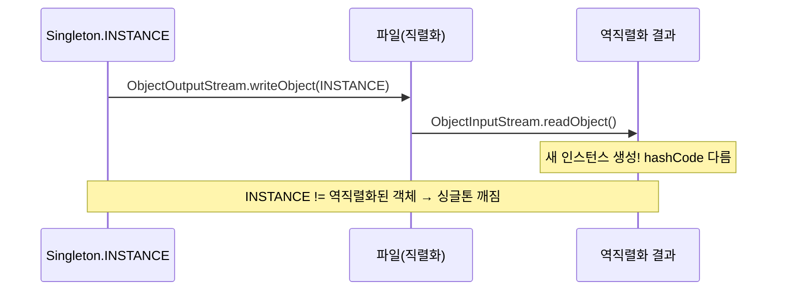
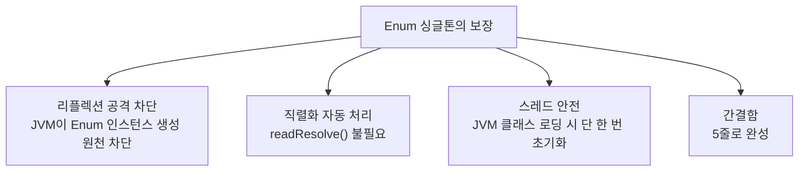
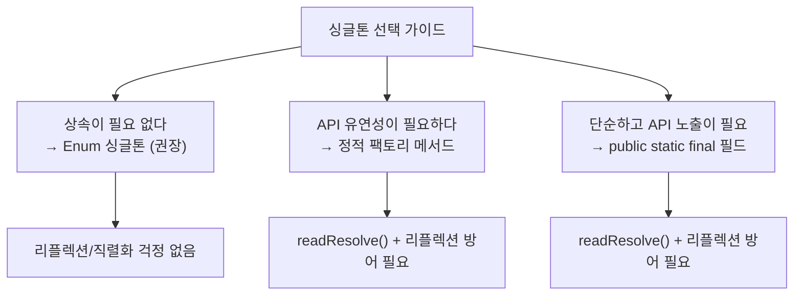

싱글톤은 "전 세계에 딱 하나만 존재해야 하는 객체"를 만드는 패턴입니다. 쉬워 보이지만 리플렉션과 직렬화라는 두 가지 함정이 있습니다. 세 가지 구현 방식과 각각의 약점을 비유로 설명합니다.

---

## 1. 싱글톤이란?

인스턴스를 오직 하나만 만들 수 있는 클래스입니다. 무상태 서비스 객체나 시스템 전체에서 유일해야 하는 컴포넌트가 전형적인 예입니다.

비유하자면 **나라의 대통령**과 같습니다. 한 나라에 대통령은 반드시 한 명이어야 합니다. 누군가 몰래 "새 대통령"을 만들어 내면 안 됩니다.

**단점:** 싱글톤 클래스는 테스트하기 어렵습니다. 인터페이스가 없으면 Mock 객체로 교체할 수 없어서 싱글톤에 의존하는 클라이언트를 독립적으로 테스트할 수 없습니다.

---

## 2. 방식 1: public static final 필드

```java
public class President {
    public static final President INSTANCE = new President();

    private President() {
        // private 생성자 — 외부에서 new President() 불가
    }

    public void governe() { ... }
}

// 사용
President.INSTANCE.governe();
```

**장점:** `public static final`이므로 다른 객체를 참조할 수 없음이 API에 드러납니다. 코드가 간결합니다.

**약점 — 리플렉션 공격:**

```java
// 리플렉션으로 private 생성자를 강제 호출 가능!
Constructor<President> c = President.class.getDeclaredConstructor();
c.setAccessible(true);
President second = c.newInstance();  // 두 번째 인스턴스 생성!

System.out.println(President.INSTANCE == second);  // false → 싱글톤 깨짐
```

**방어 방법:** 생성자에서 두 번째 호출을 탐지하면 예외를 던집니다.

```java
private President() {
    if (INSTANCE != null) {
        throw new IllegalStateException("싱글톤! 두 번째 인스턴스 생성 불가");
    }
}
```

---

## 3. 방식 2: 정적 팩토리 메서드

```java
public class President {
    private static final President INSTANCE = new President();

    private President() {}

    public static President getInstance() {
        return INSTANCE;  // 항상 동일 인스턴스 반환
    }

    public void governe() { ... }
}

// 사용
President.getInstance().governe();
```

**추가 장점 (방식 1 대비):**
- API를 바꾸지 않고 나중에 싱글톤이 아니게 변경 가능 (스레드별 다른 인스턴스 반환 등)
- 제네릭 싱글톤 팩토리로 만들 수 있음
- `Supplier<President>`로 메서드 참조 활용 가능

**리플렉션 약점은 동일합니다.**

---

## 4. 직렬화 문제 (방식 1, 2 공통)

`Serializable`을 구현한 싱글톤을 직렬화→역직렬화하면 새 인스턴스가 만들어집니다.


```mermaid
sequenceDiagram
    participant S as Singleton.INSTANCE
    participant F as 파일(직렬화)
    participant D as 역직렬화 결과

    S->>F: ObjectOutputStream.writeObject(INSTANCE)
    F->>D: ObjectInputStream.readObject()
    Note over D: 새 인스턴스 생성! hashCode 다름
    Note over S,D: INSTANCE != 역직렬화된 객체 → 싱글톤 깨짐
```

```java
// 싱글톤 깨짐 재현
Singleton original = Singleton.getInstance();
// 직렬화
ObjectOutput out = new ObjectOutputStream(new FileOutputStream("s.dat"));
out.writeObject(original);
out.close();

// 역직렬화
ObjectInput in = new ObjectInputStream(new FileInputStream("s.dat"));
Singleton deserialized = (Singleton) in.readObject();
in.close();

System.out.println(original == deserialized);        // false!
System.out.println(original.hashCode());             // 예: 1234
System.out.println(deserialized.hashCode());         // 예: 5678
```

**해결 방법: `readResolve()` 추가**

```java
public class Singleton implements Serializable {
    private static final Singleton INSTANCE = new Singleton();
    private Singleton() {}
    public static Singleton getInstance() { return INSTANCE; }

    // 역직렬화 시 새 인스턴스 대신 기존 INSTANCE 반환
    private Object readResolve() {
        return INSTANCE;
    }
}
// 이제 직렬화→역직렬화해도 항상 INSTANCE 반환
```

> `transient`: 직렬화에서 제외할 필드에 붙이는 키워드. 싱글톤의 모든 인스턴스 필드에 `transient`를 붙이는 방법도 있지만 `readResolve()`가 더 명확합니다.

---

## 5. 방식 3: 열거 타입 (Enum) — 가장 바람직한 방법

```java
public enum President {
    INSTANCE;

    public void governe() {
        System.out.println("통치 중...");
    }
}

// 사용
President.INSTANCE.governe();
```

단 5줄로 완벽한 싱글톤입니다.


```mermaid
graph TD
    A["Enum 싱글톤의 보장"] --> B["리플렉션 공격 차단\nJVM이 Enum 인스턴스 생성 원천 차단"]
    A --> C["직렬화 자동 처리\nreadResolve() 불필요"]
    A --> D["스레드 안전\nJVM 클래스 로딩 시 단 한 번 초기화"]
    A --> E["간결함\n5줄로 완성"]
```

**리플렉션 공격 불가:**

```java
Constructor<President> c = President.class.getDeclaredConstructor(String.class, int.class);
c.setAccessible(true);
c.newInstance("INSTANCE", 0);
// java.lang.IllegalArgumentException: Cannot reflectively create enum objects
// JVM 수준에서 완전 차단!
```

**직렬화도 자동 처리:** Enum은 `java.lang.Enum`이 직렬화를 처리해 역직렬화 시 항상 같은 인스턴스를 반환합니다. `readResolve()`가 필요 없습니다.

**유일한 단점:** Enum 외의 클래스를 상속해야 하는 경우에는 사용할 수 없습니다. (인터페이스 구현은 가능)

---

## 6. 세 방식 비교

| 항목 | public 필드 | 정적 팩토리 | Enum |
|------|------------|------------|------|
| 간결함 | 보통 | 보통 | 최고 |
| 리플렉션 방어 | 직접 구현 필요 | 직접 구현 필요 | JVM이 자동 차단 |
| 직렬화 | readResolve 필요 | readResolve 필요 | 자동 처리 |
| 스레드 안전 | 가능 | 가능 | 자동 보장 |
| 유연성 | 낮음 | 높음 (API 유지) | 상속 불가 |

---

## 7. 요약


```mermaid
graph TD
    A["싱글톤 선택 가이드"] --> B["상속이 필요 없다\n→ Enum 싱글톤 (권장)"]
    A --> C["API 유연성이 필요하다\n→ 정적 팩토리 메서드"]
    A --> D["단순하고 API 노출이 필요\n→ public static final 필드"]
    B --> B1["리플렉션/직렬화 걱정 없음"]
    C --> C1["readResolve() + 리플렉션 방어 필요"]
    D --> D1["readResolve() + 리플렉션 방어 필요"]
```

> 대부분의 상황에서 **원소가 하나뿐인 열거 타입이 싱글톤을 만드는 가장 좋은 방법**입니다.

---

> 참조: 이펙티브 자바 3/E — 조슈아 블로크
