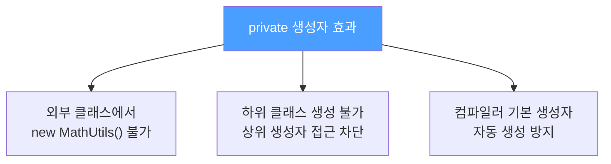
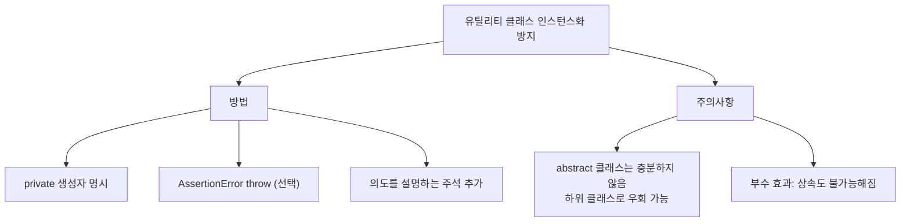

`Math.abs()`, `Collections.sort()` 같은 유틸리티 클래스는 인스턴스를 만들 필요가 없습니다. 그런데 아무 처리를 안 하면 컴파일러가 몰래 기본 생성자를 추가합니다. 어떻게 막을까요?

---

## 1. 정적 유틸리티 클래스란?

정적 메서드와 정적 필드만 담는 클래스입니다. 인스턴스 없이 `ClassName.method()` 형태로 호출하도록 설계합니다.

대표적인 예:
- `java.lang.Math` — 수학 연산 유틸리티
- `java.util.Arrays` — 배열 조작 유틸리티
- `java.util.Collections` — 컬렉션 유틸리티

```java
// 올바른 사용 — 인스턴스 없이 호출
double result = Math.abs(-3.14);
Arrays.sort(arr);
Collections.sort(list);

// 잘못된 사용 — 인스턴스를 만들 이유가 없음
Math m = new Math();  // 의미 없음
```

---

## 2. 문제: 컴파일러가 기본 생성자를 자동 추가한다

생성자를 하나도 명시하지 않으면 컴파일러가 자동으로 `public` 기본 생성자를 만듭니다. 사용자는 이것이 의도적으로 만든 생성자인지 자동 생성된 것인지 구분할 수 없습니다.

```java
// 개발자가 작성한 코드
public class MathUtils {
    public static int add(int a, int b) { return a + b; }
}

// 컴파일러가 실제로 생성하는 코드
public class MathUtils {
    public MathUtils() {}  // 자동 생성! 아무도 원하지 않는 생성자
    public static int add(int a, int b) { return a + b; }
}

// 결과: 누군가 실수로 인스턴스를 만들 수 있음
MathUtils mu = new MathUtils();  // 막을 방법이 없음
```

---

## 3. 잘못된 해결책: abstract 클래스

"추상 클래스로 만들면 인스턴스화를 막을 수 있지 않나?" 라고 생각할 수 있지만 충분하지 않습니다.

```java
// 잘못된 접근
public abstract class MathUtils {
    public static int add(int a, int b) { return a + b; }
}

// 하위 클래스를 만들면 우회 가능!
public class MyMathUtils extends MathUtils {}
MyMathUtils mu = new MyMathUtils();  // 인스턴스화 성공!
```

게다가 추상 클래스를 보면 "상속해서 쓰라는 뜻"으로 오해하기 쉽습니다.

---

## 4. 올바른 해결책: private 생성자

비유하자면 자물쇠를 채운 것과 같습니다. 생성자를 `private`으로 선언하면 외부에서도, 하위 클래스에서도 호출할 수 없습니다.

```java
public class MathUtils {

    // 인스턴스화 방지용 — 이 클래스는 인스턴스를 만들 필요가 없습니다
    private MathUtils() {
        throw new AssertionError("인스턴스 생성 불가");
    }

    public static int add(int a, int b) { return a + b; }
    public static int max(int a, int b) { return a > b ? a : b; }
}
```

`AssertionError`를 던지는 이유: 클래스 내부에서 실수로 생성자를 호출하는 것도 막기 위해서입니다. 꼭 필요하지는 않지만 안전망 역할을 합니다.

**주석을 달자:** 생성자가 분명히 존재하는데 호출할 수 없어서 직관적이지 않습니다. 반드시 의도를 주석으로 설명하세요.



---

## 5. 상속도 막힌다

모든 생성자는 상위 클래스의 생성자를 명시적이든 묵시적이든 호출해야 합니다. 상위 클래스의 생성자가 `private`이면 하위 클래스가 `super()`를 호출할 수 없으므로 상속 자체가 불가능해집니다.

```java
// 컴파일 에러 발생
public class ExtendedMathUtils extends MathUtils {
    // 묵시적으로 super() 호출 → MathUtils() private이므로 컴파일 에러!
}
```

이것은 의도된 부수 효과입니다. 유틸리티 클래스는 상속용으로 설계된 것이 아니므로 상속을 막는 것이 오히려 올바른 설계입니다.

---

## 6. 실무 패턴

```java
// Spring 프로젝트에서 자주 보이는 패턴
public final class StringUtils {

    // 인스턴스화 방지
    private StringUtils() {
        throw new AssertionError();
    }

    public static boolean isEmpty(String s) {
        return s == null || s.isEmpty();
    }

    public static String capitalize(String s) {
        if (isEmpty(s)) return s;
        return Character.toUpperCase(s.charAt(0)) + s.substring(1);
    }
}

// Lombok @UtilityClass — private 생성자 자동 추가
@UtilityClass
public class DateUtils {
    public LocalDate today() { return LocalDate.now(); }
}
```

---

## 7. 요약



> 정적 메서드만 담은 유틸리티 클래스는 반드시 `private` 생성자를 추가해 인스턴스화와 상속을 모두 막으세요.

---

> 참조: 이펙티브 자바 3/E — 조슈아 블로크
