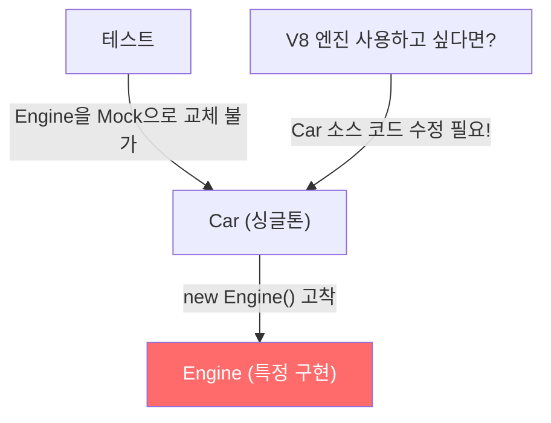
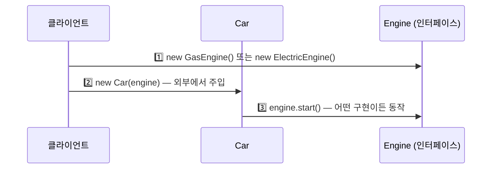
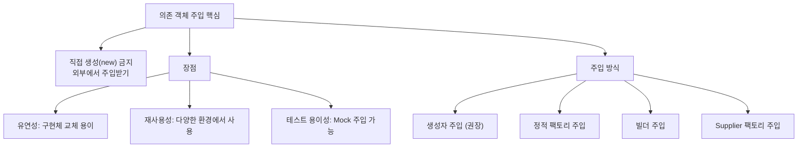

클래스 내부에서 `new Engine()`처럼 의존 객체를 직접 생성하면 어떤 문제가 생길까요? 테스트가 어려워지고, 엔진 종류를 바꿀 때마다 소스 코드를 열어야 합니다. 의존 객체 주입(DI)이 이를 해결합니다.

---

## 1. 문제: 의존 객체를 내부에서 직접 생성

### 안티패턴 — 싱글톤에서 자원 직접 생성

```java
// 나쁜 예 — Car가 특정 Engine에 고착됨
public class Car {
    private final Engine engine = new Engine();  // 직접 생성!

    public static Car INSTANCE = new Car();
    private Car() {}

    public void drive() {
        engine.start();
    }
}
```

**문제점:**



- `Engine`을 `V8Engine`으로 바꾸려면 `Car` 코드를 열어 수정해야 합니다.
- 테스트 시 실제 `Engine` 없이 `Car`를 테스트할 방법이 없습니다.
- 멀티스레드 환경에서 `Engine`을 동적으로 교체하는 방법이 없습니다.

---

## 2. 해결: 의존 객체 주입 (Dependency Injection)

### 동작 원리

비유하자면 **레고 블록**입니다. 자동차 모델에 어떤 엔진 블록이든 끼울 수 있어야 합니다. 자동차가 직접 엔진을 만드는 게 아니라, 외부에서 엔진을 가져다 조립합니다.

```java
// 좋은 예 — 생성자로 의존 객체 주입
public class Car {
    private final Engine engine;  // 외부에서 받음

    public Car(Engine engine) {
        this.engine = Objects.requireNonNull(engine);  // null 방어
    }

    public void drive() {
        engine.start();
    }
}

// 다양한 Engine을 주입 가능
Car gasCar     = new Car(new GasEngine());
Car electricCar = new Car(new ElectricEngine());
Car testCar    = new Car(new MockEngine());  // 테스트용 Mock
```



---

## 3. 세 가지 주입 방식

```java
// 1. 생성자 주입 (권장 — 불변 보장)
public class Car {
    private final Engine engine;

    public Car(Engine engine) {
        this.engine = Objects.requireNonNull(engine);
    }
}

// 2. 정적 팩토리 메서드 주입
public class Car {
    private final Engine engine;

    private Car(Engine engine) { this.engine = engine; }

    public static Car of(Engine engine) {
        return new Car(Objects.requireNonNull(engine));
    }
}

// 3. 빌더 주입
public class Car {
    private final Engine engine;

    private Car(Builder builder) { this.engine = builder.engine; }

    public static class Builder {
        private Engine engine;
        public Builder engine(Engine e) { this.engine = e; return this; }
        public Car build() { return new Car(this); }
    }
}
```

---

## 4. 팩토리 메서드 패턴 응용 — Supplier

의존 객체 주입의 변형으로, 인스턴스를 만드는 **팩토리(Supplier)** 를 주입할 수 있습니다.

```java
// Supplier<T>를 받아 필요할 때마다 새 인스턴스 생성
public class CarFactory {
    private final Supplier<? extends Engine> engineFactory;

    public CarFactory(Supplier<? extends Engine> engineFactory) {
        this.engineFactory = Objects.requireNonNull(engineFactory);
    }

    public Car makeCar() {
        return new Car(engineFactory.get());  // 매번 새 엔진 생성
    }
}

// 사용
CarFactory factory = new CarFactory(GasEngine::new);
Car car1 = factory.makeCar();
Car car2 = factory.makeCar();  // 각각 새 GasEngine 인스턴스
```

---

## 5. 테스트 가능성 향상

의존 객체 주입의 가장 큰 장점은 **테스트 시 Mock 주입**이 가능하다는 것입니다.

```java
// 테스트에서 Mock Engine 주입
class CarTest {
    @Test
    void testDrive() {
        Engine mockEngine = mock(Engine.class);
        Car car = new Car(mockEngine);

        car.drive();

        verify(mockEngine).start();  // engine.start()가 호출됐는지 검증
    }
}
```

**만약 `new Engine()`으로 직접 생성했다면?** 테스트 시 실제 엔진(DB 연결, 네트워크 등)이 동작해야 하므로 단위 테스트가 불가능해집니다.

---

## 6. 대규모 프로젝트에서의 DI 프레임워크

의존성이 수십~수백 개가 되면 생성자 주입 코드가 복잡해집니다. Spring 같은 DI 프레임워크가 이 어지러움을 해소합니다.

```java
// Spring의 의존 객체 주입 — @Autowired 또는 생성자 주입
@Service
public class CarService {
    private final Engine engine;

    // Spring이 자동으로 Engine 빈을 찾아 주입
    public CarService(Engine engine) {
        this.engine = engine;
    }

    public void drive() {
        engine.start();
    }
}
```

---

## 7. 요약



> 클래스가 하나 이상의 자원에 의존하고 그 자원이 동작에 영향을 준다면, 자원을 직접 생성하지 마세요. 생성자(또는 팩토리/빌더)에 자원을 넘겨받는 의존 객체 주입을 사용하면 유연성·재사용성·테스트 용이성이 크게 향상됩니다.

---

> 참조: 이펙티브 자바 3/E — 조슈아 블로크
