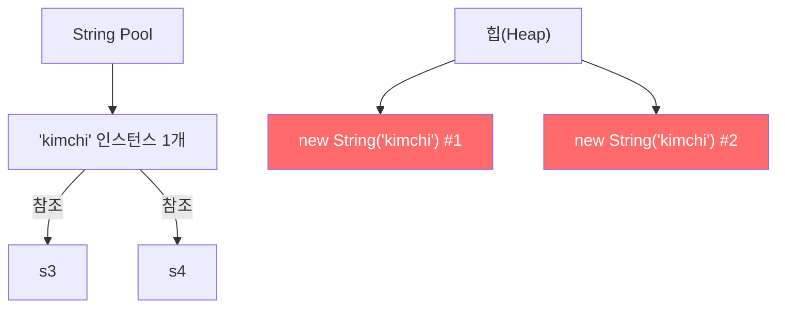
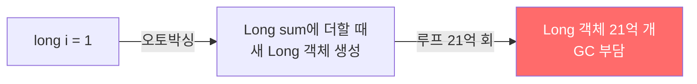
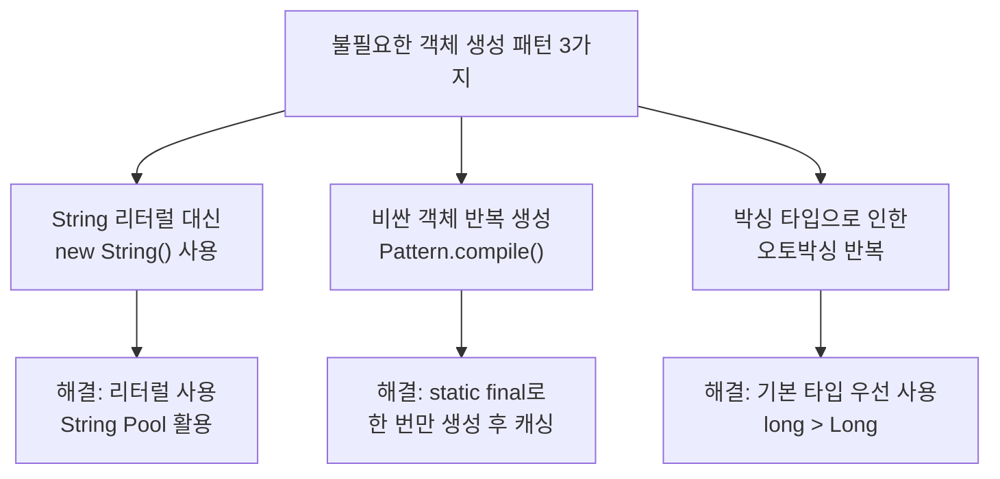

"객체는 가비지 컬렉터가 처리해주니까 마음대로 만들어도 되지 않나?" — 맞기도 하고 틀리기도 합니다. 불필요한 객체 생성이 성능을 얼마나 갉아먹는지, 세 가지 함정을 통해 확인합니다.

---

## 1. 함정 1: String 리터럴 대신 new String()

### 동작 원리

Java의 String은 **String Pool(문자열 풀)** 이라는 특별한 영역에서 관리됩니다. 리터럴로 생성하면 풀에서 같은 문자열을 재사용하지만, `new String()`은 매번 힙에 새 객체를 만듭니다.

```java
// 나쁜 예 — 매번 새 객체 생성
String s1 = new String("kimchi");  // 힙에 새 객체
String s2 = new String("kimchi");  // 또 다른 새 객체
System.out.println(s1 == s2);  // false — 서로 다른 객체!

// 좋은 예 — String Pool 재사용
String s3 = "kimchi";  // String Pool에 저장
String s4 = "kimchi";  // Pool에서 같은 객체 반환
System.out.println(s3 == s4);  // true — 동일 객체!
```



**만약 루프에서 `new String()`을 쓴다면?** 10만 번 반복하면 10만 개의 String 객체가 생성되고, GC 압력이 폭발적으로 증가합니다.

---

## 2. 함정 2: 비싼 객체의 반복 생성 — Pattern 예시

### 동작 원리

정규표현식 `Pattern` 객체는 내부적으로 **유한 상태 머신(Finite State Machine)** 을 빌드하는 무거운 작업을 수행합니다. `String.matches()`는 호출할 때마다 `Pattern`을 새로 생성하고 곧바로 버립니다.

```java
// 나쁜 예 — 매 호출마다 Pattern 인스턴스 새로 생성 (비쌈!)
static boolean isPhoneNumber(String s) {
    return s.matches("^01(?:0|1|[6-9])-(?:\\d{3}|\\d{4})-\\d{4}$");
    //       ↑ 내부적으로 Pattern.compile() 호출 → FSM 빌드 → 사용 → GC
}

// isPhoneNumber가 10만 번 호출되면 Pattern이 10만 번 생성!
```

```java
// 좋은 예 — static final로 한 번만 생성, 이후 재사용
public class PhoneUtils {
    // 클래스 로딩 시 딱 한 번만 컴파일
    private static final Pattern PHONE_PATTERN =
        Pattern.compile("^01(?:0|1|[6-9])-(?:\\d{3}|\\d{4})-\\d{4}$");

    static boolean isPhoneNumber(String s) {
        return PHONE_PATTERN.matcher(s).matches();  // 재사용!
    }
}
```

**성능 비교:**

| 방식 | 10만 회 호출 | Pattern 생성 수 |
|------|------------|----------------|
| `String.matches()` | 느림 | 10만 개 |
| `static final Pattern` | 빠름 | 1개 |

실제로 Effective Java 저자의 측정에서 약 **6.5배** 빠른 결과가 나왔습니다.

---

## 3. 함정 3: 오토박싱 — 박싱 타입의 함정

### 동작 원리

오토박싱은 기본 타입(`long`)을 박싱 타입(`Long`)으로 자동 변환해주는 편의 기능입니다. 그런데 이 변환 시 **새 객체가 생성**됩니다. 반복문 안에서 오토박싱이 일어나면 엄청난 수의 불필요한 객체가 만들어집니다.

```java
// 나쁜 예 — Long(대문자!) 타입 사용
private static long sum() {
    Long sum = 0L;  // ← Long(박싱 타입)!

    for (long i = 0; i <= Integer.MAX_VALUE; i++) {
        sum += i;
        // sum += i는 다음과 같이 동작:
        // 1. sum을 long으로 언박싱
        // 2. i를 더함
        // 3. 결과를 다시 Long으로 오토박싱 → 새 Long 객체 생성!
    }
    return sum;
}
// Integer.MAX_VALUE ≈ 21억 번 → Long 객체 21억 개 생성!
```

```java
// 좋은 예 — long(소문자!) 기본 타입 사용
private static long sum() {
    long sum = 0L;  // ← long(기본 타입)!

    for (long i = 0; i <= Integer.MAX_VALUE; i++) {
        sum += i;  // 오토박싱 없음, 기본 타입 연산
    }
    return sum;
}
// 성능 차이: 수 배~수십 배
```



**주의:** 오토박싱/언박싱 자체는 문제가 아닙니다. **성능이 중요한 루프 안에서** 의도치 않게 일어나는 것이 문제입니다.

---

## 4. 불변 객체 캐싱 패턴

비싼 객체를 `static final`로 캐싱해두면 매 호출마다 생성하는 비용을 아낄 수 있습니다.

```java
// Boolean — 미리 만든 인스턴스 재사용
// new Boolean(true) 대신:
Boolean t = Boolean.valueOf(true);   // 캐시된 Boolean.TRUE 반환
Boolean f = Boolean.valueOf(false);  // 캐시된 Boolean.FALSE 반환

// Integer — -128 ~ 127 범위 캐싱
Integer a = Integer.valueOf(100);
Integer b = Integer.valueOf(100);
System.out.println(a == b);  // true — 캐시 재사용

Integer c = Integer.valueOf(200);
Integer d = Integer.valueOf(200);
System.out.println(c == d);  // false — 범위 초과, 새 객체 생성
```

---

## 5. 방어적 복사와의 균형

> "객체를 재사용하면 안 되는 경우도 있다."

보안이 중요한 경우 **방어적 복사(defensive copy)** 가 필요합니다. 객체를 공유했다가 외부에서 변경되면 버그가 생기기 때문입니다. 성능을 위한 재사용과 안전을 위한 방어적 복사는 상황에 따라 선택해야 합니다.

```java
// 방어적 복사가 필요한 경우 (Item 50)
public class Period {
    private final Date start;
    private final Date end;

    public Period(Date start, Date end) {
        this.start = new Date(start.getTime());  // 방어적 복사 — 재사용 안 함
        this.end   = new Date(end.getTime());
    }
}
```

---

## 6. 요약



**핵심 규칙:**
1. `new String("리터럴")` 대신 `"리터럴"` 사용
2. 자주 쓰이는 비싼 객체는 `static final`로 캐싱
3. 반복 연산에서 박싱 타입(`Long`, `Integer`) 대신 기본 타입(`long`, `int`) 사용
4. 정적 팩토리 메서드 (`Boolean.valueOf()`) 활용 — 캐싱 내장

---

> 참조: 이펙티브 자바 3/E — 조슈아 블로크
