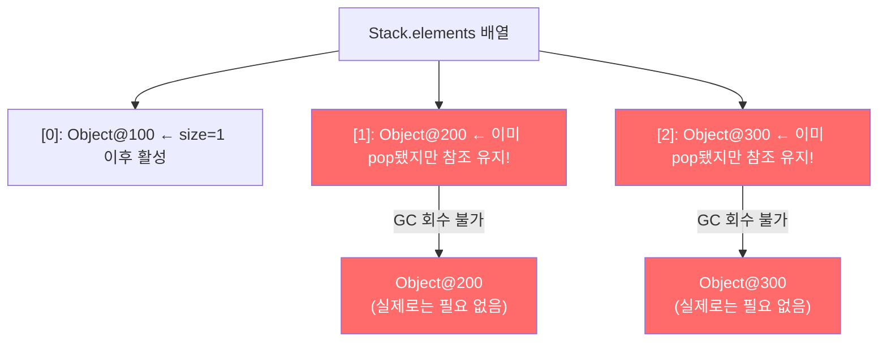
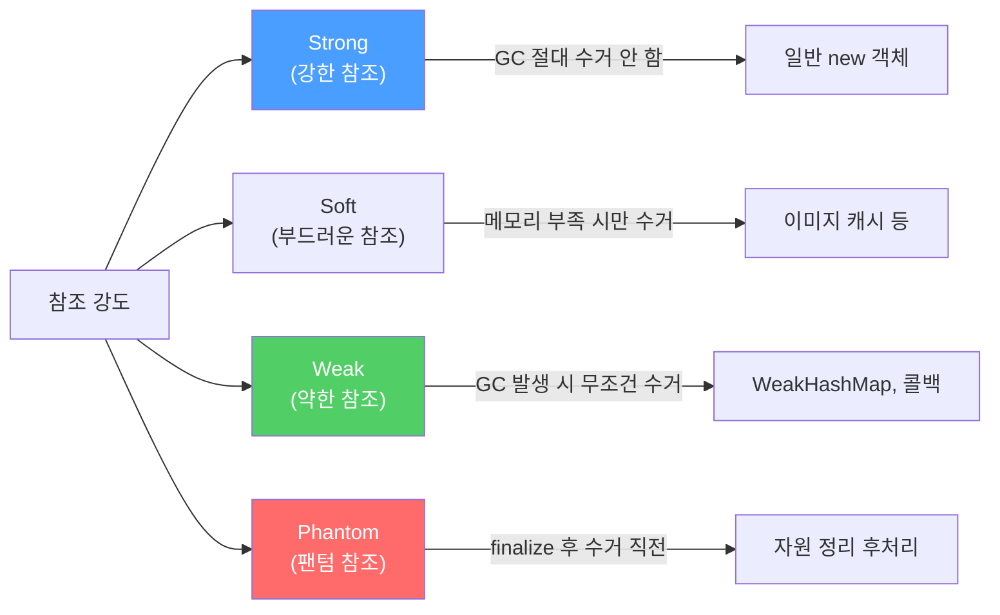
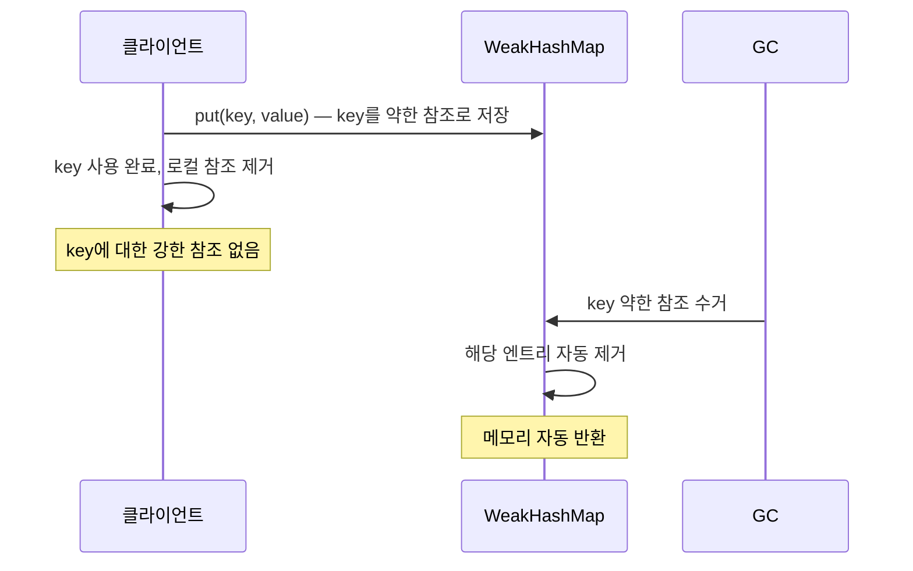
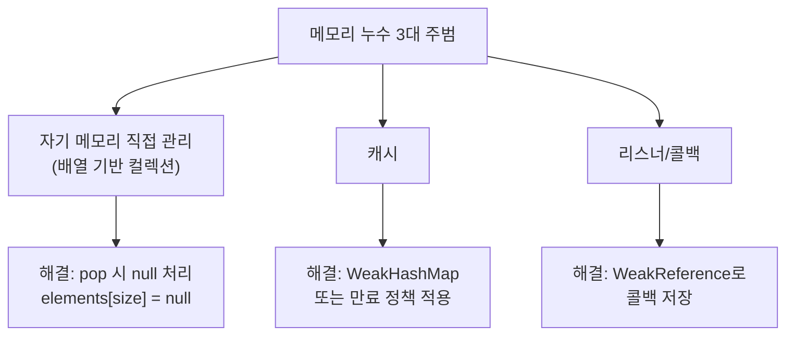

"GC가 다 처리해주니까 메모리 걱정은 안 해도 되겠지?" — 이 생각이 가장 위험합니다. Java에는 GC가 절대 회수하지 못하는 참조가 존재하고, 그것이 메모리 누수로 이어집니다.

---

## 1. GC가 회수하지 못하는 참조 — Stack 예시

### 동작 원리

비유하자면 **창고 관리원**을 생각해보세요. 창고(elements 배열)에 물건이 들어오고 나갑니다. 그런데 물건을 꺼냈어도 창고 대장(배열 슬롯)에는 여전히 그 물건의 이름이 적혀 있습니다. GC는 창고 대장에 이름이 적힌 물건은 "아직 필요한 것"으로 보고 회수하지 않습니다.

```java
public class Stack {
    private Object[] elements;
    private int size = 0;
    private static final int DEFAULT_INITIAL_CAPACITY = 16;

    public Stack() {
        elements = new Object[DEFAULT_INITIAL_CAPACITY];
    }

    public void push(Object e) {
        ensureCapacity();
        elements[size++] = e;
    }

    // 문제 있는 pop — 참조를 해제하지 않음!
    public Object pop() {
        if (size == 0) {
            throw new EmptyStackException();
        }
        return elements[--size];  // ← size만 줄이고, 슬롯엔 여전히 참조 남아있음
    }

    private void ensureCapacity() {
        if (elements.length == size) {
            elements = Arrays.copyOf(elements, 2 * size + 1);
        }
    }
}
```



**만약 이걸 방치하면?** 스택이 커졌다가 줄어들기를 반복할수록 pop된 객체들이 GC에서 제외된 채 힙을 잠식합니다. 그 객체들이 참조하는 하위 객체들까지 연쇄적으로 살아남아 결국 OutOfMemoryError가 발생합니다.

---

## 2. 해결: 다 쓴 참조를 null로 해제

```java
// 올바른 pop — 참조 해제
public Object pop() {
    if (size == 0) {
        throw new EmptyStackException();
    }
    Object result = elements[--size];
    elements[size] = null;  // ← 다 쓴 참조 명시적 해제
    return result;
}
```

**null 처리의 부가 효과:** 실수로 해제된 참조를 다시 사용하려 하면 `NullPointerException`을 즉시 던집니다. 조용히 잘못된 객체를 반환하는 것보다 훨씬 낫습니다.

> **주의:** 모든 변수를 null로 초기화하는 습관은 코드를 지저분하게 만들 뿐입니다. null 처리는 **자기 메모리를 직접 관리하는 클래스**에서, 다 쓴 원소를 즉시 해제할 때만 사용하세요. 일반적인 경우에는 변수를 해당 스코프(scope) 밖으로 밀어내는 것이 훨씬 좋은 방법입니다.

---

## 3. 메모리 누수의 세 가지 주범

### 주범 1: 자기 메모리를 직접 관리하는 클래스

Stack처럼 배열이나 리스트로 원소를 직접 관리하는 클래스가 여기에 해당합니다. GC는 어느 원소가 "활성"인지 알 수 없으므로 개발자가 직접 null 처리를 해줘야 합니다.

### 주범 2: 캐시

```java
// 위험한 캐시 — 키가 외부에서 더 이상 참조되지 않아도 Map에 남아있음
Map<String, byte[]> cache = new HashMap<>();
cache.put("config", loadConfig());
// config를 다 쓴 뒤에도 cache에서 제거하지 않으면 영원히 메모리 점유
```

```java
// 해결책 1: WeakHashMap — 키 참조가 사라지면 엔트리 자동 제거
Map<String, byte[]> cache = new WeakHashMap<>();

// 해결책 2: 시간 기반 만료 — ScheduledThreadPoolExecutor로 주기적 청소
// 해결책 3: LinkedHashMap.removeEldestEntry() 오버라이드
```

비유하자면 **냉장고 관리**입니다. 재료를 넣기만 하고 꺼내지 않으면 결국 자리가 없어집니다. 오래된 재료(엔트리)를 주기적으로 꺼내 버려야 합니다.

### 주범 3: 리스너(Listener)와 콜백(Callback)

```java
// 위험한 콜백 등록 — 등록만 하고 해제하지 않으면 콜백이 계속 쌓임
public class EventBus {
    private List<EventListener> listeners = new ArrayList<>();

    public void register(EventListener listener) {
        listeners.add(listener);  // 강한 참조 — GC 회수 불가
    }
    // unregister()를 호출하지 않으면 리스너들이 영원히 메모리 점유
}
```

```java
// 해결책: 약한 참조(WeakReference)로 콜백 저장
public class EventBus {
    private List<WeakReference<EventListener>> listeners = new ArrayList<>();

    public void register(EventListener listener) {
        listeners.add(new WeakReference<>(listener));
        // 외부에서 listener 참조가 사라지면 GC가 자동 수거
    }
}
```

---

## 4. Java의 참조 4단계

Java는 참조 강도를 4단계로 나눠 GC 동작을 세밀하게 제어할 수 있습니다.



### Strong Reference (강한 참조)

```java
// 가장 일반적인 참조 — GC가 절대 회수하지 않음
SampleObject obj = new SampleObject();
// obj가 null이 되거나 스코프를 벗어나야 GC 대상이 됨
```

### Soft Reference (부드러운 참조)

```java
SampleObject obj = new SampleObject();
SoftReference<SampleObject> ref = new SoftReference<>(obj);

obj = null;
System.gc();  // 메모리 여유 있으면 수거 안 함

obj = ref.get();  // 메모리 충분하면 not null 반환
System.out.println(obj == null ? "수거됨" : "살아있음");
// 메모리가 충분하면 → "살아있음"
// OOM 직전이면 → "수거됨"
```

**언제 쓰나?** 이미지 캐시처럼 메모리 여유 있을 때는 캐시를 유지하고, 부족할 때는 자동으로 해제하고 싶을 때 사용합니다.

### Weak Reference (약한 참조)

```java
SampleObject obj = new SampleObject();
WeakReference<SampleObject> ref = new WeakReference<>(obj);

obj = null;
System.gc();  // GC 발생하면 무조건 수거

obj = ref.get();
System.out.println(obj == null ? "수거됨" : "살아있음");
// → "수거됨" (GC가 실행됐다면)
```

**WeakHashMap의 동작 원리:**



### Phantom Reference (팬텀 참조)

팬텀 참조는 `get()`이 항상 `null`을 반환합니다. **GC가 객체 메모리를 회수하기 직전**에 `ReferenceQueue`에 enqueue되어, 자원 정리 후처리 작업에 사용합니다.

```java
// GC 처리 순서
// 1. soft references 수거 (메모리 부족 시)
// 2. weak references 수거 (GC 발생 시 무조건)
// 3. finalize() 실행
// 4. phantom references → ReferenceQueue enqueue
// 5. 메모리 실제 회수
```

> 팬텀 참조는 매우 고급 주제이며, 일반 애플리케이션 코드에서 직접 쓸 일은 거의 없습니다. `cleaner`(Item 8)가 내부적으로 이 메커니즘을 활용합니다.

---

## 5. 요약



**핵심 규칙:**
1. 자기 메모리를 직접 관리하는 클래스에서 다 쓴 원소는 즉시 `null` 처리
2. 캐시는 `WeakHashMap` 또는 시간 기반 만료 정책 적용
3. 콜백/리스너는 `WeakReference`로 저장하거나 명시적 해제 보장
4. 메모리 누수는 힙 프로파일러 없이는 발견하기 어려우므로 처음부터 예방

---

> 참조: 이펙티브 자바 3/E — 조슈아 블로크
