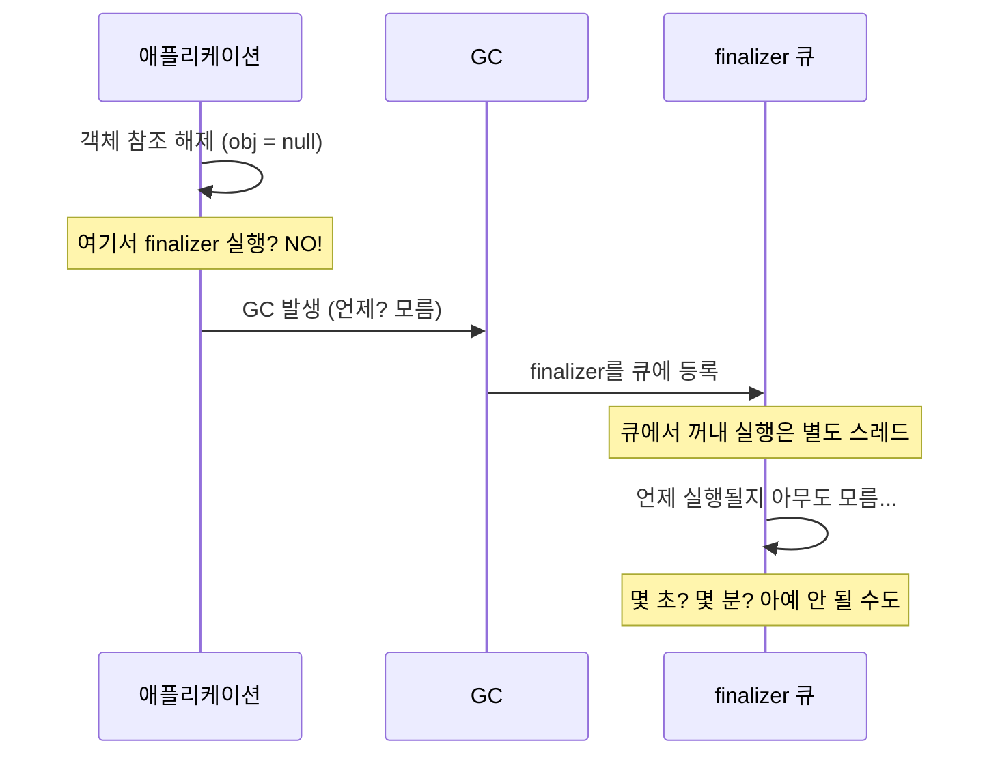
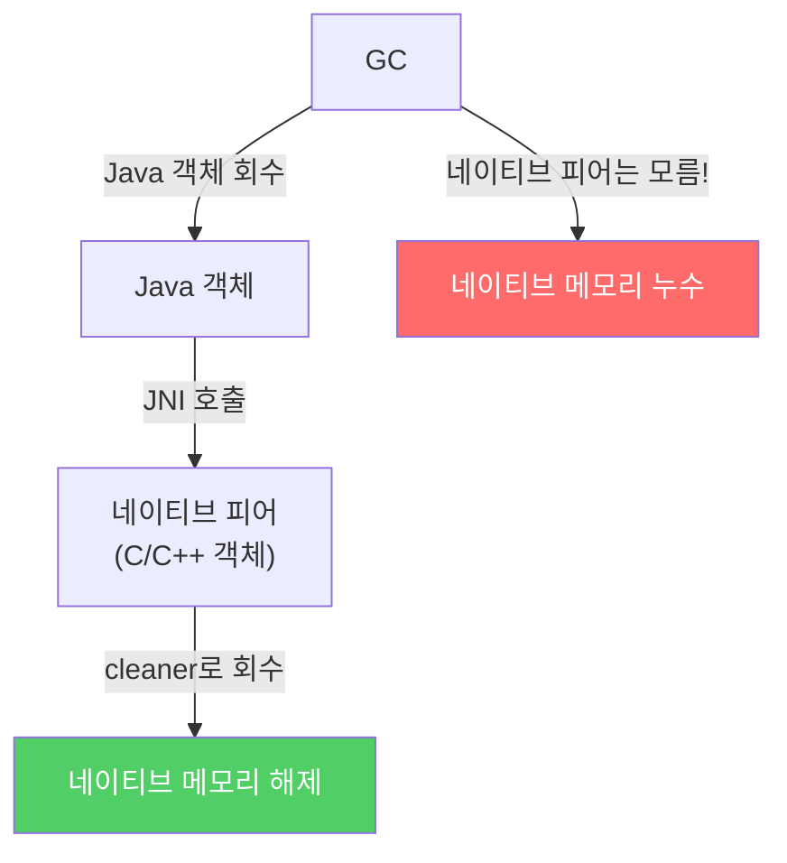
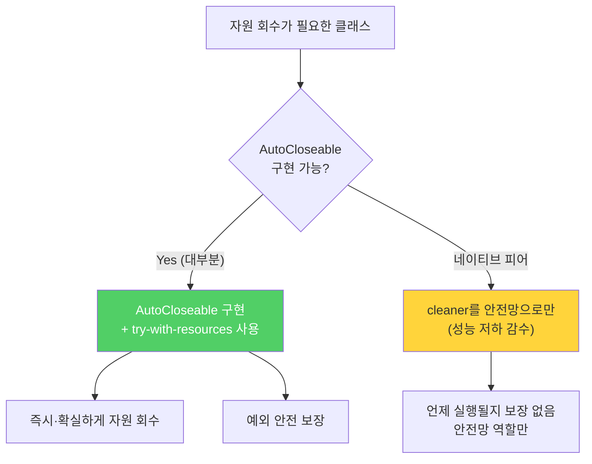

Java에는 두 가지 객체 소멸자가 있습니다 — `finalizer`와 `cleaner`. 둘 다 존재하긴 하지만, 언제 실행될지 아무도 모릅니다. 시한폭탄처럼 언젠가 터지는데 그게 언제인지 알 수 없는 도구입니다.

---

## 1. finalizer와 cleaner란?

비유하자면 **"나중에 치울게요" 약속지**입니다. 방을 사용하고 나서 직접 청소하지 않고 쪽지만 남겨두는 것처럼, 언제 청소가 될지 전혀 모릅니다. 급한 약속이 있어서 지금 당장 청소가 필요한데 쪽지만 믿고 나갔다간 큰일 납니다.

| 항목 | finalizer | cleaner |
|------|-----------|---------|
| Java 버전 | Java 9에서 deprecated | Java 9에서 도입 |
| 위험도 | 높음 | 낮음 (하지만 여전히 위험) |
| 실행 보장 | 없음 | 없음 |
| 성능 영향 | 심각함 (~50배) | 심각함 |
| 권장 | 절대 사용 금지 | 안전망 용도로만 |

> C++의 소멸자(destructor)와는 다릅니다. C++에서는 객체 소멸 시 소멸자가 즉시·확실하게 호출됩니다. Java의 finalizer/cleaner는 "언젠가 호출될 수도 있는" 것으로, 실행 시점과 실행 여부 모두 보장되지 않습니다.

---

## 2. 왜 쓰면 안 되는가 — 5가지 치명적 문제

### 문제 1: 실행 시점 보장 없음



**만약 파일 닫기를 finalizer에 맡기면?** 시스템에서 동시에 열 수 있는 파일 수는 제한되어 있습니다. finalizer가 늦게 실행되면 파일이 닫히지 않은 채 쌓여 결국 `Too many open files` 오류가 발생합니다.

### 문제 2: 실행 자체가 보장되지 않음

```java
// 절대 하면 안 되는 코드
class DatabaseConnection {
    @Override
    protected void finalize() {
        connection.close();  // DB 락 해제를 finalizer에 맡김
        // → 분산 시스템 전체가 서서히 멈출 수 있음!
    }
}
```

Java 언어 명세는 finalizer의 수행 시점뿐 아니라 **수행 여부조차 보장하지 않습니다.** 프로그램이 종료되면서 실행되지 않은 finalizer가 그냥 사라질 수 있습니다.

### 문제 3: 예외가 무시됨

```java
@Override
protected void finalize() {
    // 여기서 예외가 발생하면...
    throw new RuntimeException("오류!");
    // 예외가 출력조차 안 되고 그냥 무시됨!
    // 객체는 마무리되지 않은 상태로 남음
}
```

일반 코드에서 예외는 스택 트레이스라도 출력됩니다. finalizer에서 발생한 예외는 **경고조차 없이 무시**됩니다. 객체가 부분적으로만 처리된 채 방치되고, 다른 스레드가 이 훼손된 객체를 사용하면 예측 불가능한 동작이 발생합니다.

### 문제 4: 심각한 성능 저하

```
AutoCloseable (try-with-resources) 방식: ~12ns
finalizer 방식: ~550ns
성능 차이: 약 50배
```

finalizer는 GC가 객체를 즉시 수거하지 못하게 방해합니다. GC가 객체를 발견하면 finalizer 큐에 넣고 별도 스레드가 처리할 때까지 기다려야 하기 때문입니다.

### 문제 5: 보안 공격에 취약 — finalizer 공격

```java
// 공격 클래스 예시
public class MaliciousAccount extends BankAccount {
    static MaliciousAccount captured;

    @Override
    protected void finalize() {
        captured = this;  // 정적 필드에 자신을 등록 → GC 수거 영구 차단!
        // 생성자에서 예외가 발생한 "반쯤 만들어진" 객체로
        // 허용되지 않은 작업을 계속 수행 가능
    }
}

// 공격 시나리오
try {
    new MaliciousAccount(-1000);  // 생성자에서 예외 발생
} catch (Exception e) {}

System.gc();
Thread.sleep(1000);
// captured에 살아있는 MaliciousAccount 객체!
captured.transfer(1000000);  // 검증 우회하여 이체!
```

**방어 방법:** `final` 클래스는 하위 클래스를 만들 수 없으므로 이 공격에서 안전합니다. `final`이 아닌 클래스는 아무 동작도 하지 않는 `finalize()` 메서드를 `final`로 선언해 공격을 막아야 합니다.

```java
@Override
protected final void finalize() {
    // 아무것도 하지 않음 — 하위 클래스의 finalizer 공격 차단
}
```

---

## 3. 올바른 대안: AutoCloseable

```java
// 자원을 직접 관리하는 클래스라면 AutoCloseable 구현
public class DatabaseConnection implements AutoCloseable {
    private final Connection connection;
    private boolean closed = false;

    public DatabaseConnection(String url) {
        this.connection = DriverManager.getConnection(url);
    }

    public void query(String sql) {
        if (closed) throw new IllegalStateException("이미 닫힌 연결입니다");
        // ... 쿼리 실행
    }

    @Override
    public void close() {
        if (!closed) {
            connection.close();
            closed = true;  // 닫힌 후 재사용 방지
        }
    }
}

// 사용 — try-with-resources가 자동으로 close() 호출 보장
try (DatabaseConnection conn = new DatabaseConnection(url)) {
    conn.query("SELECT * FROM users");
}  // 예외 발생 여부와 무관하게 여기서 close() 반드시 호출됨
```

---

## 4. 그럼 finalizer/cleaner는 어디에 쓰나?

딱 두 가지 제한적 상황에서만 사용합니다.

### 용도 1: 안전망 (Safety Net)

클라이언트가 `close()`를 깜빡 잊었을 때를 대비한 최후의 수단입니다. "늦게라도 자원을 회수하는 게 안 하는 것보다는 낫다"는 관점입니다. Java 라이브러리의 `FileInputStream`, `FileOutputStream`, `ThreadPoolExecutor`가 이 방식을 사용합니다.

### 용도 2: 네이티브 피어(Native Peer) 자원 회수



GC는 Java 힙 밖의 네이티브 메모리를 알 수 없습니다. 네이티브 피어가 중요한 자원을 갖지 않고 성능 저하를 감당할 수 있을 때만 cleaner를 사용합니다.

---

## 5. cleaner를 안전망으로 사용하는 올바른 예

```java
public class Room implements AutoCloseable {

    private static final Cleaner cleaner = Cleaner.create();

    // 청소에 필요한 상태 — 절대 Room을 참조하면 안 됨! (순환 참조 방지)
    private static class State implements Runnable {
        int numJunkPiles;

        State(int numJunkPiles) {
            this.numJunkPiles = numJunkPiles;
        }

        // close() 또는 cleaner가 호출 (단 한 번)
        @Override
        public void run() {
            System.out.println("방 청소");
            numJunkPiles = 0;
        }
    }

    private final State state;
    private final Cleaner.Cleanable cleanable;

    public Room(int numJunkPiles) {
        this.state = new State(numJunkPiles);
        this.cleanable = cleaner.register(this, state);
        // this(Room)가 GC 대상이 되면 state.run() 호출 예약
    }

    @Override
    public void close() {
        cleanable.clean();  // 즉시 청소 + 이후 cleaner 중복 실행 방지
    }
}
```

**State가 static 중첩 클래스인 이유:** 비정적 중첩 클래스는 바깥 클래스(Room)의 참조를 자동으로 갖습니다. State가 Room을 참조하면 Room → State → Room의 순환 참조가 생겨 GC가 Room을 회수할 수 없게 됩니다.

```java
// 올바른 사용 — try-with-resources로 즉시 청소 보장
class Adult {
    public static void main(String[] args) {
        try (Room room = new Room(7)) {
            System.out.println("청소 완료 예정");
        }
        // → "청소 완료 예정" 출력 후 즉시 close() 호출 → "방 청소" 출력
    }
}

// 위험한 사용 — cleaner가 언제 실행될지 모름
class Teenager {
    public static void main(String[] args) {
        new Room(9);
        System.out.println("언젠간 치워지겠지...");
        // "방 청소"가 언제 출력될지 아무도 모름 (안 될 수도 있음)
    }
}
```

---

## 6. 요약



**핵심 규칙:**
1. `finalizer`는 절대 사용하지 마세요 (Java 9에서 deprecated)
2. `cleaner`는 안전망 역할이나 네이티브 피어 자원 회수에만 제한적으로 사용
3. 자원을 직접 관리하는 클래스는 항상 `AutoCloseable`을 구현하세요
4. 클라이언트는 항상 `try-with-resources`를 사용하세요

---

> 참조: 이펙티브 자바 3/E — 조슈아 블로크
