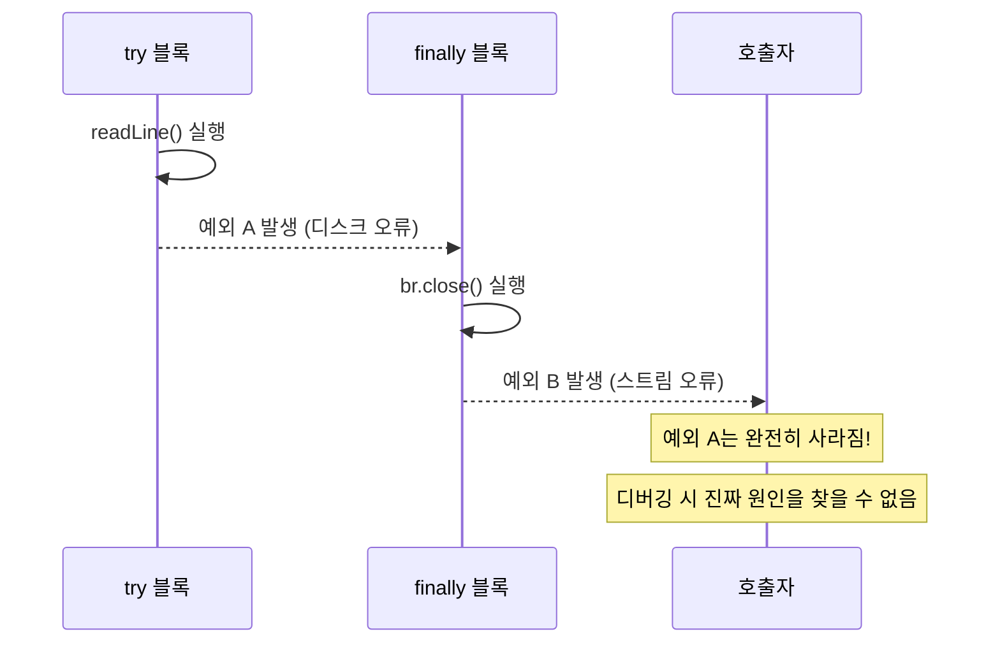
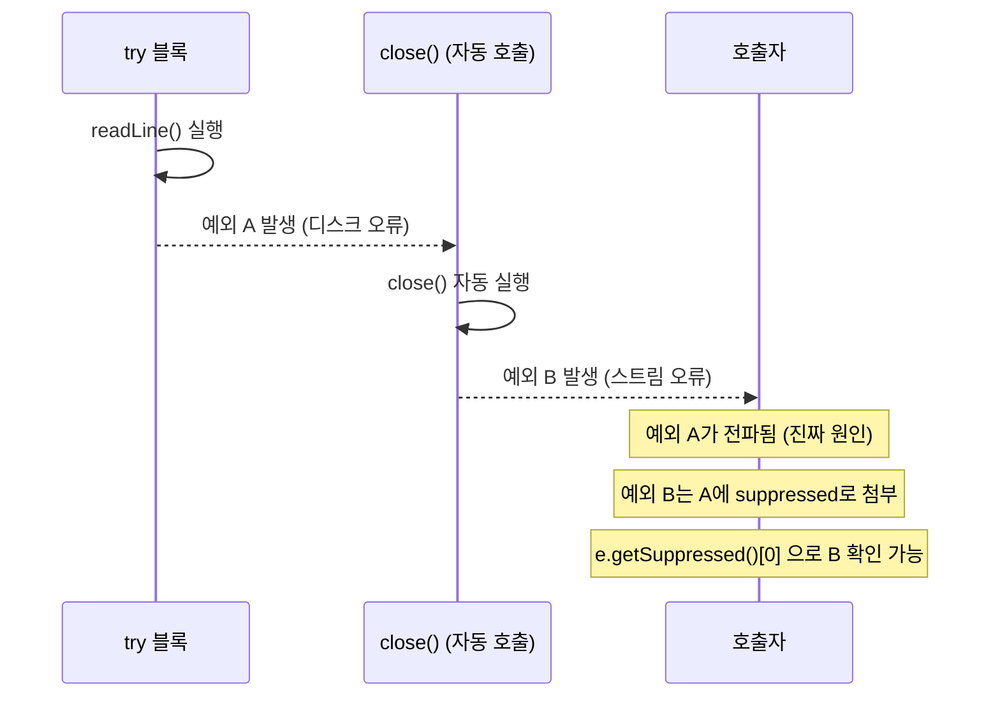
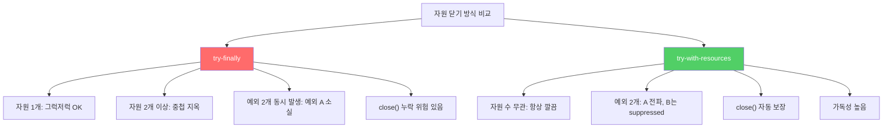

파일, DB 연결, 네트워크 소켓처럼 직접 닫아야(close) 하는 자원이 있습니다. `try-finally`로 닫으면 될 것 같지만, 자원이 2개만 돼도 코드가 위험해지고 예외 정보도 삼켜집니다. `try-with-resources`가 이 모든 문제를 해결합니다.

---

## 1. 문제: try-finally의 두 가지 함정

### 함정 1: 예외가 덮어씌워짐

비유하자면 **두 사람이 동시에 비명을 지르는 상황**입니다. `try` 블록에서 "비명 1"이 들리고, `finally` 블록에서 "비명 2"가 들립니다. 결국 "비명 2"만 들리고 "비명 1"은 사라집니다. 원인 추적이 불가능해집니다.

```java
static String firstLineOfFile(String path) throws IOException {
    BufferedReader br = new BufferedReader(new FileReader(path));
    try {
        return br.readLine();  // ← 예외 A 발생 (예: 디스크 오류)
    } finally {
        br.close();  // ← 예외 B 발생 (예: 스트림 이미 닫힘)
        // 예외 B가 예외 A를 완전히 덮어씀!
        // 스택 트레이스에 예외 A는 흔적도 없이 사라짐
    }
}
```



**만약 프로덕션에서 이런 일이 발생하면?** 실제 원인(예외 A)은 사라지고 증상(예외 B)만 로그에 남아 문제 해결이 극도로 어려워집니다.

### 함정 2: 자원이 여러 개면 코드가 끔찍해짐

```java
// 자원이 2개 — 중첩 try-finally
static void copy(String src, String dst) throws IOException {
    InputStream in = new FileInputStream(src);
    try {
        OutputStream out = new FileOutputStream(dst);
        try {
            byte[] buf = new byte[BUFFER_SIZE];
            int n;
            while ((n = in.read(buf)) >= 0) {
                out.write(buf, 0, n);
            }
        } finally {
            out.close();  // 예외 발생 가능
        }
    } finally {
        in.close();  // 예외 발생 가능
    }
    // 자원 3개면? 3단 중첩... 자원 4개면? 4단 중첩...
}
```

자원 수만큼 중첩이 깊어지고, 각 `finally`에서 예외가 발생하면 앞선 예외가 덮어씌워지는 문제가 반복됩니다.

---

## 2. 해결: try-with-resources

### 동작 원리

`try-with-resources`는 `try` 블록이 끝날 때 (정상 종료든, 예외 발생이든) 선언된 자원의 `close()`를 **자동으로 역순으로** 호출합니다.

**단 하나의 조건:** 자원 클래스가 `AutoCloseable` 인터페이스를 구현해야 합니다. `void close() throws Exception` 메서드 하나만 정의하면 됩니다. Java의 `InputStream`, `OutputStream`, `Connection`, `BufferedReader` 등 수많은 표준 클래스가 이미 구현되어 있습니다.

```java
// try-finally → try-with-resources 변환

// 전: try-finally (10줄, 예외 덮어씀)
static String firstLineOfFile(String path) throws IOException {
    BufferedReader br = new BufferedReader(new FileReader(path));
    try {
        return br.readLine();
    } finally {
        br.close();
    }
}

// 후: try-with-resources (5줄, 완전 안전)
static String firstLineOfFile(String path) throws IOException {
    try (BufferedReader br = new BufferedReader(new FileReader(path))) {
        return br.readLine();
    }
}  // ← 블록을 벗어나는 순간 br.close() 자동 호출
```

### 자원 여러 개도 깔끔하게

```java
// 전: 2단 중첩 try-finally
// 후: try-with-resources — 세미콜론으로 여러 자원 선언
static void copy(String src, String dst) throws IOException {
    try (InputStream  in  = new FileInputStream(src);
         OutputStream out = new FileOutputStream(dst)) {
        byte[] buf = new byte[BUFFER_SIZE];
        int n;
        while ((n = in.read(buf)) >= 0) {
            out.write(buf, 0, n);
        }
    }
    // out.close() 먼저, 그 다음 in.close() — 선언 역순으로 자동 호출
}
```

---

## 3. 예외 억제(Suppressed Exception) — 예외를 덮지 않음

`try-with-resources`의 가장 중요한 장점입니다. `try` 블록과 `close()` 양쪽에서 예외가 발생하면, `close()`에서 발생한 예외는 **억제(suppressed)**되어 첫 번째 예외에 부가 정보로 붙습니다. 예외가 사라지지 않습니다.



```java
try (var resource = new MyResource()) {
    resource.doWork();  // 예외 A 발생
}
// close()에서 예외 B 발생해도:
// - catch에서 잡히는 건 예외 A (진짜 원인)
// - e.getSuppressed()[0]로 예외 B 확인 가능
// - 스택 트레이스에 두 예외 모두 기록됨
```

---

## 4. catch 절과 함께 사용

`try-with-resources`에서도 `catch`를 그대로 사용할 수 있습니다. 자원을 닫은 후에 예외를 처리합니다.

```java
// catch 절 추가 — 자원 자동 닫힘 + 예외 처리
static String firstLineOfFile(String path, String defaultVal) {
    try (BufferedReader br = new BufferedReader(new FileReader(path))) {
        return br.readLine();
    } catch (IOException e) {
        return defaultVal;  // 파일 읽기 실패 시 기본값 반환
    }
    // br.close()는 catch 블록 실행 전에 이미 호출됨
}
```

---

## 5. 커스텀 자원에 AutoCloseable 구현

직접 만든 자원 클래스에도 `AutoCloseable`을 구현하면 `try-with-resources`의 혜택을 받을 수 있습니다.

```java
public class DatabaseConnection implements AutoCloseable {
    private final Connection conn;
    private boolean closed = false;

    public DatabaseConnection(String url) throws SQLException {
        this.conn = DriverManager.getConnection(url);
    }

    public ResultSet query(String sql) throws SQLException {
        if (closed) throw new IllegalStateException("연결이 닫혔습니다");
        return conn.createStatement().executeQuery(sql);
    }

    @Override
    public void close() throws SQLException {
        if (!closed) {
            conn.close();
            closed = true;
        }
    }
}

// 사용
try (DatabaseConnection db = new DatabaseConnection(url)) {
    ResultSet rs = db.query("SELECT * FROM users");
    // 처리...
}  // 예외 발생 여부와 무관하게 db.close() 자동 호출
```

---

## 6. try-finally vs try-with-resources 비교



| 항목 | try-finally | try-with-resources |
|------|-------------|-------------------|
| 코드 길이 | 길다 (자원당 추가) | 짧다 |
| 다중 자원 | 중첩 필요 | `;`로 나열 |
| 예외 처리 | 나중 예외가 앞 예외 소실 | suppressed로 보존 |
| close 보장 | 수동 (누락 위험) | 자동 |
| 가독성 | 낮음 | 높음 |

---

## 7. 요약

> 꼭 회수해야 하는 자원을 다룰 때는 try-finally 대신 try-with-resources를 사용하세요. 예외 없이 항상 그렇게 해야 합니다. 코드가 짧고 명확해지며, 예외 정보가 보존되고, 자원 회수가 보장됩니다.

**핵심 규칙:**
1. 직접 만드는 자원 클래스는 `AutoCloseable` 구현
2. 자원을 사용하는 코드는 항상 `try-with-resources` 사용
3. `try-finally`는 새 코드에서 절대 쓰지 않기
4. 자원이 여러 개면 `;`로 나열 — 역순으로 자동 close

---

> 참조: 이펙티브 자바 3/E — 조슈아 블로크
