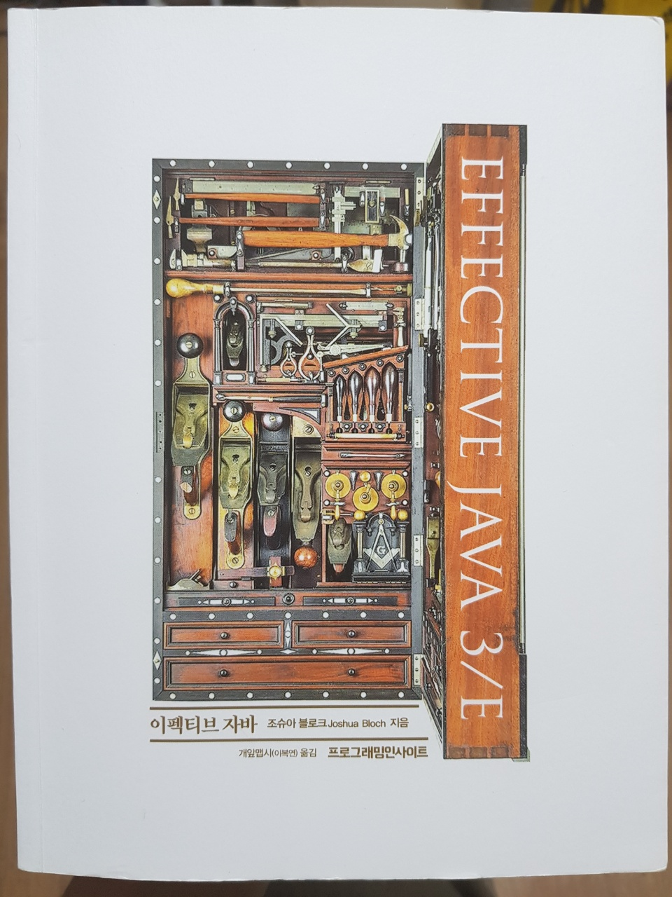

<hr>

**<code>equals</code> 메소드는 기본적으로 최상위 객체인 <code>Object</code>에서 제공하는 메소드로서 재정의를 염두에 두고 설계된 것이다. 때문에 재정의 시 지켜야 하는 일반 규약이 명확이 정의가 되어있다.**

이러한 규약을 지키지 않고 재정의를 했다간 끔찍한 결과를 초래할 수 있다.


**<span style="color:red;">그렇다면 먼저 <code>equals</code> 재정의 규약을 살펴보기 전에 어느 상황에서는 재정의 하면 안되는지 부터 알아보자.</span>**

<hr>

### 🔗 각 인스턴스가 본질적으로 고유하다.

값을 표현하는게 아니라 동작하는 개체를 표현하는 클래스가 여기 해당한다. <code>Thread</code>가 좋은 예로, Object의 equals 메서드는 이러한 클래스에 딱 맞게 구현되었다.

<hr>

### 🔗 인스턴스의 '논리적 동치성(logical equality)'를 검사할 일이 없다.

- 논리적 동치: 두 명제 p, q에 대해 쌍방 조건이 항진 명제인 경우, 즉 p<=>q
- 항진 명제: 논리식 혹은 합성명제에 있어 각 명제의 참·거짓의 모든 조합에 대하여 항상 참인 것
- **즉, 쉽게 말하면 인스턴스들 끼리 equals() 메서드를 사용해서, 논리적으로 같은지 검사할 필요가 없는 경우에는 <code>Object</code>의 기본 <code>equals</code> 로만으로도 해결한다.**

<hr>

### 🔗 상위 클래스에서 재정의한 equals가 하위 클래스에도 딱 들어맞는다.

- HashSet, TreeSet, EnumSet 등 대부분의 Set 구현체 - <code>AbstractSet</code> 에서 정의된 equals 사용
- ArrayList, Vector 등 대부분의 List 구현체 - <code>AbstractList</code> 에서 정의된 equals 사용
- HashMap, TreeMap, EnumMap 등 대부분의 Map 구현체 - <code>AbstractMap</code> 에서 정의된 equals 사용

<hr>

### 🔗 클래스가 private이거나 package-private이고 equals 메소드를 호출할 일이 없다.

이 경우에는 equals가 실수로라도 호출되는 걸 막고 싶다면 아래와 같이  하는것이 좋다고 한다.

<div class="colorscripter-code" style="color:#010101;font-family:Consolas, 'Liberation Mono', Menlo, Courier, monospace !important; position:relative !important;overflow:auto"><table class="colorscripter-code-table" style="margin:0;padding:0;border:none;background-color:#fafafa;border-radius:4px;" cellspacing="0" cellpadding="0"><tr><td style="padding:6px;border-right:2px solid #e5e5e5"><div style="margin:0;padding:0;word-break:normal;text-align:right;color:#666;font-family:Consolas, 'Liberation Mono', Menlo, Courier, monospace !important;line-height:130%"><div style="line-height:130%">1</div><div style="line-height:130%">2</div><div style="line-height:130%">3</div><div style="line-height:130%">4</div></div></td><td style="padding:6px 0;text-align:left"><div style="margin:0;padding:0;color:#010101;font-family:Consolas, 'Liberation Mono', Menlo, Courier, monospace !important;line-height:130%"><div style="padding:0 6px; white-space:pre; line-height:130%">@Override</div><div style="background-color:#f0f0f0; padding:0 6px; white-space:pre; line-height:130%"><span style="color:#ff3399">public</span>&nbsp;<span style="color:#0099cc">boolean</span>&nbsp;<span style="color:#0099cc">equals</span>(Object&nbsp;o)&nbsp;{</div><div style="padding:0 6px; white-space:pre; line-height:130%">&nbsp;&nbsp;&nbsp;&nbsp;<span style="color:#ff3399">throw</span>&nbsp;<span style="color:#ff3399">new</span>&nbsp;AssertionError();</div><div style="background-color:#f0f0f0; padding:0 6px; white-space:pre; line-height:130%">}</div></div><div style="text-align:right;margin-top:-13px;margin-right:5px;font-size:9px;font-style:italic"><a href="http://colorscripter.com/info#e" target="_blank" style="color:#e5e5e5text-decoration:none">Colored by Color Scripter</a></div></td><td style="vertical-align:bottom;padding:0 2px 4px 0"><a href="http://colorscripter.com/info#e" target="_blank" style="text-decoration:none;color:white"><span style="font-size:9px;word-break:normal;background-color:#e5e5e5;color:white;border-radius:10px;padding:1px">cs</span></a></td></tr></table></div>


**여기까지 <code>equals</code>를 재정의하면 안되는 상황들에 대해 알아보았다.**

<hr>


**<span style="color:red;">그렇다면 이제 도대체 언제 <code>equals</code>를 정의해야하는지에 대해 알아보자.</span>**

***equals를 재정의해야 할 때는 객체 식별성(object identity : 두 객체가 물리적으로 같은가)이 아니라 논리적 동치성을 확인해야하는데, 상위 클래스의 equals가 논리적 동치성을 비교하도록 재정의 되지 않았을 때이다.***

**<br>**

**주로 값 클래스들이 해당한다 [값 클래스란 <code>Integer</code>와 <code>String</code>처럼 값을 표현하는 클래스]**

두 값 객체를 equals로 비교하는 프로그래머는 객체가 같은지가 아닌 값이 같은지를 알고 싶어 할 것이다.

**<code>equals</code>가 논리적 동치성을 비교하도록 재정의 해두면, 그 인스턴스는 값을 비교하길 원하는 프로그래머의 기대에 부응함은 물론 Map의 키와 Set의 원소로 사용할 수 있게 된다.**

<hr>
<span style="color:red;">하지만</span>, 값 클래스라 해도, <code>싱글턴 클래스[인스턴스 통제 클래스]</code> 처럼 같은 인스턴스가 둘 이상 만들어지지 않음을 보장하는 녀석에게는 <code>equals</code>를 재정의 할 이유가 없다.

<br>

지금까지 <code>equals</code>를 언제 재정의하는지도 알아보았다. 

<span style="color:red;">중요한게 남아있다. <code>equals</code> 메소드를 재정의할 때는 따라야하는 규약이 있다고 한다.</span>

아래에서 살펴보자.


### 🔗 equals 메소드를 재정의 할 때 따라야하는 일반 규약

다음은 Object 명세에 적힌 규약이다.


> equals 메소드는 동치관계(equivalence relation)을 구현하며, 다음을 만족한다.
>
> * **반사성(reflexivity)** : null이 아닌 모든 참조 값 x에 대해, x.equals(x)는 true이다.
> * **대칭성(symmetry)** : null이 아닌 모든 참조 값 x,y에 대해, x.equals(y)가 true이면 y.equals(x)도 true이다.
> * **추이성(transitivity)** : null이 아닌 모든 참조 값 x,y,z에 대해, x.equals(y)가 true이고 y.equals(z)도 true이면 x.equals(z)도 true이다.
> * **일관성(consistency)**: null이 아닌 모든 참조 값 x,y에 대해, x.equals(y)를 반복해서 호출하면 항상 true를 반환하거나 항상 false를 반환한다.
> * **null-아님** : null이 아닌 모든 참조 값 x에 대해, x.equals(null)은 false이다.


<hr>

하나하나씩 자세히 살펴보도록 하자.


### 💎 반사성

**단순히 말하면 객체는 자기 자신과 같아야 한다는 말**이라는데 ? 뭔 당연한 소릴 하는걸까? 라고 생각할 것 같다.

이 요건은 일부러 여기는 경우가 아니라면 만족시키지 못하기가 더 어렵다고 한다.

<div class="colorscripter-code" style="color:#010101;font-family:Consolas, 'Liberation Mono', Menlo, Courier, monospace !important; position:relative !important;overflow:auto"><table class="colorscripter-code-table" style="margin:0;padding:0;border:none;background-color:#fafafa;border-radius:4px;" cellspacing="0" cellpadding="0"><tr><td style="padding:6px;border-right:2px solid #e5e5e5"><div style="margin:0;padding:0;word-break:normal;text-align:right;color:#666;font-family:Consolas, 'Liberation Mono', Menlo, Courier, monospace !important;line-height:130%"><div style="line-height:130%">1</div><div style="line-height:130%">2</div><div style="line-height:130%">3</div><div style="line-height:130%">4</div><div style="line-height:130%">5</div><div style="line-height:130%">6</div><div style="line-height:130%">7</div><div style="line-height:130%">8</div><div style="line-height:130%">9</div><div style="line-height:130%">10</div><div style="line-height:130%">11</div><div style="line-height:130%">12</div><div style="line-height:130%">13</div><div style="line-height:130%">14</div></div></td><td style="padding:6px 0;text-align:left"><div style="margin:0;padding:0;color:#010101;font-family:Consolas, 'Liberation Mono', Menlo, Courier, monospace !important;line-height:130%"><div style="padding:0 6px; white-space:pre; line-height:130%"><span style="color:#ff3399">public</span>&nbsp;<span style="color:#ff3399">class</span>&nbsp;Car&nbsp;{</div><div style="background-color:#f0f0f0; padding:0 6px; white-space:pre; line-height:130%">&nbsp;&nbsp;&nbsp;&nbsp;</div><div style="padding:0 6px; white-space:pre; line-height:130%">&nbsp;&nbsp;&nbsp;&nbsp;<span style="color:#ff3399">public</span>&nbsp;<span style="color:#ff3399">static</span>&nbsp;<span style="color:#ff3399">void</span>&nbsp;main(<span style="color:#0099cc">String</span>[]&nbsp;args)&nbsp;{</div><div style="background-color:#f0f0f0; padding:0 6px; white-space:pre; line-height:130%">&nbsp;&nbsp;&nbsp;&nbsp;</div><div style="padding:0 6px; white-space:pre; line-height:130%">&nbsp;&nbsp;&nbsp;&nbsp;&nbsp;&nbsp;&nbsp;&nbsp;Set<span style="color:#0086b3"></span><span style="color:#ff3399">&lt;</span>Car<span style="color:#0086b3"></span><span style="color:#ff3399">&gt;</span>&nbsp;carSet&nbsp;<span style="color:#0086b3"></span><span style="color:#ff3399">=</span>&nbsp;<span style="color:#ff3399">new</span>&nbsp;Set<span style="color:#0086b3"></span><span style="color:#ff3399">&lt;</span><span style="color:#0086b3"></span><span style="color:#ff3399">&gt;</span>();</div><div style="background-color:#f0f0f0; padding:0 6px; white-space:pre; line-height:130%">&nbsp;&nbsp;&nbsp;&nbsp;&nbsp;&nbsp;&nbsp;&nbsp;Car&nbsp;car&nbsp;<span style="color:#0086b3"></span><span style="color:#ff3399">=</span>&nbsp;<span style="color:#ff3399">new</span>&nbsp;Car();</div><div style="padding:0 6px; white-space:pre; line-height:130%">&nbsp;&nbsp;&nbsp;&nbsp;&nbsp;&nbsp;&nbsp;&nbsp;carSet.<span style="color:#0099cc">add</span>(car);</div><div style="background-color:#f0f0f0; padding:0 6px; white-space:pre; line-height:130%">&nbsp;&nbsp;&nbsp;&nbsp;&nbsp;&nbsp;&nbsp;&nbsp;</div><div style="padding:0 6px; white-space:pre; line-height:130%">&nbsp;&nbsp;&nbsp;&nbsp;&nbsp;&nbsp;&nbsp;&nbsp;<span style="color:#999999">//반사성을&nbsp;어기면&nbsp;해당&nbsp;값이&nbsp;false가&nbsp;나온다고&nbsp;한다.</span></div><div style="background-color:#f0f0f0; padding:0 6px; white-space:pre; line-height:130%">&nbsp;&nbsp;&nbsp;&nbsp;&nbsp;&nbsp;&nbsp;&nbsp;<span style="color:#0099cc">System</span>.<span style="color:#0099cc">out</span>.<span style="color:#0099cc">println</span>(carSet.contains(car));</div><div style="padding:0 6px; white-space:pre; line-height:130%">&nbsp;&nbsp;&nbsp;&nbsp;&nbsp;&nbsp;&nbsp;&nbsp;</div><div style="background-color:#f0f0f0; padding:0 6px; white-space:pre; line-height:130%">&nbsp;&nbsp;&nbsp;&nbsp;}</div><div style="padding:0 6px; white-space:pre; line-height:130%">}</div><div style="background-color:#f0f0f0; padding:0 6px; white-space:pre; line-height:130%">&nbsp;</div></div><div style="text-align:right;margin-top:-13px;margin-right:5px;font-size:9px;font-style:italic"><a href="http://colorscripter.com/info#e" target="_blank" style="color:#e5e5e5text-decoration:none">Colored by Color Scripter</a></div></td><td style="vertical-align:bottom;padding:0 2px 4px 0"><a href="http://colorscripter.com/info#e" target="_blank" style="text-decoration:none;color:white"><span style="font-size:9px;word-break:normal;background-color:#e5e5e5;color:white;border-radius:10px;padding:1px">cs</span></a></td></tr></table></div>


<hr>

### 💎 대칭성

두 객체는 서로에 대한 동치 여부에 똑같이 답해야 한다.

다음의 예시를 보자.

<div class="colorscripter-code" style="color:#010101;font-family:Consolas, 'Liberation Mono', Menlo, Courier, monospace !important; position:relative !important;overflow:auto"><table class="colorscripter-code-table" style="margin:0;padding:0;border:none;background-color:#fafafa;border-radius:4px;" cellspacing="0" cellpadding="0"><tr><td style="padding:6px;border-right:2px solid #e5e5e5"><div style="margin:0;padding:0;word-break:normal;text-align:right;color:#666;font-family:Consolas, 'Liberation Mono', Menlo, Courier, monospace !important;line-height:130%"><div style="line-height:130%">1</div><div style="line-height:130%">2</div><div style="line-height:130%">3</div><div style="line-height:130%">4</div><div style="line-height:130%">5</div><div style="line-height:130%">6</div><div style="line-height:130%">7</div><div style="line-height:130%">8</div><div style="line-height:130%">9</div><div style="line-height:130%">10</div><div style="line-height:130%">11</div><div style="line-height:130%">12</div><div style="line-height:130%">13</div><div style="line-height:130%">14</div><div style="line-height:130%">15</div><div style="line-height:130%">16</div><div style="line-height:130%">17</div><div style="line-height:130%">18</div><div style="line-height:130%">19</div><div style="line-height:130%">20</div><div style="line-height:130%">21</div><div style="line-height:130%">22</div><div style="line-height:130%">23</div><div style="line-height:130%">24</div><div style="line-height:130%">25</div><div style="line-height:130%">26</div><div style="line-height:130%">27</div><div style="line-height:130%">28</div><div style="line-height:130%">29</div><div style="line-height:130%">30</div><div style="line-height:130%">31</div></div></td><td style="padding:6px 0;text-align:left"><div style="margin:0;padding:0;color:#010101;font-family:Consolas, 'Liberation Mono', Menlo, Courier, monospace !important;line-height:130%"><div style="padding:0 6px; white-space:pre; line-height:130%"><span style="color:#ff3399">package</span>&nbsp;Item10;</div><div style="background-color:#f0f0f0; padding:0 6px; white-space:pre; line-height:130%">&nbsp;</div><div style="padding:0 6px; white-space:pre; line-height:130%"><span style="color:#ff3399">import</span>&nbsp;java.util.Objects;</div><div style="background-color:#f0f0f0; padding:0 6px; white-space:pre; line-height:130%">&nbsp;</div><div style="padding:0 6px; white-space:pre; line-height:130%"><span style="color:#ff3399">public</span>&nbsp;<span style="color:#ff3399">class</span>&nbsp;CaseInsensitiveString&nbsp;{</div><div style="background-color:#f0f0f0; padding:0 6px; white-space:pre; line-height:130%">&nbsp;</div><div style="padding:0 6px; white-space:pre; line-height:130%">&nbsp;&nbsp;&nbsp;&nbsp;<span style="color:#ff3399">private</span>&nbsp;<span style="color:#ff3399">final</span>&nbsp;<span style="color:#0099cc">String</span>&nbsp;s;</div><div style="background-color:#f0f0f0; padding:0 6px; white-space:pre; line-height:130%">&nbsp;</div><div style="padding:0 6px; white-space:pre; line-height:130%">&nbsp;&nbsp;&nbsp;&nbsp;<span style="color:#ff3399">public</span>&nbsp;CaseInsensitiveString(<span style="color:#0099cc">String</span>&nbsp;s)&nbsp;{</div><div style="background-color:#f0f0f0; padding:0 6px; white-space:pre; line-height:130%">&nbsp;&nbsp;&nbsp;&nbsp;&nbsp;&nbsp;&nbsp;&nbsp;<span style="color:#ff3399">this</span>.s&nbsp;<span style="color:#0086b3"></span><span style="color:#ff3399">=</span>&nbsp;Objects.requireNonNull(s);</div><div style="padding:0 6px; white-space:pre; line-height:130%">&nbsp;&nbsp;&nbsp;&nbsp;}</div><div style="background-color:#f0f0f0; padding:0 6px; white-space:pre; line-height:130%">&nbsp;</div><div style="padding:0 6px; white-space:pre; line-height:130%">&nbsp;&nbsp;&nbsp;&nbsp;<span style="color:#ff3399">public</span>&nbsp;<span style="color:#ff3399">static</span>&nbsp;<span style="color:#ff3399">void</span>&nbsp;main(<span style="color:#0099cc">String</span>[]&nbsp;args)&nbsp;{</div><div style="background-color:#f0f0f0; padding:0 6px; white-space:pre; line-height:130%">&nbsp;&nbsp;&nbsp;&nbsp;&nbsp;&nbsp;&nbsp;&nbsp;CaseInsensitiveString&nbsp;cis&nbsp;<span style="color:#0086b3"></span><span style="color:#ff3399">=</span>&nbsp;<span style="color:#ff3399">new</span>&nbsp;CaseInsensitiveString(<span style="color:#993333">"Polish"</span>);</div><div style="padding:0 6px; white-space:pre; line-height:130%">&nbsp;&nbsp;&nbsp;&nbsp;&nbsp;&nbsp;&nbsp;&nbsp;<span style="color:#0099cc">String</span>&nbsp;s&nbsp;<span style="color:#0086b3"></span><span style="color:#ff3399">=</span>&nbsp;<span style="color:#993333">"polish"</span>;</div><div style="background-color:#f0f0f0; padding:0 6px; white-space:pre; line-height:130%">&nbsp;&nbsp;&nbsp;&nbsp;&nbsp;&nbsp;&nbsp;&nbsp;<span style="color:#0099cc">System</span>.<span style="color:#0099cc">out</span>.<span style="color:#0099cc">println</span>(cis.<span style="color:#0099cc">equals</span>(s));</div><div style="padding:0 6px; white-space:pre; line-height:130%">&nbsp;&nbsp;&nbsp;&nbsp;}</div><div style="background-color:#f0f0f0; padding:0 6px; white-space:pre; line-height:130%">&nbsp;</div><div style="padding:0 6px; white-space:pre; line-height:130%">&nbsp;&nbsp;&nbsp;&nbsp;@Override</div><div style="background-color:#f0f0f0; padding:0 6px; white-space:pre; line-height:130%">&nbsp;&nbsp;&nbsp;&nbsp;<span style="color:#ff3399">public</span>&nbsp;<span style="color:#0099cc">boolean</span>&nbsp;<span style="color:#0099cc">equals</span>(Object&nbsp;o)&nbsp;{</div><div style="padding:0 6px; white-space:pre; line-height:130%">&nbsp;</div><div style="background-color:#f0f0f0; padding:0 6px; white-space:pre; line-height:130%">&nbsp;&nbsp;&nbsp;&nbsp;&nbsp;&nbsp;&nbsp;&nbsp;<span style="color:#ff3399">if</span>&nbsp;(&nbsp;o&nbsp;<span style="color:#ff3399">instanceof</span>&nbsp;CaseInsensitiveString)&nbsp;{</div><div style="padding:0 6px; white-space:pre; line-height:130%">&nbsp;&nbsp;&nbsp;&nbsp;&nbsp;&nbsp;&nbsp;&nbsp;&nbsp;&nbsp;&nbsp;&nbsp;<span style="color:#ff3399">return</span>&nbsp;s.<span style="color:#0099cc">equalsIgnoreCase</span>(((CaseInsensitiveString)&nbsp;o).s);</div><div style="background-color:#f0f0f0; padding:0 6px; white-space:pre; line-height:130%">&nbsp;&nbsp;&nbsp;&nbsp;&nbsp;&nbsp;&nbsp;&nbsp;}</div><div style="padding:0 6px; white-space:pre; line-height:130%">&nbsp;&nbsp;&nbsp;&nbsp;&nbsp;&nbsp;&nbsp;&nbsp;<span style="color:#ff3399">if</span>&nbsp;(&nbsp;o&nbsp;<span style="color:#ff3399">instanceof</span>&nbsp;<span style="color:#0099cc">String</span>)&nbsp;{</div><div style="background-color:#f0f0f0; padding:0 6px; white-space:pre; line-height:130%">&nbsp;&nbsp;&nbsp;&nbsp;&nbsp;&nbsp;&nbsp;&nbsp;&nbsp;&nbsp;&nbsp;&nbsp;<span style="color:#ff3399">return</span>&nbsp;s.<span style="color:#0099cc">equalsIgnoreCase</span>((<span style="color:#0099cc">String</span>)&nbsp;o);</div><div style="padding:0 6px; white-space:pre; line-height:130%">&nbsp;&nbsp;&nbsp;&nbsp;&nbsp;&nbsp;&nbsp;&nbsp;}</div><div style="background-color:#f0f0f0; padding:0 6px; white-space:pre; line-height:130%">&nbsp;&nbsp;&nbsp;&nbsp;&nbsp;&nbsp;&nbsp;&nbsp;<span style="color:#ff3399">return</span>&nbsp;<span style="color:#308ce5">false</span>;</div><div style="padding:0 6px; white-space:pre; line-height:130%">&nbsp;&nbsp;&nbsp;&nbsp;}</div><div style="background-color:#f0f0f0; padding:0 6px; white-space:pre; line-height:130%">}</div><div style="padding:0 6px; white-space:pre; line-height:130%">&nbsp;</div></div><div style="text-align:right;margin-top:-13px;margin-right:5px;font-size:9px;font-style:italic"><a href="http://colorscripter.com/info#e" target="_blank" style="color:#e5e5e5text-decoration:none">Colored by Color Scripter</a></div></td><td style="vertical-align:bottom;padding:0 2px 4px 0"><a href="http://colorscripter.com/info#e" target="_blank" style="text-decoration:none;color:white"><span style="font-size:9px;word-break:normal;background-color:#e5e5e5;color:white;border-radius:10px;padding:1px">cs</span></a></td></tr></table></div>

위 코드의 문제점을 무엇일까?

<code>CaseInsensitiveString</code>의 <code>equals</code>는 일반 문자열과 비교를 시도하며 결과는 <code>true</code>를 반환한다.

문제는 <code>CaseInsensitiveString</code> 의 재정의된 <code>equals</code>는 일반 <code>String</code> 을 알고 있지만 <code>String</code>의 <code>equals</code>는 재정의 되있지 않기 때문에 <code>CaseInsensitiveString</code>의 존재를 모른다. 


**따라서 역으로 s.equals(cis)는 false를 반환하여, 대칭성을 명백히 위반한다.**

<hr>

이 문제를 해결하려면 <code>CaseInsensitiveString</code>의 <code>equals</code>를 <code>String</code>과도 연동한다는 허황된 꿈을 버려야 하며 아래와 같이 해결해야 한다. 

**결론 - 같은 놈 끼리만 비교해라;;**

<div class="colorscripter-code" style="color:#010101;font-family:Consolas, 'Liberation Mono', Menlo, Courier, monospace !important; position:relative !important;overflow:auto"><table class="colorscripter-code-table" style="margin:0;padding:0;border:none;background-color:#fafafa;border-radius:4px;" cellspacing="0" cellpadding="0"><tr><td style="padding:6px;border-right:2px solid #e5e5e5"><div style="margin:0;padding:0;word-break:normal;text-align:right;color:#666;font-family:Consolas, 'Liberation Mono', Menlo, Courier, monospace !important;line-height:130%"><div style="line-height:130%">1</div><div style="line-height:130%">2</div><div style="line-height:130%">3</div><div style="line-height:130%">4</div><div style="line-height:130%">5</div></div></td><td style="padding:6px 0;text-align:left"><div style="margin:0;padding:0;color:#010101;font-family:Consolas, 'Liberation Mono', Menlo, Courier, monospace !important;line-height:130%"><div style="padding:0 6px; white-space:pre; line-height:130%">@Override</div><div style="background-color:#f0f0f0; padding:0 6px; white-space:pre; line-height:130%"><span style="color:#ff3399">public</span>&nbsp;<span style="color:#0099cc">boolean</span>&nbsp;<span style="color:#0099cc">equals</span>(Object&nbsp;o)&nbsp;{</div><div style="padding:0 6px; white-space:pre; line-height:130%">&nbsp;&nbsp;&nbsp;&nbsp;<span style="color:#ff3399">return</span>&nbsp;o&nbsp;<span style="color:#ff3399">instanceof</span>&nbsp;CaseInsensitiveString&nbsp;<span style="color:#0086b3"></span><span style="color:#ff3399">&amp;</span><span style="color:#0086b3"></span><span style="color:#ff3399">&amp;</span></div><div style="background-color:#f0f0f0; padding:0 6px; white-space:pre; line-height:130%">&nbsp;&nbsp;&nbsp;&nbsp;&nbsp;&nbsp;&nbsp;&nbsp;((CaseInsensitiveString)&nbsp;o).s.<span style="color:#0099cc">equalsIgnoreCase</span>(s);</div><div style="padding:0 6px; white-space:pre; line-height:130%">}</div></div><div style="text-align:right;margin-top:-13px;margin-right:5px;font-size:9px;font-style:italic"><a href="http://colorscripter.com/info#e" target="_blank" style="color:#e5e5e5text-decoration:none">Colored by Color Scripter</a></div></td><td style="vertical-align:bottom;padding:0 2px 4px 0"><a href="http://colorscripter.com/info#e" target="_blank" style="text-decoration:none;color:white"><span style="font-size:9px;word-break:normal;background-color:#e5e5e5;color:white;border-radius:10px;padding:1px">cs</span></a></td></tr></table></div>


```
참조 - 이펙티브 자바 3/E - 조슈아 블로크
```

