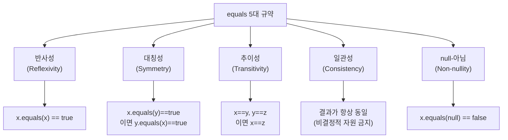
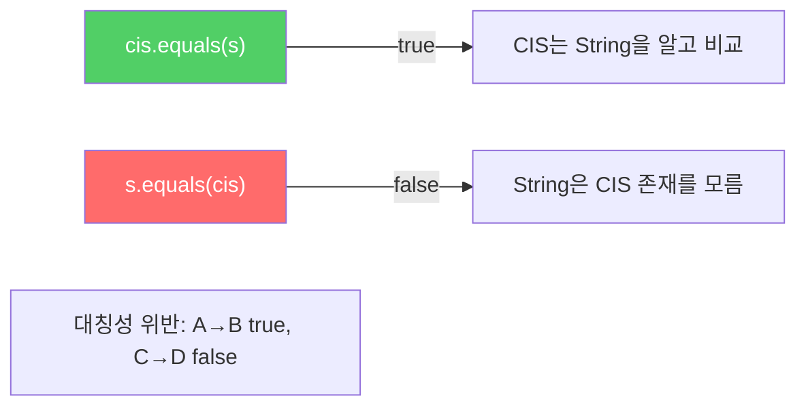
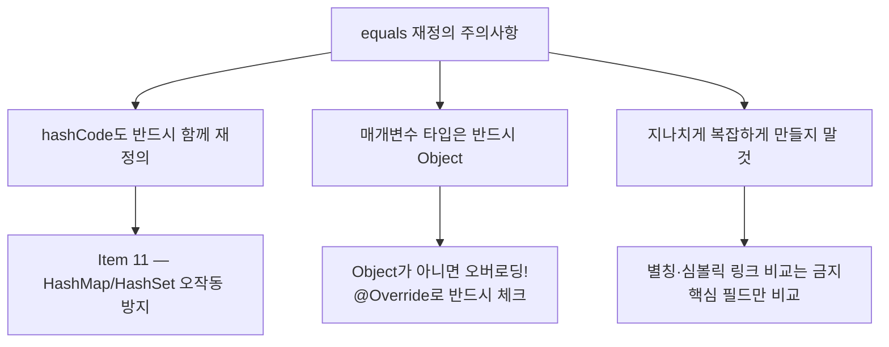
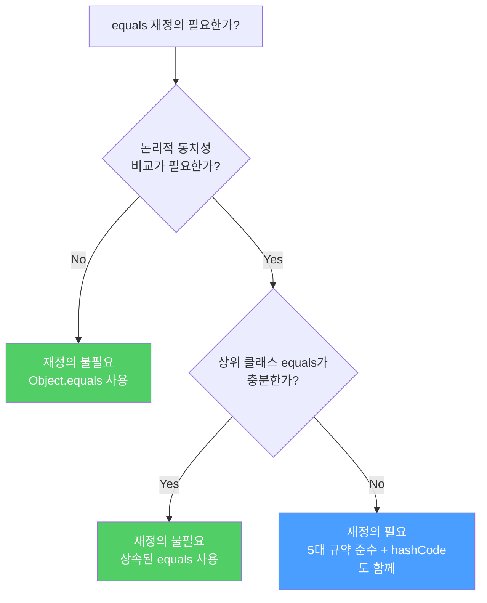

`equals`를 재정의하는 것은 쉬워 보이지만, 잘못 구현하면 `HashMap`이나 `Set`이 오작동하고 예측 불가능한 버그가 생깁니다. 언제 재정의해야 하고, 언제 하지 말아야 하며, 어떻게 해야 올바른지 단계별로 살펴봅니다.

---

## 1. equals를 재정의하지 말아야 할 4가지 상황

`equals`를 잘못 재정의하면 오히려 문제가 생깁니다. 다음 상황에서는 `Object`의 기본 `equals`(물리적 동일성 비교)를 그냥 쓰는 것이 정답입니다.

### 상황 1: 각 인스턴스가 본질적으로 고유한 경우

`Thread`, `Runnable`처럼 동작하는 개체를 나타내는 클래스입니다. 두 스레드가 "같은 스레드"인지를 값으로 비교할 이유가 없습니다. `==`(주소 비교)가 곧 정답입니다.

### 상황 2: 논리적 동치성을 검사할 일이 없는 경우

`Random`, `Pattern`처럼 두 인스턴스가 "같은 값"인지 비교할 일이 없는 클래스입니다.

### 상황 3: 상위 클래스의 equals가 이미 딱 맞는 경우

`HashSet` → `AbstractSet`, `ArrayList` → `AbstractList`, `HashMap` → `AbstractMap`이 이미 올바른 `equals`를 정의해두었습니다. 하위 클래스에서 다시 재정의할 필요가 없습니다.

### 상황 4: 클래스가 private이거나 equals를 절대 호출하지 않는 경우

혹시라도 실수로 호출될 것이 걱정된다면 이렇게 막아두세요:

```java
@Override
public boolean equals(Object o) {
    throw new AssertionError();  // 절대 호출되면 안 됨
}
```

---

## 2. equals를 재정의해야 할 때

비유하자면 **주민등록증 비교**입니다. 두 장의 주민등록증이 물리적으로 다른 종이여도, 주민번호·이름이 같다면 "같은 사람의 신분증"으로 봐야 합니다. 이것이 **논리적 동치성**입니다.

> `equals`를 재정의해야 할 때는 객체 식별성(물리적으로 같은 객체인가)이 아니라 **논리적 동치성**을 확인해야 하는데, 상위 클래스의 `equals`가 이를 구현하지 않았을 때입니다.

대표 예시: `Integer`, `String` 같은 **값 클래스**. `"abc".equals("abc")`가 `true`여야 `HashMap`의 키로 정상 사용할 수 있습니다.

**단, 싱글톤 클래스는 예외입니다.** 인스턴스가 하나뿐이므로 물리적 동일성 = 논리적 동치성입니다.

---

## 3. equals 일반 규약 5가지


```mermaid
graph TD
    A["equals 5대 규약"] --> B["반사성\n(Reflexivity)"]
    A --> C["대칭성\n(Symmetry)"]
    A --> D["추이성\n(Transitivity)"]
    A --> E["일관성\n(Consistency)"]
    A --> F["null-아님\n(Non-nullity)"]
    B --> B1["x.equals(x) == true"]
    C --> C1["x.equals(y)==true\n이면 y.equals(x)==true"]
    D --> D1["x==y, y==z\n이면 x==z"]
    E --> E1["결과가 항상 동일\n(비결정적 자원 금지)"]
    F --> F1["x.equals(null) == false"]
```

### 규약 1: 반사성 (Reflexivity)

`x.equals(x)`는 항상 `true`여야 합니다. 의도적으로 어기지 않는 한 자연스럽게 지켜집니다. 어기면 `list.contains(x)`처럼 자기 자신을 컬렉션에서 찾을 수 없게 됩니다.

### 규약 2: 대칭성 (Symmetry)

`x.equals(y)`가 `true`면 `y.equals(x)`도 `true`여야 합니다.

**위반 사례 — CaseInsensitiveString:**

```java
// 잘못된 구현 — 대칭성 위반
public class CaseInsensitiveString {
    private final String s;

    @Override
    public boolean equals(Object o) {
        if (o instanceof CaseInsensitiveString) {
            return s.equalsIgnoreCase(((CaseInsensitiveString) o).s);
        }
        // String과도 비교하려는 욕심 → 대칭성 파괴
        if (o instanceof String) {
            return s.equalsIgnoreCase((String) o);
        }
        return false;
    }
}

CaseInsensitiveString cis = new CaseInsensitiveString("Polish");
String s = "polish";

cis.equals(s);  // true — CIS는 String을 알고 있음
s.equals(cis);  // false — String은 CIS를 모름 → 대칭성 파괴!
```


```mermaid
graph LR
    A["cis.equals(s)"] -->|"true"| B["CIS는 String을 알고 비교"]
    C["s.equals(cis)"] -->|"false"| D["String은 CIS 존재를 모름"]
    style A fill:#51cf66,color:#fff
    style C fill:#ff6b6b,color:#fff
    note["대칭성 위반: A→B true, C→D false"]
```

**올바른 수정 — 같은 타입끼리만 비교:**

```java
@Override
public boolean equals(Object o) {
    return o instanceof CaseInsensitiveString &&
        ((CaseInsensitiveString) o).s.equalsIgnoreCase(s);
}
```

### 규약 3: 추이성 (Transitivity)

`x==y`, `y==z`이면 `x==z`여야 합니다. **상속으로 필드를 추가할 때 가장 자주 위반됩니다.**

```java
// Point(x, y)를 상속한 ColorPoint(x, y, color) 시나리오
ColorPoint p1 = new ColorPoint(1, 2, Color.RED);
Point      p2 = new Point(1, 2);
ColorPoint p3 = new ColorPoint(1, 2, Color.BLUE);

// 색상을 무시하는 방향으로 구현하면:
p1.equals(p2)  // true  (색상 무시)
p2.equals(p3)  // true  (색상 무시)
p1.equals(p3)  // false (색상 비교) → 추이성 위반!
```

**근본적 해결책 — 상속 대신 컴포지션:**

이 문제는 객체지향 언어에서 구체 클래스를 확장해 값을 추가하면서 `equals` 규약을 동시에 만족시킬 방법이 존재하지 않습니다. 상속 대신 컴포지션을 사용하세요.

```java
// 상속 대신 컴포지션 — 추이성 완전 보장
public class ColorPoint {
    private final Point point;  // Point를 필드로 보유
    private final Color color;

    public ColorPoint(int x, int y, Color color) {
        this.point = new Point(x, y);
        this.color = Objects.requireNonNull(color);
    }

    // Point 뷰 제공
    public Point asPoint() {
        return point;
    }

    @Override
    public boolean equals(Object o) {
        if (!(o instanceof ColorPoint)) return false;
        ColorPoint cp = (ColorPoint) o;
        return cp.point.equals(point) && cp.color.equals(color);
    }
}
```

> **추상 클래스라면 예외.** 상위 클래스 인스턴스를 직접 만들 수 없다면 이 문제가 발생하지 않습니다. `Shape` → `Circle`, `Rectangle` 구조가 그 예입니다.

### 규약 4: 일관성 (Consistency)

두 객체가 같다면 (어느 한쪽이 수정되지 않는 한) 언제 비교해도 항상 같아야 합니다.

**위반 사례:** `java.net.URL`의 `equals`는 호스트 이름을 IP 주소로 변환해 비교합니다. 네트워크 환경에 따라 같은 URL이 어떤 때는 `true`, 어떤 때는 `false`가 되는 불일관성이 생깁니다.

**규칙:** `equals`는 항상 **메모리에 존재하는 객체만** 사용한 결정적 계산만 수행해야 합니다.

### 규약 5: null-아님

`x.equals(null)`은 항상 `false`여야 합니다. `instanceof`를 사용하면 자동으로 보장됩니다 — `null instanceof Foo`는 항상 `false`이기 때문입니다.

```java
// null 검사는 불필요 — instanceof가 이미 처리함
@Override
public boolean equals(Object o) {
    if (!(o instanceof PhoneNumber)) return false;  // o == null이면 false 반환
    PhoneNumber pn = (PhoneNumber) o;
    return pn.lineNum == lineNum && pn.prefix == prefix && pn.areaCode == areaCode;
}
```

---

## 4. 올바른 equals 구현 4단계

```java
@Override
public boolean equals(Object o) {
    // 1단계: 자기 자신 참조인지 확인 (성능 최적화)
    if (this == o) return true;

    // 2단계: 올바른 타입인지 확인 (null 검사 포함)
    if (!(o instanceof PhoneNumber)) return false;

    // 3단계: 올바른 타입으로 형변환
    PhoneNumber pn = (PhoneNumber) o;

    // 4단계: 핵심 필드 비교 — 다를 가능성이 크거나 비용이 싼 필드를 먼저
    return pn.lineNum == lineNum
        && pn.prefix == prefix
        && pn.areaCode == areaCode;
}
```

**성능 팁:** 비교 비용이 싸거나 다를 가능성이 큰 필드를 먼저 비교하면 앞 필드에서 `false`가 나와 뒷 필드 비교를 건너뛸 수 있습니다.

---

## 5. equals 재정의 시 주의사항


```mermaid
graph TD
    A["equals 재정의 주의사항"] --> B["hashCode도 반드시 함께 재정의"]
    A --> C["매개변수 타입은 반드시 Object"]
    A --> D["지나치게 복잡하게 만들지 말 것"]
    B --> B1["Item 11 — HashMap/HashSet 오작동 방지"]
    C --> C1["Object가 아니면 오버로딩!\n@Override로 반드시 체크"]
    D --> D1["별칭·심볼릭 링크 비교는 금지\n핵심 필드만 비교"]
```

**흔한 실수 — 오버라이딩이 아닌 오버로딩:**

```java
// 잘못된 equals — Object가 아닌 구체 타입 매개변수
public boolean equals(MyClass o) {  // 오버로딩!
    ...
}

// Object.equals가 여전히 살아있어 다형성에서 엉뚱한 메서드가 호출됨
// @Override 어노테이션을 쓰면 컴파일 에러로 즉시 발견 가능
```

> `@Override`를 항상 붙이세요. 잘못된 시그니처를 컴파일 에러로 잡아줍니다.

---

## 6. 자동화 도구 활용

직접 작성이 번거롭다면 두 가지 대안이 있습니다:

```java
// 1. IDE 자동 생성 (IntelliJ, Eclipse)
// — Generate → equals() and hashCode()

// 2. Lombok @EqualsAndHashCode
@EqualsAndHashCode
public class PhoneNumber {
    private final short areaCode, prefix, lineNum;
}

// 3. Java 16+ Record — equals/hashCode 자동 제공
public record PhoneNumber(short areaCode, short prefix, short lineNum) {}
```

---

## 7. 요약

> 꼭 필요한 경우가 아니면 `equals`를 재정의하지 마세요. 재정의해야 한다면 반사성·대칭성·추이성·일관성·null-아님 다섯 규약을 반드시 지키고, `hashCode`도 함께 재정의하세요.

**equals 재정의 결정 흐름:**


```mermaid
graph TD
    A["equals 재정의 필요한가?"] --> B{"논리적 동치성\n비교가 필요한가?"}
    B -->|"No"| C["재정의 불필요\nObject.equals 사용"]
    B -->|"Yes"| D{"상위 클래스 equals가\n충분한가?"}
    D -->|"Yes"| E["재정의 불필요\n상속된 equals 사용"]
    D -->|"No"| F["재정의 필요\n5대 규약 준수 + hashCode도 함께"]
    style C fill:#51cf66,color:#fff
    style E fill:#51cf66,color:#fff
    style F fill:#4a9eff,color:#fff
```

---

> 참조: 이펙티브 자바 3/E — 조슈아 블로크
