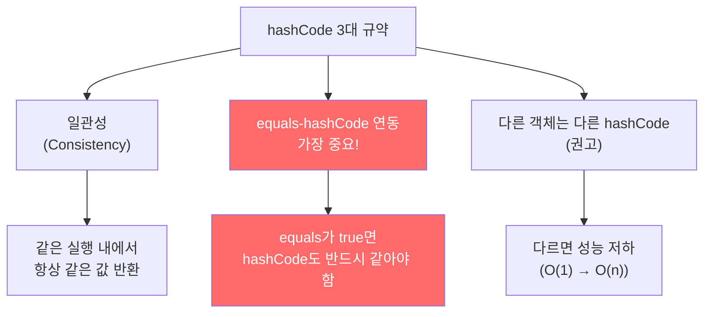
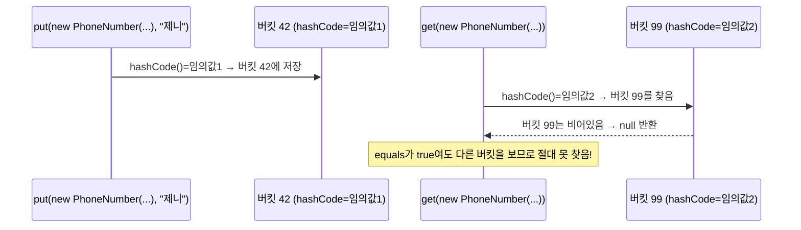
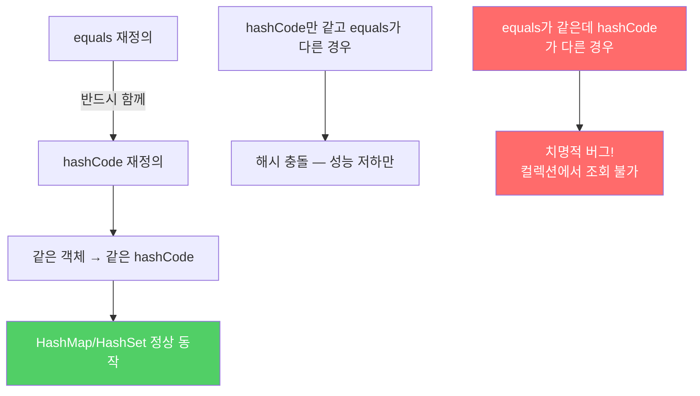

`equals`를 재정의하고 `hashCode`를 재정의하지 않으면, `HashMap`에 넣은 객체를 같은 키로 찾아도 `null`이 반환됩니다. 이유를 이해하면 두 메서드가 왜 항상 쌍으로 다뤄져야 하는지 자연스럽게 납득할 수 있습니다.

---

## 1. hashCode란 무엇인가?

비유하자면 **도서관의 책 분류 번호**입니다. 책(객체)을 찾을 때 제목(값)을 일일이 비교하지 않고, 먼저 분류 번호(hashCode)로 해당 서가(버킷)를 찾아간 다음 그 서가에서 정확한 책을 `equals`로 확인합니다.


**만약 hashCode가 equals와 불일치하면?** `put(k, v)` 시 사용한 키와 `get(k)` 시 사용한 키가 논리적으로 같아도(equals=true) hashCode가 다르면 서로 다른 버킷을 바라보게 됩니다. `get`은 영원히 그 항목을 찾지 못합니다.

---

## 2. Object 명세의 hashCode 3대 규약



가장 중요한 규약은 **두 번째**입니다:

> **`equals(Object)`가 두 객체를 같다고 판단했다면, 두 객체의 `hashCode`는 반드시 같은 값을 반환해야 한다.**

---

## 3. 왜 문제가 되는가 — 구체적 시나리오

```java
// PhoneNumber.equals는 재정의했지만 hashCode는 재정의 안 한 경우
Map<PhoneNumber, String> phoneMap = new HashMap<>();
phoneMap.put(new PhoneNumber(707, 867, 5309), "제니");

// 논리적으로 같은 키로 조회 시도
String result = phoneMap.get(new PhoneNumber(707, 867, 5309));
System.out.println(result);  // null! → "제니"가 나올 것 같지만 null
```



두 `PhoneNumber` 인스턴스는 `equals`로 같다고 판단되지만, `hashCode`를 재정의하지 않으면 `Object`의 기본 구현(객체 메모리 주소 기반)이 호출되어 서로 다른 hashCode를 반환합니다.

---

## 4. 최악의 hashCode — 절대 하지 말 것

```java
// 합법적(equals와 모순 없음)이지만 사용해서는 안 되는 구현
@Override
public int hashCode() {
    return 42;  // 모든 객체에 같은 값 반환
}
```

**왜 나쁜가?** 모든 객체가 버킷 42에 쏟아집니다. 해시테이블이 연결 리스트로 전락합니다.

```
조회 성능: O(1) → O(n)
객체 100만 개: 평균 50만 번 비교 필요
```

---

## 5. 올바른 hashCode 구현

### 방법 1: 표준 공식 (권장)

```java
@Override
public int hashCode() {
    int result = Short.hashCode(areaCode);         // 1. 첫 번째 핵심 필드로 초기화
    result = 31 * result + Short.hashCode(prefix); // 2. 나머지 핵심 필드 혼합
    result = 31 * result + Short.hashCode(lineNum);
    return result;
}
```

**왜 31을 곱하는가?**
- 31은 홀수 소수입니다. 짝수면 시프트 연산과 같아 정보 손실이 생깁니다.
- `31 * i = (i << 5) - i`로 JVM이 최적화합니다.
- 비슷한 필드들 사이의 해시 충돌을 줄입니다.

**필드 타입별 해시코드 계산:**

```java
// 기본 타입: 박싱 클래스의 hashCode 사용
Type.hashCode(f)          // Integer.hashCode(x), Long.hashCode(x), ...

// 참조 타입: 재귀적 hashCode 호출
f == null ? 0 : f.hashCode()

// 배열: Arrays.hashCode 사용
Arrays.hashCode(array)
```

### 방법 2: Objects.hash (간결하지만 느림)

```java
@Override
public int hashCode() {
    return Objects.hash(areaCode, prefix, lineNum);
    // 배열 생성 + 박싱/언박싱 오버헤드 → 성능 민감 상황에서는 피할 것
}
```

### 방법 3: 지연 초기화 (비용이 큰 불변 클래스)

```java
// 해시코드 계산 비용이 크고, 클래스가 불변인 경우
private int hashCode;  // 기본값 0 (아직 계산 안 됨을 의미)

@Override
public int hashCode() {
    int result = hashCode;
    if (result == 0) {  // 처음 호출 시에만 계산
        result = Short.hashCode(areaCode);
        result = 31 * result + Short.hashCode(prefix);
        result = 31 * result + Short.hashCode(lineNum);
        hashCode = result;  // 캐시
    }
    return result;
}
// 주의: 멀티스레드 환경에서는 동기화 필요
```

---

## 6. hashCode 작성 시 주의사항

| 항목 | 설명 |
|------|------|
| 파생 필드 제외 | 다른 필드로 계산 가능한 필드는 생략해도 됨 |
| equals 미사용 필드 제외 | **반드시** 제외해야 함 (규약 위반) |
| 핵심 필드 생략 금지 | 성능 향상을 위해 핵심 필드를 빼면 안 됨 |
| 생성 규칙 비공개 | API 문서에 알고리즘을 공표하지 말 것 (나중에 개선 여지 확보) |

**핵심 필드 생략의 위험:**

```java
// 나쁜 예: URL 클래스처럼 특정 필드만 해시하면
// 도메인이 같은 수천 개 URL이 모두 같은 버킷에 몰림
// → 해시테이블 성능 파국
```

---

## 7. 현대적 접근: Record와 Lombok

Java 16+에서 `record`를 사용하면 `equals`와 `hashCode`가 자동으로 올바르게 구현됩니다:

```java
// record는 equals + hashCode + toString 자동 구현
public record PhoneNumber(short areaCode, short prefix, short lineNum) {}

PhoneNumber p1 = new PhoneNumber((short)707, (short)867, (short)5309);
PhoneNumber p2 = new PhoneNumber((short)707, (short)867, (short)5309);
System.out.println(p1.equals(p2));    // true
System.out.println(p1.hashCode() == p2.hashCode());  // true
```

---

## 8. 요약



**핵심 규칙:**
1. `equals` 재정의 시 `hashCode`를 반드시 함께 재정의
2. 논리적으로 같은 객체는 반드시 같은 `hashCode`를 반환
3. 다른 객체는 가능한 한 다른 `hashCode`를 반환 (충돌 최소화)
4. `hashCode` 계산에는 `equals`에 사용한 필드만 포함

---

> 참조: 이펙티브 자바 3/E — 조슈아 블로크
