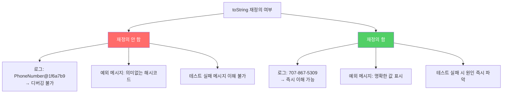

객체를 로그로 출력하거나 디버깅할 때 `PhoneNumber@1f6a7b9`가 찍힌다면 아무 의미가 없습니다. `toString`을 재정의하면 로그가 읽기 쉬워지고, 버그를 훨씬 빨리 찾을 수 있습니다.

---

## 1. 기본 toString이 왜 쓸모없는가?

`Object`의 기본 `toString` 구현은 `클래스이름@16진수해시코드`를 반환합니다.

```java
PhoneNumber p = new PhoneNumber(707, 867, 5309);
System.out.println(p);
// 출력: PhoneNumber@1f6a7b9
// 이게 무슨 전화번호인지 알 수 없음
```

비유하자면 **이름표 없는 택배 박스**입니다. 안에 뭐가 들었는지 열어보지 않으면 알 수 없습니다. `toString`을 재정의하면 박스 겉면에 내용물 설명이 적히는 것과 같습니다.

**toString이 자동 호출되는 상황:**
- `System.out.println(obj)` — 명시적 출력
- `"값: " + obj` — 문자열 연결
- `logger.info("연결: {}", obj)` — 로깅
- 디버거의 변수 표시
- `assert` 실패 메시지

**만약 toString을 재정의하지 않으면?** 프로덕션 버그를 추적할 때 로그에 `PhoneNumber@1f6a7b9`만 남습니다. 어떤 전화번호가 문제였는지 알 방법이 없습니다.

---

## 2. 좋은 toString이 갖춰야 할 것

### 조건 1: 객체가 가진 주요 정보 모두 포함

```java
// 나쁜 toString — 정보 부족
@Override
public String toString() {
    return "PhoneNumber 객체";  // 쓸모없음
}

// 좋은 toString — 핵심 정보 모두 포함
@Override
public String toString() {
    return String.format("%03d-%03d-%04d", areaCode, prefix, lineNum);
    // 출력: "707-867-5309"
}
```

**객체가 너무 크거나 문자열로 표현하기 어렵다면** 요약 정보를 담으세요:

```java
// 요약 정보 예시
"맨해튼 거주자 전화번호부 (총 1,487,536개)"
"Thread[main, 5, main]"
"Person{name='김철수', age=30, address=(요약됨)}"
```

### 조건 2: 반환 값의 포맷을 명확히 결정하고 문서화

```java
/**
 * 이 전화번호의 문자열 표현을 반환한다.
 * 이 문자열은 "XXX-YYY-ZZZZ" 형태의 12글자로 구성된다.
 * XXX는 지역 코드, YYY는 프리픽스, ZZZZ는 가입자 번호다.
 * 각 부분의 값이 너무 작아 자릿수를 채울 수 없다면 앞에서부터 0으로 채운다.
 * 예: 가입자 번호가 123이면 "0123"이 된다.
 */
@Override
public String toString() {
    return String.format("%03d-%03d-%04d", areaCode, prefix, lineNum);
}
```

**포맷을 명시하지 않을 때도 의도를 명확히 밝혀야 합니다:**

```java
/**
 * 이 약물에 관한 대략적인 설명을 반환한다.
 * 상세 형식은 정해지지 않았으며 향후 변경될 수 있다.
 * "[약물 #9: 유형=아스피린, 성분=...]" 형태일 수 있다.
 */
@Override
public String toString() { ... }
```

### 조건 3: toString에 포함된 정보를 직접 가져올 수 있는 접근자 제공

```java
// 나쁜 설계 — 접근자가 없어 파싱을 강요함
PhoneNumber p = new PhoneNumber(707, 867, 5309);
String s = p.toString();  // "707-867-5309"
// 지역 코드를 얻으려면: s.split("-")[0] → 문자열 파싱 필요 (비효율, 취약)

// 좋은 설계 — 접근자 제공
public short getAreaCode() { return areaCode; }
public short getPrefix()   { return prefix; }
public short getLineNum()  { return lineNum; }
```

---

## 3. toString 재정의의 실제 효과



**실제 비교:**

```java
// toString 재정의 전 — 로그
logger.error("전화번호 처리 실패: {}", phoneNumber);
// 출력: 전화번호 처리 실패: PhoneNumber@1f6a7b9

// toString 재정의 후 — 로그
logger.error("전화번호 처리 실패: {}", phoneNumber);
// 출력: 전화번호 처리 실패: 707-867-5309
```

---

## 4. toString을 재정의할 필요가 없는 경우

모든 클래스에 재정의가 필요한 건 아닙니다.

- **정적 유틸리티 클래스:** 인스턴스를 만들 수 없으므로 불필요
- **대부분의 열거 타입(Enum):** Java가 이미 의미있는 문자열을 반환
- **상위 클래스에서 이미 적절히 재정의한 경우:** `AbstractList`, `AbstractMap` 등

```java
// Enum은 toString이 이미 완벽
DayOfWeek.MONDAY.toString()  // → "MONDAY"
Color.RED.toString()         // → "RED"
```

---

## 5. 현대적 접근: 자동 생성

직접 작성하기 번거롭다면:

```java
// 1. Java record — toString 자동 구현
public record PhoneNumber(int areaCode, int prefix, int lineNum) {}
// toString: "PhoneNumber[areaCode=707, prefix=867, lineNum=5309]"

// 2. Lombok @ToString
@ToString
public class PhoneNumber {
    private final int areaCode, prefix, lineNum;
}
// toString: "PhoneNumber(areaCode=707, prefix=867, lineNum=5309)"

// 3. Lombok — 특정 필드 제외
@ToString(exclude = "password")
public class User {
    private String name;
    private String password;  // 보안상 출력 제외
}
```

---

## 6. 요약

> 모든 구체 클래스에서 `Object`의 `toString`을 재정의하세요. 상위 클래스에서 이미 알맞게 재정의한 경우는 예외입니다. `toString`은 해당 객체에 관한 명확하고 유용한 정보를 읽기 좋은 형태로 반환해야 합니다.

**체크리스트:**
1. 주요 정보를 모두 포함했는가?
2. 사람이 읽기 쉬운 형태인가?
3. 포맷 문서화 여부를 명확히 결정했는가?
4. toString에 포함된 정보를 얻어올 접근자를 제공했는가?
5. 보안 민감 정보(비밀번호, 개인정보)는 제외했는가?

---

> 참조: 이펙티브 자바 3/E — 조슈아 블로크
