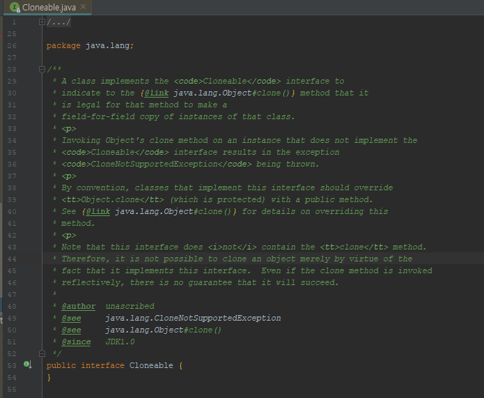

**Cloneable**은 복제해도 되는 클래스임을 명시하는 용도의 믹스인 인터페이스(mixin interface)지만,

아쉽게도 의도한 목적을 제대로 이루지 못했다.

가장 큰 문제는 <code>clone</code> 메소드가 선언된 곳이 Cloneable이 아닌 <code>Object</code>이고, 그마저도 <code>protected</code> 접근자로 되있다는 것이다.

그래서 <code>Cloneable</code>을 구현하는 것만으로는 외부 객체에서 clone 메소드를 호출할 수 없다.


<span style="color:red">하지만</span> 이를 포함한 여러 문제점에도 불구하고 Cloneable방식은 널리 쓰이고 있어서 잘 알아 두는 것이 좋다.

<hr>

#### 🔗 도대체 무슨 일을 하는데 널리 쓰인다는거야?

자 충격적인걸 보자. 



**Cloneable 인터페이스는 메서드 하나 조차 가지고 있지 않다.** 

<span style="color:red;">하지만</span> 이 인터페이스는 놀랍게도 <code>Object</code>의 <code>protected</code> 메소드인 <code>clone</code>의 동작 방식을 결정한다.

**Cloneable**을 구현한 클래스의 인스턴스에서 <code>clone</code>을 호출하면 그 객체의 필드들을 하나하나 복사한 객체를 반환하며, 그렇지 않은 클래스의 인스턴스에서 호출하면 <code>CloneNotSupportedException</code>을 던진다.

<br>

**이는 인터페이스를 상당히 이례적으로 사용한 예이니 따라하지는 말자.**

인터페이스를 구현한다는 것은 일반적으로 해당 클래스가 그 인터페이스에서 정의한 기능을 제공한다고 선언하는 행위이다. <span style="color:red;">그런데</span> <code>Cloneable</code>의 경우에는 **상위 클래스**에 정의된 <code>protected</code> 메소드의 동작 방식을 변경한 것이다.


<hr>


💎실무에서 <code>Cloneable</code>을 구현한 클래스는 <code>clone</code> 메소드를 <code>public</code>으로 제공하며, 사용자는 당연히 복제가 제대로 이뤄지리라 기대한다.


이 기대를 만족시키려면 그 클래스와 모든 상위클래스는 복잡하고, 강제할 수 없고, 허술하게 기술된 프로토콜을 지켜야만 하는데, **그 결과로 깨지기 쉽고, 위험하고, 모순적인 메커니즘이 탄생한다**.

**생성자를 호출하지 않고도 객체를 생성할 수 있게 되는 것이다.**

clone 메소드의 일반 규약은 다음과 같이 허술하다.

<hr>

> 이 객체의 복사본을 생성해 반환한다. '복사'의 정확한 뜻은 그 객체를 구현한 클래스에 따라 다를 수 있다. 일반적인 의도는 다음과 같다. 어떤 객체 x에 대해 다음 식은 참이다.
>
> x.clone() != x
>
> 또한 다음 식도 참이다.
>
> x.clone().getClass() == x.getClass()
>
> 하지만 이상의 요구를 반드시 만족해야 하는 것은 아니다.
>
> 한편 다음 식도 일반적으로는 참이지만, 역시 필수는 아니다.
>
> x.clone().equals(x)
>
> 관례상, 이 메소드가 반환하는 객체는 super.clone을 호출해 얻어야 한다. 이 클래스와 Object를 제외한 모든 상위 클래스가 이 관례를 따른다면 다음 식은 참이다.
>
> x.clone().getClass() == x.getClass()
>
> 관례상, 반환된 객체와 원본 객체는 독립적이어야 한다. 이를 만족하려면 super.clone으로 얻은 객체의 필드 중 하나 이상을 반환 전에 수정해야 할 수도 있다.

<hr>

위 설명을 자세히보면 관례라는 말이 많이 나온다. 그 말 그대로 강제성이 없다는 것이다.

<span style="color:red;">만약</span>, <code>clone</code> 메소드가 <code>super.clone</code>이 아닌, 생성자를 호출해 얻은 인스턴스를 반환하더라도 컴파일시에 문제가 되지않지만 해당 클래스의 하위 클래스에서 <code>super.clone</code>을 호출한다면 하위 클래스 타입 객체를 반환하지 않고 상위 클래스 타입 객체를 반환하여 문제가 생길 수 있다.

<br>

<code>clone</code>을 재정의한 클래스가 <code>final</code>이라면 걱정해야 할 하위 클래스가 없으니 <span style="color:red;">이 관례는 무시</span>해도 된다. 하지만 <code>final</code> 클래스의 <code>clone</code>메소드가 <code>super.clone</code>을 호출하지 않는다면 <code>Cloneable</code>을 구현할 이유도 없다. <code>Object</code>의 <code>clone</code>구현의 동작 방식에 기댈 필요가 없기 때문이다.

<hr>

#### 🔗 가변 객체를 참조하지 않는 클래스의 clone

제대로 동작하는 <code>clone</code> 메소드를 가진 상위 클래스를 상속해 <code>Cloneable</code>을 구현한 코드를보자.

<div class="colorscripter-code" style="color:#010101;font-family:Consolas, 'Liberation Mono', Menlo, Courier, monospace !important; position:relative !important;overflow:auto"><table class="colorscripter-code-table" style="margin:0;padding:0;border:none;background-color:#fafafa;border-radius:4px;" cellspacing="0" cellpadding="0"><tr><td style="padding:6px;border-right:2px solid #e5e5e5"><div style="margin:0;padding:0;word-break:normal;text-align:right;color:#666;font-family:Consolas, 'Liberation Mono', Menlo, Courier, monospace !important;line-height:130%"><div style="line-height:130%">1</div><div style="line-height:130%">2</div><div style="line-height:130%">3</div><div style="line-height:130%">4</div><div style="line-height:130%">5</div><div style="line-height:130%">6</div><div style="line-height:130%">7</div><div style="line-height:130%">8</div><div style="line-height:130%">9</div></div></td><td style="padding:6px 0;text-align:left"><div style="margin:0;padding:0;color:#010101;font-family:Consolas, 'Liberation Mono', Menlo, Courier, monospace !important;line-height:130%"><div style="padding:0 6px; white-space:pre; line-height:130%">@Override</div><div style="background-color:#f0f0f0; padding:0 6px; white-space:pre; line-height:130%"><span style="color:#ff3399">public</span>&nbsp;PhoneNumber&nbsp;<span style="color:#0099cc">clone</span>()&nbsp;{</div><div style="padding:0 6px; white-space:pre; line-height:130%">&nbsp;&nbsp;&nbsp;&nbsp;<span style="color:#ff3399">try</span>&nbsp;{</div><div style="background-color:#f0f0f0; padding:0 6px; white-space:pre; line-height:130%">&nbsp;&nbsp;&nbsp;&nbsp;&nbsp;&nbsp;&nbsp;&nbsp;<span style="color:#ff3399">return</span>&nbsp;(PhoneNumber)&nbsp;<span style="color:#ff3399">super</span>.<span style="color:#0099cc">clone</span>();</div><div style="padding:0 6px; white-space:pre; line-height:130%">&nbsp;&nbsp;&nbsp;&nbsp;}</div><div style="background-color:#f0f0f0; padding:0 6px; white-space:pre; line-height:130%">&nbsp;&nbsp;&nbsp;&nbsp;<span style="color:#ff3399">catch</span>(CloneNotSupportedException&nbsp;e)&nbsp;{</div><div style="padding:0 6px; white-space:pre; line-height:130%">&nbsp;&nbsp;&nbsp;&nbsp;&nbsp;&nbsp;&nbsp;&nbsp;<span style="color:#ff3399">throw</span>&nbsp;<span style="color:#ff3399">new</span>&nbsp;AssertionError();&nbsp;<span style="color:#999999">//일어날&nbsp;수&nbsp;없는&nbsp;일</span></div><div style="background-color:#f0f0f0; padding:0 6px; white-space:pre; line-height:130%">&nbsp;&nbsp;&nbsp;&nbsp;}</div><div style="padding:0 6px; white-space:pre; line-height:130%">}</div></div><div style="text-align:right;margin-top:-13px;margin-right:5px;font-size:9px;font-style:italic"><a href="http://colorscripter.com/info#e" target="_blank" style="color:#e5e5e5text-decoration:none">Colored by Color Scripter</a></div></td><td style="vertical-align:bottom;padding:0 2px 4px 0"><a href="http://colorscripter.com/info#e" target="_blank" style="text-decoration:none;color:white"><span style="font-size:9px;word-break:normal;background-color:#e5e5e5;color:white;border-radius:10px;padding:1px">cs</span></a></td></tr></table></div>

**위 코드는 모든 필드가 기본 타입이거나 불변 객체를 참조하는 코드이다**

💎**즉 ,가변 상태를 참조하지 않는 <code>clone</code> 코드란 얘기이다.**

위 메소드가 동작하게하려면 PhoneNumber의 클래스 선언에 <code>Cloneable</code>을 구현해야한다.

<code>Object</code>의 <code>clone</code> 메소드는 <code>Object</code>를 반환하지만 PhoneNumber의 <code>clone</code>메소드는 PhoneNumber를 반환하게 했다.

**자바가 공변 반환 타이핑을 지원하니 이렇게 하는것이 가능하고 권장하는 방식이기도 한다.**

<br>

<code>super.clone</code> 호출을 <code>try-catch</code> 블록으로 감싼 이유는 <code>Object</code>의 <code>clone</code> 메소드가 <span style="color:red;">검사 예외</span>인 <code>CloneNotSupportedException</code>을 던지도록 선언되었기 때문이다.  사실 알고보면 <span style="color:red;">비검사 예외</span>였지만 말이다. 그것은 나중에 알아보자.

<hr>

**💎가변 객체를 참조하는 클래스의 clone에 대해 살펴보자.**

다음은 Stack 클래스의 코드이다.

<div class="colorscripter-code" style="color:#010101;font-family:Consolas, 'Liberation Mono', Menlo, Courier, monospace !important; position:relative !important;overflow:auto"><table class="colorscripter-code-table" style="margin:0;padding:0;border:none;background-color:#fafafa;border-radius:4px;" cellspacing="0" cellpadding="0"><tr><td style="padding:6px;border-right:2px solid #e5e5e5"><div style="margin:0;padding:0;word-break:normal;text-align:right;color:#666;font-family:Consolas, 'Liberation Mono', Menlo, Courier, monospace !important;line-height:130%"><div style="line-height:130%">1</div><div style="line-height:130%">2</div><div style="line-height:130%">3</div><div style="line-height:130%">4</div><div style="line-height:130%">5</div><div style="line-height:130%">6</div><div style="line-height:130%">7</div><div style="line-height:130%">8</div><div style="line-height:130%">9</div><div style="line-height:130%">10</div><div style="line-height:130%">11</div><div style="line-height:130%">12</div><div style="line-height:130%">13</div><div style="line-height:130%">14</div><div style="line-height:130%">15</div><div style="line-height:130%">16</div><div style="line-height:130%">17</div><div style="line-height:130%">18</div><div style="line-height:130%">19</div><div style="line-height:130%">20</div><div style="line-height:130%">21</div><div style="line-height:130%">22</div><div style="line-height:130%">23</div><div style="line-height:130%">24</div><div style="line-height:130%">25</div><div style="line-height:130%">26</div><div style="line-height:130%">27</div><div style="line-height:130%">28</div><div style="line-height:130%">29</div></div></td><td style="padding:6px 0;text-align:left"><div style="margin:0;padding:0;color:#010101;font-family:Consolas, 'Liberation Mono', Menlo, Courier, monospace !important;line-height:130%"><div style="padding:0 6px; white-space:pre; line-height:130%"><span style="color:#ff3399">public</span>&nbsp;<span style="color:#ff3399">class</span>&nbsp;Stack&nbsp;{</div><div style="background-color:#f0f0f0; padding:0 6px; white-space:pre; line-height:130%">&nbsp;&nbsp;&nbsp;&nbsp;<span style="color:#ff3399">private</span>&nbsp;Object[]&nbsp;elements;</div><div style="padding:0 6px; white-space:pre; line-height:130%">&nbsp;&nbsp;&nbsp;&nbsp;<span style="color:#ff3399">private</span>&nbsp;<span style="color:#0099cc">int</span>&nbsp;size&nbsp;<span style="color:#0086b3"></span><span style="color:#ff3399">=</span>&nbsp;<span style="color:#308ce5">0</span>;</div><div style="background-color:#f0f0f0; padding:0 6px; white-space:pre; line-height:130%">&nbsp;&nbsp;&nbsp;&nbsp;<span style="color:#ff3399">private</span>&nbsp;<span style="color:#ff3399">static</span>&nbsp;<span style="color:#ff3399">final</span>&nbsp;<span style="color:#0099cc">int</span>&nbsp;DEFAULT_INITIAL_CAPACITY&nbsp;<span style="color:#0086b3"></span><span style="color:#ff3399">=</span>&nbsp;<span style="color:#308ce5">16</span>;</div><div style="padding:0 6px; white-space:pre; line-height:130%">&nbsp;</div><div style="background-color:#f0f0f0; padding:0 6px; white-space:pre; line-height:130%">&nbsp;&nbsp;&nbsp;&nbsp;<span style="color:#ff3399">public</span>&nbsp;Stack()&nbsp;{</div><div style="padding:0 6px; white-space:pre; line-height:130%">&nbsp;&nbsp;&nbsp;&nbsp;&nbsp;&nbsp;&nbsp;&nbsp;<span style="color:#ff3399">this</span>.elemens&nbsp;<span style="color:#0086b3"></span><span style="color:#ff3399">=</span>&nbsp;<span style="color:#ff3399">new</span>&nbsp;Object[DEFAULT_INITIAL_CAPACITY];</div><div style="background-color:#f0f0f0; padding:0 6px; white-space:pre; line-height:130%">&nbsp;&nbsp;&nbsp;&nbsp;}</div><div style="padding:0 6px; white-space:pre; line-height:130%">&nbsp;</div><div style="background-color:#f0f0f0; padding:0 6px; white-space:pre; line-height:130%">&nbsp;&nbsp;&nbsp;&nbsp;<span style="color:#ff3399">public</span>&nbsp;<span style="color:#ff3399">void</span>&nbsp;push(Object&nbsp;e)&nbsp;{</div><div style="padding:0 6px; white-space:pre; line-height:130%">&nbsp;&nbsp;&nbsp;&nbsp;&nbsp;&nbsp;&nbsp;&nbsp;ensureCapacity();</div><div style="background-color:#f0f0f0; padding:0 6px; white-space:pre; line-height:130%">&nbsp;&nbsp;&nbsp;&nbsp;&nbsp;&nbsp;&nbsp;&nbsp;elements[size<span style="color:#0086b3"></span><span style="color:#ff3399">+</span><span style="color:#0086b3"></span><span style="color:#ff3399">+</span>]&nbsp;<span style="color:#0086b3"></span><span style="color:#ff3399">=</span>&nbsp;e;</div><div style="padding:0 6px; white-space:pre; line-height:130%">&nbsp;&nbsp;&nbsp;&nbsp;}</div><div style="background-color:#f0f0f0; padding:0 6px; white-space:pre; line-height:130%">&nbsp;</div><div style="padding:0 6px; white-space:pre; line-height:130%">&nbsp;&nbsp;&nbsp;&nbsp;<span style="color:#ff3399">public</span>&nbsp;Object&nbsp;pop()&nbsp;{</div><div style="background-color:#f0f0f0; padding:0 6px; white-space:pre; line-height:130%">&nbsp;&nbsp;&nbsp;&nbsp;&nbsp;&nbsp;&nbsp;&nbsp;<span style="color:#ff3399">if</span>&nbsp;(&nbsp;size&nbsp;<span style="color:#0086b3"></span><span style="color:#ff3399">=</span><span style="color:#0086b3"></span><span style="color:#ff3399">=</span>&nbsp;<span style="color:#308ce5">0</span>&nbsp;)&nbsp;{</div><div style="padding:0 6px; white-space:pre; line-height:130%">&nbsp;&nbsp;&nbsp;&nbsp;&nbsp;&nbsp;&nbsp;&nbsp;&nbsp;&nbsp;&nbsp;&nbsp;<span style="color:#ff3399">throw</span>&nbsp;<span style="color:#ff3399">new</span>&nbsp;EmptyStackException();&nbsp;&nbsp;&nbsp;&nbsp;</div><div style="background-color:#f0f0f0; padding:0 6px; white-space:pre; line-height:130%">&nbsp;&nbsp;&nbsp;&nbsp;&nbsp;&nbsp;&nbsp;&nbsp;}</div><div style="padding:0 6px; white-space:pre; line-height:130%">&nbsp;&nbsp;&nbsp;&nbsp;&nbsp;&nbsp;&nbsp;&nbsp;Object&nbsp;result&nbsp;<span style="color:#0086b3"></span><span style="color:#ff3399">=</span>&nbsp;elements[<span style="color:#0086b3"></span><span style="color:#ff3399">-</span><span style="color:#0086b3"></span><span style="color:#ff3399">-</span>size];</div><div style="background-color:#f0f0f0; padding:0 6px; white-space:pre; line-height:130%">&nbsp;&nbsp;&nbsp;&nbsp;&nbsp;&nbsp;&nbsp;&nbsp;elements[size]&nbsp;<span style="color:#0086b3"></span><span style="color:#ff3399">=</span>&nbsp;<span style="color:#0099cc">null</span>;</div><div style="padding:0 6px; white-space:pre; line-height:130%">&nbsp;&nbsp;&nbsp;&nbsp;&nbsp;&nbsp;&nbsp;&nbsp;<span style="color:#ff3399">return</span>&nbsp;result;</div><div style="background-color:#f0f0f0; padding:0 6px; white-space:pre; line-height:130%">&nbsp;&nbsp;&nbsp;&nbsp;}</div><div style="padding:0 6px; white-space:pre; line-height:130%">&nbsp;</div><div style="background-color:#f0f0f0; padding:0 6px; white-space:pre; line-height:130%">&nbsp;&nbsp;&nbsp;&nbsp;<span style="color:#ff3399">private</span>&nbsp;<span style="color:#ff3399">void</span>&nbsp;ensureCapacity()&nbsp;{</div><div style="padding:0 6px; white-space:pre; line-height:130%">&nbsp;&nbsp;&nbsp;&nbsp;&nbsp;&nbsp;&nbsp;&nbsp;<span style="color:#ff3399">if</span>&nbsp;(&nbsp;elements.<span style="color:#0099cc">length</span>&nbsp;<span style="color:#0086b3"></span><span style="color:#ff3399">=</span><span style="color:#0086b3"></span><span style="color:#ff3399">=</span>&nbsp;size&nbsp;)&nbsp;{</div><div style="background-color:#f0f0f0; padding:0 6px; white-space:pre; line-height:130%">&nbsp;&nbsp;&nbsp;&nbsp;&nbsp;&nbsp;&nbsp;&nbsp;&nbsp;&nbsp;&nbsp;&nbsp;elements&nbsp;<span style="color:#0086b3"></span><span style="color:#ff3399">=</span>&nbsp;Arrays.copyOf(elements,&nbsp;<span style="color:#308ce5">2</span>&nbsp;<span style="color:#0086b3"></span><span style="color:#ff3399">*</span>&nbsp;size&nbsp;<span style="color:#0086b3"></span><span style="color:#ff3399">+</span>&nbsp;<span style="color:#308ce5">1</span>);</div><div style="padding:0 6px; white-space:pre; line-height:130%">&nbsp;&nbsp;&nbsp;&nbsp;&nbsp;&nbsp;&nbsp;&nbsp;}</div><div style="background-color:#f0f0f0; padding:0 6px; white-space:pre; line-height:130%">&nbsp;&nbsp;&nbsp;&nbsp;}</div><div style="padding:0 6px; white-space:pre; line-height:130%">}</div></div><div style="text-align:right;margin-top:-13px;margin-right:5px;font-size:9px;font-style:italic"><a href="http://colorscripter.com/info#e" target="_blank" style="color:#e5e5e5text-decoration:none">Colored by Color Scripter</a></div></td><td style="vertical-align:bottom;padding:0 2px 4px 0"><a href="http://colorscripter.com/info#e" target="_blank" style="text-decoration:none;color:white"><span style="font-size:9px;word-break:normal;background-color:#e5e5e5;color:white;border-radius:10px;padding:1px">cs</span></a></td></tr></table></div>

간단했던 앞서의 <code>clone</code> 메소드를 이용하여 단순히 <code>super.clone</code>의 결과를 그대로 반환한다면 어떻게 될까?

**반환된 <code>Stack</code> 인스턴스의 <code>size</code> 필드는 올바른 값을 갖겠지만, <code>elements</code> 필드는 원본 <code>Stack></code> 인스턴스와 똑같은 배열을 참조할 것이다.**


<hr>

#### 🔗 이렇게 가변 객체를 참조하는 클래스의 clone은 어떻게 해야해?

**<code>Stack</code> 클래스의 하나뿐인 생성자를 호출한다면 이러한 상황은 절대 일어나지 않는다.** 

<code>clone</code> 메소드는 사실상 생성자와 같은 효과를 낸다. 즉, <code>clone</code>은 원본 객체에 아무런 해를 끼치지 않는 동시에 복제된 객체의 불변식을 보장해야한다.

다음의 예를 통해 가변 객체를 참조하는 클래스의 <code>clone</code> 방법 중 가장 쉬운 방법을 살펴보자.

<div class="colorscripter-code" style="color:#010101;font-family:Consolas, 'Liberation Mono', Menlo, Courier, monospace !important; position:relative !important;overflow:auto"><table class="colorscripter-code-table" style="margin:0;padding:0;border:none;background-color:#fafafa;border-radius:4px;" cellspacing="0" cellpadding="0"><tr><td style="padding:6px;border-right:2px solid #e5e5e5"><div style="margin:0;padding:0;word-break:normal;text-align:right;color:#666;font-family:Consolas, 'Liberation Mono', Menlo, Courier, monospace !important;line-height:130%"><div style="line-height:130%">1</div><div style="line-height:130%">2</div><div style="line-height:130%">3</div><div style="line-height:130%">4</div><div style="line-height:130%">5</div><div style="line-height:130%">6</div><div style="line-height:130%">7</div><div style="line-height:130%">8</div><div style="line-height:130%">9</div><div style="line-height:130%">10</div><div style="line-height:130%">11</div></div></td><td style="padding:6px 0;text-align:left"><div style="margin:0;padding:0;color:#010101;font-family:Consolas, 'Liberation Mono', Menlo, Courier, monospace !important;line-height:130%"><div style="padding:0 6px; white-space:pre; line-height:130%">@Override</div><div style="background-color:#f0f0f0; padding:0 6px; white-space:pre; line-height:130%"><span style="color:#ff3399">public</span>&nbsp;Stack&nbsp;Clone()&nbsp;{</div><div style="padding:0 6px; white-space:pre; line-height:130%">&nbsp;&nbsp;&nbsp;&nbsp;<span style="color:#ff3399">try</span>&nbsp;&nbsp;&nbsp;&nbsp;{</div><div style="background-color:#f0f0f0; padding:0 6px; white-space:pre; line-height:130%">&nbsp;&nbsp;&nbsp;&nbsp;&nbsp;&nbsp;&nbsp;&nbsp;Stack&nbsp;result&nbsp;<span style="color:#0086b3"></span><span style="color:#ff3399">=</span>&nbsp;(Stack)&nbsp;<span style="color:#ff3399">super</span>.<span style="color:#0099cc">clone</span>();</div><div style="padding:0 6px; white-space:pre; line-height:130%">&nbsp;&nbsp;&nbsp;&nbsp;&nbsp;&nbsp;&nbsp;&nbsp;result.elements&nbsp;<span style="color:#0086b3"></span><span style="color:#ff3399">=</span>&nbsp;elements.<span style="color:#0099cc">clone</span>();</div><div style="background-color:#f0f0f0; padding:0 6px; white-space:pre; line-height:130%">&nbsp;&nbsp;&nbsp;&nbsp;&nbsp;&nbsp;&nbsp;&nbsp;<span style="color:#ff3399">return</span>&nbsp;result;</div><div style="padding:0 6px; white-space:pre; line-height:130%">&nbsp;&nbsp;&nbsp;&nbsp;}</div><div style="background-color:#f0f0f0; padding:0 6px; white-space:pre; line-height:130%">&nbsp;&nbsp;&nbsp;&nbsp;<span style="color:#ff3399">catch</span>&nbsp;(CloneNotSupportedException&nbsp;e)&nbsp;{</div><div style="padding:0 6px; white-space:pre; line-height:130%">&nbsp;&nbsp;&nbsp;&nbsp;&nbsp;&nbsp;&nbsp;&nbsp;<span style="color:#ff3399">throw</span>&nbsp;<span style="color:#ff3399">new</span>&nbsp;AssertionError();</div><div style="background-color:#f0f0f0; padding:0 6px; white-space:pre; line-height:130%">&nbsp;&nbsp;&nbsp;&nbsp;}</div><div style="padding:0 6px; white-space:pre; line-height:130%">}</div></div><div style="text-align:right;margin-top:-13px;margin-right:5px;font-size:9px;font-style:italic"><a href="http://colorscripter.com/info#e" target="_blank" style="color:#e5e5e5text-decoration:none">Colored by Color Scripter</a></div></td><td style="vertical-align:bottom;padding:0 2px 4px 0"><a href="http://colorscripter.com/info#e" target="_blank" style="text-decoration:none;color:white"><span style="font-size:9px;word-break:normal;background-color:#e5e5e5;color:white;border-radius:10px;padding:1px">cs</span></a></td></tr></table></div>

방법은 바로 <code>elements</code> 배열의 <code>clone</code>을 **재귀적으로 호출**해 주는것이다.

배열의 <code>clone</code>은 런타임 타입과 컴파일 타임 타입 모두가 원본 배열과 똑같은 배열을 반환한다.

따라서 배열을 복제할 떄는 배열의 <code>clone</code> 메소드를 사용하라고 권장한다.

***사실, 배열은 clone 기능을 제대로 사용하는 유일한 예라고 한다.***

<hr>

**💎<span style="color:red;">final</span> 필드는 clone이 안된다고?**

<code>final</code> 필드에는 새로운 값을 할당 할 수 없기 때문이다. 이는 근본적인 문제로, 직렬화와 마찬가지로 <code>Cloneable</code> 아키텍처는 **'가변객체를 참조하는 필드는 <code>final</code>로 선언하라'**는 일반 용법과 충돌한다.

<hr>

💎 **clone을 재귀적으로 호출하는 것만으로는 충분하지 않을 때도 있다고?**

이번에는 해시테이블용 <code>clone</code> 메소드를 생각해보자. 해시테이블 내부는 버킷들의 배열이고, 각 버킷은 키-값 쌍을 담는 연결 리스트의 첫 번째 엔트리를 참조한다.

<div class="colorscripter-code" style="color:#010101;font-family:Consolas, 'Liberation Mono', Menlo, Courier, monospace !important; position:relative !important;overflow:auto"><table class="colorscripter-code-table" style="margin:0;padding:0;border:none;background-color:#fafafa;border-radius:4px;" cellspacing="0" cellpadding="0"><tr><td style="padding:6px;border-right:2px solid #e5e5e5"><div style="margin:0;padding:0;word-break:normal;text-align:right;color:#666;font-family:Consolas, 'Liberation Mono', Menlo, Courier, monospace !important;line-height:130%"><div style="line-height:130%">1</div><div style="line-height:130%">2</div><div style="line-height:130%">3</div><div style="line-height:130%">4</div><div style="line-height:130%">5</div><div style="line-height:130%">6</div><div style="line-height:130%">7</div><div style="line-height:130%">8</div><div style="line-height:130%">9</div><div style="line-height:130%">10</div><div style="line-height:130%">11</div><div style="line-height:130%">12</div><div style="line-height:130%">13</div><div style="line-height:130%">14</div><div style="line-height:130%">15</div></div></td><td style="padding:6px 0;text-align:left"><div style="margin:0;padding:0;color:#010101;font-family:Consolas, 'Liberation Mono', Menlo, Courier, monospace !important;line-height:130%"><div style="padding:0 6px; white-space:pre; line-height:130%"><span style="color:#ff3399">private</span>&nbsp;<span style="color:#ff3399">class</span>&nbsp;HashTable&nbsp;<span style="color:#ff3399">implements</span>&nbsp;Cloneable&nbsp;{</div><div style="background-color:#f0f0f0; padding:0 6px; white-space:pre; line-height:130%">&nbsp;&nbsp;&nbsp;&nbsp;<span style="color:#ff3399">private</span>&nbsp;Entry[]&nbsp;buckets&nbsp;<span style="color:#0086b3"></span><span style="color:#ff3399">=</span>&nbsp;...;</div><div style="padding:0 6px; white-space:pre; line-height:130%">&nbsp;&nbsp;&nbsp;&nbsp;</div><div style="background-color:#f0f0f0; padding:0 6px; white-space:pre; line-height:130%">&nbsp;&nbsp;&nbsp;&nbsp;<span style="color:#ff3399">private</span>&nbsp;<span style="color:#ff3399">static</span>&nbsp;<span style="color:#ff3399">class</span>&nbsp;Entry&nbsp;{</div><div style="padding:0 6px; white-space:pre; line-height:130%">&nbsp;&nbsp;&nbsp;&nbsp;&nbsp;&nbsp;&nbsp;&nbsp;<span style="color:#ff3399">final</span>&nbsp;Object&nbsp;key;</div><div style="background-color:#f0f0f0; padding:0 6px; white-space:pre; line-height:130%">&nbsp;&nbsp;&nbsp;&nbsp;&nbsp;&nbsp;&nbsp;&nbsp;Object&nbsp;value;</div><div style="padding:0 6px; white-space:pre; line-height:130%">&nbsp;&nbsp;&nbsp;&nbsp;&nbsp;&nbsp;&nbsp;&nbsp;Entry&nbsp;next;</div><div style="background-color:#f0f0f0; padding:0 6px; white-space:pre; line-height:130%">&nbsp;&nbsp;&nbsp;&nbsp;&nbsp;&nbsp;&nbsp;&nbsp;</div><div style="padding:0 6px; white-space:pre; line-height:130%">&nbsp;&nbsp;&nbsp;&nbsp;&nbsp;&nbsp;&nbsp;&nbsp;Entry(Object&nbsp;key,&nbsp;Object&nbsp;value,&nbsp;Entry&nbsp;next)&nbsp;{</div><div style="background-color:#f0f0f0; padding:0 6px; white-space:pre; line-height:130%">&nbsp;&nbsp;&nbsp;&nbsp;&nbsp;&nbsp;&nbsp;&nbsp;&nbsp;&nbsp;&nbsp;&nbsp;<span style="color:#ff3399">this</span>.key&nbsp;<span style="color:#0086b3"></span><span style="color:#ff3399">=</span>&nbsp;key;</div><div style="padding:0 6px; white-space:pre; line-height:130%">&nbsp;&nbsp;&nbsp;&nbsp;&nbsp;&nbsp;&nbsp;&nbsp;&nbsp;&nbsp;&nbsp;&nbsp;<span style="color:#ff3399">this</span>.value&nbsp;<span style="color:#0086b3"></span><span style="color:#ff3399">=</span>&nbsp;value;</div><div style="background-color:#f0f0f0; padding:0 6px; white-space:pre; line-height:130%">&nbsp;&nbsp;&nbsp;&nbsp;&nbsp;&nbsp;&nbsp;&nbsp;&nbsp;&nbsp;&nbsp;&nbsp;<span style="color:#ff3399">this</span>.next&nbsp;<span style="color:#0086b3"></span><span style="color:#ff3399">=</span>&nbsp;next;</div><div style="padding:0 6px; white-space:pre; line-height:130%">&nbsp;&nbsp;&nbsp;&nbsp;&nbsp;&nbsp;&nbsp;&nbsp;}</div><div style="background-color:#f0f0f0; padding:0 6px; white-space:pre; line-height:130%">&nbsp;&nbsp;&nbsp;&nbsp;}</div><div style="padding:0 6px; white-space:pre; line-height:130%">}</div></div><div style="text-align:right;margin-top:-13px;margin-right:5px;font-size:9px;font-style:italic"><a href="http://colorscripter.com/info#e" target="_blank" style="color:#e5e5e5text-decoration:none">Colored by Color Scripter</a></div></td><td style="vertical-align:bottom;padding:0 2px 4px 0"><a href="http://colorscripter.com/info#e" target="_blank" style="text-decoration:none;color:white"><span style="font-size:9px;word-break:normal;background-color:#e5e5e5;color:white;border-radius:10px;padding:1px">cs</span></a></td></tr></table></div>

<code>Stack</code>에서 처럼 단순히 버킷 배열의 <code>clone</code>을 재귀적으로 호출한다면 복제본은 자신만의 버킷 배열을 갖지만, 이 배열은 원본과 같은 연결리스트를 참조하여 원본과 복제본 모두 예기치 않게 동작할 가능성이 생긴다.

<hr>

이를 해결하기 위한 방법은 다음과 같이 각 버킷을 구성하는 연결리스트를 복사하는 것이다.

<div class="colorscripter-code" style="color:#010101;font-family:Consolas, 'Liberation Mono', Menlo, Courier, monospace !important; position:relative !important;overflow:auto"><table class="colorscripter-code-table" style="margin:0;padding:0;border:none;background-color:#fafafa;border-radius:4px;" cellspacing="0" cellpadding="0"><tr><td style="padding:6px;border-right:2px solid #e5e5e5"><div style="margin:0;padding:0;word-break:normal;text-align:right;color:#666;font-family:Consolas, 'Liberation Mono', Menlo, Courier, monospace !important;line-height:130%"><div style="line-height:130%">1</div><div style="line-height:130%">2</div><div style="line-height:130%">3</div><div style="line-height:130%">4</div><div style="line-height:130%">5</div><div style="line-height:130%">6</div><div style="line-height:130%">7</div><div style="line-height:130%">8</div><div style="line-height:130%">9</div><div style="line-height:130%">10</div><div style="line-height:130%">11</div><div style="line-height:130%">12</div><div style="line-height:130%">13</div><div style="line-height:130%">14</div><div style="line-height:130%">15</div><div style="line-height:130%">16</div><div style="line-height:130%">17</div><div style="line-height:130%">18</div><div style="line-height:130%">19</div><div style="line-height:130%">20</div><div style="line-height:130%">21</div><div style="line-height:130%">22</div><div style="line-height:130%">23</div><div style="line-height:130%">24</div><div style="line-height:130%">25</div><div style="line-height:130%">26</div><div style="line-height:130%">27</div><div style="line-height:130%">28</div><div style="line-height:130%">29</div><div style="line-height:130%">30</div><div style="line-height:130%">31</div><div style="line-height:130%">32</div><div style="line-height:130%">33</div><div style="line-height:130%">34</div><div style="line-height:130%">35</div><div style="line-height:130%">36</div><div style="line-height:130%">37</div><div style="line-height:130%">38</div><div style="line-height:130%">39</div><div style="line-height:130%">40</div><div style="line-height:130%">41</div></div></td><td style="padding:6px 0;text-align:left"><div style="margin:0;padding:0;color:#010101;font-family:Consolas, 'Liberation Mono', Menlo, Courier, monospace !important;line-height:130%"><div style="padding:0 6px; white-space:pre; line-height:130%"><span style="color:#ff3399">public</span>&nbsp;<span style="color:#ff3399">class</span>&nbsp;HashTable&nbsp;<span style="color:#ff3399">implements</span>&nbsp;Cloneable&nbsp;{</div><div style="background-color:#f0f0f0; padding:0 6px; white-space:pre; line-height:130%">&nbsp;</div><div style="padding:0 6px; white-space:pre; line-height:130%">&nbsp;&nbsp;&nbsp;&nbsp;<span style="color:#ff3399">private</span>&nbsp;Entry[]&nbsp;buckets&nbsp;<span style="color:#0086b3"></span><span style="color:#ff3399">=</span>&nbsp;...;</div><div style="background-color:#f0f0f0; padding:0 6px; white-space:pre; line-height:130%">&nbsp;&nbsp;&nbsp;&nbsp;</div><div style="padding:0 6px; white-space:pre; line-height:130%">&nbsp;&nbsp;&nbsp;&nbsp;<span style="color:#ff3399">private</span>&nbsp;<span style="color:#ff3399">static</span>&nbsp;<span style="color:#ff3399">class</span>&nbsp;Entry&nbsp;{</div><div style="background-color:#f0f0f0; padding:0 6px; white-space:pre; line-height:130%">&nbsp;&nbsp;&nbsp;&nbsp;&nbsp;&nbsp;&nbsp;&nbsp;<span style="color:#ff3399">final</span>&nbsp;Object&nbsp;key;</div><div style="padding:0 6px; white-space:pre; line-height:130%">&nbsp;&nbsp;&nbsp;&nbsp;&nbsp;&nbsp;&nbsp;&nbsp;Object&nbsp;value;</div><div style="background-color:#f0f0f0; padding:0 6px; white-space:pre; line-height:130%">&nbsp;&nbsp;&nbsp;&nbsp;&nbsp;&nbsp;&nbsp;&nbsp;Entry&nbsp;next;</div><div style="padding:0 6px; white-space:pre; line-height:130%">&nbsp;&nbsp;&nbsp;&nbsp;&nbsp;&nbsp;&nbsp;&nbsp;</div><div style="background-color:#f0f0f0; padding:0 6px; white-space:pre; line-height:130%">&nbsp;&nbsp;&nbsp;&nbsp;&nbsp;&nbsp;&nbsp;&nbsp;Entry(Object&nbsp;key,&nbsp;Object&nbsp;value,&nbsp;Entry&nbsp;next)&nbsp;{</div><div style="padding:0 6px; white-space:pre; line-height:130%">&nbsp;&nbsp;&nbsp;&nbsp;&nbsp;&nbsp;&nbsp;&nbsp;&nbsp;&nbsp;&nbsp;&nbsp;<span style="color:#ff3399">this</span>.key&nbsp;<span style="color:#0086b3"></span><span style="color:#ff3399">=</span>&nbsp;key;</div><div style="background-color:#f0f0f0; padding:0 6px; white-space:pre; line-height:130%">&nbsp;&nbsp;&nbsp;&nbsp;&nbsp;&nbsp;&nbsp;&nbsp;&nbsp;&nbsp;&nbsp;&nbsp;<span style="color:#ff3399">this</span>.value&nbsp;<span style="color:#0086b3"></span><span style="color:#ff3399">=</span>&nbsp;value;</div><div style="padding:0 6px; white-space:pre; line-height:130%">&nbsp;&nbsp;&nbsp;&nbsp;&nbsp;&nbsp;&nbsp;&nbsp;&nbsp;&nbsp;&nbsp;&nbsp;<span style="color:#ff3399">this</span>.next&nbsp;<span style="color:#0086b3"></span><span style="color:#ff3399">=</span>&nbsp;next;</div><div style="background-color:#f0f0f0; padding:0 6px; white-space:pre; line-height:130%">&nbsp;&nbsp;&nbsp;&nbsp;&nbsp;&nbsp;&nbsp;&nbsp;}</div><div style="padding:0 6px; white-space:pre; line-height:130%">&nbsp;&nbsp;&nbsp;&nbsp;&nbsp;&nbsp;&nbsp;&nbsp;</div><div style="background-color:#f0f0f0; padding:0 6px; white-space:pre; line-height:130%">&nbsp;&nbsp;&nbsp;&nbsp;&nbsp;&nbsp;&nbsp;&nbsp;Entry&nbsp;deepCopy()&nbsp;{</div><div style="padding:0 6px; white-space:pre; line-height:130%">&nbsp;&nbsp;&nbsp;&nbsp;&nbsp;&nbsp;&nbsp;&nbsp;&nbsp;&nbsp;&nbsp;&nbsp;Entry&nbsp;result&nbsp;<span style="color:#0086b3"></span><span style="color:#ff3399">=</span>&nbsp;<span style="color:#ff3399">new</span>&nbsp;Entry(key,value,next);</div><div style="background-color:#f0f0f0; padding:0 6px; white-space:pre; line-height:130%">&nbsp;&nbsp;&nbsp;&nbsp;&nbsp;&nbsp;&nbsp;&nbsp;&nbsp;&nbsp;&nbsp;&nbsp;<span style="color:#ff3399">for</span>&nbsp;(&nbsp;Entry&nbsp;p&nbsp;<span style="color:#0086b3"></span><span style="color:#ff3399">=</span>&nbsp;result;&nbsp;p.next&nbsp;<span style="color:#0086b3"></span><span style="color:#ff3399">!</span><span style="color:#0086b3"></span><span style="color:#ff3399">=</span>&nbsp;<span style="color:#0099cc">null</span>;&nbsp;p&nbsp;<span style="color:#0086b3"></span><span style="color:#ff3399">=</span>&nbsp;p.next&nbsp;)&nbsp;{</div><div style="padding:0 6px; white-space:pre; line-height:130%">&nbsp;&nbsp;&nbsp;&nbsp;&nbsp;&nbsp;&nbsp;&nbsp;&nbsp;&nbsp;&nbsp;&nbsp;&nbsp;&nbsp;&nbsp;&nbsp;p.next&nbsp;<span style="color:#0086b3"></span><span style="color:#ff3399">=</span>&nbsp;<span style="color:#ff3399">new</span>&nbsp;Entry(p.next.key,&nbsp;p.next.value,&nbsp;p.next.next);</div><div style="background-color:#f0f0f0; padding:0 6px; white-space:pre; line-height:130%">&nbsp;&nbsp;&nbsp;&nbsp;&nbsp;&nbsp;&nbsp;&nbsp;&nbsp;&nbsp;&nbsp;&nbsp;}</div><div style="padding:0 6px; white-space:pre; line-height:130%">&nbsp;&nbsp;&nbsp;&nbsp;&nbsp;&nbsp;&nbsp;&nbsp;&nbsp;&nbsp;&nbsp;&nbsp;<span style="color:#ff3399">return</span>&nbsp;result;</div><div style="background-color:#f0f0f0; padding:0 6px; white-space:pre; line-height:130%">&nbsp;&nbsp;&nbsp;&nbsp;&nbsp;&nbsp;&nbsp;&nbsp;}</div><div style="padding:0 6px; white-space:pre; line-height:130%">&nbsp;&nbsp;&nbsp;&nbsp;}</div><div style="background-color:#f0f0f0; padding:0 6px; white-space:pre; line-height:130%">&nbsp;</div><div style="padding:0 6px; white-space:pre; line-height:130%">&nbsp;&nbsp;&nbsp;&nbsp;@Override&nbsp;</div><div style="background-color:#f0f0f0; padding:0 6px; white-space:pre; line-height:130%">&nbsp;&nbsp;&nbsp;&nbsp;<span style="color:#ff3399">public</span>&nbsp;HashTable&nbsp;<span style="color:#0099cc">clone</span>()&nbsp;{</div><div style="padding:0 6px; white-space:pre; line-height:130%">&nbsp;&nbsp;&nbsp;&nbsp;&nbsp;&nbsp;&nbsp;&nbsp;<span style="color:#ff3399">try</span>&nbsp;{</div><div style="background-color:#f0f0f0; padding:0 6px; white-space:pre; line-height:130%">&nbsp;&nbsp;&nbsp;&nbsp;&nbsp;&nbsp;&nbsp;&nbsp;&nbsp;&nbsp;&nbsp;&nbsp;HashTable&nbsp;result&nbsp;<span style="color:#0086b3"></span><span style="color:#ff3399">=</span>&nbsp;(HashTable)&nbsp;<span style="color:#ff3399">super</span>.<span style="color:#0099cc">clone</span>();</div><div style="padding:0 6px; white-space:pre; line-height:130%">&nbsp;&nbsp;&nbsp;&nbsp;&nbsp;&nbsp;&nbsp;&nbsp;&nbsp;&nbsp;&nbsp;&nbsp;result.buckets&nbsp;<span style="color:#0086b3"></span><span style="color:#ff3399">=</span>&nbsp;<span style="color:#ff3399">new</span>&nbsp;Entry[buckets.<span style="color:#0099cc">length</span>];</div><div style="background-color:#f0f0f0; padding:0 6px; white-space:pre; line-height:130%">&nbsp;&nbsp;&nbsp;&nbsp;&nbsp;&nbsp;&nbsp;&nbsp;&nbsp;&nbsp;&nbsp;&nbsp;<span style="color:#ff3399">for</span>&nbsp;(&nbsp;<span style="color:#0099cc">int</span>&nbsp;i&nbsp;<span style="color:#0086b3"></span><span style="color:#ff3399">=</span>&nbsp;<span style="color:#308ce5">0</span>&nbsp;;&nbsp;i&nbsp;<span style="color:#0086b3"></span><span style="color:#ff3399">&lt;</span>&nbsp;buckets.<span style="color:#0099cc">length</span>;&nbsp;i<span style="color:#0086b3"></span><span style="color:#ff3399">+</span><span style="color:#0086b3"></span><span style="color:#ff3399">+</span>&nbsp;)&nbsp;{</div><div style="padding:0 6px; white-space:pre; line-height:130%">&nbsp;&nbsp;&nbsp;&nbsp;&nbsp;&nbsp;&nbsp;&nbsp;&nbsp;&nbsp;&nbsp;&nbsp;&nbsp;&nbsp;&nbsp;&nbsp;<span style="color:#ff3399">if</span>&nbsp;(&nbsp;buckets[i]&nbsp;<span style="color:#0086b3"></span><span style="color:#ff3399">!</span><span style="color:#0086b3"></span><span style="color:#ff3399">=</span>&nbsp;<span style="color:#0099cc">null</span>&nbsp;)&nbsp;{</div><div style="background-color:#f0f0f0; padding:0 6px; white-space:pre; line-height:130%">&nbsp;&nbsp;&nbsp;&nbsp;&nbsp;&nbsp;&nbsp;&nbsp;&nbsp;&nbsp;&nbsp;&nbsp;&nbsp;&nbsp;&nbsp;&nbsp;&nbsp;&nbsp;&nbsp;&nbsp;result.buckets[i]&nbsp;<span style="color:#0086b3"></span><span style="color:#ff3399">=</span>&nbsp;buckets[i].deepCopy();</div><div style="padding:0 6px; white-space:pre; line-height:130%">&nbsp;&nbsp;&nbsp;&nbsp;&nbsp;&nbsp;&nbsp;&nbsp;&nbsp;&nbsp;&nbsp;&nbsp;&nbsp;&nbsp;&nbsp;&nbsp;}</div><div style="background-color:#f0f0f0; padding:0 6px; white-space:pre; line-height:130%">&nbsp;&nbsp;&nbsp;&nbsp;&nbsp;&nbsp;&nbsp;&nbsp;&nbsp;&nbsp;&nbsp;&nbsp;}&nbsp;</div><div style="padding:0 6px; white-space:pre; line-height:130%">&nbsp;&nbsp;&nbsp;&nbsp;&nbsp;&nbsp;&nbsp;&nbsp;&nbsp;&nbsp;&nbsp;&nbsp;<span style="color:#ff3399">return</span>&nbsp;result;</div><div style="background-color:#f0f0f0; padding:0 6px; white-space:pre; line-height:130%">&nbsp;&nbsp;&nbsp;&nbsp;&nbsp;&nbsp;&nbsp;&nbsp;}</div><div style="padding:0 6px; white-space:pre; line-height:130%">&nbsp;&nbsp;&nbsp;&nbsp;&nbsp;&nbsp;&nbsp;&nbsp;<span style="color:#ff3399">catch</span>&nbsp;(CloneNotSupportedException&nbsp;e)&nbsp;{</div><div style="background-color:#f0f0f0; padding:0 6px; white-space:pre; line-height:130%">&nbsp;&nbsp;&nbsp;&nbsp;&nbsp;&nbsp;&nbsp;&nbsp;&nbsp;&nbsp;&nbsp;&nbsp;<span style="color:#ff3399">throw</span>&nbsp;<span style="color:#ff3399">new</span>&nbsp;AssertionError();</div><div style="padding:0 6px; white-space:pre; line-height:130%">&nbsp;&nbsp;&nbsp;&nbsp;&nbsp;&nbsp;&nbsp;&nbsp;}</div><div style="background-color:#f0f0f0; padding:0 6px; white-space:pre; line-height:130%">&nbsp;&nbsp;&nbsp;&nbsp;}</div><div style="padding:0 6px; white-space:pre; line-height:130%">}</div></div><div style="text-align:right;margin-top:-13px;margin-right:5px;font-size:9px;font-style:italic"><a href="http://colorscripter.com/info#e" target="_blank" style="color:#e5e5e5text-decoration:none">Colored by Color Scripter</a></div></td><td style="vertical-align:bottom;padding:0 2px 4px 0"><a href="http://colorscripter.com/info#e" target="_blank" style="text-decoration:none;color:white"><span style="font-size:9px;word-break:normal;background-color:#e5e5e5;color:white;border-radius:10px;padding:1px">cs</span></a></td></tr></table></div>


<hr>

**💎 아직 한 발 남았다. 복잡한 가변 객체를 복제하는 마지막 방법**

먼저 super.clone을 호출하여 얻은 객체의 모든 필드를 초기 상태로 설정한 다음, 원본 객체의 상태를 다시 생성하는 고수준 메소드들을 호출한다. 

<br>

HashTable 예에서라면, buckets 필드를 새로운 버킷 배열로 초기화한 다음 원본 테이블에 담긴 모든 키-값 쌍 각각에 대해 복제본 테이블의 put(key,value) 메소드를 호출해 둘의 내용이 똑같게 해주면 된다.

<br>

하지만 이방식은 저수준에서 바로 처리 할 때 보다 느리며, Cloneable 아키텍처의 기초가 되는 필드 단위 객체 복사를 우회하기 때문에 Cloneable 아키텍처와는 어울리지 않는 방식이다.

<hr>

#### 💎 clone 재정의시 주의 사항

* **clone 메소드에서는 하위클래스에서 재정의한 메소드를 호출하지 않아야 한다.**
  * 만약 clone이 하위 클래스에서 재정의한 메소드를 호출하면, 하위 클래스는 복제 과정에서 자신의 상태를 교정할 기회를 잃게 되어 원본과 복제본의 상태가 달라질 가능성이 크다.
    따라서 put(key,value) 메소드는 final이거나 private 이어야 한다.
* **public인 clone 메소드에서는 throws 절을 없애야 한다.**
  * Object의 clone 메소드는 CloneNotSupportedException을 던진다고 선언했지만 재정의한 메소드는 그렇지 않다. 검사 예외를 던지지 않아야 그 메소드를 사용하기 편하기 때문이다.

* **상속용 클래스는 Cloneable을 구현해서는 안된다.**
  * Object의 방식을 모방하여, 제대로 작동하는 clone 메소드를 구현해 protected로 두고 CloneNotSupportedException도 던질 수 있다고 선언하는 방법
    이 방식은 마치 Object를 바로 상속할 때 처럼 Cloneable 구현 여부를 하위 클래스에서 선택하도록 해준다.
  * clone을 동작하지 않게 구현해놓고 하위클래스에서 재정의하지 못하게 한다. (final 메소드)

* **Cloneable을 구현한 스레드 안전 클래스를 작성할 때는 clone 메소드 역시 적절히 동기화해줘야 한다.**
  * Object의 clone 메소드는 동기화를 신경 쓰지 않았다. 그러니 super.clone 호출 외에 다른 할 일이 없더라도 clone을 재정의하고 동기화해줘야 한다.

<hr>

##### 💎Cloneable/clone 요약

**Cloneable을 구현하는 모든 클래스는 clone을 재정의해야 한다.**

이때 접근 제한자는 public으로, 반환 타입은 클래스 자신으로 변경한다. 이 메소드는 가장 먼저 super.clone을 호출한 후 필요한 필드를 전부 적절히 수정한다.

<br>

기본 타입 필드와 불변 객체 참조만 갖는 클래스라면 아무 필드도 수정할 필요가 없다. 

**단, 일련번호나 고유 ID는 비록 기본 타입이나 불변일지라도 수정해주야 한다.**


<hr>

#### **💎근데 clone이 꼭 필요해?**

다행스럽게도 위처럼 복잡한 경우는 드물다. Cloneable을 이미 구현한 클래스를 확장한다면 어쩔 수 없이 clone을 잘 작동하도록 구현해야한다.

<span style="color:red;">그렇지 않다면</span>, **복사 생성자**와 **복사 팩토리**라는 더 나은 객체 복사 방식을 제공할 수 있다.

 

* **복사 생성자**

  복사 생성자란 단순히 자신과 같은 클래스의 인스턴스를 인수로 받는 생성자를 말한다.

  <div class="colorscripter-code" style="color:#010101;font-family:Consolas, 'Liberation Mono', Menlo, Courier, monospace !important; position:relative !important;overflow:auto"><table class="colorscripter-code-table" style="margin:0;padding:0;border:none;background-color:#fafafa;border-radius:4px;" cellspacing="0" cellpadding="0"><tr><td style="padding:6px;border-right:2px solid #e5e5e5"><div style="margin:0;padding:0;word-break:normal;text-align:right;color:#666;font-family:Consolas, 'Liberation Mono', Menlo, Courier, monospace !important;line-height:130%"><div style="line-height:130%">1</div></div></td><td style="padding:6px 0;text-align:left"><div style="margin:0;padding:0;color:#010101;font-family:Consolas, 'Liberation Mono', Menlo, Courier, monospace !important;line-height:130%"><div style="padding:0 6px; white-space:pre; line-height:130%"><span style="color:#ff3399">public</span>&nbsp;Yum(Yum&nbsp;yum)&nbsp;{...}</div></div></td><td style="vertical-align:bottom;padding:0 2px 4px 0"><a href="http://colorscripter.com/info#e" target="_blank" style="text-decoration:none;color:white"><span style="font-size:9px;word-break:normal;background-color:#e5e5e5;color:white;border-radius:10px;padding:1px">cs</span></a></td></tr></table></div>

* **복사 팩토리**

  복사 팩토리는 복사 생성자를 모방한 정적 팩토리 메소드이다.

  <div class="colorscripter-code" style="color:#010101;font-family:Consolas, 'Liberation Mono', Menlo, Courier, monospace !important; position:relative !important;overflow:auto"><table class="colorscripter-code-table" style="margin:0;padding:0;border:none;background-color:#fafafa;border-radius:4px;" cellspacing="0" cellpadding="0"><tr><td style="padding:6px;border-right:2px solid #e5e5e5"><div style="margin:0;padding:0;word-break:normal;text-align:right;color:#666;font-family:Consolas, 'Liberation Mono', Menlo, Courier, monospace !important;line-height:130%"><div style="line-height:130%">1</div></div></td><td style="padding:6px 0;text-align:left"><div style="margin:0;padding:0;color:#010101;font-family:Consolas, 'Liberation Mono', Menlo, Courier, monospace !important;line-height:130%"><div style="padding:0 6px; white-space:pre; line-height:130%"><span style="color:#ff3399">public</span>&nbsp;<span style="color:#ff3399">static</span>&nbsp;Yum&nbsp;newInstance(Yum&nbsp;yum)&nbsp;{...}</div></div></td><td style="vertical-align:bottom;padding:0 2px 4px 0"><a href="http://colorscripter.com/info#e" target="_blank" style="text-decoration:none;color:white"><span style="font-size:9px;word-break:normal;background-color:#e5e5e5;color:white;border-radius:10px;padding:1px">cs</span></a></td></tr></table></div>

<br>

**복사 생성자와 복사 팩토리는 Cloneable/clone 방식보다 나은 면이 많다.**

* 언어 모순적이고 위험천만한 객체 생성 메커니즘(생성자를 쓰지 않는 방식)을 사용하지 않는다.
* 엉성하게 문서화된 규약에 기대지 않는다.
* 정상적인 final 필드 용법과도 충돌하지 않는다.
* 불필요한 검사 예외를 던지지 않고, 형변환도 필요치 않다.
* 해당 클래스가 구현한 '인터페이스' 타입의 인스턴스를 인수로 받을 수 있다.
  * 관례상 모든 범용 컬렉션 구현체는 Collection이나 Map타입을 받는 생성자를 제공한다.
    인터페이스 기반 복사 생성자와 복사 팩토리의 더 정확한 이름은 '변환 생성자'와 '변환 팩토리'이다. 이들을 이용하면 클라이언트는 원본의 구현 타입에 얽매이지 않고 복제본의 타입을 직접 선택할 수 있다.

<hr>


> Cloneable이 몰고 온 문제를 되짚어봤을 때, 새로운 인터페이스를 만들 때는 절대 Cloneable을 확장해서는 안 되며, 새로운 클래스도 이를 구현해서는 안 된다. 
>
> final 클래스라면 Cloneable을 구현해도 위험이 크지 않지만, 성능 최적화 관점에서 검토한 후 별다른 문제가 없을 때만 드물게 허용해야 한다.
>
> 기본 원칙은 '복제 기능은 생성자와 팩토리를 이용하는게 최고'라는 것이다. 
>
> 단, 배열만은 clone 메소드 방식이 가장 깔끔한, 이 규칙의 합당한 예외라 할 수 있다.


```
참조 - 이펙티브 자바 3/E - 조슈아 블로크
```

