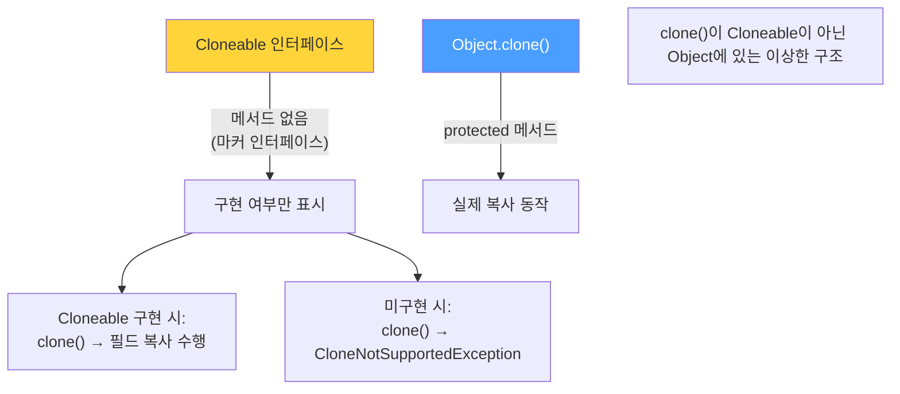
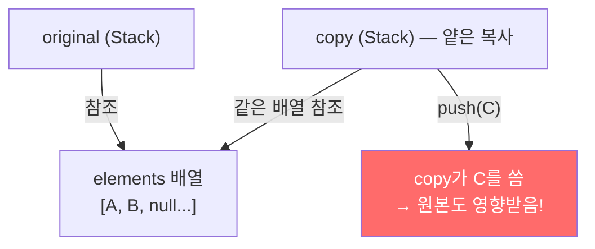
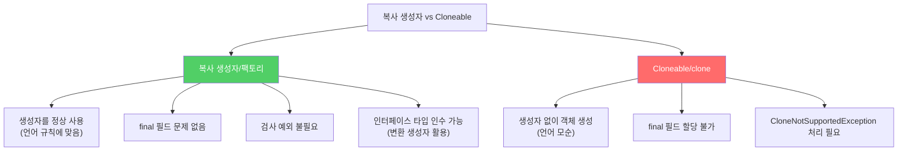
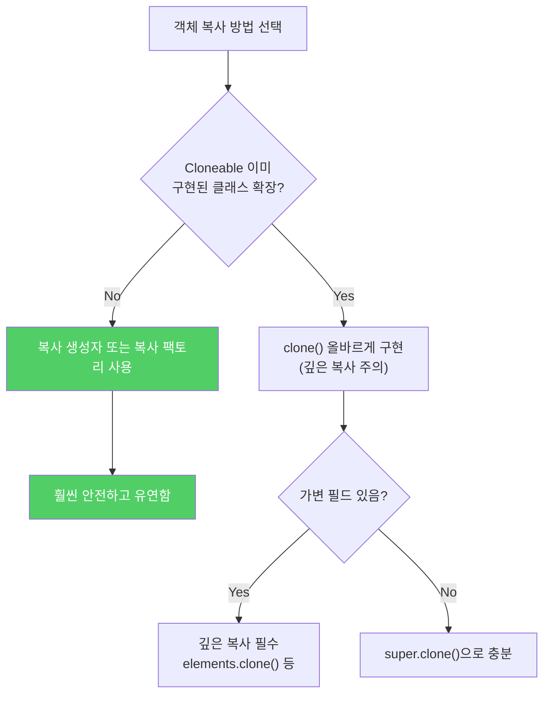

`clone()`을 재정의하면 객체를 복사할 수 있습니다. 그런데 `Cloneable` 인터페이스에는 메서드가 하나도 없고, `clone()`은 `Object`에 있고, 가변 필드가 있으면 얕은 복사가 버그를 만들고... 함정이 겹겹이 쌓여 있습니다. 어떻게 안전하게 쓸지, 그리고 더 나은 대안은 무엇인지 살펴봅니다.

---

## 1. Cloneable의 이상한 설계

비유하자면 **복사 허가증**입니다. "이 클래스는 복사해도 됩니다"라고 표시하는 용도인데, 실제 복사 기능(`clone()`)은 허가증 자체가 아닌 전혀 다른 곳(`Object`)에 있습니다. 게다가 `protected`로 숨겨져 있어 바깥에서 직접 호출도 못 합니다.


```mermaid
graph TD
    A["Cloneable 인터페이스"] -->|"메서드 없음\n(마커 인터페이스)"| B["구현 여부만 표시"]
    C["Object.clone()"] -->|"protected 메서드"| D["실제 복사 동작"]
    B --> E["Cloneable 구현 시:\nclone() → 필드 복사 수행"]
    B --> F["미구현 시:\nclone() → CloneNotSupportedException"]
    style A fill:#ffd43b
    style C fill:#4a9eff,color:#fff
    note["clone()이 Cloneable이 아닌 Object에 있는 이상한 구조"]
```

**이것은 인터페이스의 이례적인 사용입니다.** 일반적으로 인터페이스 구현은 "이 클래스가 해당 기능을 제공한다"는 선언인데, `Cloneable`은 **상위 클래스(`Object`)의 `protected` 메서드 동작 방식을 변경**합니다. 따라서 이 패턴은 절대 따라 하지 마세요.

---

## 2. clone() 일반 규약 — 허술함 주의

`clone()` 규약은 대부분 "관례상"이라는 단서가 붙어 강제성이 없습니다:

```
x.clone() != x                          // 참 (다른 객체)
x.clone().getClass() == x.getClass()    // 일반적으로 참 (필수 아님)
x.clone().equals(x)                     // 일반적으로 참 (필수 아님)
```

핵심 관례: **`super.clone()`을 호출해 얻은 객체를 반환해야 합니다.** 만약 생성자로 만든 객체를 반환하면, 하위 클래스에서 `super.clone()`을 호출했을 때 상위 타입 객체가 반환되어 타입 불일치 버그가 생깁니다.

---

## 3. 가변 상태가 없는 클래스의 clone

모든 필드가 기본 타입이거나 불변 객체를 참조한다면 `super.clone()`만으로 충분합니다.

```java
public class PhoneNumber implements Cloneable {
    private final short areaCode, prefix, lineNum;

    @Override
    public PhoneNumber clone() {
        try {
            return (PhoneNumber) super.clone();  // 공변 반환 타입 — Object 대신 PhoneNumber 반환
        } catch (CloneNotSupportedException e) {
            throw new AssertionError();  // Cloneable을 구현했으므로 절대 발생 안 함
        }
    }
}
```

`CloneNotSupportedException`은 검사 예외(checked exception)이지만, `Cloneable`을 구현한 클래스에서는 절대 발생하지 않으므로 `AssertionError`로 처리합니다.

---

## 4. 가변 객체를 참조하는 클래스의 clone — 핵심 위험

비유하자면 **집 열쇠를 복사했는데 원본과 복사본이 같은 열쇠로 같은 잠금 장치를 공유**하는 상황입니다. 한 쪽이 잠금 장치를 바꾸면 다른 쪽도 영향을 받습니다.

```java
// Stack: Object[] elements 배열을 필드로 가짐
// 단순 super.clone()만 하면?
Stack original = new Stack();
original.push("A");
original.push("B");

Stack copy = original.clone();
copy.push("C");  // 원본 Stack의 elements도 변경됨!
// → 원본과 복사본이 같은 배열을 공유하는 버그
```


```mermaid
graph TD
    A["original (Stack)"] -->|"참조"| C["elements 배열\n[A, B, null...]"]
    B["copy (Stack) — 얕은 복사"] -->|"같은 배열 참조"| C
    B -->|"push(C)"| D["copy가 C를 씀\n→ 원본도 영향받음!"]
    style D fill:#ff6b6b,color:#fff
```

**올바른 해결: elements 배열도 복사(깊은 복사)**

```java
@Override
public Stack clone() {
    try {
        Stack result = (Stack) super.clone();
        result.elements = elements.clone();  // 배열도 별도 복사
        return result;
    } catch (CloneNotSupportedException e) {
        throw new AssertionError();
    }
}
```

> **배열의 `clone()`은 예외적으로 권장됩니다.** 배열은 런타임 타입과 컴파일 타입 모두 원본과 똑같은 배열을 반환하기 때문입니다.

---

## 5. 더 복잡한 경우 — 연결 리스트 깊은 복사

해시테이블처럼 배열 안에 연결 리스트가 있는 경우, 배열만 복사해서는 리스트 노드들이 여전히 공유됩니다.

```java
public class HashTable implements Cloneable {
    private Entry[] buckets;

    private static class Entry {
        final Object key;
        Object value;
        Entry next;

        // 연결 리스트를 반복적으로 깊은 복사 (재귀 대신 반복 — 스택 오버플로 방지)
        Entry deepCopy() {
            Entry result = new Entry(key, value, next);
            for (Entry p = result; p.next != null; p = p.next) {
                p.next = new Entry(p.next.key, p.next.value, p.next.next);
            }
            return result;
        }
    }

    @Override
    public HashTable clone() {
        try {
            HashTable result = (HashTable) super.clone();
            result.buckets = new Entry[buckets.length];  // 새 배열
            for (int i = 0; i < buckets.length; i++) {
                if (buckets[i] != null) {
                    result.buckets[i] = buckets[i].deepCopy();  // 연결 리스트 깊은 복사
                }
            }
            return result;
        } catch (CloneNotSupportedException e) {
            throw new AssertionError();
        }
    }
}
```

---

## 6. final 필드 문제

`final` 필드에는 `clone()` 내부에서 새 값을 할당할 수 없습니다. "가변 객체를 참조하는 필드는 `final`로 선언하라"는 원칙과 충돌합니다.

```java
private final int[] data;  // final이면 clone()에서 새 배열을 할당하지 못함!
// result.data = data.clone();  ← 컴파일 에러
```

이것이 `Cloneable` 아키텍처의 근본적 한계입니다.

---

## 7. 더 나은 대안: 복사 생성자와 복사 팩토리

`Cloneable`을 처음부터 구현하는 상황이라면 다음 두 가지 방식이 훨씬 낫습니다.

```java
// 복사 생성자 — 자신과 같은 타입을 인수로 받는 생성자
public Stack(Stack original) {
    this.elements = original.elements.clone();
    this.size = original.size;
}

// 복사 팩토리 — 복사 생성자를 정적 메서드로 제공
public static Stack newInstance(Stack original) {
    return new Stack(original);
}
```

**복사 생성자/팩토리의 장점:**


```mermaid
graph TD
    A["복사 생성자 vs Cloneable"] --> B["복사 생성자/팩토리"]
    A --> C["Cloneable/clone"]
    B --> B1["생성자를 정상 사용\n(언어 규칙에 맞음)"]
    B --> B2["final 필드 문제 없음"]
    B --> B3["검사 예외 불필요"]
    B --> B4["인터페이스 타입 인수 가능\n(변환 생성자 활용)"]
    C --> C1["생성자 없이 객체 생성\n(언어 모순)"]
    C --> C2["final 필드 할당 불가"]
    C --> C3["CloneNotSupportedException 처리 필요"]
    style B fill:#51cf66,color:#fff
    style C fill:#ff6b6b,color:#fff
```

**인터페이스 타입 변환도 가능:**

```java
// HashSet → TreeSet으로 변환 복사
Set<String> hashSet = new HashSet<>(List.of("b", "a", "c"));
Set<String> treeSet = new TreeSet<>(hashSet);  // 자동 정렬된 TreeSet으로 변환
// 이런 유연성이 복사 생성자의 강점
```

---

## 8. clone 재정의 시 주의사항

어쩔 수 없이 `Cloneable`을 구현해야 한다면:

1. **`super.clone()` 먼저 호출** — 생성자 호출로 대체하지 말 것
2. **가변 필드는 반드시 깊은 복사**
3. **재정의 가능한 메서드 호출 금지** — `clone()` 내에서 하위 클래스가 재정의할 수 있는 메서드를 호출하면 원본/복사본 상태 불일치 위험
4. **`public` 공개 시 `throws CloneNotSupportedException` 제거** — 클라이언트 사용 편의를 위해
5. **스레드 안전 클래스는 `clone()`도 동기화** — `Object.clone()`은 동기화 없음

---

## 9. 요약


```mermaid
graph TD
    A["객체 복사 방법 선택"] --> B{"Cloneable 이미\n구현된 클래스 확장?"}
    B -->|"Yes"| C["clone() 올바르게 구현\n(깊은 복사 주의)"]
    B -->|"No"| D["복사 생성자 또는 복사 팩토리 사용"]
    D --> D1["훨씬 안전하고 유연함"]
    C --> E{"가변 필드 있음?"}
    E -->|"Yes"| F["깊은 복사 필수\nelements.clone() 등"]
    E -->|"No"| G["super.clone()으로 충분"]
    style D fill:#51cf66,color:#fff
    style D1 fill:#51cf66,color:#fff
```

> 새로운 인터페이스를 만들 때는 절대 `Cloneable`을 확장하지 마세요. 새로운 클래스도 `Cloneable`을 구현하면 안 됩니다. 복제 기능은 **복사 생성자와 복사 팩토리**를 이용하는 게 최선입니다. 단, 배열의 `clone()`은 예외적으로 가장 깔끔한 방법입니다.

---

> 참조: 이펙티브 자바 3/E — 조슈아 블로크
