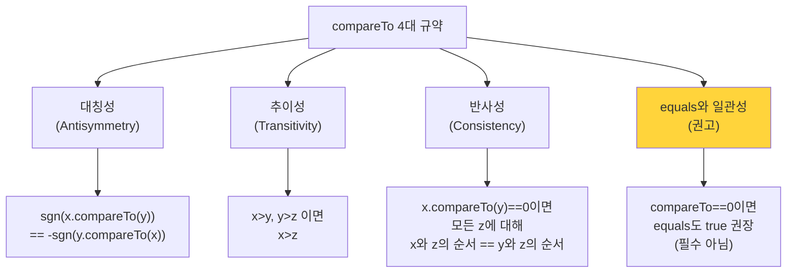
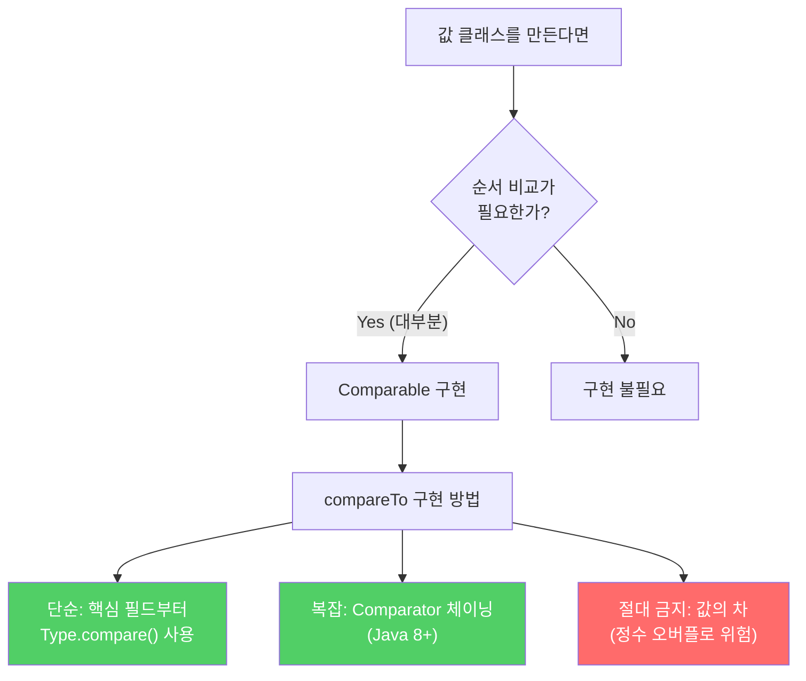

`Comparable`을 구현하면 `Arrays.sort()`, `TreeSet`, `TreeMap`, `Collections.sort()`가 그 클래스 인스턴스를 자동으로 정렬해줍니다. 값을 표현하는 클래스를 만든다면 거의 항상 구현해야 합니다.

---

## 1. Comparable이란?

비유하자면 **신장 측정 눈금**입니다. 사람들을 줄 세울 때 키를 비교할 수 있는 기준이 있어야 하듯, `Comparable`을 구현하면 객체에 "자연적인 순서(natural ordering)"가 생깁니다.

```java
// Comparable을 구현하면 이런 것들이 자동으로 됩니다
String[] words = {"banana", "apple", "cherry"};
Arrays.sort(words);  // → ["apple", "banana", "cherry"]

Set<String> sorted = new TreeSet<>(List.of("banana", "apple", "cherry"));
// → {apple, banana, cherry} — 자동 정렬 유지

// 중복 제거 + 알파벳 정렬
public class WordList {
    public static void main(String[] args) {
        Set<String> set = new TreeSet<>(Arrays.asList(args));
        System.out.println(set);
    }
}
```

`String`, `Integer`, `BigDecimal`, `LocalDate` 등 Java 표준 라이브러리의 값 클래스는 모두 `Comparable`을 구현합니다.

---

## 2. compareTo 일반 규약

`compareTo`는 `equals`와 성격이 비슷하지만 **순서 비교**라는 점이 다릅니다. 반환값 규칙:
- **음수**: `this < other`
- **0**: `this == other`
- **양수**: `this > other`



### equals와의 일관성 — 꼭 지키세요

```java
// BigDecimal의 경고적 예시
BigDecimal a = new BigDecimal("1.0");
BigDecimal b = new BigDecimal("1.00");

a.equals(b)      // false — 정밀도가 다름
a.compareTo(b)   // 0     — 값은 같음

// HashSet은 equals 기반 → 2개 원소
Set<BigDecimal> hashSet = new HashSet<>();
hashSet.add(a); hashSet.add(b);
System.out.println(hashSet.size());  // 2

// TreeSet은 compareTo 기반 → 1개 원소
Set<BigDecimal> treeSet = new TreeSet<>();
treeSet.add(a); treeSet.add(b);
System.out.println(treeSet.size());  // 1 ← 주의!
```

**만약 equals와 일관성이 없다면?** `TreeSet`과 `HashSet`에서 같은 객체가 다른 원소 수로 처리됩니다. 직관에 반하는 동작이 발생합니다.

---

## 3. compareTo 구현 방법

### 방법 1: 핵심 필드부터 순서대로 비교

```java
public class PhoneNumber implements Comparable<PhoneNumber> {
    private final short areaCode, prefix, lineNum;

    @Override
    public int compareTo(PhoneNumber pn) {
        int result = Short.compare(areaCode, pn.areaCode);  // 1. 가장 중요한 필드
        if (result == 0) {
            result = Short.compare(prefix, pn.prefix);      // 2. 두 번째 중요 필드
            if (result == 0) {
                result = Short.compare(lineNum, pn.lineNum); // 3. 세 번째 중요 필드
            }
        }
        return result;
    }
}
```

앞 필드에서 결과가 0이 아니면 즉시 반환 — 불필요한 비교를 건너뜁니다.

### 방법 2: Comparator 체이닝 (Java 8+, 간결하지만 약간 느림)

```java
public class PhoneNumber implements Comparable<PhoneNumber> {
    private static final Comparator<PhoneNumber> COMPARATOR =
        Comparator.comparingInt((PhoneNumber pn) -> pn.areaCode)  // 타입 명시 필요
                  .thenComparingInt(pn -> pn.prefix)
                  .thenComparingInt(pn -> pn.lineNum);

    @Override
    public int compareTo(PhoneNumber pn) {
        return COMPARATOR.compare(this, pn);
    }
}
```

`comparingInt` → `thenComparingInt` → `thenComparingInt` 순서로 체이닝합니다. 첫 번째 비교자에서 타입을 명시해야 타입 추론이 올바르게 동작합니다.

---

## 4. 절대 하지 말 것 — 값의 차로 비교

```java
// 위험한 코드 — 절대 사용 금지
static Comparator<Object> hashCodeOrder = (o1, o2) ->
    o1.hashCode() - o2.hashCode();  // 정수 오버플로 가능!
```

`Integer.MIN_VALUE - Integer.MAX_VALUE`는 양수가 되는 오버플로가 발생합니다. 부호가 뒤집혀 정렬 순서가 완전히 깨집니다.

```java
// 올바른 방법 1: 정적 compare 메서드 사용
static Comparator<Object> hashCodeOrder = (o1, o2) ->
    Integer.compare(o1.hashCode(), o2.hashCode());

// 올바른 방법 2: 비교자 생성 메서드 사용
static Comparator<Object> hashCodeOrder =
    Comparator.comparingInt(Object::hashCode);
```

---

## 5. 필드 타입별 비교 방법

```java
// 기본 타입: 박싱 클래스의 compare 사용
Integer.compare(x, y)
Long.compare(x, y)
Double.compare(x, y)

// 참조 타입: compareTo 재귀 호출
nameField.compareTo(other.nameField)

// Comparable을 구현하지 않은 필드: Comparator 사용
Comparator.comparing(Person::getAddress, addressComparator)
```

> Java 7 이전에는 `<`, `>`를 쓰도록 권장했지만, **Java 7부터는 박싱 클래스의 정적 `compare` 메서드를 사용하세요.** 관계 연산자는 거추장스럽고 오류를 유발합니다.

---

## 6. 실용적인 Comparable 예시

```java
public class Student implements Comparable<Student> {
    private final String name;
    private final int grade;
    private final double gpa;

    // 학년 → GPA 내림차순 → 이름 순으로 정렬
    private static final Comparator<Student> COMPARATOR =
        Comparator.comparingInt(Student::getGrade)
                  .thenComparingDouble((Student s) -> -s.gpa)  // 내림차순: 부호 반전
                  .thenComparing(Student::getName);

    @Override
    public int compareTo(Student other) {
        return COMPARATOR.compare(this, other);
    }
}

// 사용
List<Student> students = ...;
Collections.sort(students);         // 자동 정렬
TreeSet<Student> set = new TreeSet<>(students);  // 자동 정렬 컬렉션
```

---

## 7. 요약



**핵심 규칙:**
1. 순서를 고려하는 값 클래스는 반드시 `Comparable` 구현
2. `compareTo`에서 필드 비교 시 `<`, `>` 대신 `Type.compare()` 사용
3. 값의 차(`a - b`)로 비교하면 정수 오버플로 → 절대 금지
4. `compareTo`와 `equals`가 일관되도록 구현 (강력 권고)

---

> 참조: 이펙티브 자바 3/E — 조슈아 블로크
