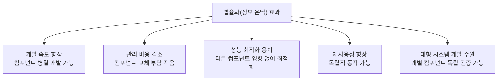
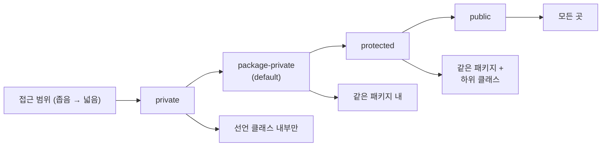
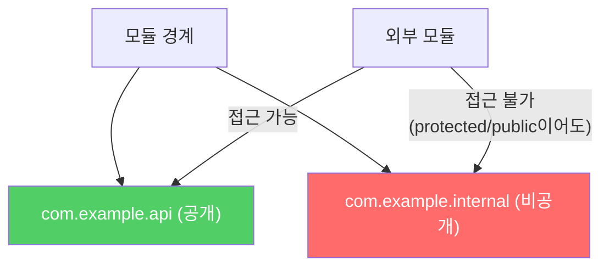
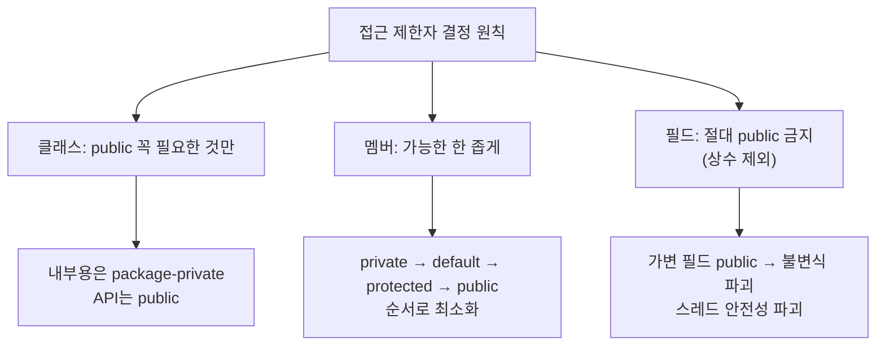

잘 설계된 컴포넌트와 어설프게 설계된 컴포넌트의 가장 큰 차이는 **내부 구현을 얼마나 잘 숨겼느냐**입니다. 이것이 캡슐화(정보 은닉)이고, 접근 제한자를 올바르게 사용하는 것이 핵심입니다.

---

## 1. 캡슐화가 중요한 이유

비유하자면 **공장의 조립 라인**입니다. 각 부서(컴포넌트)가 자신의 내부 작업을 숨기고 정해진 인터페이스로만 소통하면, 한 부서의 기계를 교체해도 다른 부서에 영향이 없습니다. 내부가 노출되어 있으면 어느 한 곳을 바꿀 때 연쇄적으로 모든 곳을 바꿔야 합니다.

**캡슐화의 5가지 이점:**



---

## 2. 접근 제한자 4단계



**기본 원칙: 모든 클래스와 멤버의 접근성을 가능한 한 좁혀야 합니다.**

---

## 3. 톱레벨 클래스의 접근 수준

톱레벨 클래스(파일의 가장 바깥 클래스)에는 `public`과 `package-private` 두 가지만 선택할 수 있습니다.

```java
// public 클래스 — 공개 API가 됨, 하위 호환 영원히 유지 필요
public class PublicUtils {
    public static void doSomething() { ... }
}

// package-private 클래스 — 내부 구현, 언제든 수정·삭제 가능
class InternalHelper {
    static void internalProcess() { ... }
}
```

**만약 패키지 외부에서 쓸 이유가 없다면 반드시 `package-private`으로 선언하세요.** `public`으로 선언하면 API가 되어 영원히 관리해야 합니다.

**한 클래스에서만 쓰이는 `package-private` 클래스라면 private 정적 중첩 클래스로 만드세요:**

```java
public class OuterClass {
    // 외부에서 볼 필요 없는 도우미 클래스
    private static class InternalHelper {
        void help() { ... }
    }
}
```

---

## 4. 멤버의 접근 수준 결정 원칙

### 원칙 1: public API에 꼭 필요한 것만 public

```java
public class UserService {
    // public API: 외부에서 호출해야 하는 것만
    public User findById(long id) { ... }
    public void updateEmail(long id, String email) { ... }

    // 내부 구현 — private
    private User fetchFromCache(long id) { ... }
    private void sendNotification(String email) { ... }

    // 같은 패키지 내 테스트/형제 클래스에서 필요 — package-private
    void clearCache() { ... }
}
```

### 원칙 2: protected는 작을수록 좋다

`public` 클래스에서 `package-private` → `protected`로 올리는 순간, 그 멤버에 접근할 수 있는 범위가 급격히 넓어집니다.

```java
// protected 멤버는 공개 API — 영원히 지원해야 함
public class AbstractTemplate {
    protected void hookMethod() { ... }  // 하위 클래스에서 재정의 가능
    // 이 메서드를 제거하거나 시그니처를 바꾸면 모든 하위 클래스가 깨짐
}
```

### 원칙 3: 리스코프 치환 원칙 — 접근 수준을 좁힐 수 없음

상위 클래스 메서드를 재정의할 때 접근 수준을 더 좁게 할 수 없습니다.

```java
public class Parent {
    public void doWork() { ... }
}

public class Child extends Parent {
    // 컴파일 에러! public을 더 좁게 만들 수 없음
    @Override
    protected void doWork() { ... }  // ← 에러
}
```

이유: `Parent p = new Child()`로 사용할 때, `p.doWork()`가 항상 가능해야 리스코프 치환 원칙이 성립합니다.

---

## 5. 인스턴스 필드는 절대 public으로 두지 말 것

```java
// 나쁜 설계 — 가변 public 필드
public class Temperature {
    public double celsius;  // 누구든 직접 수정 가능!
    // 불변식 보장 불가: -273.15 이하가 되어도 막을 수 없음
    // 스레드 안전성 보장 불가
    // 나중에 로직 추가 불가 (값 변경 시 이벤트 발생 등)
}

// 좋은 설계 — private 필드 + 접근자
public class Temperature {
    private double celsius;

    public double getCelsius() { return celsius; }

    public void setCelsius(double celsius) {
        if (celsius < -273.15) throw new IllegalArgumentException("절대온도 이하");
        this.celsius = celsius;
        notifyObservers();  // 나중에 로직 추가 가능
    }
}
```

**예외: 상수 필드는 `public static final`로 공개 가능**

```java
// OK — 기본 타입 또는 불변 객체 참조 상수
public static final int MAX_SIZE = 100;
public static final String DEFAULT_NAME = "unknown";

// 위험! — 가변 객체 참조
public static final List<String> NAMES = new ArrayList<>();  // 내용 변경 가능!

// 올바른 방법 — 불변 컬렉션으로
public static final List<String> NAMES =
    Collections.unmodifiableList(Arrays.asList("Alice", "Bob"));
```

---

## 6. public static final 배열 필드 — 보안 함정

```java
// 보안 허점 — 배열은 항상 가변
public static final String[] VALUES = {"admin", "user"};
// 클라이언트: ClassName.VALUES[0] = "hacker"; → 허용됨!
```

**해결책 두 가지:**

```java
// 해결책 1: 불변 리스트로 감싸기 (읽기 전용 뷰)
private static final String[] PRIVATE_VALUES = {"admin", "user"};
public static final List<String> VALUES =
    Collections.unmodifiableList(Arrays.asList(PRIVATE_VALUES));

// 해결책 2: 방어적 복사본 반환
private static final String[] PRIVATE_VALUES = {"admin", "user"};
public static String[] values() {
    return PRIVATE_VALUES.clone();  // 매번 새 배열 반환
}
```

클라이언트가 배열 원소 수정을 막으려면 해결책 1, 배열 자체를 자유롭게 수정해야 하면 해결책 2를 선택합니다.

---

## 7. Java 9 모듈 시스템

Java 9에서 도입된 모듈 시스템은 패키지 단위의 새로운 접근 제어를 제공합니다.

```java
// module-info.java
module my.library {
    exports com.example.api;        // 외부에 공개할 패키지만 명시
    // exports com.example.internal; ← 이 줄이 없으면 외부 접근 불가
}
```



**주의:** JAR를 classpath에 두면 모듈 선언이 무시되어 모든 패키지가 노출됩니다. 모듈 시스템의 보호를 받으려면 반드시 module-path에 두어야 합니다.

---

## 8. 요약



**체크리스트:**
1. 이 클래스가 패키지 외부에서 쓰일 이유가 있는가? 없다면 `package-private`
2. 이 메서드가 외부 API인가? 아니라면 `private` 또는 `package-private`
3. 인스턴스 필드가 `public`인가? 반드시 `private`으로 + 접근자 제공
4. `public static final` 필드가 배열인가? 불변 컬렉션 또는 방어적 복사로 교체

---

> 참조: 이펙티브 자바 3/E — 조슈아 블로크
