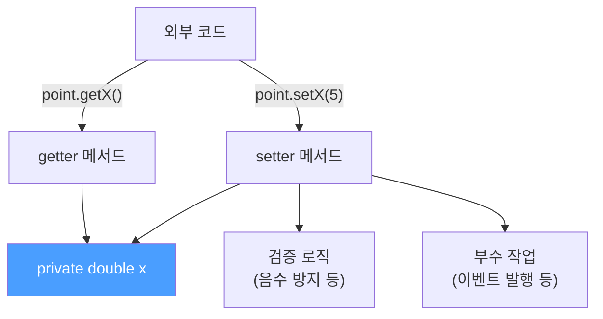
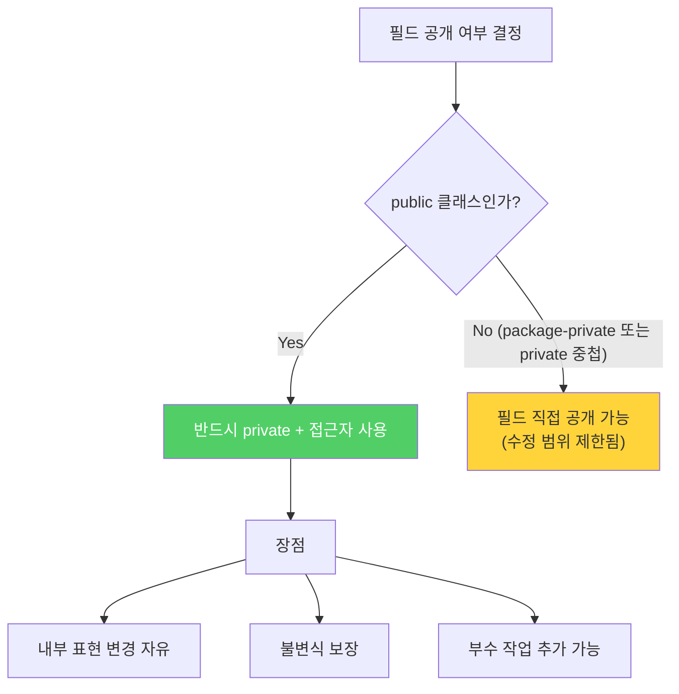

필드를 `public`으로 열어두면 편하지만, 나중에 내부 구현을 바꾸거나 검증 로직을 추가하고 싶을 때 API를 변경해야 하는 함정에 빠집니다. `getter`/`setter`가 단순히 관례가 아닌 이유를 살펴봅니다.

---

## 1. public 필드의 세 가지 문제점

비유하자면 **회사 금고를 복도에 열어두는 것**과 같습니다. 누구나 직접 손댈 수 있어서 잠금 절차(검증)를 거칠 방법이 없고, 금고를 다른 것으로 교체하려면 금고 위치를 알고 있는 모든 사람에게 알려야 합니다.

```java
// 나쁜 설계 — 필드가 모두 public
class Point {
    public double x;
    public double y;
}
```

**문제 1: API를 수정하지 않고 내부 표현을 바꿀 수 없다**

```java
// Point를 쓰는 코드가 이렇게 작성됐다면
double px = point.x;
double py = point.y;

// 나중에 x, y를 배열로 바꾸거나 int로 바꾸려면
// → 이 필드를 참조하는 모든 코드를 찾아서 수정해야 함
```

**문제 2: 불변식을 보장할 수 없다**

```java
point.x = -1000;  // 좌표가 음수여도 막을 방법이 없음
point.y = Double.NaN;  // NaN도 그냥 들어감
```

**문제 3: 필드 접근 시 부수 작업을 수행할 수 없다**

```java
// 값이 바뀔 때 이벤트를 발행하거나 캐시를 갱신하고 싶어도 불가능
point.x = 5;  // 여기에 로직을 끼울 수가 없음
```

---

## 2. 올바른 설계: private 필드 + 접근자 메서드

```java
// 좋은 설계
class Point {
    private double x;
    private double y;

    public Point(double x, double y) {
        this.x = x;
        this.y = y;
    }

    public double getX() { return x; }
    public double getY() { return y; }

    public void setX(double x) {
        // 검증 로직 추가 가능
        this.x = x;
        notifyPositionChanged();  // 부수 작업 추가 가능
    }

    public void setY(double y) {
        this.y = y;
        notifyPositionChanged();
    }
}
```



이제 내부 표현을 `double` → `int`로 바꾸거나 좌표계를 변경해도, 외부 API(`getX()`, `getY()`)는 유지됩니다. 클라이언트 코드는 수정 없이 그대로 동작합니다.

---

## 3. public 필드를 노출해도 되는 경우

**`package-private` 클래스 또는 `private` 중첩 클래스**라면 필드를 공개해도 문제없습니다.

```java
// package-private 클래스 — 패키지 내부에서만 사용
class PackagePoint {
    double x;  // 패키지 외부에서 접근 불가 → 수정 범위가 패키지로 제한
    double y;
}

// private 중첩 클래스 — 외부 클래스에서만 사용
public class Canvas {
    private static class Pixel {
        int x, y;  // 수정 범위가 Canvas 클래스로 제한
        int color;
    }
}
```

이 경우 필드 직접 접근이 API가 되지 않고, 변경 범위도 명확히 제한됩니다.

---

## 4. 불변 필드는 어떨까?

`public final` 필드는 불변식을 보장할 수 있지만, 여전히 두 가지 단점이 남습니다.

```java
public final class Time {
    private static final int HOURS_PER_DAY    = 24;
    private static final int MINUTES_PER_HOUR = 60;

    public final int hour;    // final이므로 불변식은 보장
    public final int minute;

    public Time(int hour, int minute) {
        if (hour < 0 || hour >= HOURS_PER_DAY)
            throw new IllegalArgumentException("시간: " + hour);
        if (minute < 0 || minute >= MINUTES_PER_HOUR)
            throw new IllegalArgumentException("분: " + minute);
        this.hour = hour;
        this.minute = minute;
    }
}
```

`hour`와 `minute`이 `final`이므로 외부에서 변경은 불가능합니다. 하지만:
- `hour`를 나중에 다른 표현으로 바꾸려면 API(`public final int hour`)를 바꿔야 합니다
- `getHour()` 호출 시 로깅 등 부수 작업을 추가할 수 없습니다

---

## 5. 요약



> `public` 클래스는 절대 가변 필드를 직접 노출하지 마세요. 불변 필드라도 노출하지 않는 것이 좋습니다. 단, `package-private` 클래스나 `private` 중첩 클래스에서는 상황에 따라 필드를 공개하는 편이 나을 수 있습니다.

---

> 참조: 이펙티브 자바 3/E — 조슈아 블로크
