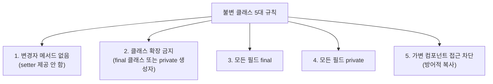
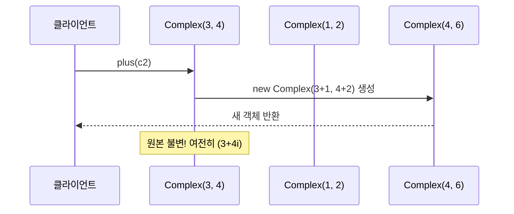
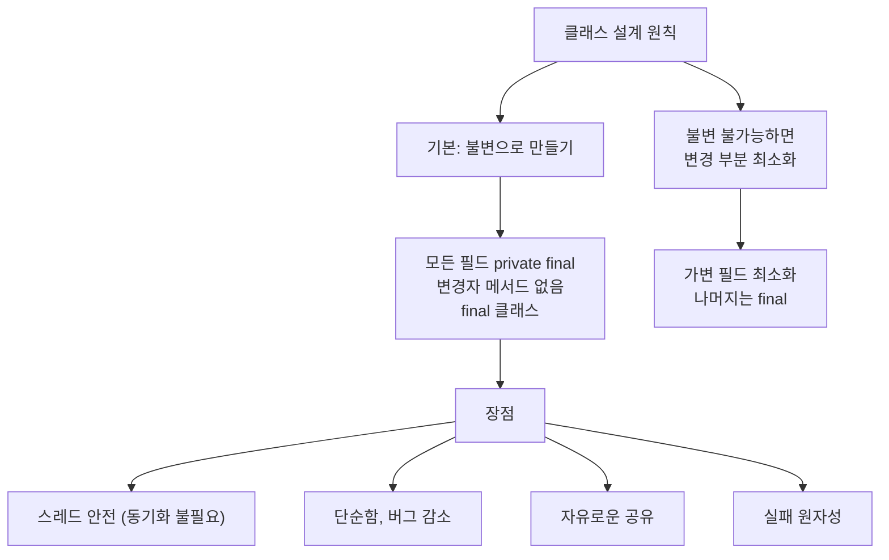

불변 클래스(immutable class)는 한번 만들어지면 상태가 절대 변하지 않는 클래스입니다. `String`, `Integer`, `BigDecimal`이 대표적입니다. 가변 클래스보다 설계·구현·사용이 쉽고 버그도 훨씬 적습니다.

---

## 1. 불변 클래스를 만드는 5가지 규칙

비유하자면 **조각상**입니다. 한번 완성된 조각상은 절대 형태가 바뀌지 않습니다. 조각상을 "수정"하려면 새 조각상을 만들어야 합니다.



---

## 2. 함수형 프로그래밍 방식 — 연산 결과를 새 객체로 반환

불변 복소수 클래스를 통해 함수형 프로그래밍 방식을 살펴봅니다.

```java
public final class Complex {
    private final double re;  // 실수부
    private final double im;  // 허수부

    public Complex(double re, double im) {
        this.re = re;
        this.im = im;
    }

    public double realPart()      { return re; }
    public double imaginaryPart() { return im; }

    // 핵심: 자신을 수정하지 않고 새 인스턴스를 반환 — 함수형 프로그래밍
    public Complex plus(Complex c) {
        return new Complex(re + c.re, im + c.im);
    }
    public Complex minus(Complex c) {
        return new Complex(re - c.re, im - c.im);
    }
    public Complex times(Complex c) {
        return new Complex(re * c.re - im * c.im,
                          re * c.im + im * c.re);
    }

    @Override
    public boolean equals(Object o) {
        if (o == this) return true;
        if (!(o instanceof Complex)) return false;
        Complex c = (Complex) o;
        // double, float 비교에는 == 대신 compare 사용 (부동소수점 오차)
        return Double.compare(c.re, re) == 0 && Double.compare(c.im, im) == 0;
    }

    @Override
    public int hashCode() {
        return 31 * Double.hashCode(re) + Double.hashCode(im);
    }

    @Override
    public String toString() {
        return "(" + re + " + " + im + "i)";
    }
}
```

**메서드 이름에 주목하세요.** `add`, `subtract`(동사) 대신 `plus`, `minus`(전치사)를 사용했습니다. 이는 "이 메서드가 객체를 변경하지 않는다"는 의도를 이름으로 강조합니다.



---

## 3. 불변 객체의 5가지 장점

### 장점 1: 단순함

불변 객체는 생성 시점의 상태를 파괴될 때까지 그대로 유지합니다. 상태 변화를 추적할 필요가 없어 이해하기 쉽습니다.

### 장점 2: 스레드 안전 — 동기화 불필요

```java
// 불변 객체는 멀티스레드 환경에서 자유롭게 공유 가능
// 아무 스레드도 다른 스레드의 상태를 변경할 수 없음
Complex c = new Complex(3, 4);
// 수백 개의 스레드가 동시에 c를 읽어도 안전
```

불변 클래스는 자주 사용되는 인스턴스를 캐시하는 정적 팩토리를 제공할 수 있습니다:

```java
// Boolean의 캐싱 예시 (실제 구현)
public static final Boolean TRUE  = new Boolean(true);
public static final Boolean FALSE = new Boolean(false);

public static Boolean valueOf(boolean b) {
    return b ? TRUE : FALSE;  // 재사용!
}
```

### 장점 3: 방어적 복사 불필요

불변 객체는 복사해봐야 원본과 같으므로 `clone()`이나 복사 생성자를 제공할 필요가 없습니다.

### 장점 4: 내부 데이터 공유 가능

```java
// BigInteger의 negate 구현 개념
// 부호만 다른 새 BigInteger를 만들 때
// 크기(magnitude) 배열은 복사 없이 공유해도 됨 (불변이므로)
BigInteger a = BigInteger.valueOf(1234567890);
BigInteger b = a.negate();  // 배열 공유 — 메모리 절약
```

### 장점 5: 실패 원자성 (Failure Atomicity)

메서드에서 예외가 발생해도 객체 상태가 이미 불변이므로 불일치 상태가 될 수 없습니다.

---

## 4. 불변 객체의 단점 — 그리고 해결책

**유일한 단점:** 값이 다르면 반드시 새 객체를 만들어야 합니다.

```java
BigInteger moby = ...; // 100만 비트짜리 BigInteger
moby = moby.flipBit(0);
// → 단 1비트 차이인 새 BigInteger 생성 — O(n) 비용
```

**해결책: 가변 동반 클래스(companion class)**

```java
// 불변 String의 가변 동반 클래스 → StringBuilder
String result = "";
for (int i = 0; i < 10000; i++) {
    result += i;  // 매번 새 String 생성 — O(n²)
}

// StringBuilder 사용
StringBuilder sb = new StringBuilder();
for (int i = 0; i < 10000; i++) {
    sb.append(i);  // 내부에서 가변 배열 수정 — O(n)
}
String result = sb.toString();
```

- `String` ↔ `StringBuilder` / `StringBuffer`
- `BigInteger` ↔ `BitSet` (다단계 연산용)

---

## 5. 불변 클래스를 만드는 더 유연한 방법

`final` 클래스 대신, 모든 생성자를 `private`/`package-private`으로 만들고 정적 팩토리를 제공하면 더 유연합니다.

```java
public class Complex {
    private final double re;
    private final double im;

    // 생성자를 private으로
    private Complex(double re, double im) {
        this.re = re;
        this.im = im;
    }

    // 정적 팩토리 — 캐싱, 하위 타입 반환 등 유연성 확보
    public static Complex valueOf(double re, double im) {
        // 0+0i는 자주 쓰이므로 캐시 가능
        if (re == 0 && im == 0) return ZERO;
        return new Complex(re, im);
    }

    public static final Complex ZERO = new Complex(0, 0);
    public static final Complex ONE  = new Complex(1, 0);
}
```

바깥에서 보면 이 클래스는 사실상 `final`입니다. `public`/`protected` 생성자가 없으므로 외부에서 상속할 수 없습니다.

---

## 6. 요약



**핵심 규칙:**
1. 클래스는 꼭 필요한 경우가 아니라면 불변으로 만들 것
2. 불변으로 만들 수 없다면 변경 가능한 부분을 최소화
3. 특별한 이유가 없다면 모든 필드를 `private final`로 선언
4. 생성자는 완전히 초기화된 객체를 생성해야 하며, 재초기화 메서드를 제공하지 말 것

---

> 참조: 이펙티브 자바 3/E — 조슈아 블로크
