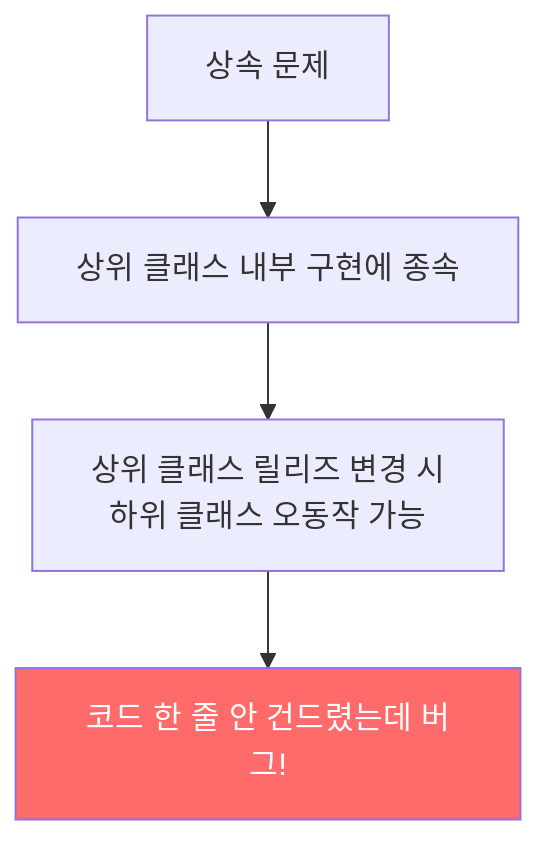
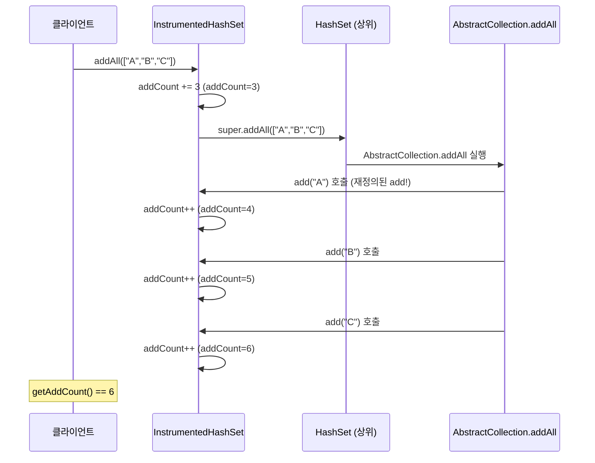
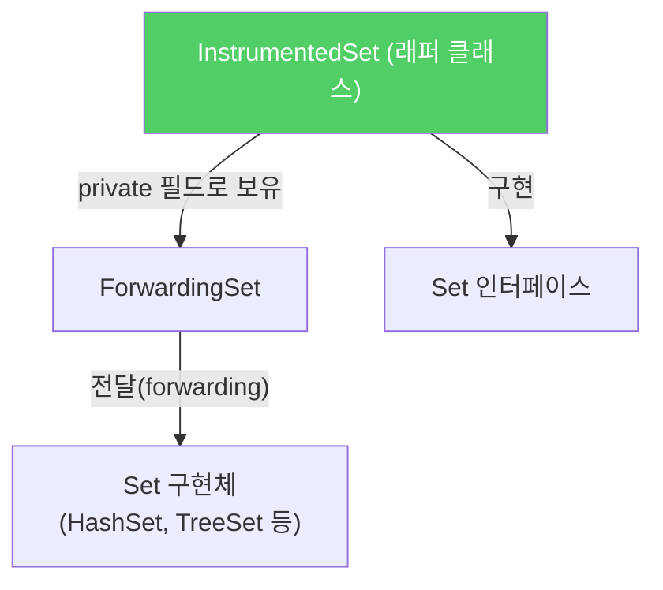
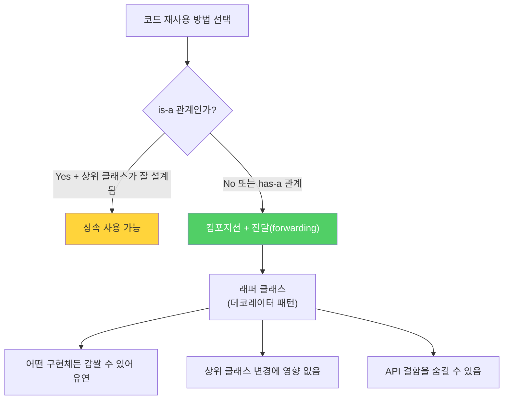

상속은 강력한 코드 재사용 수단이지만, 잘못 사용하면 예상치 못한 버그를 만들어냅니다. 특히 다른 패키지의 구체 클래스를 상속할 때는 상위 클래스의 내부 구현에 종속되어 언제든 깨질 수 있습니다.

---

## 1. 상속이 캡슐화를 어떻게 깨뜨리는가

비유하자면 **다른 회사의 부품을 분해해서 재조립하는 것**과 같습니다. 부품 제조사가 내부 설계를 바꾸면, 그 부품을 재조립한 제품도 오동작합니다. 반면 부품을 그대로 사용(컴포지션)한다면 제조사가 내부를 바꿔도 외부 인터페이스가 유지되는 한 안전합니다.



---

## 2. 상속의 잘못된 예시 — addCount가 6이 되는 이유

`HashSet`을 상속해서 원소 추가 횟수를 세는 클래스를 만들어봅니다.

```java
public class InstrumentedHashSet<E> extends HashSet<E> {
    private int addCount = 0;

    public InstrumentedHashSet() {}

    public InstrumentedHashSet(int initCap, float loadFactor) {
        super(initCap, loadFactor);
    }

    @Override
    public boolean add(E e) {
        addCount++;
        return super.add(e);
    }

    @Override
    public boolean addAll(Collection<? extends E> c) {
        addCount += c.size();
        return super.addAll(c);  // ← 여기서 문제 발생!
    }

    public int getAddCount() { return addCount; }
}

// 테스트
InstrumentedHashSet<String> s = new InstrumentedHashSet<>();
s.addAll(List.of("A", "B", "C"));
System.out.println(s.getAddCount());  // 예상: 3, 실제: 6!
```

**왜 6이 나오는가?**



`HashSet.addAll()`은 내부적으로 `add()`를 반복 호출합니다. 재정의된 `add()`가 매번 `addCount`를 증가시키므로 3 + 3 = 6이 됩니다. 이것이 **자기 사용(self-use)** 문제입니다.

**더 위험한 것:** 이 내부 구현(`addAll`이 `add`를 사용)은 다음 Java 릴리즈에서 바뀔 수 있습니다. 언제든 깨질 수 있는 코드입니다.

---

## 3. 해결책: 컴포지션(Composition)

비유하자면 **부품을 직접 뜯는 게 아니라 기능을 위임(delegation)**하는 것입니다. `HashSet`을 상속하지 않고, `private` 필드로 갖고 있으면서 필요한 메서드를 그냥 전달(forwarding)합니다.



**전달 클래스 (재사용 가능한 기반):**

```java
public class ForwardingSet<E> implements Set<E> {
    private final Set<E> s;  // 컴포지션 — private 필드로 보유

    public ForwardingSet(Set<E> s) { this.s = s; }

    // 모든 Set 메서드를 s에게 전달
    public int size()                               { return s.size(); }
    public boolean isEmpty()                        { return s.isEmpty(); }
    public boolean contains(Object o)               { return s.contains(o); }
    public Iterator<E> iterator()                   { return s.iterator(); }
    public Object[] toArray()                       { return s.toArray(); }
    public <T> T[] toArray(T[] a)                   { return s.toArray(a); }
    public boolean add(E e)                         { return s.add(e); }
    public boolean remove(Object o)                 { return s.remove(o); }
    public boolean containsAll(Collection<?> c)     { return s.containsAll(c); }
    public boolean addAll(Collection<? extends E> c){ return s.addAll(c); }
    public boolean retainAll(Collection<?> c)       { return s.retainAll(c); }
    public boolean removeAll(Collection<?> c)       { return s.removeAll(c); }
    public void clear()                             { s.clear(); }
    @Override public boolean equals(Object o)       { return s.equals(o); }
    @Override public int hashCode()                 { return s.hashCode(); }
    @Override public String toString()              { return s.toString(); }
}
```

**래퍼 클래스 (계측 기능 추가):**

```java
public class InstrumentedSet<E> extends ForwardingSet<E> {
    private int addCount = 0;

    public InstrumentedSet(Set<E> s) {
        super(s);
    }

    @Override
    public boolean add(E e) {
        addCount++;
        return super.add(e);  // ForwardingSet.add → s.add 순서로 전달
    }

    @Override
    public boolean addAll(Collection<? extends E> c) {
        addCount += c.size();
        return super.addAll(c);  // ForwardingSet.addAll → s.addAll
        // s(HashSet)의 addAll이 내부적으로 어떻게 구현돼도 영향 없음!
    }

    public int getAddCount() { return addCount; }
}
```

이제 `addAll(["A","B","C"])`를 호출하면 `addCount`는 정확히 3이 됩니다.

**컴포지션의 추가 이점 — 어떤 Set이든 사용 가능:**

```java
// HashSet 감싸기
Set<String> hs = new InstrumentedSet<>(new HashSet<>());

// TreeSet 감싸기 (자동 정렬)
Set<String> ts = new InstrumentedSet<>(new TreeSet<>());

// LinkedHashSet 감싸기 (삽입 순서 유지)
Set<String> ls = new InstrumentedSet<>(new LinkedHashSet<>());

// 기존 Set에도 바로 적용
Set<String> existing = new HashSet<>(existingData);
Set<String> instrumented = new InstrumentedSet<>(existing);
```

상속 방식이라면 `HashSet`, `TreeSet`, `LinkedHashSet`마다 별도의 하위 클래스를 만들어야 합니다.

---

## 4. 래퍼 클래스의 한계: SELF 문제

래퍼 클래스는 콜백 프레임워크에서 문제가 생길 수 있습니다.

```java
// 내부 객체가 this(자기 자신)를 콜백으로 넘기는 경우
interface Callback { void onEvent(); }

class Inner {
    void register(Callback cb) { ... }
    void trigger() { cb.onEvent(); }  // 콜백 호출
}

class Wrapper {
    private final Inner inner;
    Wrapper(Inner inner) { this.inner = inner; }

    void setup() {
        inner.register(this::handleEvent);
    }
    // 하지만 inner는 Wrapper의 존재를 모르고 Inner 자신을 콜백으로 넘길 수 있음
}
```

이런 콜백 상황을 제외하면 래퍼 클래스의 단점은 거의 없습니다.

---

## 5. 상속은 언제 써야 하는가

**is-a 관계일 때만** 상속을 사용하세요.

```java
// 올바른 상속 — is-a 관계
class Animal { ... }
class Dog extends Animal { ... }  // Dog is an Animal

// 잘못된 상속 — has-a 관계를 상속으로 표현
class Stack<E> extends Vector<E> { ... }
// Stack is NOT a Vector — Stack has a Vector
// Java 표준 라이브러리의 실수 (실제로 Stack은 Vector를 상속함)
```

**상속 전 자문해야 할 질문:**

1. B가 정말로 A인가? (is-a 관계인가?)
2. 확장하려는 클래스의 API에 결함이 없는가?
3. 결함이 있다면 그 결함을 내 API까지 전파해도 되는가?

---

## 6. 요약



> 상속은 강력하지만 캡슐화를 해칩니다. 순수한 is-a 관계일 때만 사용하세요. 상속의 취약점을 피하려면 컴포지션과 전달(forwarding)을 사용하세요. 특히 래퍼 클래스로 구현할 인터페이스가 있다면 컴포지션이 항상 더 낫습니다.

---

> 참조: 이펙티브 자바 3/E — 조슈아 블로크
