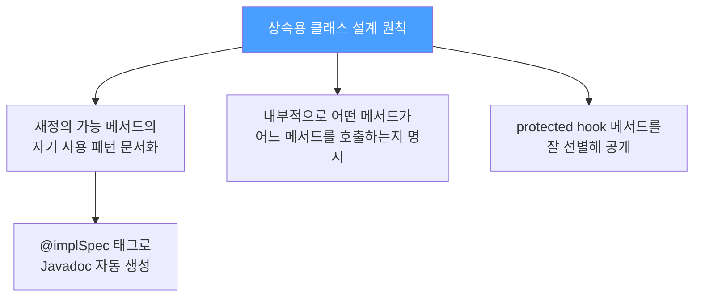
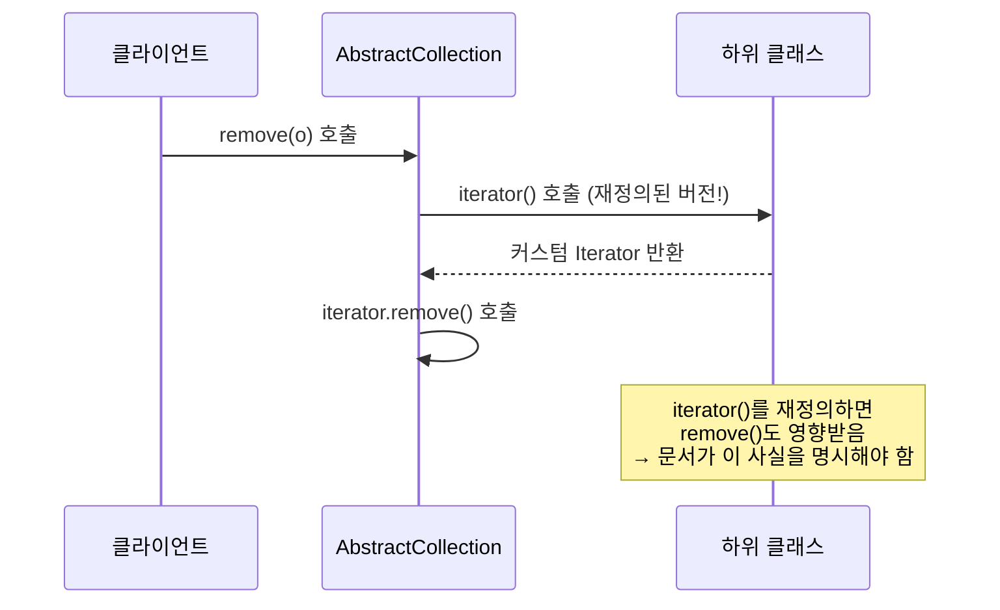
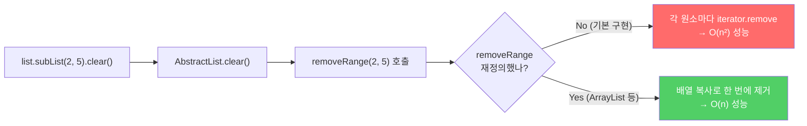
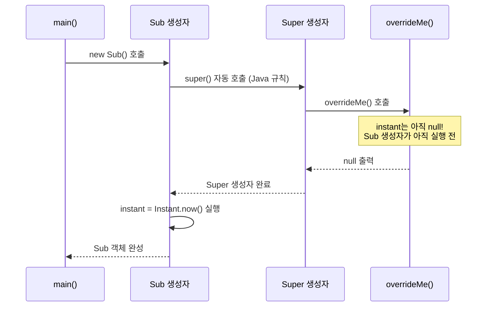
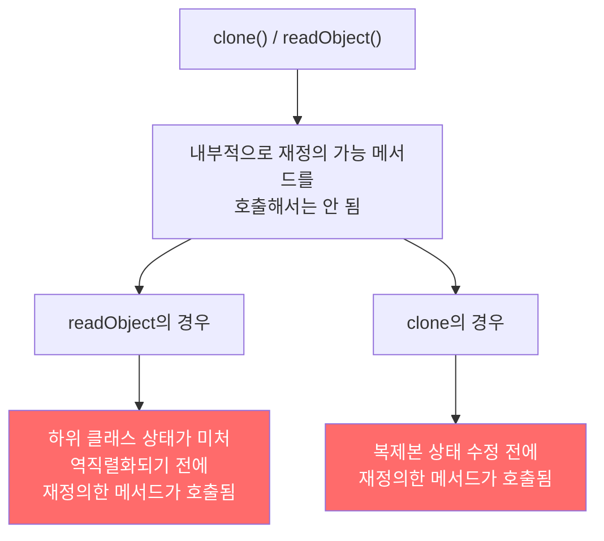
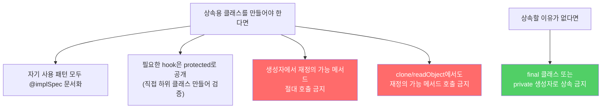

상속은 강력하지만, "무심코" 열어두면 폭탄이 됩니다. 상속을 허용하려면 내부 동작 방식을 철저히 문서화해야 하고, 그게 어렵다면 차라리 상속을 아예 막는 게 낫습니다.

---

## 1. 상속용 클래스에서 문서화가 필요한 이유

비유하자면 **복잡한 기계 부품의 설계 도면**입니다. 도면(문서) 없이 부품을 개조하면, 개조자가 내부 연결 구조를 모른 채 한 곳을 건드렸다가 전혀 다른 곳이 망가집니다. 상속도 마찬가지입니다.



핵심 원칙: **재정의 가능한 메서드를 내부에서 어떻게 사용하는지(자기 사용, self-use)를 반드시 문서로 남겨야 합니다.**

---

## 2. @implSpec — 내부 구현 방식을 문서화하는 방법

`AbstractCollection.remove()`의 실제 Javadoc을 봅시다.

```java
/**
 * 주어진 원소가 이 컬렉션 안에 있다면 그 인스턴스 하나를 제거합니다.
 *
 * @implSpec
 * 이 메서드는 컬렉션을 순회하며 주어진 원소를 찾도록 구현되었습니다.
 * 주어진 원소를 찾으면 반복자의 remove 메서드를 사용해 제거합니다.
 * 이 컬렉션의 iterator()가 반환한 반복자가 remove를 구현하지 않았다면
 * UnsupportedOperationException을 던집니다.
 */
public boolean remove(Object o) { ... }
```

이 문서를 통해 알 수 있는 것: **`iterator()` 메서드를 재정의하면 `remove()` 동작이 바뀝니다.** 이 관계가 문서에 명시되어 있으므로 하위 클래스 작성자가 안전하게 설계할 수 있습니다.



**만약 이걸 문서화하지 않으면?** 하위 클래스 작성자는 `iterator()`를 재정의했을 때 `remove()`까지 영향받는다는 것을 모릅니다. 다음 Java 릴리즈에서 `remove()`의 내부 구현이 바뀌면 하위 클래스가 갑자기 오동작할 수 있습니다.

---

## 3. 훅(Hook) 메서드 — protected로 내부 진입점 제공

비유하자면 **공장 라인의 점검구**입니다. 외부에서 라인 전체를 교체할 수 없지만, 설계자가 미리 만들어둔 점검구를 통해서는 특정 부분만 교체할 수 있습니다.

`AbstractList.removeRange()`가 대표적인 예입니다.

```java
/**
 * fromIndex(포함)부터 toIndex(미포함)까지의 원소를 모두 제거합니다.
 *
 * @implSpec
 * fromIndex에서 시작하는 리스트 반복자를 얻어 모든 원소를 제거할 때까지
 * ListIterator.next와 ListIterator.remove를 반복 호출합니다.
 * 주의: ListIterator.remove가 선형 시간이 걸리면 이 구현의 성능은 제곱에 비례합니다.
 */
protected void removeRange(int fromIndex, int toIndex) { ... }
```

`List` 최종 사용자는 `removeRange()`를 직접 호출하지 않습니다. 그런데 왜 `protected`로 공개했을까요?



`removeRange()`가 없었다면, `clear()`를 최적화하려는 하위 클래스가 밑바닥부터 다시 구현해야 했습니다.

**어떤 메서드를 protected로 노출할지는 어떻게 결정하나?** 정해진 공식은 없습니다. 직접 하위 클래스를 여러 개 만들어보는 것이 유일한 방법입니다. protected 메서드를 만들었는데 하위 클래스에서 한 번도 쓰이지 않는다면 `private`이었어야 합니다.

---

## 4. 상속용 클래스의 가장 큰 함정 — 생성자에서 재정의 가능 메서드 호출

이것이 가장 흔하고 치명적인 실수입니다.

```java
// 잘못된 설계 — 생성자에서 재정의 가능 메서드 호출!
public class Super {
    public Super() {
        overrideMe();  // 위험!
    }

    public void overrideMe() { }
}
```

```java
public final class Sub extends Super {
    private final Instant instant;

    Sub() {
        // super() 생성자가 먼저 실행됨 → overrideMe() 호출됨
        // 그 시점에 instant는 아직 null!
        instant = Instant.now();  // 이후에 실행됨
    }

    @Override
    public void overrideMe() {
        System.out.println(instant);  // 첫 번째 호출 시 null 출력!
    }

    public static void main(String[] args) {
        Sub sub = new Sub();
        sub.overrideMe();  // 두 번째 호출은 정상 출력
    }
}
// 출력: null
//       2024-01-01T12:00:00Z
```

**왜 이런 일이 생기나?**



상위 클래스 생성자가 **항상 하위 클래스 생성자보다 먼저** 실행됩니다. 생성자에서 재정의 가능한 메서드를 호출하면, 하위 클래스의 초기화가 끝나기 전에 그 메서드가 실행됩니다.

> `private`, `final`, `static` 메서드는 재정의가 불가능하므로 생성자에서 안전하게 호출할 수 있습니다.

---

## 5. Cloneable과 Serializable — 상속을 더 어렵게 만드는 인터페이스

`clone()`과 `readObject()`는 생성자와 유사합니다. 새 객체를 만들기 때문입니다. 따라서 동일한 규칙이 적용됩니다.



또한, `Serializable`을 구현하는 상속용 클래스에 `readResolve()`나 `writeReplace()` 메서드가 있다면 반드시 `protected`로 선언해야 합니다. `private`으로 선언하면 하위 클래스에서 무시됩니다.

---

## 6. 상속을 허용할 명분이 없다면 — 상속을 금지하라

상속을 위해 설계하지 않은 클래스는 상속을 막는 것이 최선입니다.

**방법 1: final 클래스로 선언**

```java
public final class MyClass {
    // 아무도 이 클래스를 상속할 수 없음
}
```

**방법 2: 모든 생성자를 private/package-private으로 + 정적 팩토리**

```java
public class MyClass {
    private MyClass() { }  // 외부에서 상속 불가 (생성자 접근 불가)

    public static MyClass create() {
        return new MyClass();
    }
}
```

**상속을 꼭 허용해야 하는데 상속용으로 설계되지 않은 클래스라면?** 재정의 가능 메서드의 자기 사용을 없애는 방법이 있습니다.

```java
public class Base {
    // 재정의 가능한 메서드의 실제 로직을 private 도우미로 분리
    private void doSomethingHelper() {
        // 실제 로직
    }

    // 재정의 가능한 메서드는 private 도우미를 호출
    public void doSomething() {
        doSomethingHelper();
    }

    // 생성자에서는 private 도우미를 호출 — 재정의 가능 메서드 호출 X
    public Base() {
        doSomethingHelper();  // 안전
    }
}
```

---

## 7. 요약



**체크리스트:**
1. 재정의 가능 메서드가 내부에서 다른 메서드를 호출하나? → `@implSpec`으로 문서화
2. 생성자, `clone()`, `readObject()`에서 재정의 가능 메서드를 호출하나? → 즉시 제거
3. 상속이 꼭 필요한 클래스인가? 아니라면 `final`로 선언
4. 하위 클래스를 직접 만들어서 protected 메서드 설계를 검증했나?

---

> 참조: 이펙티브 자바 3/E — 조슈아 블로크
