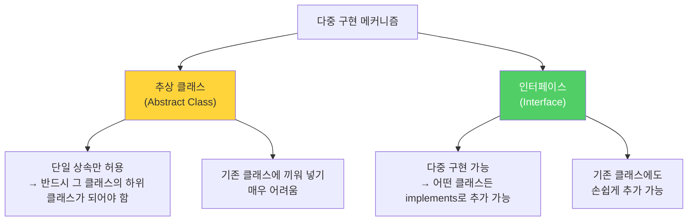
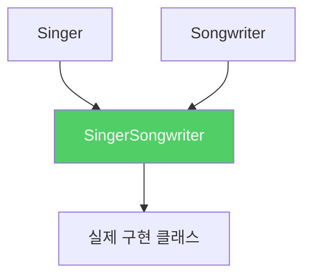
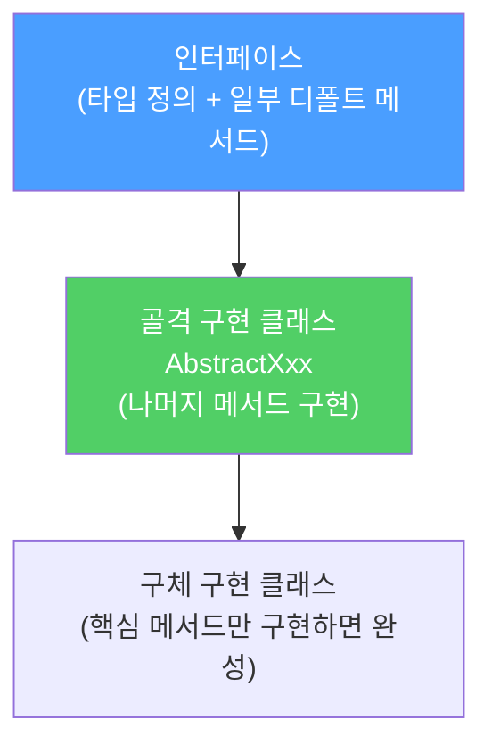
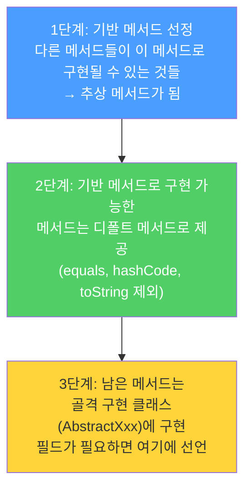
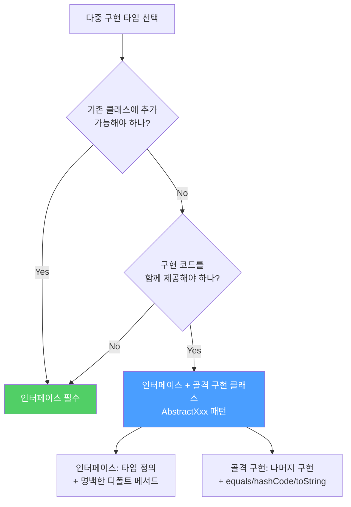

자바에서 다중 구현을 제공하는 방법은 인터페이스와 추상 클래스, 두 가지입니다. 둘 다 기능이 있는데 왜 인터페이스가 더 나을까요? 그리고 둘의 장점을 모두 취하는 방법은 없을까요?

---

## 1. 추상 클래스 vs 인터페이스 — 결정적 차이

비유하자면 **추상 클래스는 혈통, 인터페이스는 자격증**입니다. 혈통(추상 클래스)을 가지려면 그 가문(상속 계층)에 속해야 합니다. 자격증(인터페이스)은 어느 가문 출신이든 따로 취득할 수 있습니다.



자바는 단일 상속만 지원하기 때문에, 추상 클래스 방식으로는 이미 다른 클래스를 상속한 클래스에 새 타입을 추가할 수 없습니다.

---

## 2. 인터페이스의 세 가지 강점

### 강점 1: 기존 클래스에도 손쉽게 추가

인터페이스는 기존 클래스에 아무 영향 없이 끼워 넣을 수 있습니다.

```java
// 기존 클래스에 인터페이스 추가 — 간단!
class MyValue implements Comparable<MyValue>, Serializable {
    // Comparable 요구 메서드만 구현하면 됨
    @Override
    public int compareTo(MyValue other) { ... }
}
```

반면 추상 클래스는 이미 다른 클래스를 상속한 클래스에 끼워 넣을 수 없습니다.

```java
// 이미 Base를 상속 중인 클래스에 추상 클래스를 추가할 방법이 없음
class MyValue extends Base /*, AbstractMyValue — 불가! */ {
}
```

Java 표준 라이브러리도 `Comparable`, `Iterable`, `AutoCloseable`이 추가되었을 때 기존 수많은 클래스가 이 인터페이스들을 구현한 채 릴리즈될 수 있었던 이유가 이 덕분입니다.

### 강점 2: 믹스인(Mixin) 정의에 최적

믹스인이란 주된 타입 외에 선택적 기능을 선언하는 타입입니다.

```java
// Singer는 주된 타입
public interface Singer {
    AudioClip sing(Song s);
}

// Comparable은 믹스인 — "나는 순서 비교가 가능합니다" 선언
public class Musician implements Singer, Comparable<Musician> {
    @Override public AudioClip sing(Song s) { ... }
    @Override public int compareTo(Musician other) { ... }
}
```

추상 클래스로는 믹스인을 정의할 수 없습니다. 이미 상속 계층에 속해 있어야 하는데, 클래스는 두 부모를 가질 수 없기 때문입니다.

### 강점 3: 계층 구조 없는 타입 프레임워크

현실에는 계층을 엄격히 구분하기 어려운 개념들이 있습니다.

```java
public interface Singer {
    AudioClip sing(Song s);
}

public interface Songwriter {
    Song compose(int chartPosition);
}

// 싱어송라이터 — Singer이기도 하고 Songwriter이기도 함
public interface SingerSongwriter extends Singer, Songwriter {
    AudioClip strum();
    void actSensitive();
}
```



추상 클래스로 같은 구조를 만들려면 조합마다 별도 클래스가 필요합니다.

```
Singer, Songwriter, SingerSongwriter
→ 속성이 n개라면 2ⁿ개의 조합 클래스가 필요한 "조합 폭발" 발생
```

---

## 3. 디폴트 메서드 — 인터페이스에서 구현 제공하기

Java 8부터 인터페이스도 구현을 가진 메서드를 제공할 수 있습니다.

```java
public interface Collection<E> {
    // 추상 메서드
    int size();
    boolean contains(Object o);

    // 디폴트 메서드 — 구현 제공
    default boolean isEmpty() {
        return size() == 0;  // size()를 이용해 기본 구현 제공
    }

    default void forEach(Consumer<? super E> action) {
        Objects.requireNonNull(action);
        for (E e : this) {
            action.accept(e);
        }
    }
}
```

구현 방법이 명백한 메서드는 디폴트 메서드로 제공해 구현 클래스의 부담을 줄일 수 있습니다. 디폴트 메서드를 제공할 때는 `@implSpec`으로 문서화해야 합니다.

**디폴트 메서드의 제약:**
- `equals`, `hashCode`, `toString` 같은 `Object` 메서드는 디폴트로 제공 불가
- 인스턴스 필드를 가질 수 없음
- `public`이 아닌 정적 멤버 불가 (단, `private` 정적 메서드는 Java 9부터 허용)
- 직접 만들지 않은 인터페이스에는 디폴트 메서드 추가 불가

---

## 4. 골격 구현 클래스(Skeletal Implementation) — 인터페이스 + 추상 클래스의 장점 결합

비유하자면 **IKEA 가구**입니다. 인터페이스는 완성품의 명세(조립 방법), 골격 구현 클래스는 반조립 상태의 부품입니다. 골격 구현을 상속하면 남은 작업이 최소화됩니다.



관례상 인터페이스 이름이 `Interface`라면 골격 구현 클래스는 `AbstractInterface`로 짓습니다.

- `Collection` → `AbstractCollection`
- `List` → `AbstractList`
- `Set` → `AbstractSet`
- `Map` → `AbstractMap`

**골격 구현을 활용한 List 어댑터 예시:**

```java
// int 배열을 List<Integer>로 감싸기
static List<Integer> intArrayAsList(int[] a) {
    Objects.requireNonNull(a);

    return new AbstractList<>() {
        @Override
        public Integer get(int i) {
            return a[i];  // 오토박싱
        }

        @Override
        public Integer set(int i, Integer val) {
            int oldVal = a[i];
            a[i] = val;  // 오토언박싱
            return oldVal;
        }

        @Override
        public int size() {
            return a.length;
        }
    };
}
```

`AbstractList`가 이미 `iterator()`, `contains()`, `indexOf()`, `subList()` 등 수십 개의 메서드를 구현해 두었기 때문에, 위 코드는 `get()`과 `size()` (그리고 선택적으로 `set()`)만 구현하면 완전한 `List`가 됩니다.

---

## 5. 골격 구현 클래스 작성법



**Map.Entry 골격 구현 예시:**

```java
public abstract class AbstractMapEntry<K, V> implements Map.Entry<K, V> {

    // 기반 메서드 — 반드시 하위 클래스가 구현
    @Override public abstract K getKey();
    @Override public abstract V getValue();

    // 변경 가능 엔트리는 재정의 필요 (선택적 기반 메서드)
    @Override
    public V setValue(V value) {
        throw new UnsupportedOperationException();
    }

    // Object 메서드는 디폴트로 제공 불가 → 골격 구현 클래스에서 직접 구현
    @Override
    public boolean equals(Object obj) {
        if (obj == this) return true;
        if (!(obj instanceof Map.Entry)) return false;
        Map.Entry<?, ?> e = (Map.Entry<?, ?>) obj;
        return Objects.equals(e.getKey(), getKey())
            && Objects.equals(e.getValue(), getValue());
    }

    @Override
    public int hashCode() {
        return Objects.hashCode(getKey()) ^ Objects.hashCode(getValue());
    }

    @Override
    public String toString() {
        return getKey() + "=" + getValue();
    }
}
```

`getKey()`와 `getValue()`가 기반 메서드이고, `equals`/`hashCode`/`toString`은 `Object` 메서드이므로 디폴트로 제공할 수 없어 골격 구현 클래스에 작성했습니다.

---

## 6. 시뮬레이트한 다중 상속

골격 구현을 직접 상속할 수 없는 상황(이미 다른 클래스를 상속 중)에서도 우회할 수 있습니다.

```java
// 이미 OtherBase를 상속 중이어서 골격 구현을 직접 상속 불가
public class MyList extends OtherBase implements List<Integer> {

    // 골격 구현을 private 내부 클래스로 우회 활용
    private class InnerAbstractList extends AbstractList<Integer> {
        @Override public Integer get(int i) { return MyList.this.get(i); }
        @Override public int size() { return MyList.this.size(); }
    }

    private final InnerAbstractList delegate = new InnerAbstractList();

    // List 메서드들은 delegate에 전달
    @Override public Iterator<Integer> iterator() { return delegate.iterator(); }
    @Override public boolean contains(Object o) { return delegate.contains(o); }
    // ...
}
```

이를 **시뮬레이트한 다중 상속(simulated multiple inheritance)**이라 합니다. 다중 상속의 장점을 누리면서 단점(복잡성, 다이아몬드 문제)은 피할 수 있습니다.

---

## 7. 요약



> 일반적으로 다중 구현용 타입에는 인터페이스가 가장 적합합니다. 복잡한 인터페이스라면 `AbstractXxx` 형태의 골격 구현 클래스를 함께 제공해 구현 부담을 줄여주세요. 골격 구현은 가능한 한 인터페이스의 디폴트 메서드로 제공하되, 인터페이스 제약상 불가능하다면 추상 클래스로 제공하세요.

---

> 참조: 이펙티브 자바 3/E — 조슈아 블로크
