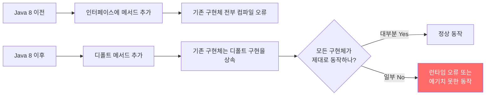
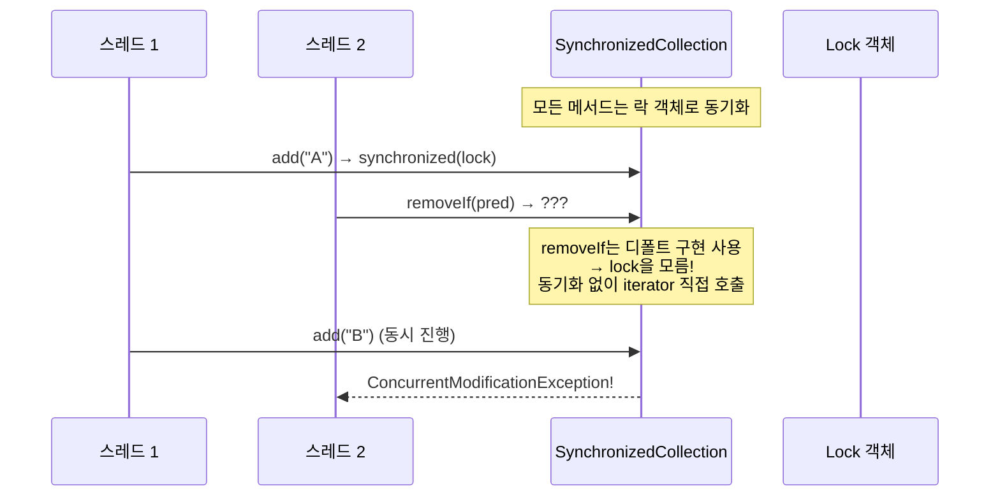
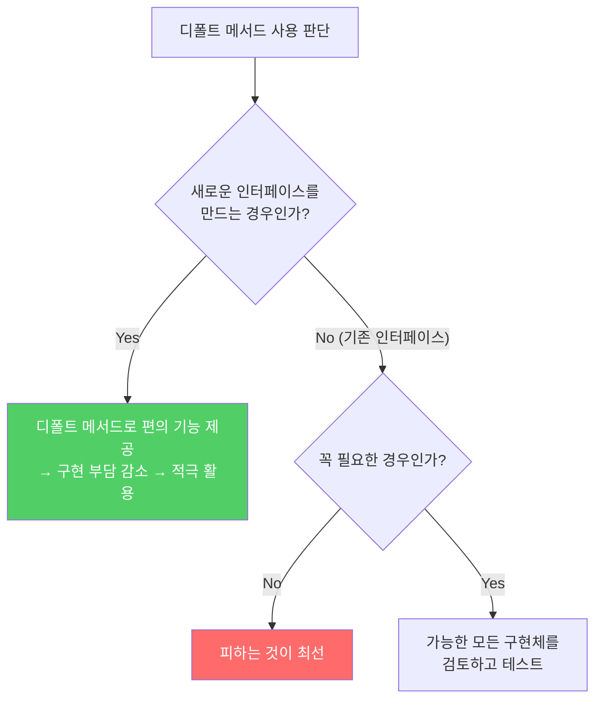
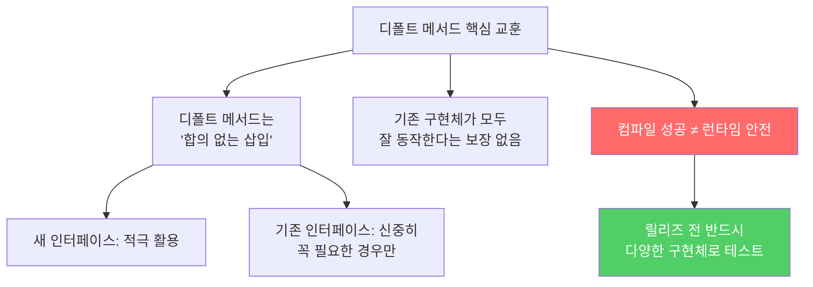

Java 8에서 디폴트 메서드가 추가되면서 기존 인터페이스에 메서드를 추가할 수 있게 됐습니다. 하지만 이것이 "안전하다"는 뜻은 아닙니다. 디폴트 메서드는 기존 구현체에 몰래 삽입되는 코드입니다.

---

## 1. 디폴트 메서드가 등장하기 전의 세계

비유하자면 **건물 설계 확정 후 벽을 추가하는 것**입니다. 기존 인터페이스는 "계약서"이고, 이미 수많은 구현체가 그 계약서를 기반으로 작성됐습니다. Java 8 이전에는 인터페이스에 메서드를 추가하면 그 인터페이스를 구현한 모든 클래스가 컴파일 오류가 났습니다.



디폴트 메서드는 **구현 클래스에 대해 아무것도 모른 채 합의 없이 무작정 삽입**됩니다. Java 7까지의 모든 구현체는 "현재 인터페이스에 새 메서드가 추가될 일은 영원히 없다"고 가정하고 작성됐습니다.

---

## 2. 실제 사례 — removeIf와 SynchronizedCollection의 충돌

Java 8에서 `Collection` 인터페이스에 추가된 `removeIf` 디폴트 메서드를 봅시다.

```java
// Java 8에서 Collection 인터페이스에 추가된 디폴트 메서드
default boolean removeIf(Predicate<? super E> filter) {
    Objects.requireNonNull(filter);
    boolean removed = false;
    final Iterator<E> each = iterator();
    while (each.hasNext()) {
        if (filter.test(each.next())) {
            each.remove();
            removed = true;
        }
    }
    return removed;
}
```

이 구현은 범용적으로 잘 작성됐습니다. 하지만 아파치 커먼즈의 `SynchronizedCollection`과 충돌합니다.



`SynchronizedCollection`은 모든 메서드 호출을 락으로 동기화합니다. 하지만 `removeIf`의 디폴트 구현은 락에 대해 아무것도 모릅니다. 그래서 멀티스레드 환경에서 `removeIf`를 호출하면 `ConcurrentModificationException`이 발생하거나 데이터가 손상됩니다.

**만약 이걸 모르고 쓰면?** 단일 스레드 테스트에서는 멀쩡히 동작하다가, 프로덕션 멀티스레드 환경에서만 간헐적으로 예외가 터집니다. 재현하기도 어렵고 디버깅하기도 어렵습니다.

자바 플랫폼 라이브러리는 이 문제를 `Collections.synchronizedCollection()`에서 `removeIf`를 직접 재정의해서 해결했습니다.

```java
// java.util.Collections.SynchronizedCollection — 재정의로 문제 해결
@Override
public boolean removeIf(Predicate<? super E> filter) {
    synchronized (mutex) {  // 락을 알고 있으므로 직접 동기화
        return c.removeIf(filter);
    }
}
```

---

## 3. 디폴트 메서드 사용 규칙



**디폴트 메서드로 절대 하면 안 되는 것:**
- 기존 메서드를 제거하거나 시그니처를 수정하는 용도
  - 이런 변경은 기존 클라이언트를 반드시 망가뜨립니다

**디폴트 메서드가 유용한 경우:**
- 새 인터페이스에 표준적인 메서드 구현 제공 (구현자의 일감을 줄임)
- 골격 구현 클래스와 함께 활용

---

## 4. 인터페이스 릴리즈 전 테스트가 중요한 이유

```java
// 예: 새 인터페이스를 릴리즈 전에 최소 3개의 구현체를 만들어 테스트
public interface MyService {
    void process(String input);

    default String processAndReturn(String input) {
        process(input);
        return "done";  // 이 기본 구현이 모든 구현체에 맞는가?
    }
}

// 구현체 1: 일반 구현
class BasicService implements MyService { ... }

// 구현체 2: 동기화가 필요한 구현
class SynchronizedService implements MyService {
    @Override
    public String processAndReturn(String input) {
        synchronized (this) {  // 디폴트 구현은 동기화를 모름 → 재정의 필요
            process(input);
            return "done";
        }
    }
}

// 구현체 3: 다른 제약이 있는 구현
class ReadOnlyService implements MyService { ... }
```

**인터페이스를 릴리즈한 후에는 결함을 수정하기가 훨씬 어렵습니다.** 수정하면 기존 구현체가 깨질 수 있기 때문입니다.

---

## 5. 요약



> 디폴트 메서드라는 도구가 생겼더라도 인터페이스를 설계할 때는 세심한 주의가 필요합니다. 새로운 인터페이스라면 릴리즈 전에 반드시 최소 3개의 구현체로 테스트하세요. 릴리즈 후 결함 수정 가능성에 기대서는 안 됩니다.

---

> 참조: 이펙티브 자바 3/E — 조슈아 블로크
