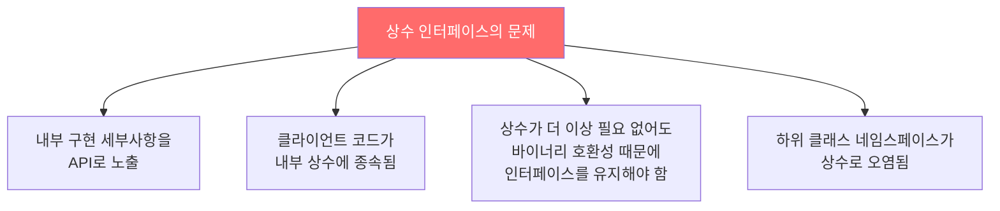
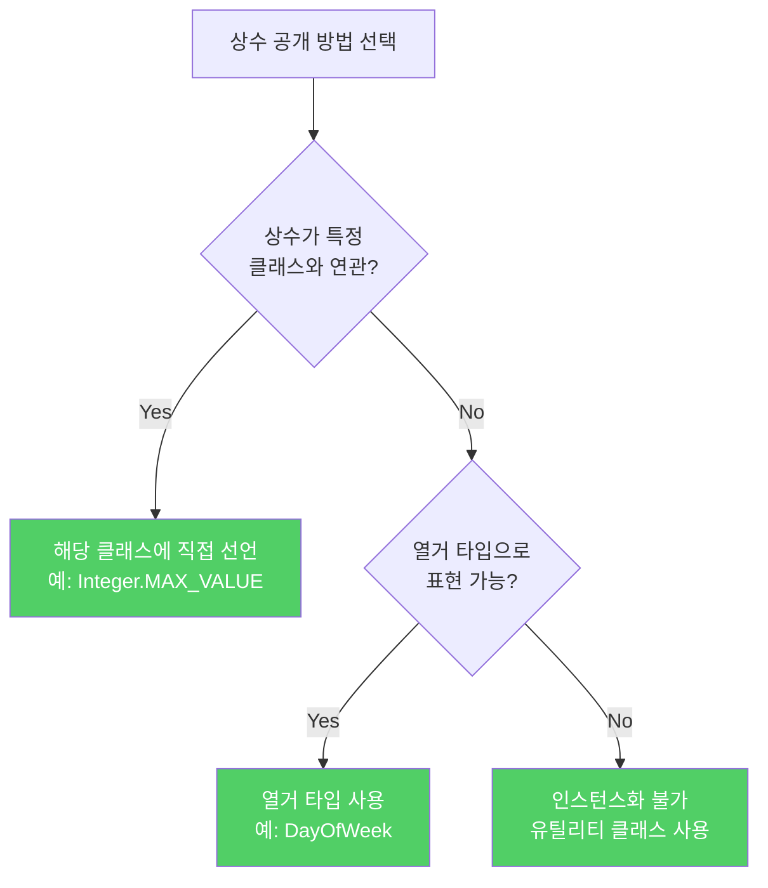
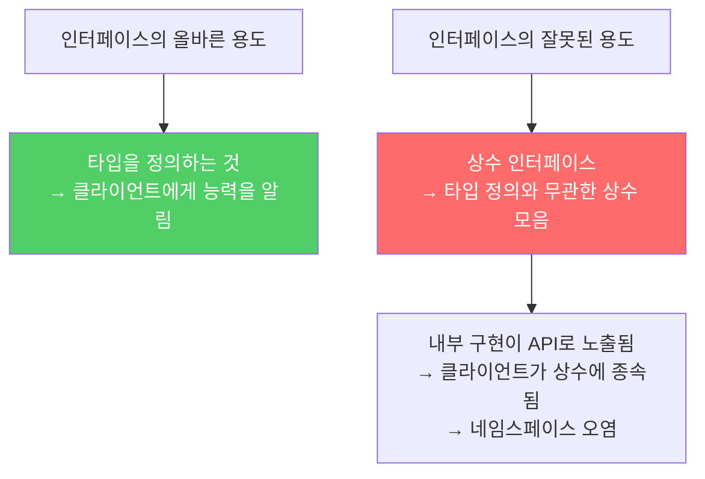

인터페이스는 "이 클래스가 무엇을 할 수 있는가"를 클라이언트에게 알려주는 타입 역할을 합니다. 그런데 이 목적과 전혀 다른 용도로 오용되는 패턴이 있습니다. 바로 상수 인터페이스입니다.

---

## 1. 인터페이스의 올바른 역할

비유하자면 **명함**입니다. 명함은 "저는 의사입니다", "저는 변호사입니다"처럼 그 사람이 무엇을 할 수 있는지를 알려줍니다. 인터페이스도 마찬가지로 "이 객체는 Comparable(비교 가능)합니다", "이 객체는 Serializable(직렬화 가능)합니다"처럼 능력을 선언합니다.

```java
// 올바른 인터페이스 용도 — 타입 정의
public interface Flyable {
    void fly();  // "나는 날 수 있습니다"
}

public interface Comparable<T> {
    int compareTo(T o);  // "나는 비교될 수 있습니다"
}
```

---

## 2. 상수 인터페이스 — 인터페이스를 잘못 사용한 안티패턴

```java
// 안티패턴 — 상수 인터페이스
public interface PhysicalConstants {
    static final double AVOGADROS_NUMBER   = 6.022_140_857e23;
    static final double BOLTZMANN_CONSTANT = 1.380_648_52e-23;
    static final double ELECTRON_MASS      = 9.109_383_56e-31;
}

// 이 상수들을 쓰려고 인터페이스를 구현
public class Chemistry implements PhysicalConstants {
    public double calculateEnergy(double temp) {
        return BOLTZMANN_CONSTANT * temp;  // 정규화 이름 없이 직접 사용
    }
}
```



**만약 이 패턴을 쓰면?** `Chemistry` 클래스의 사용자는 `PhysicalConstants` 인터페이스를 구현한다는 사실을 API를 통해 알게 됩니다. 이건 `Chemistry`가 실제로 "물리 상수가 되겠다"고 선언하는 것과 같습니다. 말이 안 됩니다. 그리고 `Chemistry`를 상속하는 모든 하위 클래스의 네임스페이스도 상수들로 오염됩니다.

---

## 3. 상수를 공개하는 올바른 방법 세 가지

### 방법 1: 관련 클래스나 인터페이스에 직접 추가

```java
// 박싱 클래스에 관련 상수 선언 — 올바른 방법
public final class Integer {
    public static final int MIN_VALUE = -2147483648;
    public static final int MAX_VALUE =  2147483647;
}

// 사용
int max = Integer.MAX_VALUE;
```

상수가 특정 클래스와 강하게 연관된다면 그 클래스에 두는 것이 자연스럽습니다.

### 방법 2: 열거 타입

```java
// 열거 타입으로 관련 상수 묶기
public enum DayOfWeek {
    MONDAY, TUESDAY, WEDNESDAY, THURSDAY, FRIDAY, SATURDAY, SUNDAY
}
```

열거 타입으로 나타내기 적합한 상수라면 열거 타입을 사용하세요.

### 방법 3: 인스턴스화 불가 유틸리티 클래스

```java
// 올바른 방법 — 유틸리티 클래스에 상수 모음
public class PhysicalConstants {
    private PhysicalConstants() { }  // 인스턴스화 방지

    // 아보가드로 수 (1/몰)
    public static final double AVOGADROS_NUMBER   = 6.022_140_857e23;
    // 볼츠만 상수 (J/K)
    public static final double BOLTZMANN_CONSTANT = 1.380_648_52e-23;
    // 전자 질량 (kg)
    public static final double ELECTRON_MASS      = 9.109_383_56e-31;
}
```

```java
// 사용 — 정규화된 이름으로 명확하게 접근
double energy = PhysicalConstants.BOLTZMANN_CONSTANT * temp;

// 자주 쓴다면 static import로 편의 제공
import static com.example.PhysicalConstants.*;
double energy = BOLTZMANN_CONSTANT * temp;
```



---

## 4. 숫자 리터럴의 가독성 팁 — 밑줄(_) 활용

예시 코드에 사용된 밑줄에 주목하세요.

```java
// 밑줄 없이 — 읽기 어려움
static final double AVOGADROS_NUMBER = 6.022140857e23;

// 밑줄 있음 — 훨씬 읽기 편함 (Java 7+)
static final double AVOGADROS_NUMBER = 6.022_140_857e23;

// 정수 리터럴도 동일
static final int ONE_BILLION = 1_000_000_000;
static final long CREDIT_CARD_NUMBER = 1234_5678_9012_3456L;
```

밑줄은 숫자 값에 아무 영향을 주지 않으면서 읽기 훨씬 편하게 만들어줍니다. 5자리 이상의 숫자 리터럴이라면 밑줄 사용을 고려하세요.

---

## 5. 요약



> 인터페이스는 반드시 타입을 정의하는 용도로만 사용하세요. 상수 공개 목적으로는 해당 클래스에 직접 선언하거나, 열거 타입이나 인스턴스화 불가 유틸리티 클래스를 사용하세요.

---

> 참조: 이펙티브 자바 3/E — 조슈아 블로크
