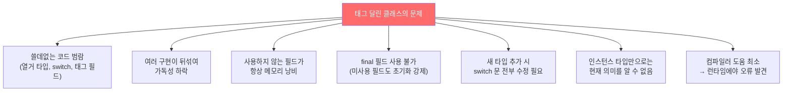
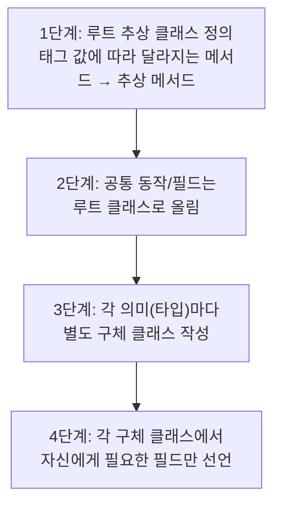
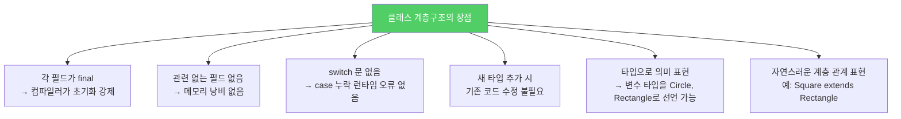
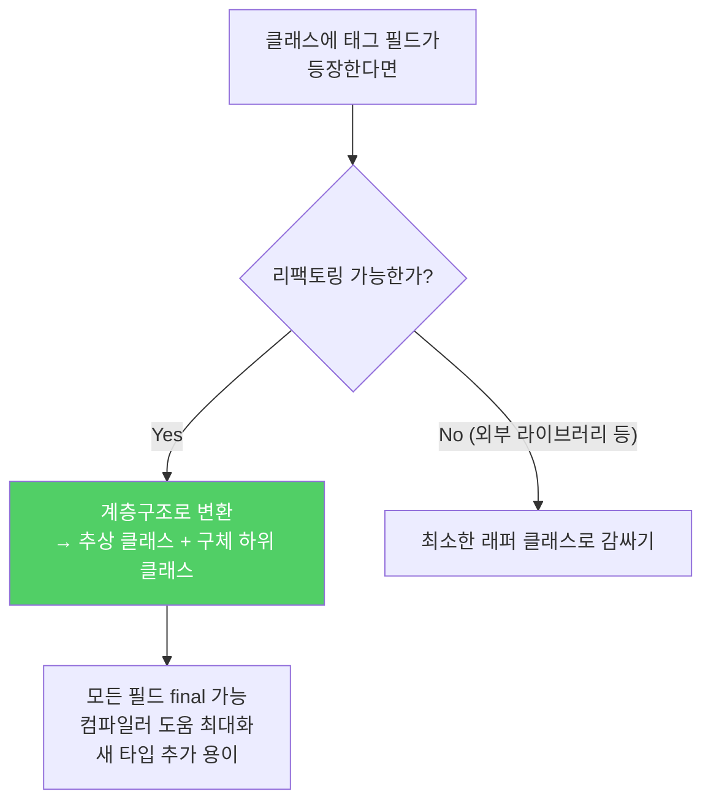

하나의 클래스가 switch 문과 태그 필드를 이용해 여러 종류의 동작을 구분한다면, 그건 클래스 계층구조를 어설프게 흉내 낸 것입니다. 훨씬 더 나은 방법이 있습니다.

---

## 1. 태그 달린 클래스란?

비유하자면 **하나의 서랍에 각기 다른 물건을 레이블을 붙여 넣어두는 것**입니다. 서랍을 열 때마다 레이블을 확인해서 어떤 물건인지 파악해야 하고, 물건 종류가 늘어날수록 서랍도 복잡해집니다. 각 물건을 별도 서랍(클래스)에 나눠 넣는 것이 훨씬 명확합니다.

```java
// 태그 달린 클래스 — 두 종류의 도형을 하나의 클래스로 처리
public class Figure {
    enum Shape { RECTANGLE, CIRCLE }

    // 태그 필드 — 현재 어떤 도형인지 나타냄
    private Shape shape;

    // 사각형일 때만 사용
    private double length;
    private double width;

    // 원일 때만 사용
    private double radius;

    public Figure(double radius) {          // 원용 생성자
        shape = Shape.CIRCLE;
        this.radius = radius;
    }

    public Figure(double length, double width) {  // 사각형용 생성자
        shape = Shape.RECTANGLE;
        this.length = length;
        this.width = width;
    }

    public double area() {
        switch (shape) {
            case RECTANGLE: return length * width;
            case CIRCLE:    return Math.PI * (radius * radius);
            default:        throw new AssertionError(shape);
        }
    }
}
```

---

## 2. 태그 달린 클래스의 문제점



예를 들어 삼각형 타입을 추가한다면?

```java
// 삼각형 추가 — 모든 switch 문을 찾아다니며 수정해야 함
enum Shape { RECTANGLE, CIRCLE, TRIANGLE }  // 추가

// area() switch에도 추가
case TRIANGLE: return 0.5 * base * height;
// 실수로 한 곳이라도 빠뜨리면? → 런타임에 AssertionError!
```

---

## 3. 클래스 계층구조로 변환하는 방법



```java
// 루트 추상 클래스 — 공통 추상 메서드만 선언
public abstract class Figure {
    abstract double area();
}

// 원 — 자신에게 필요한 필드(radius)만 가짐
public class Circle extends Figure {
    final double radius;

    public Circle(double radius) {
        this.radius = radius;
    }

    @Override
    double area() {
        return Math.PI * (radius * radius);
    }
}

// 사각형 — 자신에게 필요한 필드(length, width)만 가짐
public class Rectangle extends Figure {
    final double length;
    final double width;

    public Rectangle(double length, double width) {
        this.length = length;
        this.width = width;
    }

    @Override
    double area() {
        return length * width;
    }
}
```

삼각형 추가도 간단합니다:

```java
// 새 타입 추가 — 기존 코드 수정 없음!
public class Triangle extends Figure {
    final double base;
    final double height;

    public Triangle(double base, double height) {
        this.base = base;
        this.height = height;
    }

    @Override
    double area() {
        return 0.5 * base * height;
    }
}
```

---

## 4. 계층구조의 장점



```java
// 타입으로 의미를 명확히 표현 가능
Figure f1 = new Circle(5.0);
Figure f2 = new Rectangle(3.0, 4.0);

// 특정 의미만 매개변수로 받을 수 있음
void drawCircle(Circle c) { ... }  // Circle만 받음
void drawShape(Figure f) { ... }   // 모든 도형 받음

// 계층 확장도 자연스러움
public class Square extends Rectangle {
    public Square(double side) {
        super(side, side);
    }
}
```

---

## 5. 요약



> 태그 달린 클래스를 써야 할 상황은 거의 없습니다. 새로운 클래스를 작성하는 데 태그 필드가 등장한다면, 태그를 없애고 계층구조로 대체하는 방법을 먼저 생각하세요. 기존 클래스가 태그 필드를 사용하고 있다면 계층구조로 리팩토링하는 것을 고민해보세요.

---

> 참조: 이펙티브 자바 3/E — 조슈아 블로크
