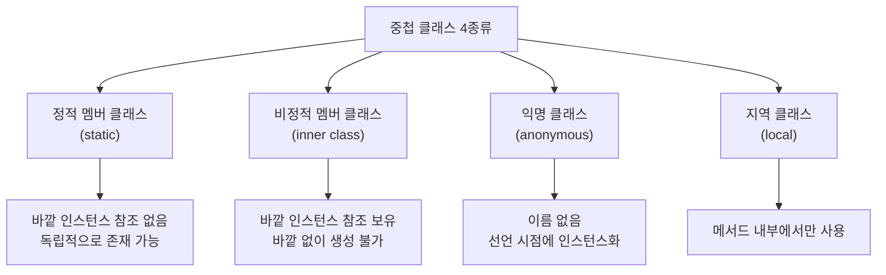
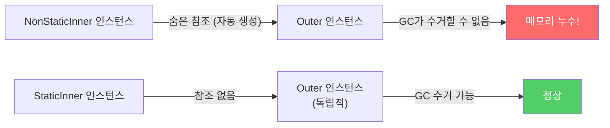
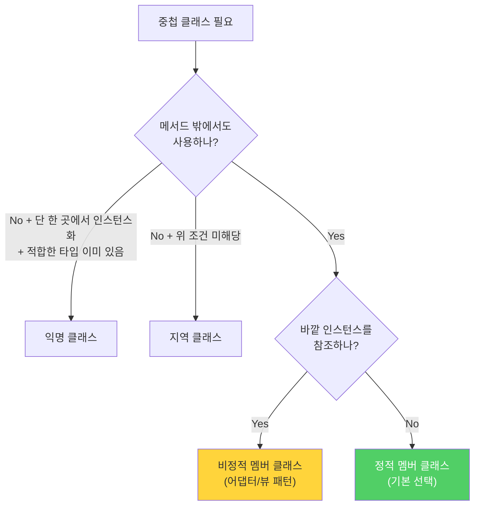

클래스 안에 클래스를 정의하는 중첩 클래스는 네 종류가 있습니다. 그 중 가장 흔하게 실수하는 부분이 비정적 멤버 클래스입니다. `static`을 붙이지 않으면 조용히 메모리 누수가 생깁니다.

---

## 1. 중첩 클래스의 네 종류

비유하자면 **회사 내 부서**입니다. 어떤 부서는 회사 자원에 완전히 독립적으로 일하고(정적 멤버 클래스), 어떤 부서는 본사 자원을 항상 참조하며 일합니다(비정적 멤버 클래스). 독립적으로 일할 수 있는 부서가 본사 자원을 불필요하게 붙들고 있으면 낭비입니다.



---

## 2. 정적 멤버 클래스 vs 비정적 멤버 클래스

문법 차이는 딱 `static` 한 단어지만, 의미 차이는 큽니다.

```java
public class Outer {

    // 정적 멤버 클래스 — 바깥 인스턴스 참조 없음
    public static class StaticInner {
        void doSomething() {
            // Outer 인스턴스 없이 독립적으로 동작
        }
    }

    // 비정적 멤버 클래스 — 바깥 인스턴스에 암묵적으로 연결됨
    public class NonStaticInner {
        void doSomething() {
            // Outer.this 로 바깥 인스턴스에 접근 가능
            Outer.this.someMethod();
        }
    }
}

// 생성 방법도 다름
Outer outer = new Outer();
Outer.StaticInner si = new Outer.StaticInner();  // 바깥 인스턴스 불필요
Outer.NonStaticInner ni = outer.new NonStaticInner();  // 바깥 인스턴스 필요
```

---

## 3. 비정적 멤버 클래스의 숨은 참조 — 메모리 누수의 원인

비정적 멤버 클래스의 인스턴스는 **바깥 클래스 인스턴스로의 숨은 외부 참조**를 항상 보유합니다.



**만약 static을 빠뜨리면?**

```java
// 문제 있는 코드 — static을 빠뜨림
public class Cache {
    private Map<String, Entry> map = new HashMap<>();

    // static이 없으면 Entry 인스턴스가 Cache 인스턴스를 참조함!
    class Entry {  // static class Entry 가 되어야 함
        String key;
        Object value;
    }
}

// Cache 객체를 더 이상 쓰지 않아도
// Entry가 살아있는 한 Cache도 GC되지 않음
// → 메모리 누수
```

이 참조는 코드에 명시적으로 보이지 않기 때문에 찾기 어렵고, 심각한 메모리 누수를 유발할 수 있습니다.

---

## 4. 비정적 멤버 클래스의 올바른 용도 — 어댑터 패턴

비정적 멤버 클래스는 바깥 클래스의 인스턴스를 **다른 클래스의 인스턴스처럼 보이게 하는 뷰(view)** 역할을 할 때 씁니다.

```java
public class MySet<E> extends AbstractSet<E> {

    @Override
    public Iterator<E> iterator() {
        return new MyIterator();  // 바깥 인스턴스(MySet)를 참조해야 함
    }

    // 바깥 MySet 인스턴스를 사용하므로 비정적이 맞음
    private class MyIterator implements Iterator<E> {
        private int cursor = 0;

        @Override
        public boolean hasNext() {
            return cursor < MySet.this.size();  // 바깥 인스턴스 참조
        }

        @Override
        public E next() {
            return MySet.this.get(cursor++);  // 바깥 인스턴스 참조
        }
    }
}
```

`Map`의 `keySet()`, `values()`, `entrySet()`이 반환하는 컬렉션 뷰들도 이 방식으로 구현됩니다.

---

## 5. private 정적 멤버 클래스 — 구성 요소를 표현할 때

Map의 Entry가 대표적인 예입니다.

```java
public class HashMap<K, V> {

    // Entry는 Map 내부의 키-값 쌍을 나타내는 구성 요소
    // getKey(), getValue(), setValue()는 바깥 Map을 직접 사용하지 않음
    // → 정적 멤버 클래스가 적합
    static class Node<K, V> implements Map.Entry<K, V> {
        final K key;
        V value;
        Node<K, V> next;

        Node(K key, V value, Node<K, V> next) {
            this.key = key;
            this.value = value;
            this.next = next;
        }

        @Override public K getKey()   { return key; }
        @Override public V getValue() { return value; }
        // ...
    }
}
```

`Node`에서 `static`을 빠뜨리면 모든 엔트리가 `HashMap` 인스턴스로의 참조를 갖게 되어 공간과 시간을 낭비합니다.

---

## 6. 익명 클래스와 지역 클래스

```java
// 익명 클래스 — Java 8 이전에 주로 사용, 이제는 람다로 대체
Comparator<String> comp = new Comparator<String>() {
    @Override
    public int compare(String a, String b) {
        return a.length() - b.length();
    }
};

// 람다로 대체 (Java 8+)
Comparator<String> comp = (a, b) -> a.length() - b.length();
```

```java
// 지역 클래스 — 가장 드물게 사용
void processData() {
    class DataProcessor {  // 메서드 내에서만 사용
        void process() { ... }
    }
    new DataProcessor().process();
}
```

---

## 7. 중첩 클래스 선택 기준



**핵심 규칙: 멤버 클래스에서 바깥 인스턴스를 참조할 일이 없다면 무조건 `static`을 붙이세요.**

멤버 클래스가 `public`이나 `protected`라면 더욱 중요합니다. 향후 릴리즈에서 `static`을 추가하거나 제거하면 하위 호환성이 깨집니다.

---

> 참조: 이펙티브 자바 3/E — 조슈아 블로크
