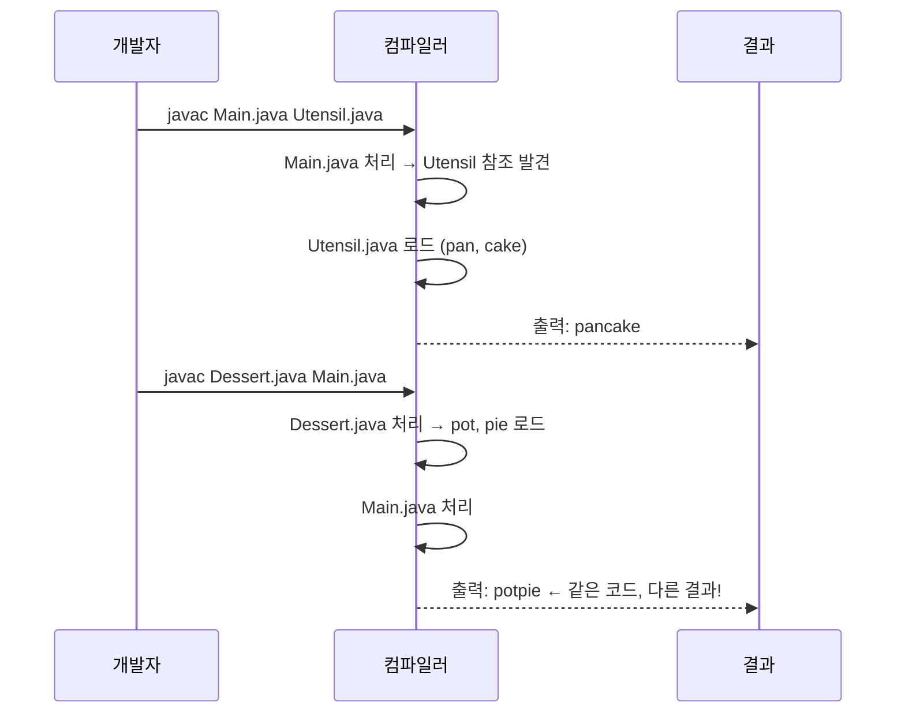
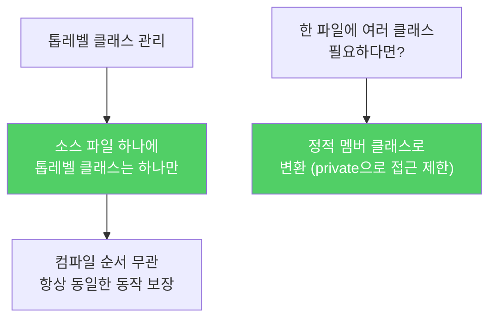

소스 파일 하나에 톱레벨 클래스를 여러 개 넣어도 컴파일러는 불평하지 않습니다. 하지만 이건 조용한 시한폭탄입니다. 컴파일 순서에 따라 프로그램 동작이 달라집니다.

---

## 1. 문제 상황 — 같은 클래스가 두 파일에 정의되면

비유하자면 **같은 이름의 직원이 두 부서에 등록된 상황**입니다. 어느 부서 직원을 호출하느냐에 따라 결과가 달라집니다. 전화하는 순서(컴파일 순서)에 따라 어느 직원이 응답할지 결정됩니다.

다음 파일 구조를 보겠습니다.

```java
// Main.java
public class Main {
    public static void main(String[] args) {
        System.out.println(Utensil.NAME + Dessert.NAME);
    }
}
```

```java
// Utensil.java — Utensil과 Dessert 두 클래스를 한 파일에 정의
class Utensil {
    static final String NAME = "pan";
}

class Dessert {
    static final String NAME = "cake";
}
// 출력 결과: pancake
```

```java
// Dessert.java — 같은 이름의 클래스를 또 다른 파일에 정의
class Utensil {
    static final String NAME = "pot";  // pan이 아니라 pot!
}

class Dessert {
    static final String NAME = "pie";  // cake가 아니라 pie!
}
// 이 파일이 먼저 컴파일되면: potpie 출력
```

---

## 2. 컴파일 순서에 따른 동작 차이



**만약 이 상태에서 계속 개발하면?** 로컬에서는 `pancake`가 나오고, CI 서버에서는 `potpie`가 나오는 상황이 생깁니다. 원인을 찾기가 매우 어렵습니다.

`javac Main.java Dessert.java`처럼 컴파일하면 운 좋게 중복 정의 오류가 납니다. 하지만 특정 순서로만 컴파일하면 오류 없이 조용히 잘못된 클래스를 사용합니다.

---

## 3. 해결책 — 하나의 파일에 하나의 톱레벨 클래스

**해결책 1: 파일을 분리 (가장 간단)**

```
Utensil.java  →  class Utensil { ... }
Dessert.java  →  class Dessert { ... }
```

각 클래스를 별도 파일에 넣으면 끝입니다. 컴파일 순서에 상관없이 항상 같은 결과가 나옵니다.

**해결책 2: 정적 멤버 클래스로 변환 (한 파일에 묶고 싶다면)**

```java
// Test.java — 정적 멤버 클래스로 묶기
public class Test {
    public static void main(String[] args) {
        System.out.println(Utensil.NAME + Dessert.NAME);
    }

    // private으로 접근 범위 최소화 가능
    private static class Utensil {
        static final String NAME = "pan";
    }

    private static class Dessert {
        static final String NAME = "cake";
    }
}
```

정적 멤버 클래스로 만들면 관련 클래스를 논리적으로 묶으면서도, `private`으로 접근 범위를 제한할 수 있습니다.

---

## 4. 요약



> 소스 파일 하나에는 반드시 톱레벨 클래스를 하나만 담으세요. 이 규칙을 지키면 컴파일러가 같은 클래스에 대한 정의를 여러 개 만들어내는 일이 없어지고, 소스 파일을 어떤 순서로 컴파일하든 프로그램 동작이 달라지는 일도 없어집니다.

---

> 참조: 이펙티브 자바 3/E — 조슈아 블로크
