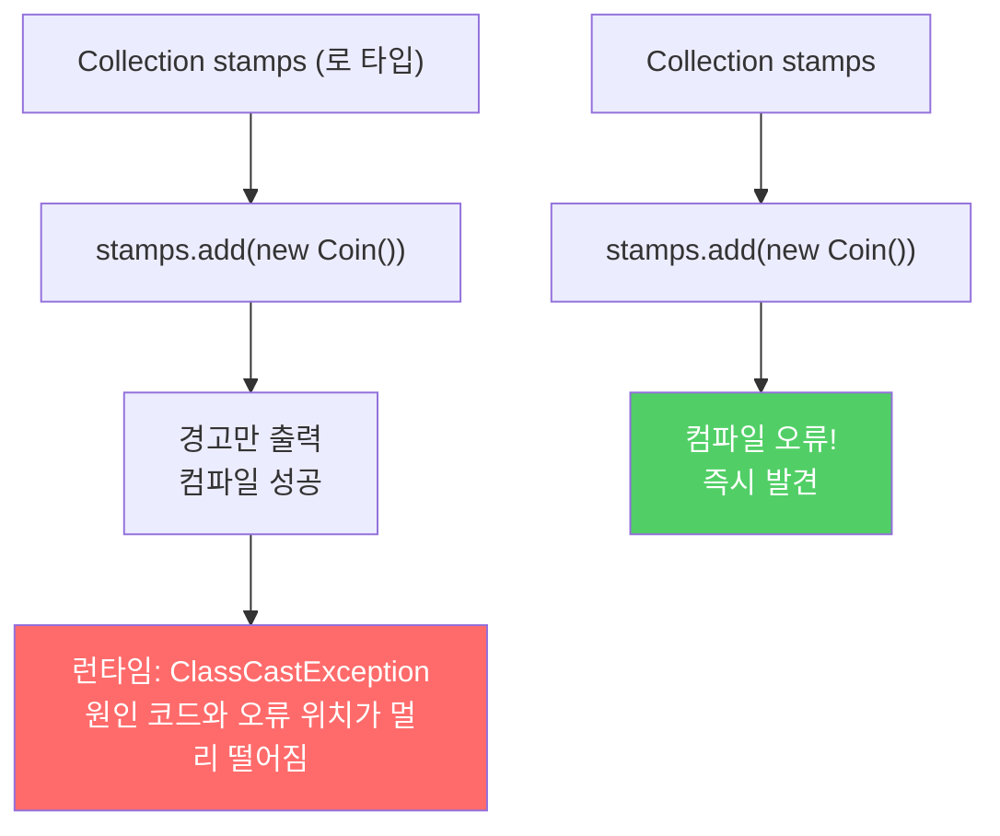
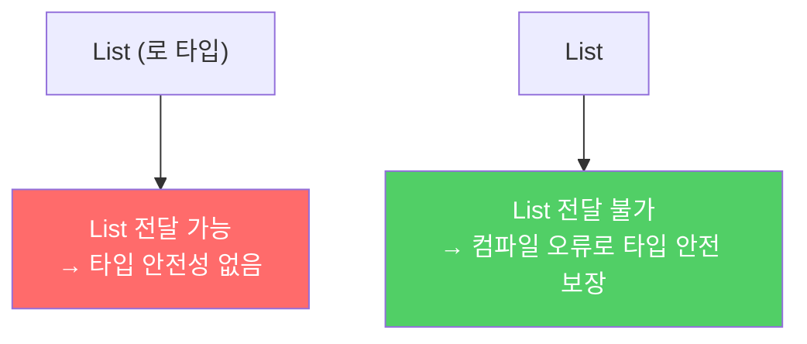
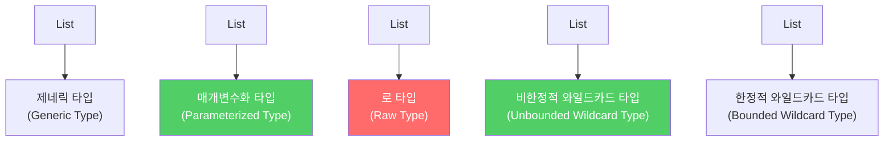

제네릭이 있는데도 타입 매개변수를 쓰지 않는 로 타입은 런타임에 `ClassCastException`을 유발합니다. 컴파일러가 잡아줄 수 있는 오류를 런타임까지 미루는 행위입니다.

---

## 1. 제네릭 타입과 로 타입

비유하자면 **라벨 없는 약통**입니다. 라벨 있는 약통(제네릭 타입)은 "이 통에는 아스피린만 넣습니다"라고 명시합니다. 라벨 없는 약통(로 타입)은 뭐든 넣을 수 있지만, 꺼낼 때 뭐가 들어있는지 모릅니다.

```java
// 제네릭 타입: List<E>
// 매개변수화 타입: List<String>, List<Integer>
// 로 타입(raw type): List — 타입 매개변수를 사용하지 않음

// 로 타입 사용 — 컴파일 성공, 런타임 폭발
private final Collection stamps = new ArrayList();  // 로 타입

stamps.add(new Stamp());
stamps.add(new Coin());  // 경고만 나고 컴파일 성공!

for (Iterator i = stamps.iterator(); i.hasNext(); ) {
    Stamp stamp = (Stamp) i.next();  // Coin이 나오면 ClassCastException!
    stamp.cancel();
}
```

오류는 가능한 한 발생 즉시, 이상적으로는 **컴파일 때** 발견해야 합니다. 로 타입은 오류를 런타임까지 미룹니다.

---

## 2. 로 타입 대신 제네릭 타입 사용

```java
// 올바른 방법 — 제네릭 타입 명시
private final Collection<Stamp> stamps = new ArrayList<>();

stamps.add(new Stamp());   // OK
stamps.add(new Coin());    // 컴파일 오류!
// error: incompatible types: Coin cannot be converted to Stamp

// 꺼낼 때도 형변환 불필요 — 컴파일러가 타입 안전성 보장
for (Stamp stamp : stamps) {
    stamp.cancel();  // 항상 Stamp
}
```



---

## 3. 로 타입이 존재하는 이유 — 하위 호환성

로 타입은 왜 아직도 남아있을까요? 자바가 제네릭을 도입하기까지 약 10년이 걸렸습니다. 그 사이에 제네릭 없이 작성된 코드가 방대합니다. 로 타입은 그 레거시 코드와의 **하위 호환성** 때문에 남겨둔 것입니다.

```java
// Java 5 이전 레거시 코드 (제네릭 없음)
List oldList = new ArrayList();  // 로 타입

// Java 5+ 새 코드와 함께 동작해야 함
void processLegacy(List list) { ... }  // 로 타입 매개변수 허용
```

로 타입은 과거의 유물입니다. **새로운 코드에서는 절대 사용하면 안 됩니다.**

---

## 4. List vs List\<Object\> — 차이가 있다

```java
// 로 타입 List: 제네릭 타입 시스템에서 완전히 발을 뺌
// List<Object>: 모든 타입을 허용한다고 컴파일러에게 명시적으로 전달

public static void main(String[] args) {
    List<String> strings = new ArrayList<>();
    unsafeAdd(strings, 42);
    String s = strings.get(0);  // ClassCastException!
}

// 로 타입 사용 — 위험
static void unsafeAdd(List list, Object o) {
    list.add(o);
}

// List<Object> 사용 — 안전: 컴파일 오류로 막힘
static void safeAdd(List<Object> list, Object o) {
    list.add(o);
}
// safeAdd(strings, 42) → 컴파일 오류!
// List<String>은 List<Object>의 하위 타입이 아니기 때문
```



---

## 5. 비한정적 와일드카드 타입 — 타입을 모를 때의 해결책

원소 타입을 몰라도 되는 경우, 로 타입 대신 **비한정적 와일드카드 타입(`?`)**을 씁니다.

```java
// 나쁜 방법 — 로 타입
static int numElementsInCommon(Set s1, Set s2) {
    int result = 0;
    for (Object o1 : s1) {
        if (s2.contains(o1)) result++;
    }
    return result;
}

// 올바른 방법 — 비한정적 와일드카드 타입
static int numElementsInCommon(Set<?> s1, Set<?> s2) {
    int result = 0;
    for (Object o1 : s1) {
        if (s2.contains(o1)) result++;
    }
    return result;
}
```

**`Set<?>` vs `Set`의 차이:**

```java
Set rawSet = new HashSet();
rawSet.add("hello");
rawSet.add(42);     // 가능 — 타입 불변식 훼손 가능

Set<?> wildcardSet = new HashSet<>();
wildcardSet.add("hello");  // 컴파일 오류!
// null 외에 어떤 원소도 넣을 수 없음 — 타입 안전
```

`Set<?>`는 어떤 타입인지 모르지만, 안전합니다. 모르는 타입의 컬렉션에 함부로 원소를 넣지 못하도록 막아줍니다.

---

## 6. 로 타입을 써도 되는 예외 두 가지

### 예외 1: class 리터럴

```java
// 허용: 로 타입 class 리터럴
List.class
String[].class
int.class

// 불허: 매개변수화 타입 class 리터럴
List<String>.class  // 컴파일 오류
List<?>.class       // 컴파일 오류
```

### 예외 2: instanceof 연산자

```java
// instanceof는 런타임에 동작하는데,
// 런타임에는 제네릭 타입 정보가 지워짐 (타입 소거)
// → instanceof에는 로 타입 사용

if (o instanceof Set) {         // 로 타입으로 검사
    Set<?> s = (Set<?>) o;      // 와일드카드 타입으로 형변환
    // 이후 s는 Set<?>로 안전하게 사용
}
```

---

## 7. 제네릭 타입 용어 정리



> 로 타입을 사용하면 런타임에 예외가 일어날 수 있습니다. 로 타입은 제네릭 도입 이전 코드와의 호환성을 위해 제공될 뿐입니다. `Set<Object>`는 모든 타입의 객체를 저장할 수 있는 매개변수화 타입이고, `Set<?>`는 모종의 타입 객체만 저장할 수 있는 와일드카드 타입입니다. 이 둘은 안전하지만, 로 타입인 `Set`은 안전하지 않습니다.

---

> 참조: 이펙티브 자바 3/E — 조슈아 블로크
