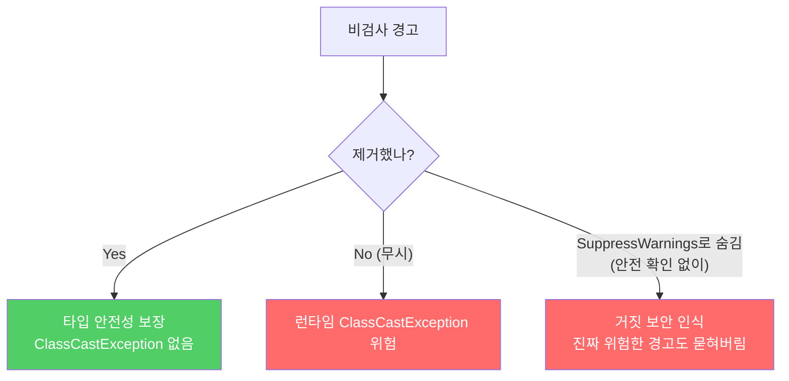
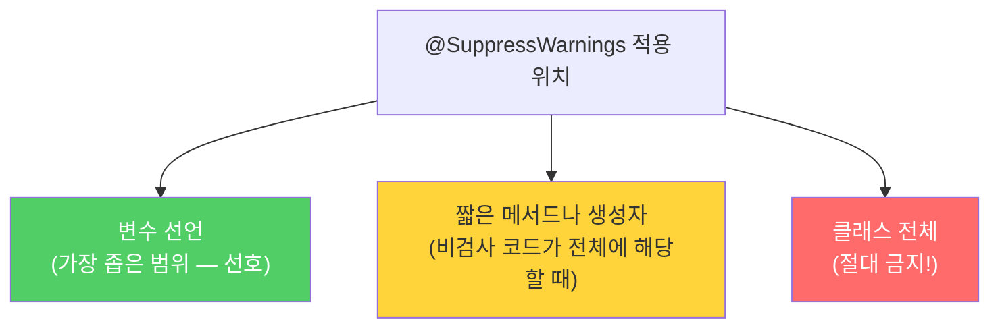

제네릭을 사용하다 보면 컴파일러가 `[unchecked]` 경고를 쏟아냅니다. 이 경고들은 귀찮다고 무시하면 안 됩니다. 각 경고는 "여기서 런타임에 `ClassCastException`이 날 수 있어요"라는 신호입니다.

---

## 1. 비검사 경고가 뜨는 상황

비유하자면 **레시피 없이 요리하는 것**입니다. 레시피(타입 정보) 없이 재료(원소)를 다루면 요리사(컴파일러)가 "이게 맞는 재료인지 런타임 전까지는 확인할 수 없어요"라고 경고합니다.

```java
// 경고 발생 — 타입 매개변수 누락
Set<Lark> exaltation = new HashSet();
// warning: [unchecked] unchecked conversion
// required: Set<Lark>, found: HashSet

// 해결 — 다이아몬드 연산자 사용 (Java 7+)
Set<Lark> exaltation = new HashSet<>();  // 컴파일러가 Lark 추론
```

비검사 경고의 종류:
- 비검사 형변환 경고 (unchecked cast)
- 비검사 메서드 호출 경고 (unchecked call)
- 비검사 매개변수화 가변인수 타입 경고
- 비검사 변환 경고 (unchecked conversion)

---

## 2. 경고를 제거해야 하는 이유



안전하다고 검증된 경고를 숨기지 않고 그대로 두면, 진짜 문제를 알리는 새로운 경고가 수십 개의 거짓 경고 속에 묻혀버립니다.

---

## 3. @SuppressWarnings — 경고를 숨겨야 한다면

경고를 제거할 수 없지만 **타입 안전하다고 확신할 수 있다면** `@SuppressWarnings("unchecked")`로 숨길 수 있습니다. 단, 두 가지 규칙을 반드시 지켜야 합니다.

**규칙 1: 가능한 한 좁은 범위에 적용**

```java
// 나쁜 예 — 메서드 전체에 적용 (범위 과다)
@SuppressWarnings("unchecked")
public <T> T[] toArray(T[] a) {
    if (a.length < size)
        return (T[]) Arrays.copyOf(elements, size, a.getClass());
    System.arraycopy(elements, 0, a, 0, size);
    if (a.length > size) a[size] = null;
    return a;
}

// 좋은 예 — 지역변수에 최소 범위로 적용
public <T> T[] toArray(T[] a) {
    if (a.length < size) {
        // 생성한 배열과 매개변수의 타입이 모두 T[]로 같으므로 안전한 형변환
        @SuppressWarnings("unchecked")
        T[] result = (T[]) Arrays.copyOf(elements, size, a.getClass());
        return result;
    }
    System.arraycopy(elements, 0, a, 0, size);
    if (a.length > size) a[size] = null;
    return a;
}
```

클래스 전체에 `@SuppressWarnings`를 적용하면 심각한 경고를 놓칠 수 있습니다. **절대로 클래스 전체에 적용하지 마세요.**

**규칙 2: 왜 안전한지 주석으로 설명**

```java
// 안전한 이유를 주석으로 명시
// elements는 push(E)로만 원소를 추가하므로 항상 E 타입만 들어있음
// 따라서 (T[]) 형변환은 런타임에도 안전하다
@SuppressWarnings("unchecked")
T[] result = (T[]) Arrays.copyOf(elements, size, a.getClass());
```

주석이 없으면 나중에 코드를 수정하는 사람이 "이게 왜 안전하지?" 의아해하다가 실수로 타입 안전성을 망칠 수 있습니다.

---

## 4. 적용 범위 결정 기준



---

## 5. 요약

> 비검사 경고는 `ClassCastException`이 날 수 있다는 신호입니다. 최선을 다해 제거하세요. 경고를 없앨 방법을 찾지 못하겠다면, 그 코드가 타입 안전함을 직접 증명하고 가능한 한 좁은 범위에 `@SuppressWarnings("unchecked")`를 달아 경고를 숨기세요. 그리고 왜 안전한지 이유를 주석으로 반드시 남기세요.

---

> 참조: 이펙티브 자바 3/E — 조슈아 블로크
