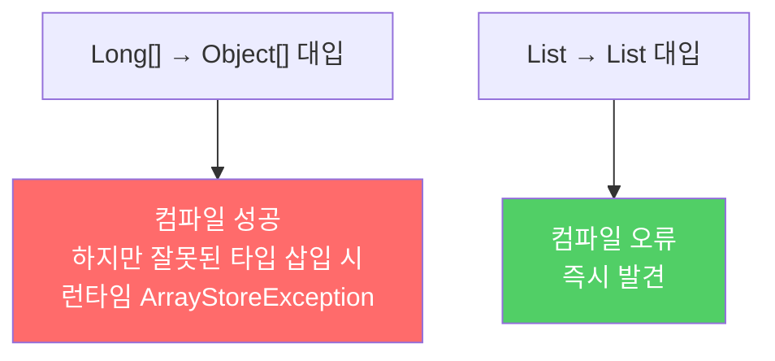
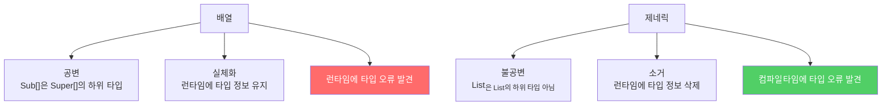

배열과 제네릭은 근본적으로 다른 타입 규칙을 따릅니다. 배열은 런타임에 타입 오류를 잡고, 제네릭은 컴파일타임에 잡습니다. 둘을 섞어 쓰면 항상 충돌이 납니다.

---

## 1. 배열은 공변, 제네릭은 불공변

비유하자면 **상속 서류와 독립 계약서**의 차이입니다. 배열은 "부모-자식 관계를 그대로 물려받는다"(공변)는 방식이고, 제네릭은 "타입이 다르면 완전히 남남이다"(불공변)는 방식입니다.

```java
// 배열은 공변 — Sub[]는 Super[]의 하위 타입
Object[] objectArray = new Long[1];   // 컴파일 성공!
objectArray[0] = "문자열";             // ArrayStoreException — 런타임 오류

// 제네릭은 불공변 — List<Long>은 List<Object>의 하위 타입이 아님
List<Object> objectList = new ArrayList<Long>();  // 컴파일 오류!
```



배열은 런타임까지 오류를 숨깁니다. 제네릭은 컴파일타임에 즉시 잡아냅니다.

---

## 2. 배열은 실체화, 제네릭은 소거

- **배열**: 런타임에도 자신의 원소 타입을 기억합니다. `Long[]`는 런타임에도 `Long` 배열임을 압니다.
- **제네릭**: 타입 정보가 런타임에 소거됩니다. `List<String>`은 런타임에 그냥 `List`입니다.

```java
// 배열은 런타임에 타입 확인
Long[] longs = new Long[1];
Object[] objs = longs;
objs[0] = "hi";  // 런타임: ArrayStoreException (String이 Long 배열에 들어감)

// 제네릭은 컴파일타임에 타입 확인, 런타임에는 타입 정보 없음
List<String> strings = new ArrayList<>();
// strings는 런타임에 그냥 ArrayList — String 정보 소거됨
```

---

## 3. 제네릭 배열은 왜 만들 수 없나?

`new E[10]`같은 제네릭 배열 생성이 허용된다면 어떤 일이 벌어질까요?

```java
// (1) 이 코드가 허용된다고 가정하면
List<String>[] stringLists = new List<String>[1];

// (2)
List<Integer> intList = List.of(42);

// (3) 배열은 공변이므로 Object[]에 대입 가능
Object[] objects = stringLists;

// (4) 배열은 실체화되므로 List<Integer>를 Object[]에 넣을 수 있음
objects[0] = intList;  // ArrayStoreException이 안 남 (타입 소거 때문)

// (5) 컴파일러가 자동으로 String 형변환 코드 삽입
String s = stringLists[0].get(0);  // ClassCastException!
```

이런 이유로 Java는 제네릭 배열 생성을 컴파일 오류로 막습니다. (1)에서 막지 않으면 (5)에서 `ClassCastException`이 발생하는데, 이는 제네릭의 핵심 약속(런타임 `ClassCastException` 방지)을 위반합니다.

---

## 4. 배열 대신 리스트 사용 — Chooser 예시

```java
// 나쁜 설계 — Object 배열 사용
public class Chooser {
    private final Object[] choiceArray;

    public Chooser(Collection choices) {
        choiceArray = choices.toArray();
    }

    public Object choose() {
        Random rnd = ThreadLocalRandom.current();
        return choiceArray[rnd.nextInt(choiceArray.length)];
        // 반환된 Object를 호출자가 매번 형변환해야 함
        // 잘못된 타입이 들어있으면 런타임 ClassCastException
    }
}
```

```java
// 제네릭 배열로 만들려는 시도 — 컴파일 오류
public class Chooser<T> {
    private final T[] choiceArray;

    public Chooser(Collection<T> choices) {
        choiceArray = choices.toArray();  // Object[]를 T[]로 변환 불가 — 오류
    }
}
```

```java
// 경고를 SuppressWarnings로 숨기는 시도 — 힙 오염 가능성
public class Chooser<T> {
    private final T[] choiceArray;

    @SuppressWarnings("unchecked")
    public Chooser(Collection<T> choices) {
        choiceArray = (T[]) choices.toArray();  // 경고 숨겼지만 힙 오염 위험
    }
}
```

```java
// 올바른 해결책 — 배열 대신 리스트
public class Chooser<T> {
    private final List<T> choiceList;

    public Chooser(Collection<T> choices) {
        choiceList = new ArrayList<>(choices);
    }

    public T choose() {
        Random rnd = ThreadLocalRandom.current();
        return choiceList.get(rnd.nextInt(choiceList.size()));
        // 형변환 불필요, ClassCastException 발생 가능성 없음
    }
}
```

성능이 약간 느려질 수 있지만, 런타임 `ClassCastException`을 완전히 없앨 수 있습니다.

---

## 5. 배열과 제네릭 비교 정리



> 배열과 제네릭은 서로 다른 타입 규칙을 따르기 때문에 잘 어울리지 않습니다. 둘을 섞어 쓰다가 컴파일 오류나 경고를 만나면, 가장 먼저 배열을 리스트로 대체하는 방법을 시도해보세요.

---

> 참조: 이펙티브 자바 3/E — 조슈아 블로크
