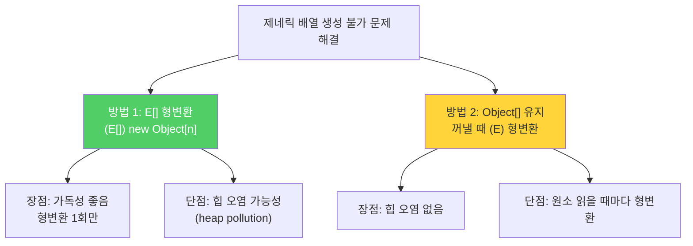
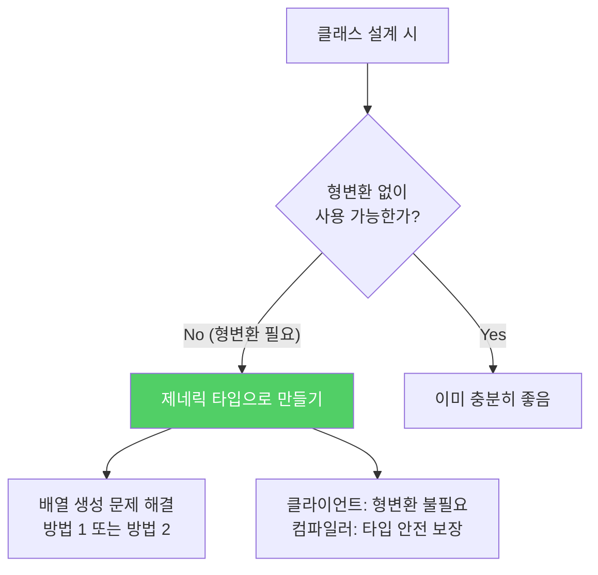

클라이언트가 형변환 없이 사용할 수 있어야 더 안전하고 편한 API입니다. 기존 클래스에 형변환이 많다면 제네릭 타입으로 만들 후보입니다.

---

## 1. Object 기반 스택의 문제점

비유하자면 **라벨 없는 창고**입니다. 물건을 넣을 때는 아무거나 넣을 수 있지만, 꺼낼 때는 무엇인지 직접 확인하고 변환해야 합니다. 잘못 확인하면 그 자리에서 쓰러집니다.

```java
// Object 기반 스택 — 형변환 지옥
public class Stack {
    private Object[] elements;
    private int size = 0;
    private static final int DEFAULT_INITIAL_CAPACITY = 16;

    public Stack() {
        elements = new Object[DEFAULT_INITIAL_CAPACITY];
    }

    public void push(Object e) {
        ensureCapacity();
        elements[size++] = e;
    }

    public Object pop() {
        if (size == 0) throw new EmptyStackException();
        Object result = elements[--size];
        elements[size] = null;
        return result;
    }

    public boolean isEmpty() { return size == 0; }

    private void ensureCapacity() {
        if (elements.length == size)
            elements = Arrays.copyOf(elements, 2 * size + 1);
    }
}

// 사용 — 매번 형변환 필요
Stack stack = new Stack();
stack.push("hello");
String s = (String) stack.pop();  // 매번 형변환, 실수하면 ClassCastException
```

---

## 2. 제네릭 타입으로 변환 — 배열 생성 문제

1단계: 클래스 선언에 타입 매개변수 `E`를 추가하고 `Object`를 `E`로 교체합니다.

```java
// 컴파일 오류 발생 — generic array creation
public class Stack<E> {
    private E[] elements;

    public Stack() {
        elements = new E[DEFAULT_INITIAL_CAPACITY];  // 오류!
        // E 같은 실체화 불가 타입으로는 배열을 만들 수 없음
    }
    // ...
}
```

`E`는 런타임에 타입 정보가 소거되므로 `new E[16]`을 만들 수 없습니다. 해결책은 두 가지입니다.

---

## 3. 해결책 1 — Object 배열을 생성하고 E[]로 형변환

```java
public class Stack<E> {
    private E[] elements;
    private int size = 0;
    private static final int DEFAULT_INITIAL_CAPACITY = 16;

    @SuppressWarnings("unchecked")
    public Stack() {
        // push(E)로만 원소가 추가되므로 E 타입 안전성 보장
        // 배열의 런타임 타입은 Object[]이지만, 논리적으로는 E[]
        elements = (E[]) new Object[DEFAULT_INITIAL_CAPACITY];
    }

    public void push(E e) {
        ensureCapacity();
        elements[size++] = e;
    }

    public E pop() {
        if (size == 0) throw new EmptyStackException();
        E result = elements[--size];
        elements[size] = null;
        return result;
    }
    // ...
}
```

**장점:** 가독성이 좋고, `E[]`로 선언해 오직 `E` 타입만 담음을 명확히 표현합니다. 형변환을 생성자에서 단 한 번만 합니다. 현업에서 선호하는 방식입니다.

**단점:** 배열의 런타임 타입(`Object[]`)과 컴파일타임 타입(`E[]`)이 달라 힙 오염(heap pollution)이 발생할 수 있습니다.

---

## 4. 해결책 2 — 필드를 Object[]로 유지하고 꺼낼 때 E로 형변환

```java
public class Stack<E> {
    private Object[] elements;  // Object[] 유지
    private int size = 0;
    private static final int DEFAULT_INITIAL_CAPACITY = 16;

    public Stack() {
        elements = new Object[DEFAULT_INITIAL_CAPACITY];  // 정상 생성
    }

    public void push(E e) {
        ensureCapacity();
        elements[size++] = e;
    }

    public E pop() {
        if (size == 0) throw new EmptyStackException();
        // push(E)로만 원소가 추가됐으므로 E로 형변환 안전
        @SuppressWarnings("unchecked")
        E result = (E) elements[--size];
        elements[size] = null;
        return result;
    }
    // ...
}
```

**장점:** 힙 오염이 없습니다.

**단점:** 배열에서 원소를 읽을 때마다 형변환이 발생합니다.

---

## 5. 두 방식 비교



---

## 6. 제네릭 타입 사용의 이점

```java
// 제네릭 Stack 사용 — 형변환 불필요, 타입 안전
Stack<String> stack = new Stack<>();
stack.push("hello");
stack.push("world");

String s = stack.pop();  // 형변환 없음! 컴파일러가 타입 보장
stack.push(42);          // 컴파일 오류! String 스택에 int 불가
```

---

## 7. 한정적 타입 매개변수

타입 매개변수에 제약을 둘 수도 있습니다.

```java
// DelayQueue — E가 반드시 Delayed의 하위 타입이어야 함
class DelayQueue<E extends Delayed> implements BlockingQueue<E> {
    // E가 항상 Delayed임이 보장되므로
    // 클라이언트가 형변환 없이 Delayed 메서드를 바로 호출 가능
}

// 사용
DelayQueue<MyDelayedTask> queue = new DelayQueue<>();
MyDelayedTask task = queue.take();
long delay = task.getDelay(TimeUnit.SECONDS);  // Delayed 메서드 직접 호출
```

---

## 8. 요약



> 클라이언트에서 직접 형변환해야 하는 타입보다 제네릭 타입이 더 안전하고 쓰기 편합니다. 새로운 타입을 설계할 때는 형변환 없이도 사용할 수 있도록 제네릭 타입으로 만드세요. 기존 타입 중 제네릭이었어야 하는 것이 있다면 제네릭 타입으로 변경하세요.

---

> 참조: 이펙티브 자바 3/E — 조슈아 블로크
