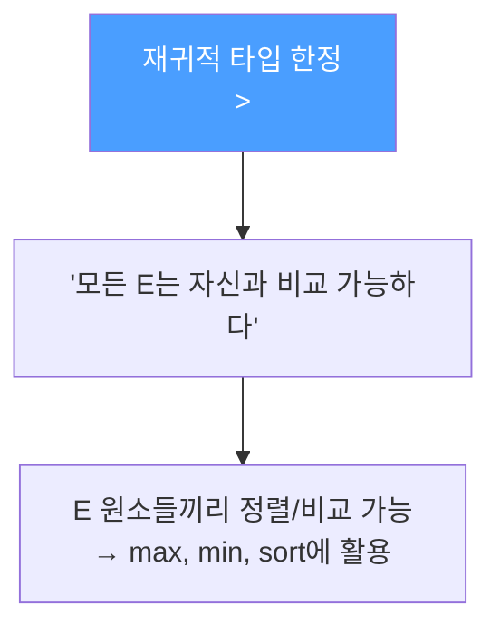
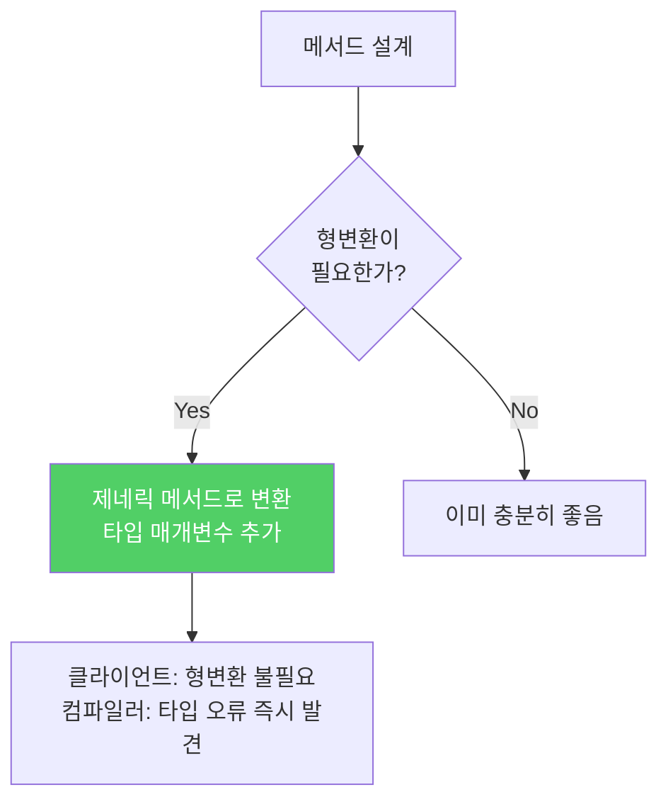

메서드도 타입 안전하게 만들 수 있습니다. 형변환 없이 사용할 수 있는 제네릭 메서드가 더 안전하고 쓰기 편합니다.

---

## 1. 로 타입 메서드의 문제

비유하자면 **라벨 없는 봉투에 편지를 받는 것**입니다. 봉투를 열 때마다 안에 무엇이 들어있는지 직접 확인해야 하고, 잘못 꺼내면 그 자리에서 문제가 생깁니다.

```java
// 로 타입 — 경고 2개 발생
public static Set union(Set s1, Set s2) {
    Set result = new HashSet(s1);
    result.addAll(s2);
    return result;
}
// warning: unchecked call to HashSet(Collection<? extends E>)
// warning: unchecked call to addAll(Collection<? extends E>)
```

```java
// 제네릭 메서드 — 경고 없음, 타입 안전
public static <E> Set<E> union(Set<E> s1, Set<E> s2) {
    Set<E> result = new HashSet<>(s1);
    result.addAll(s2);
    return result;
}
```

타입 매개변수 목록 `<E>`는 **메서드 제한자와 반환 타입 사이**에 옵니다.

```java
// 사용 — 형변환 불필요
Set<String> guys    = Set.of("톰", "딕", "해리");
Set<String> stooges = Set.of("래리", "모에", "컬리");
Set<String> aflCio  = union(guys, stooges);  // 형변환 없음
```

---

## 2. 제네릭 싱글톤 팩토리 — 불변 객체를 여러 타입으로 활용

제네릭은 런타임에 타입 정보가 소거되므로, 하나의 객체를 어떤 타입으로든 매개변수화할 수 있습니다.

```java
// 항등 함수 (입력값을 수정 없이 그대로 반환)
private static final UnaryOperator<Object> IDENTITY_FN = t -> t;

@SuppressWarnings("unchecked")
public static <T> UnaryOperator<T> identityFunction() {
    // T가 무엇이든 입력을 그대로 반환하므로 타입 안전
    return (UnaryOperator<T>) IDENTITY_FN;
}

// 사용 — 같은 함수 객체를 여러 타입으로 활용
UnaryOperator<String> sameString = identityFunction();
UnaryOperator<Number> sameNumber = identityFunction();

String s = sameString.apply("hello");  // 형변환 불필요
Number n = sameNumber.apply(42);
```

`Collections.reverseOrder()`, `Collections.emptySet()` 등이 이 패턴을 사용합니다.

---

## 3. 재귀적 타입 한정 — 자기 자신을 포함한 타입 제약



```java
// 컬렉션에서 최댓값 반환
public static <E extends Comparable<E>> E max(Collection<E> c) {
    if (c.isEmpty())
        throw new IllegalArgumentException("컬렉션이 비어 있습니다");

    E result = null;
    for (E e : c) {
        if (result == null || e.compareTo(result) > 0)
            result = Objects.requireNonNull(e);
    }
    return result;
}

// 사용 — 어떤 Comparable 타입이든 가능
List<String> words = List.of("banana", "apple", "cherry");
String maxWord = max(words);  // "cherry"

List<Integer> nums = List.of(3, 1, 4, 1, 5);
Integer maxNum = max(nums);   // 5
```

`<E extends Comparable<E>>`는 "E 타입의 원소들은 서로 비교할 수 있다"는 의미입니다. 이 타입 한정이 있어야 `compareTo()`를 안전하게 호출할 수 있습니다.

---

## 4. 요약



> 클라이언트에서 입력 매개변수와 반환값을 명시적으로 형변환해야 하는 메서드보다 제네릭 메서드가 더 안전하고 사용하기 쉽습니다. 형변환을 해줘야 하는 기존 메서드는 제네릭하게 만드세요.

---

> 참조: 이펙티브 자바 3/E — 조슈아 블로크
