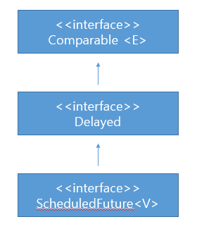

#### 🔗 불공변 방식보다 유연한 무언가가 필요해 !!@@

* 매개변수화 타입은 **불공변**(invariant)이다.


* 서로 다른 타입 **Type1**과 **Type2**가 있을 때 `List<Type1>`은 `List<Type2>`의 **하위 타입도 상위 타입도 아니다.**

  * ex) `List<String>`은 `List<Object>`의 하위 타입이 아니라는 뜻이다.

  

  * `List<Object>`에는 어떤 객체든 넣을 수 있지만 `List<String>`에는 문자열만 넣을 수 있다.

  

  * 즉, `List<String>`은 `List<Object>`가 하는 일을 제대로 수행하지 못하니 하위 타입이 될 수 없다**(리스코프 치환 원칙에 어긋난다)**


* <span style="color:red;">하지만</span> 때로는 불공변 방식보다 유연한 무언가가 필요하다.

<hr>


**💎 Stack 클래스의 일부 public API **

```java
public class Stack<E> {
    public Stack();
    public void push(E e);
    public E pop();
    public boolean isEmpty();
}
```

* 위 코드에 일련의 원소를 스택에 넣는 **pushAll** 메소드를 추가한다고 가정해보자.


<hr>


**💎 와일드카드 타입을 사용하지 않은 pushAll 메소드**

```java
public void pushAll(Iterable<E> src) {
    for (E e : src) {
        push(e);
    }
}
```

* 위 메소드는 깨끗이 컴파일 되지만 완벽하진 않다.  **Iterable src의 원소타입이 스택의 원소 타입과 일치하면 잘 작동한다.**


* <span style="color:red;">하지만</span> 아래와 같이 `Stack<Number>`로 선언후 **pushAll(Integer)**을 호출하면 오류가 생긴다.

```java
Stack<Number> numberStack = new Stack<>();
Iterable<Integer> integers = ...;
numberStack.pushAll(integers);


StackTest.java : 7: error: incompatible types: Iterable<Integer>
cannot be converted to Iterable<NUmber>
    numberStack.pushAll(integers);
```

* **매개변수화 타입이 <span style="color:red;">불공변</span>이기 때문이다.** 


* <span style="color:red;">해결책</span>으로 자바는 이런 상황에 대처할 수 있는 **한정적 와일드카드 타입**이라는 **특별한 매개변수화 타입**을 지원한다.
  * ex) **pushAll**의 입력 매개변수 타입은 '**E의 Iterable'이 아니라 <span style="color:red;">'E의 하위 타입의 Iterable'</span>**이어야 하며, 와일드 카드 타입 **Iterable<? extends E>**가 정확히 이런 뜻이다.


##### 💎 생산자 (producer) 매개변수에 와일드 카드 타입 적용

```java
public void pushAll(Iterable<? extends E> src) {
    for (E e : src) {
        push(e);
    }
}
```


<hr>


**💎 와일드 카드 타입을 사용하지 않은 popAll 메소드**

```java
public void popAll(Collection<E> dst) {
    while (!isEmpty()) {
        dst.add(pop());
    }
}
```

* 위 코드도 주어진 **컬렉션의 원소 타입이 스택의 원소 타입과 일치한다면** 말끔히 **컴파일되고 문제없이 동작한다.**


* 하지만 아래와 같이 `Stack<Number>`의 원소를 **Object**용 컬렉션으로 옮긴다고 가정하면 문제가 생긴다.

```java
Stack<Number> numberStack = new Stack<>();
Collection<Object> objects = ...;
numberStack.popAll(objects);
```

* 이 또한 불공변이기 때문에 발생하는 문제로 **"`Collection<Object>`는 `Collection<Number>`의 하위 타입이 아니다"** 라는 오류가 발생한다.


* 이 또한 **와일드카드 타입**으로 해결 할 수 있다.


<hr>


**💎 E 소비자`<consumer>` 매개변수에 와일드카드 타입 적용**

```java
public void popAll(Collection<? super E> dst) {
    while (!isEmpty()) {
        dst.add(pop());
    }
}
```

* 위의 **popAll**의 입력 매개변수의 타입은 **'E의 Collection'**이 아니라 **<span style="color:red;">'E의 상위 타입의 Collection'</span>**이어야 한다. (모든 타입은 자기 자신의 상위 타입이다)
  * 와일드카드 타입을 사용한 `Collection<? super E>`가 정확히 이런 의미다.


<hr>


##### 💎 어떤 와일드 카드 타입을 써야해?

* 유연성을 극대화하려면 원소의 생산자나 소비자용 입력 매개변수에 와일드카드 타입을 사용하라.

  

* <span style="color:red;">한편,</span> 입력 매개변수가 생산자와 소비자 역할을 동시에 한다면 와일드카드 타입을 써도 좋을 게 없다.


* 타입을 확실히 지정해야 하는 상황으로, 이때는 와일드카드 타입을 쓰지 말아야한다.


* **다음 <span style="color:red;">공식을 외워두면</span> 어떤 와일드카드 타입을 써야하는지 기억하는데 도움이 될 것이다.**

  * > 펙스(PECS) : producer-extends, consumer-super

    

  * <span style="color:red;">즉,</span> 매개변수화 타입 **T**가 생산자라면 `<? extends T>`를 사용하고, 소비자라면 `<? super T>`를 사용하라.

    * **Stack** 예에서 **pushAll**의 **src** 매개변수는 **Stack**이 사용할 **E**를 생산하므로 src의 **적절한** 타입은 **Iterable<? extends E>**이다.

    

    * <span style="color:red;">한편,</span> **popAll**의 **dst** 매개변수는 **Stack**으로부터 **E** 인스턴스를 소비하므로 **dst**의 적절한 타입은 `Collection<? super E>`이다.

    

    * **PECS 공식은 와일드카드 타입을 사용하는 기본 원칙이다.**


<hr>


**💎 PECS 공식으로 Chooser 생성자를 살펴보자. **

```java
public Chooser(Collection<T> choices)
```

* 이 생성자로 넘겨지는 **choices** 컬렉션은 **T 타입의 값을 생산**하기만 하니, T를 확장하는 와일드카드 타입을 사용해 선언해야 한다.


<br>

**💎 T생산자 매개변수에 와일드카드 타입 적용**

```java
public Chooser(Collection<? extends T> choices)
```

* 이렇게 한정적 와일드 카드 타입으로 수정하면 `Chooser<Number>`의 생성자에 `List<Integer>`를 넘겨도 문제가 생기지 않는다.


<br>

**💎 PECS 공식으로 union 메소드를 살펴보자**

```java
public static <E> Set<E> union(Set<E> s1, Set<E> s2)
```

* s1과 s2 모두 E의 **생산자이니** PECS 공식에 따라 다음처럼 선언해야 한다.

<br>

```java
public static <E> Set<E> union(Set<? extends E> s1, Set<? extends E> s2)
```

* 위와 같이 수정한 선언을 사용하면 다음의 코드도 말끔히 컴파일 된다.

<br>

```java
Set<Integer> integers = Set.of(1, 3, 5);
Set<Double> doubles = Set.of(2.0, 4.0, 6.0);
Set<Number> numbers = union(integers, doubles);
```

<br>

> 반환 타입은 여전히 Set<E>임에 주목하자.
>
> **반환 타입에는 한정적 와일드카드 타입을 사용하면 안된다.**
>
> 유연성을 높여주기는커녕 클라이언트 코드에서도 와일드카드 타입을 써야 하기 떄문이다.

<br>

* 제대로만 사용한다면 클래스 사용자는 와일드카드 타입이 쓰였다는 사실조차 의식하지 못할 것이다.

  * 받아들여야 할 매개변수를 받고 거절해야 할 매개변수는 거절하는 작업이 알아서 이뤄진다.
  * **클래스 사용자가 와일드카드 타입을 신경 써야 한다면 그 API에 무슨 문제가 있을 가능성이 크다.**

  

<hr>


##### 💎자바 8부터는 타입 추론 능력이 강력해@@

* 자바 7까지는 타입 추론 능력이 충분히 강력하지 못해서 **문맥에 맞는 반환 타입(혹은 목표 타입)을 명시**해야 했다.


* 위에서 다룬 코드 중 **union** 메소드 호출의 목표 타입은 `Set<Number>`이다.


* **자바 7까지는** (**Set.of** 팩토리를 다른 것으로 적절히 변경한 후) 이 코드를 컴파일하면 **다음처럼 아주 길고 난해한 <span style="color:red;">오류 메시지를</span> 보게 될 것이다.**

```java
Union.java:14: error: incompatible types
    	Set<Number> numbers = union(integers, doubles);
	
	required: Set<Number>
	found: Set<INT#1>
    where INT#1,INT#2 are intersection types:
		INT#1 extends Number, Comparable<? extends INT#2>
        INT#2 extends Number, Comparable<?>
```

* 위 오류는 컴파일러가 올바른 타입을 추론하지 못할 때면 언제든 아래와 같이**명시적 타입 인수를 사용해서 타입을 알려주면 해결 된다.**


```java
Set<Number> numbers = Union.<Number>union(integers, doubles);
```


> 매개변수(parameter)와 인수(argument)의 차이
>
> 매개변수는 메소드 선언에 정의한 변수이고, 인수는 메소드 호출 시 넘기는 '실젯값'이다.
>
> void add(int value) { ... }
>
> add(10)
>
> 이 코드에서 value는 매개변수이고 10은 인수다. 
>
> 
>
> 이 정의를 제네릭까지 확장하면 다음과 같다.
>
> class Set<T> { ... }
>
> Set<Integer> = ...;
> 여기서 T는 타입 매개변수이고, Integer는 타입 인수가 된다.


<hr>


**💎 PECS 공식을 통해 max메소드를 살펴보자@**

```java
public static <E extends Comparable<E>> E max(List<E> list)
```

* 위 코드를 와일드카드 타입을 사용해 다듬은 모습은 다음과 같다.


```java
public static <E extends Comparable<? super E>> E max(List<? extends E> list)
```

* 위 코드에는 **PECS** 공식을 두 번 적용했다.


* **입력 매개변수**에서는 **E 인스턴스를 생산**하므로 원래의 `List<E>`를 `List<? extends E>`로 수정했다.


* 난해한 쪽인 **타입 매개변수 E**는 원래 선언에서는 **E**가 `Comparable<E>`를 확장한다고 정의했는데, 이때 `Comparable<E>`는 **E 인스턴스를 소비한다.**

  * 그래서 **매개변수화 타입** `Comparable<E>`를 **한정적 와일드카드 타입인** `Comparable<? super E>`로 **대채했다**.

  

  * **Comparable**은 <span style="color:red;">언제나 소비자이므로,</span> 일반적으로 `Comparable<E>`보다는 `Comparable<? super E>`를 사용하는 편이 낫다.
    * **Comparator**도 마찬가지로 `Comparator<E>`보다는 `Comparator<? super E>`를 사용하는 편이 낫다.


<hr>


#### 🔗 와일드 카드 너무 어려운데 이렇게 까지 만들 가치가 있어?

* 만들 가치가 있다 그 근거로 다음의 예시를 보자.


**💎 다음 리스트는 오직 <span style="color:red;">수정된</span> max로만 처리할 수 있다.**

```java
List<ScheduledFuture<?>> scheduledFutures = ...;
```

* <span style="color:red;">수정 전</span> **max**가 <span style="color:red;">이 리스트를 처리할  수 없는 이유는</span> (java.util.concurrent 패키지의) **ScheduledFuture**가 `Comparable<ScheduledFuture>`를 구현하지 않았기 때문이다.


* **ScheduledFuture**는 **Delayed**의 하위 인터페이스이고, **Delayed**는 `Comparable<Delayed>`를 확장했다.

  * <span style="color:red;">즉,</span> **ScheduledFuture**의 인스턴스는 다른 **ScheduledFuture** 인스턴스뿐 아니라 **Delayed** 인스턴스와도 비교할 수 있어서 <span style="color:red;">수정 전</span> **max**가 이 리스트를 거부하는 것이다.

  

* **Comparable을 직접 구현하지 않고, <span style="color:red;">직접 구현한 다른 타입을 확장한 타입을 지원하기 위해 와일드카드가 필요하다.</span>**


<br>


**💎`Comparable<E>`와 `Delayed`와 `ScheduledFuture<V>`의 관계**




<br>

```java
public interface Comparable<E>
public interface Delayed extends Comparable<Delayed>
public interface ScheduledFuture<V> extends Delayed, Future<V>
```


<hr>


#### 🔗 타입 매개변수와 와일드카드

* **타입 매개변수**와 **와일드카드**에는 **공통되는 부분**이 있어서, 메소드를 정의할 때 둘 중 어느 것을 사용해도 괜찮을 때가 많다.
  * ex) 주어진 리스트에서 명시한 두 인덱스의 아이템들을 교환(swap)하는 정적 메소드를 두 방식 모두로 정의한 코드

<br>

**💎 swap 메소드의 두 가지 선언. 어떤 것이 나을까?**

```java
public static <E> void swap(List<E> list, int i, int j);
public static void swap(List<?> list, int i, int j);
```

* public API라면 간단한 두 번째가 낫다.

  * 어떤 리스트든 이 메소드에 넘기면 명시한 인덱스의 원소들을 교환해 줄 것이다.

  

  * 신경 써야 할 타입 매개변수도 없다

  

*  **메소드 선언에 타입 매개변수가 한 번만 나오면 와일드 카드로 대체하라.**
  * 비한정적 타입 매개변수라면 **비한정적 와일드카드**로 바꾸고, 한정적 타입 매개변수라면 **한정적 와일드카드**로 바꾸면 된다.


* 하지만 두 번째 선언에는 다음과 같이 아주 직관적으로 구현한 코드가 **<span style="color:red;">컴파일되지 않는 문제</span>**가 하나 있다.

```java
public static void swap(List<?> list, int i, int j) {
	list.set(j, list.set(j, list.get(i)));
}
```

* 이 코드를 컴파일하면 그다지 도움이 되지 않는 다음과 같은 오류 메시지가 나온다.

<br>

```java
Swap.java:5: error: incompatible types: Object cannot be
converted to CAP#1
    	list.set(i, list.set(j, list.get(i)));

 where CAP#1 is a fresh type-variable:
	CAP#1 extends Object from caputre of ?
```

* 위 오류의 **원인은** 리스트의 타입이 한정적 와일드 카드인 `List<?>`인데, `List<?>`에는 `null` 외에는 어떤 값도 넣을 수 없는데, 방금 꺼낸 원소를 리스트에 다시 넣으려고 하니 발생하는 것이다.


* 형변환이나 리스트의 로 타입을 사용하지 않고도 **해결할 방법**이 있다.

  * **와일드카드 타입**의 **실제 타입을 알려주는 메소드를 <span style="color:red;">private 도우미 메소드</span>**로 따로 작성하여 활용하는 방법이다.

  

  * 실제 타입을 알아내려면 **이 도우미 메소드는 제네릭 메소드여야 한다.**

```java
public static void swap(List<?> list, int i, int j) {
    swapHelper(list, i, j);
}

//와일드카드 타입을 실제 타입으로 바꿔주는 private 도우미 메소드
private static <E> void swapHelper(List<E> list, int i, int j) {
    list.set(i, list.set(j, list.get(i)));
}
```

* **swapHelper** 메소드는 리스트가 `List<E>`임을 알고 있다.


* <span style="color:red;">즉,</span> 이 리스트에서 꺼낸 값의 타입은 항상 **E**이고, **E** 타입의 값이라면 이 리스트에 넣어도 안전함을 알고 있다.

  * swap 메소드 내부에서는 더 복잡한 제네릭 메소드를 이용했지만, 덕분에 외부에서는 와일드카드 기반의 멋진 선언을 유지할 수 있었다.

  

  * <span style="color:red;">즉,</span> **swap 메소드를 호출하는 클라이언트는 복잡한 swapHelper의 존재를 모른 채 그 혜택을 누리는 것이다.**


<hr>


> **조금 복잡하더라도 와일드카드 타입을 적용하면 API가 훨씬 유연해진다.**
>
> 그러니 널리 쓰일 라이브러리를 작성한다면 **반드시** 와일드카드 타입을 적절히 사용해줘야 한다.
>
> **PECS** 공식을 기억하자.
>
> 즉, 생산자(producer)는 extends를 소비자(consumer)는 super를 사용한다.
>
> Comparable과 Comparator는 모두 소비자라는 사실도 잊지 말자.


```
참조 - 이펙티브 자바 3/E - 조슈아 블로크
```

