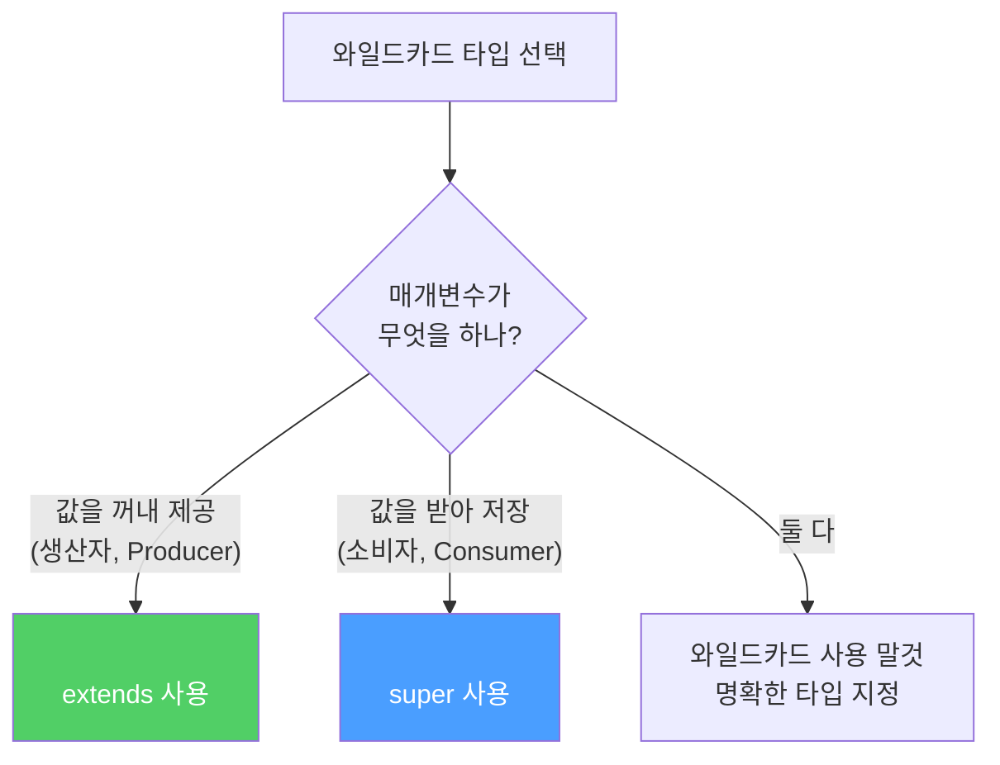

제네릭은 불공변이어서 `List<Integer>`를 `List<Number>` 자리에 쓸 수 없습니다. 때로는 이 제약이 너무 빡빡합니다. 한정적 와일드카드 타입이 이 유연성을 제공합니다.

---

## 1. 불공변의 한계 — pushAll 문제

비유하자면 **엄격한 규정**입니다. "Number 상자에는 Number만 넣을 수 있다"는 규칙 때문에 Integer도 못 넣습니다. Integer는 Number의 하위 타입인데도 불구하고요.

```java
// Stack<E>에 추가한 pushAll 메서드
public void pushAll(Iterable<E> src) {
    for (E e : src) push(e);
}

// 문제 발생
Stack<Number> numberStack = new Stack<>();
Iterable<Integer> integers = List.of(1, 2, 3);
numberStack.pushAll(integers);
// 오류! Iterable<Integer>는 Iterable<Number>의 하위 타입이 아님
```

Integer는 Number의 하위 타입인데, 제네릭 불공변 때문에 `Iterable<Integer>`는 `Iterable<Number>`의 하위 타입이 아닙니다.

**해결: `<? extends E>` — 생산자 와일드카드**

```java
// E의 하위 타입의 Iterable도 받을 수 있음
public void pushAll(Iterable<? extends E> src) {
    for (E e : src) push(e);
}

// 이제 정상 동작
Stack<Number> numberStack = new Stack<>();
numberStack.pushAll(List.of(1, 2, 3));    // Integer — OK
numberStack.pushAll(List.of(1.0, 2.0));   // Double  — OK
```

---

## 2. 불공변의 한계 — popAll 문제

```java
// Stack<E>에 추가한 popAll 메서드
public void popAll(Collection<E> dst) {
    while (!isEmpty()) dst.add(pop());
}

// 문제 발생
Stack<Number> numberStack = new Stack<>();
Collection<Object> objects = new ArrayList<>();
numberStack.popAll(objects);
// 오류! Collection<Object>는 Collection<Number>의 하위 타입이 아님
```

**해결: `<? super E>` — 소비자 와일드카드**

```java
// E의 상위 타입의 Collection도 받을 수 있음
public void popAll(Collection<? super E> dst) {
    while (!isEmpty()) dst.add(pop());
}

// 이제 정상 동작
Stack<Number> numberStack = new Stack<>();
Collection<Object> objects = new ArrayList<>();
numberStack.popAll(objects);  // Object는 Number의 상위 타입 — OK
```

---

## 3. PECS 공식 — 어떤 와일드카드를 쓸지 결정하는 법


```mermaid
graph TD
    A["와일드카드 타입 선택"] --> B{"매개변수가\n무엇을 하나?"}
    B -->|"값을 꺼내 제공\n(생산자, Producer)"| C["<? extends E>\nextends 사용"]
    B -->|"값을 받아 저장\n(소비자, Consumer)"| D["<? super E>\nsuper 사용"]
    B -->|"둘 다"| E["와일드카드 사용 말것\n명확한 타입 지정"]
    style C fill:#51cf66,color:#fff
    style D fill:#4a9eff,color:#fff
```

**PECS: Producer-Extends, Consumer-Super**

```java
// pushAll: src는 E를 꺼내 Stack에 넣음 → 생산자 → extends
public void pushAll(Iterable<? extends E> src)

// popAll: dst는 Stack에서 꺼낸 E를 받아 저장 → 소비자 → super
public void popAll(Collection<? super E> dst)
```

---

## 4. PECS 적용 예시들

```java
// Chooser 생성자: choices는 T를 꺼내 제공 → 생산자 → extends
public Chooser(Collection<? extends T> choices)
// 이제 Chooser<Number>에 List<Integer>를 넘길 수 있음

// union 메서드: s1, s2는 E를 꺼내 제공 → 생산자 → extends
public static <E> Set<E> union(Set<? extends E> s1, Set<? extends E> s2)
// 이제 Set<Integer>와 Set<Double>을 합쳐 Set<Number>를 만들 수 있음

Set<Integer> integers = Set.of(1, 3, 5);
Set<Double>  doubles  = Set.of(2.0, 4.0, 6.0);
Set<Number>  numbers  = union(integers, doubles);  // 정상 동작!
```

반환 타입에는 와일드카드를 쓰지 마세요. 클라이언트 코드까지 와일드카드를 써야 하는 상황이 생깁니다.

---

## 5. Comparable과 Comparator는 항상 소비자

```java
// 원래 선언
public static <E extends Comparable<E>> E max(List<E> list)

// PECS 적용 후
public static <E extends Comparable<? super E>> E max(List<? extends E> list)
```

- `List<? extends E>`: list는 E를 꺼내 제공 → 생산자 → `extends`
- `Comparable<? super E>`: Comparable은 E를 받아 비교 → 소비자 → `super`

이렇게 해야 `ScheduledFuture<?>`처럼 `Comparable<ScheduledFuture>`는 직접 구현하지 않고 `Comparable<Delayed>`를 통해 간접적으로 구현한 타입도 처리할 수 있습니다.

**Comparable과 Comparator는 언제나 소비자이므로, `Comparable<? super E>`, `Comparator<? super E>`를 선호하세요.**

---

## 6. 타입 매개변수 vs 와일드카드 — swap 예시

```java
// 두 선언 모두 가능
public static <E> void swap(List<E> list, int i, int j);  // 타입 매개변수
public static void swap(List<?> list, int i, int j);       // 와일드카드
```

public API라면 두 번째(와일드카드)가 더 간단합니다. **메서드 선언에 타입 매개변수가 한 번만 나오면 와일드카드로 대체하세요.**

단, `List<?>`에는 null 외에 넣을 수 없으므로 private 도우미 메서드가 필요합니다.

```java
// 외부: 깔끔한 와일드카드 API
public static void swap(List<?> list, int i, int j) {
    swapHelper(list, i, j);
}

// 내부: 실제 타입 정보를 가진 제네릭 메서드
private static <E> void swapHelper(List<E> list, int i, int j) {
    list.set(i, list.set(j, list.get(i)));
}
```

---

## 7. 요약

> 조금 복잡하더라도 와일드카드 타입을 적용하면 API가 훨씬 유연해집니다. **PECS 공식**을 기억하세요: 생산자(Producer)는 `extends`, 소비자(Consumer)는 `super`. Comparable과 Comparator는 모두 소비자입니다.

---

> 참조: 이펙티브 자바 3/E — 조슈아 블로크
