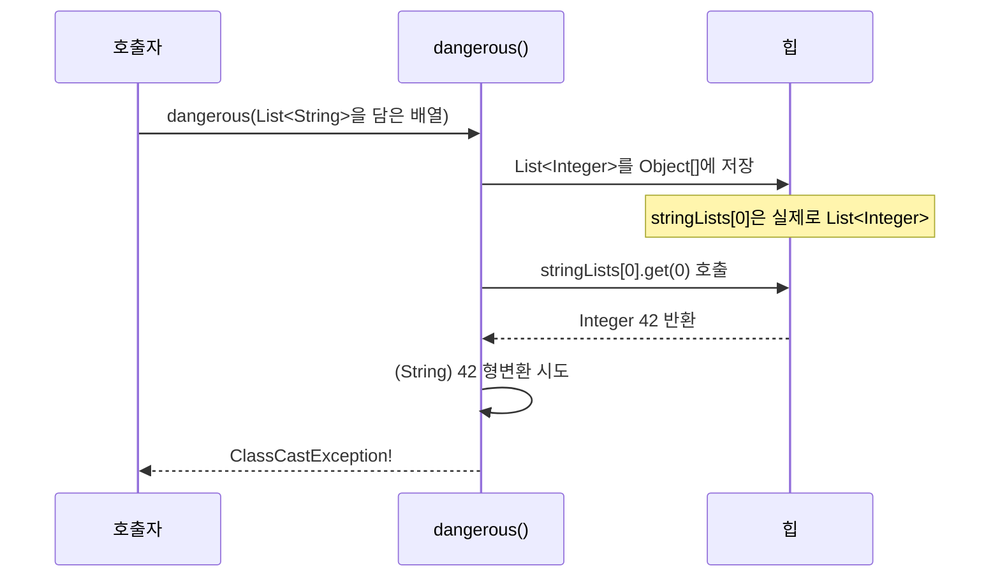
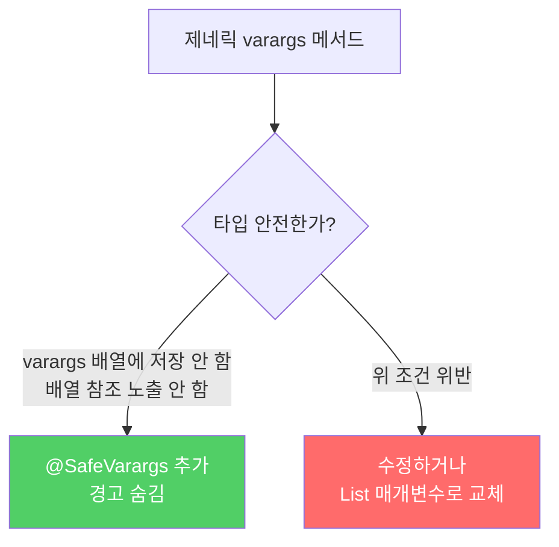

가변인수(varargs)와 제네릭은 Java 5에서 함께 등장했지만, 사실 궁합이 좋지 않습니다. 둘을 혼용하면 타입 안전성이 깨질 수 있습니다.

---

## 1. 왜 궁합이 나쁜가?

비유하자면 **레이블 없는 창고에 물건을 모아두는 것**입니다. 가변인수는 내부에서 배열을 만드는데, 제네릭 타입 정보는 런타임에 소거됩니다. 배열은 살아있고 타입 정보는 지워지니, 타입 안전성에 구멍이 생깁니다.

```java
// 가변인수 메서드를 호출하면 내부에서 배열이 자동 생성됨
void method(String... args) {
    // 내부적으로 String[] args = new String[...] 로 변환됨
}

// 제네릭 varargs를 쓰면 경고 발생
void genericMethod(List<String>... lists) {
    // warning: Possible heap pollution from parameterized vararg type List<String>
}
```

---

## 2. 힙 오염이 실제로 발생하는 예

```java
static void dangerous(List<String>... stringLists) {
    List<Integer> intList = List.of(42);
    Object[] objects = stringLists;  // 배열은 공변이므로 가능
    objects[0] = intList;            // 힙 오염 발생! (경고만 나고 성공)
    String s = stringLists[0].get(0);  // ClassCastException!
    // 보이지 않는 형변환: (String) 42 → 실패
}
```



형변환 코드가 눈에 보이지 않는데도 런타임에 터집니다. 이런 이유로 **제네릭 varargs 배열에 값을 저장하는 것은 안전하지 않습니다.**

---

## 3. 그런데 왜 제네릭 varargs는 허용되나?

제네릭 배열 생성(`new E[n]`)은 컴파일 오류이지만, 제네릭 varargs 메서드 선언은 경고만 납니다. 이유는 실무에서 매우 유용하기 때문입니다.

```java
// Java 표준 라이브러리에도 제네릭 varargs가 많음
Arrays.asList(T... a)
Collections.addAll(Collection<? super T> c, T... elements)
EnumSet.of(E first, E... rest)
```

이들은 모두 타입 안전하게 구현되어 있습니다.

---

## 4. @SafeVarargs — 타입 안전하다는 약속

Java 7에서 `@SafeVarargs` 어노테이션이 추가되었습니다. 메서드 작성자가 "이 메서드는 타입 안전하다"고 컴파일러에게 약속하는 장치입니다.

**메서드가 타입 안전한 조건:**
1. varargs 배열에 아무것도 저장하지 않는다
2. 배열 참조를 신뢰할 수 없는 코드에 노출하지 않는다

```java
// 안전한 예 — 배열에서 읽기만 함
@SafeVarargs
static <T> List<T> flatten(List<? extends T>... lists) {
    List<T> result = new ArrayList<>();
    for (List<? extends T> list : lists) {
        result.addAll(list);  // 배열에 쓰지 않음, 참조 노출 안 함
    }
    return result;
}
```

```java
// 안전하지 않은 예 — 배열 참조를 그대로 반환
static <T> T[] toArray(T... args) {
    return args;  // 배열 참조 노출 → 안전하지 않음!
}

// toArray를 호출하는 pickTwo
static <T> T[] pickTwo(T a, T b, T c) {
    switch (ThreadLocalRandom.current().nextInt(3)) {
        case 0: return toArray(a, b);
        case 1: return toArray(a, c);
        case 2: return toArray(b, c);
    }
    throw new AssertionError();
}

// 사용 — ClassCastException!
String[] attrs = pickTwo("좋은", "빠른", "저렴한");
// pickTwo는 항상 Object[]를 반환
// Object[]는 String[]의 하위 타입이 아님 → 형변환 실패
```

---

## 5. @SafeVarargs 대신 List를 쓰는 방법

varargs 대신 `List` 매개변수를 쓰면 컴파일러가 타입 안전성을 직접 검증할 수 있습니다.

```java
// @SafeVarargs 버전
@SafeVarargs
static <T> List<T> flatten(List<? extends T>... lists) { ... }

// List 버전 — 더 안전
static <T> List<T> flatten(List<List<? extends T>> lists) {
    List<T> result = new ArrayList<>();
    for (List<? extends T> list : lists) {
        result.addAll(list);
    }
    return result;
}

// 호출: List.of()로 임의 개수 인수 전달
audience = flatten(List.of(friends, romans, countrymen));
```

```java
// pickTwo를 List 버전으로 변환 — ClassCastException 없음
static <T> List<T> pickTwo(T a, T b, T c) {
    switch (ThreadLocalRandom.current().nextInt(3)) {
        case 0: return List.of(a, b);
        case 1: return List.of(a, c);
        case 2: return List.of(b, c);
    }
    throw new AssertionError();
}

List<String> attrs = pickTwo("좋은", "빠른", "저렴한");  // 정상 동작!
```

---

## 6. @SafeVarargs 사용 규칙



> `@SafeVarargs`는 재정의할 수 없는 메서드에만 달아야 합니다. Java 8에서는 정적 메서드와 `final` 인스턴스 메서드에만, Java 9부터는 `private` 인스턴스 메서드에도 허용됩니다.

---

## 7. 요약

> 가변인수와 제네릭은 궁합이 좋지 않습니다. 가변인수가 내부에서 만드는 배열이 노출되고, 배열과 제네릭의 타입 규칙이 다르기 때문입니다. 제네릭 varargs 메서드를 작성한다면, 타입 안전한지 확인하고 `@SafeVarargs`를 달거나, varargs 대신 `List` 매개변수를 사용하세요.

---

> 참조: 이펙티브 자바 3/E — 조슈아 블로크
