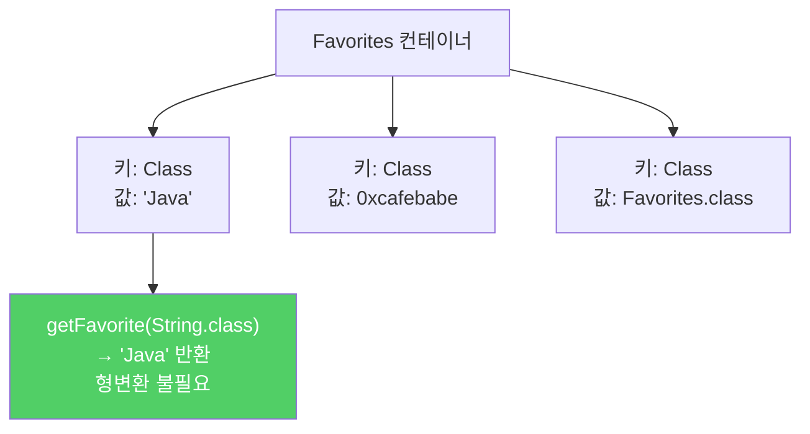
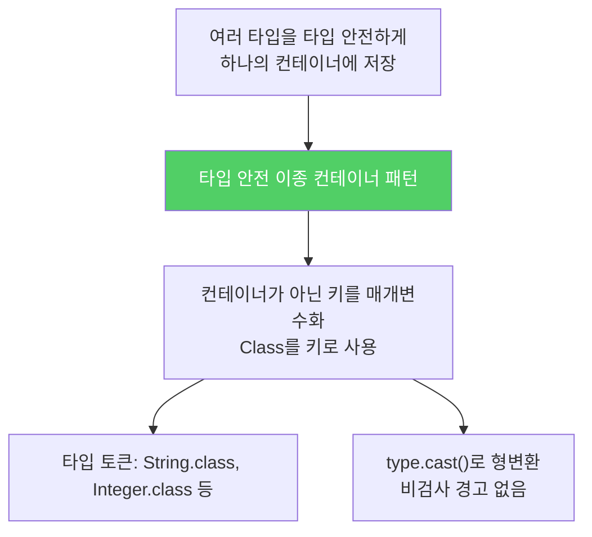

`Set<E>`나 `Map<K,V>` 같은 일반 제네릭 컨테이너는 타입 매개변수의 수가 고정됩니다. 하나의 컨테이너에서 서로 다른 타입을 타입 안전하게 저장하고 싶다면, 키를 타입 매개변수로 사용하면 됩니다.

---

## 1. 일반 컨테이너의 한계

비유하자면 **고정 칸수의 책장**입니다. `Map<K,V>`는 Key 칸과 Value 칸, 두 칸만 있습니다. 여러 타입의 물건을 각각 타입 안전하게 보관하려면 다른 접근이 필요합니다.

```java
// 일반 컨테이너 — 타입 매개변수 수 고정
Set<String> strings = new HashSet<>();         // 1개
Map<String, Integer> map = new HashMap<>();    // 2개

// 여러 타입을 함께 저장하고 싶다면?
Map<Class<?>, Object> favorites = new HashMap<>();
// 값 타입이 Object라 타입 안전성 없음 — get()할 때 형변환 필요
```

---

## 2. 타입 안전 이종 컨테이너 패턴

**컨테이너가 아닌 키를 매개변수화**합니다. `Class<T>` 객체를 키로 사용하면 됩니다.

```java
// Favorites API
public class Favorites {
    public <T> void putFavorite(Class<T> type, T instance);
    public <T> T getFavorite(Class<T> type);
}

// 사용 예
Favorites f = new Favorites();
f.putFavorite(String.class,  "Java");
f.putFavorite(Integer.class, 0xcafebabe);
f.putFavorite(Class.class,   Favorites.class);

String  s = f.getFavorite(String.class);   // 형변환 불필요!
int     i = f.getFavorite(Integer.class);
Class<?> c = f.getFavorite(Class.class);
// Java cafebabe Favorites
```



`class` 리터럴의 타입은 `Class<T>`입니다. `String.class`는 `Class<String>`, `Integer.class`는 `Class<Integer>`입니다. 이를 **타입 토큰(type token)**이라 합니다.

---

## 3. 구현

```java
public class Favorites {
    // 키: Class<?> (모든 타입의 Class 객체 허용)
    // 값: Object (실제 값의 타입은 키와 대응됨)
    private Map<Class<?>, Object> favorites = new HashMap<>();

    public <T> void putFavorite(Class<T> type, T instance) {
        favorites.put(Objects.requireNonNull(type), instance);
    }

    public <T> T getFavorite(Class<T> type) {
        // type.cast()로 동적 형변환 — 비검사 경고 없음
        return type.cast(favorites.get(type));
    }
}
```

`type.cast(obj)` 메서드는 `Class<T>`가 제네릭이라는 이점을 활용합니다.

```java
public class Class<T> {
    T cast(Object obj);  // 반환 타입이 T
}
```

`(T)` 비검사 형변환 대신 `type.cast()`를 사용하면 `T`로 안전하게 변환하면서 비검사 경고도 없습니다.

---

## 4. 런타임 타입 안전성 강화

악의적인 클라이언트가 로 타입으로 `Class` 객체를 넘겨 타입 불변식을 깰 수 있습니다. 이를 방어하려면 `putFavorite`에서 타입을 검증합니다.

```java
public <T> void putFavorite(Class<T> type, T instance) {
    // 저장 전에 type과 instance의 타입이 일치하는지 동적 검증
    favorites.put(Objects.requireNonNull(type), type.cast(instance));
}
```

`Collections.checkedSet`, `checkedList`, `checkedMap`이 이 방식으로 구현되어 있습니다.

---

## 5. 두 가지 제약

**제약 1: 로 타입으로 안전성을 깰 수 있음** (위의 `type.cast()`로 방어 가능)

**제약 2: 실체화 불가 타입에는 사용 불가**

```java
f.putFavorite(String.class, "hello");          // OK
f.putFavorite(String[].class, new String[0]); // OK
f.putFavorite(List<String>.class, list);      // 컴파일 오류!
// List<String>.class 라는 리터럴이 존재하지 않음
// List<String>과 List<Integer>는 같은 List.class를 공유
```

이 제약의 우회로로 **슈퍼 타입 토큰**이 있습니다. Spring의 `ParameterizedTypeReference`가 이 방식을 구현합니다.

---

## 6. 한정적 타입 토큰

허용하는 타입을 제한하고 싶다면 한정적 타입 토큰을 씁니다.

```java
// Annotation API: 한정적 타입 토큰으로 애너테이션만 허용
public <T extends Annotation> T getAnnotation(Class<T> annotationType);

// 사용
MyAnnotation ann = element.getAnnotation(MyAnnotation.class);
```

비한정적 `Class<?>`를 한정적 타입 토큰을 받는 메서드에 넘기려면 `asSubclass()`를 사용합니다.

```java
// asSubclass — 비한정적 → 한정적 타입 토큰으로 안전하게 변환
static Annotation getAnnotation(AnnotatedElement element, String typeName) {
    Class<?> annotationType = null;
    try {
        annotationType = Class.forName(typeName);
    } catch (Exception ex) {
        throw new IllegalArgumentException(ex);
    }
    return element.getAnnotation(
        annotationType.asSubclass(Annotation.class));  // 안전한 형변환
}
```

---

## 7. 요약



> 컬렉션 API로 대표되는 일반적인 형태에서는 한 컨테이너가 다룰 수 있는 타입 매개변수의 수가 고정됩니다. 하지만 컨테이너 자체가 아닌 키를 타입 매개변수로 바꾸면 이런 제약 없는 타입 안전 이종 컨테이너를 만들 수 있습니다. 이런 식으로 쓰이는 `Class` 객체를 타입 토큰이라 합니다.

---

> 참조: 이펙티브 자바 3/E — 조슈아 블로크
