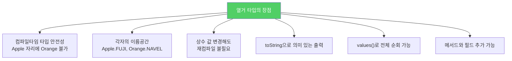
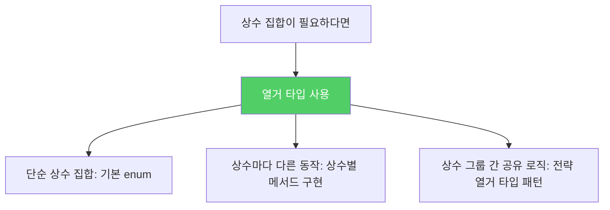

정수 상수 묶음 대신 열거 타입을 쓰면 코드가 훨씬 안전하고 읽기 좋아집니다. 더 나아가 열거 타입은 데이터와 메서드를 가질 수 있는 완전한 클래스입니다.

---

## 1. 정수 열거 패턴의 문제점

비유하자면 **숫자로만 구분하는 직원 번호 시스템**입니다. 1번이 영업부인지 개발부인지 규약만 있을 뿐 컴파일러는 모릅니다. 영업부에 개발부 번호를 실수로 넘겨도 아무도 잡아주지 않습니다.

```java
// 정수 열거 패턴 — 취약하다
public static final int APPLE_FUJI         = 0;
public static final int APPLE_PIPPIN       = 1;
public static final int ORANGE_NAVEL       = 0;
public static final int ORANGE_TEMPLE      = 1;

// 실수로 오렌지에 사과를 넘겨도 컴파일 OK
int result = (APPLE_FUJI - ORANGE_TEMPLE) / APPLE_PIPPIN;
```

**정수 열거 패턴의 단점:**
- 타입 안전성 없음 (사과 자리에 오렌지 숫자 전달 가능)
- 이름공간이 없어 접두어(`APPLE_`, `ORANGE_`)로 구분해야 함
- 상수 값이 변경되면 클라이언트도 재컴파일 필요
- 출력하면 의미 없는 숫자만 보임
- 그룹 내 상수 순회 방법 없음

---

## 2. 열거 타입 — 완전한 클래스

```java
// 간단한 열거 타입
public enum Apple  { FUJI, PIPPIN, GRANNY_SMITH }
public enum Orange { NAVEL, TEMPLE, BLOOD }
```



열거 타입은 상수당 인스턴스를 하나씩 만들어 `public static final` 필드로 공개합니다. 생성자를 외부에 제공하지 않으므로 사실상 `final`이며, 인스턴스가 딱 하나씩만 존재하는 **싱글톤을 일반화한 형태**입니다.

---

## 3. 데이터와 메서드를 가진 열거 타입 — Planet

```java
public enum Planet {
    MERCURY(3.302e+23, 2.439e6),
    VENUS  (4.869e+24, 6.052e6),
    EARTH  (5.975e+24, 6.378e6),
    MARS   (6.419e+23, 3.393e6),
    JUPITER(1.899e+27, 7.149e7),
    SATURN (5.685e+26, 6.027e7),
    URANUS (8.683e+25, 2.556e7),
    NEPTUNE(1.024e+26, 2.477e7);

    private final double mass;          // 질량 (kg)
    private final double radius;        // 반지름 (m)
    private final double surfaceGravity;// 표면중력 (m/s²)

    private static final double G = 6.67300E-11;

    Planet(double mass, double radius) {
        this.mass          = mass;
        this.radius        = radius;
        this.surfaceGravity = G * mass / (radius * radius);
    }

    public double mass()           { return mass; }
    public double radius()         { return radius; }
    public double surfaceGravity() { return surfaceGravity; }

    public double surfaceWeight(double mass) {
        return mass * surfaceGravity;
    }
}

// 사용
double earthWeight = 75.0;
double mass = earthWeight / Planet.EARTH.surfaceGravity();
for (Planet p : Planet.values()) {
    System.out.printf("%s에서의 무게: %.2f%n", p, p.surfaceWeight(mass));
}
```

열거 타입은 근본적으로 불변이므로 **모든 필드는 `final`**이어야 합니다.

---

## 4. 상수별 메서드 구현 — switch 없이 상수마다 다른 동작

```java
// 나쁜 예 — switch 문으로 분기 (새 상수 추가 시 case 누락 위험)
public enum Operation {
    PLUS, MINUS, TIMES, DIVIDE;

    public double apply(double x, double y) {
        switch (this) {
            case PLUS:   return x + y;
            case MINUS:  return x - y;
            case TIMES:  return x * y;
            case DIVIDE: return x / y;
        }
        throw new AssertionError("알 수 없는 연산: " + this);
    }
}

// 좋은 예 — 상수별 메서드 구현 (추상 메서드를 각 상수가 직접 구현)
public enum Operation {
    PLUS("+")  { public double apply(double x, double y) { return x + y; } },
    MINUS("-") { public double apply(double x, double y) { return x - y; } },
    TIMES("*") { public double apply(double x, double y) { return x * y; } },
    DIVIDE("/") { public double apply(double x, double y) { return x / y; } };

    private final String symbol;

    Operation(String symbol) { this.symbol = symbol; }

    @Override public String toString() { return symbol; }

    public abstract double apply(double x, double y);
}
```

새 상수를 추가하면 컴파일러가 `apply()` 구현을 강제합니다. `case` 누락 문제가 원천 차단됩니다.

---

## 5. fromString — toString 역변환

```java
// 문자열 → 열거 상수 역변환 메서드
private static final Map<String, Operation> stringToEnum =
    Stream.of(values()).collect(toMap(Object::toString, e -> e));

public static Optional<Operation> fromString(String symbol) {
    return Optional.ofNullable(stringToEnum.get(symbol));
}

// 사용
Operation.fromString("+").ifPresent(op -> System.out.println(op.apply(3, 4)));
// 7.0
```

---

## 6. 전략 열거 타입 패턴 — 코드 공유 + 안전성

```java
// 요일별 급여 계산 — 전략을 분리해 안전하게
enum PayrollDay {
    MONDAY(WEEKDAY), TUESDAY(WEEKDAY), WEDNESDAY(WEEKDAY),
    THURSDAY(WEEKDAY), FRIDAY(WEEKDAY),
    SATURDAY(WEEKEND), SUNDAY(WEEKEND);

    private final PayType payType;

    PayrollDay(PayType payType) { this.payType = payType; }

    int pay(int minutesWorked, int payRate) {
        return payType.pay(minutesWorked, payRate);
    }

    // 전략 열거 타입 — 잔업 계산 로직만 분리
    enum PayType {
        WEEKDAY {
            int overtimePay(int mins, int payRate) {
                return mins <= MINS_PER_SHIFT ? 0
                    : (mins - MINS_PER_SHIFT) * payRate / 2;
            }
        },
        WEEKEND {
            int overtimePay(int mins, int payRate) {
                return mins * payRate / 2;
            }
        };

        abstract int overtimePay(int mins, int payRate);
        private static final int MINS_PER_SHIFT = 8 * 60;

        int pay(int minsWorked, int payRate) {
            return minsWorked * payRate + overtimePay(minsWorked, payRate);
        }
    }
}
```

새 요일(휴가 등)을 추가할 때 전략(`WEEKDAY` or `WEEKEND`)만 선택하면 됩니다. `switch` 문 누락 오류가 없습니다.

---

## 7. 요약



> 열거 타입은 정수 상수보다 더 읽기 쉽고 안전하고 강력합니다. 대다수는 명시적 생성자나 메서드 없이 쓰이지만, 각 상수를 특정 데이터와 연결짓거나 상수마다 다르게 동작해야 할 때는 상수별 메서드 구현을 사용하세요. 상수 일부가 같은 동작을 공유한다면 전략 열거 타입 패턴을 사용하세요.

---

> 참조: 이펙티브 자바 3/E — 조슈아 블로크
