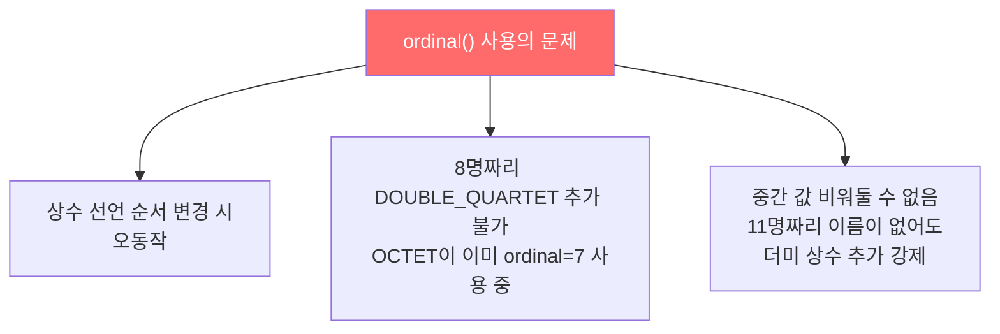
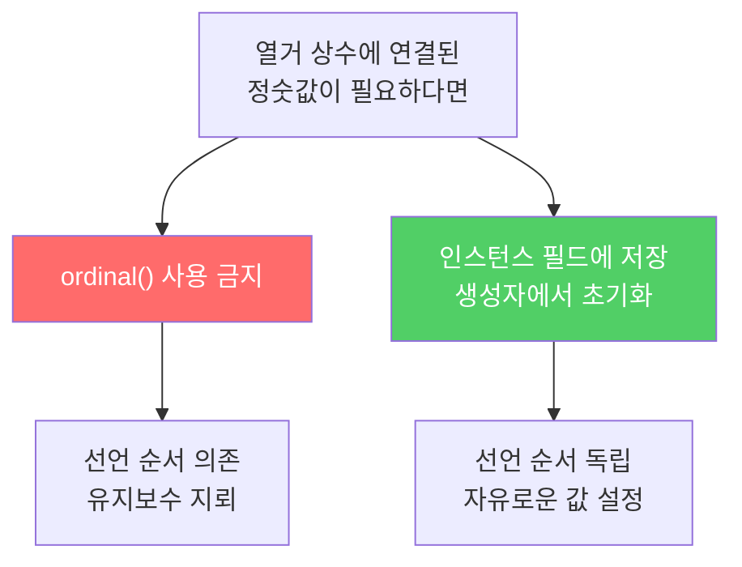

모든 열거 타입은 `ordinal()`이라는 메서드를 제공합니다. 상수가 몇 번째 위치인지 반환하는 메서드입니다. 이 메서드를 연결된 정숫값을 얻는 데 쓰면 안 됩니다.

---

## 1. ordinal 오용 — 위험한 유혹

비유하자면 **줄 서 있는 순서로 직급을 결정하는 것**입니다. 줄 순서가 바뀌거나 중간에 누가 끼어들면 직급이 뒤바뀝니다.

```java
// ordinal을 잘못 사용한 예 — 절대 따라 하지 말 것
public enum Ensemble {
    SOLO, DUET, TRIO, QUARTET, QUINTET,
    SEXTET, SEPTET, OCTET, NONET, DECTET;

    public int numberOfMusicians() {
        return ordinal() + 1;  // 선언 순서에 전적으로 의존!
    }
}
```



**만약 이걸 쓰면?**
- `SOLO`와 `DUET` 순서를 바꾸면 `SOLO.numberOfMusicians()`이 2를 반환
- 8명짜리 `DOUBLE_QUARTET`을 추가할 수 없음 — `OCTET`과 `ordinal` 충돌
- 12명짜리 `TRIPLE_QUARTET`을 추가하려면 11명짜리 더미 상수도 강제 추가

---

## 2. 해결책 — 인스턴스 필드에 저장

```java
// 올바른 방법 — 인스턴스 필드에 저장
public enum Ensemble {
    SOLO(1), DUET(2), TRIO(3), QUARTET(4), QUINTET(5),
    SEXTET(6), SEPTET(7), OCTET(8), DOUBLE_QUARTET(8),  // 8명 중복 OK!
    NONET(9), DECTET(10), TRIPLE_QUARTET(12);            // 11 건너뜀도 OK!

    private final int numberOfMusicians;

    Ensemble(int size) {
        this.numberOfMusicians = size;
    }

    public int numberOfMusicians() {
        return numberOfMusicians;
    }
}
```

이제 선언 순서와 무관하게 동작하고, 같은 값을 가진 상수도 자유롭게 추가할 수 있습니다.

---

## 3. ordinal은 언제 쓰나?

`Enum`의 API 문서는 명확하게 말합니다.

> 대부분의 프로그래머는 이 메서드를 쓸 일이 없다. `ordinal`은 `EnumSet`, `EnumMap` 같은 열거 타입 기반의 범용 자료구조에 쓸 목적으로 설계되었다.

```java
// EnumSet, EnumMap 내부 구현에서만 사용
EnumSet<Ensemble> smallGroups = EnumSet.of(SOLO, DUET, TRIO);
// 내부적으로 ordinal을 비트 인덱스로 사용 — 직접 쓸 필요 없음
```

---

## 4. 요약



> 열거 타입 상수에 연결된 값은 절대로 `ordinal()` 메서드로 얻지 마세요. 인스턴스 필드에 저장하세요.

---

> 참조: 이펙티브 자바 3/E — 조슈아 블로크
