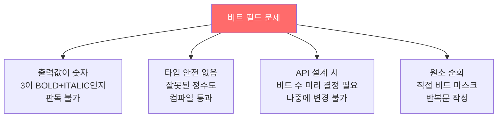
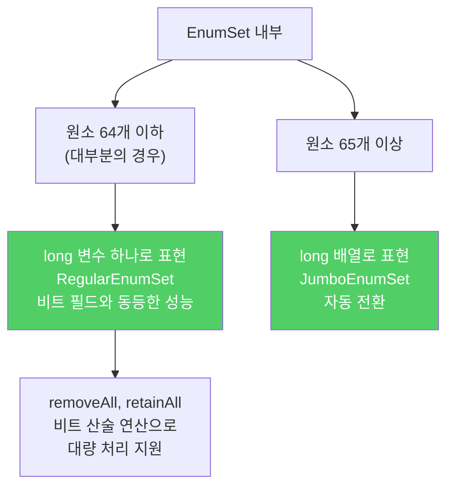
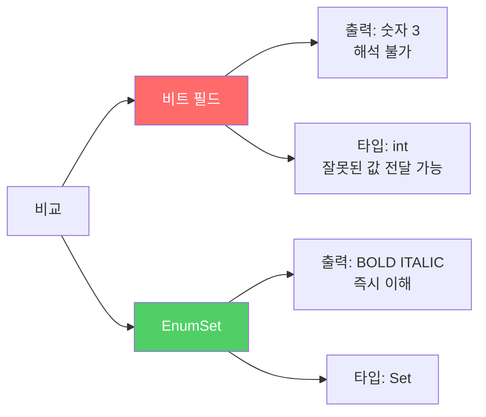
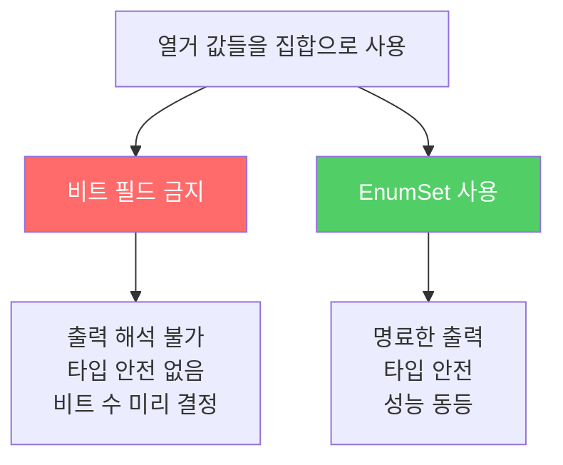

열거한 값들을 집합으로 사용할 때, 예전에는 2의 거듭제곱 정수를 비트 OR로 합치는 비트 필드를 썼습니다. 이제는 `EnumSet`이 그 역할을 훨씬 잘 해냅니다.

---

## 1. 비트 필드 — 낡은 방식의 유혹

비유하자면 **깃발 여러 개를 하나의 숫자로 눌러 담는 것**입니다. `BOLD=1, ITALIC=2, UNDERLINE=4`를 OR로 합치면 `3`이 되는데, 이 숫자만 봐서는 어떤 스타일이 적용됐는지 즉시 알 수 없습니다.

```java
// 비트 필드 열거 상수 — 낡은 기법
public class Text {
    public static final int STYLE_BOLD          = 1 << 0; // 1
    public static final int STYLE_ITALIC        = 1 << 1; // 2
    public static final int STYLE_UNDERLINE     = 1 << 2; // 4
    public static final int STYLE_STRIKETHROUGH = 1 << 3; // 8

    public void applyStyles(int styles) { ... }
}

// 사용
text.applyStyles(STYLE_BOLD | STYLE_ITALIC); // 3 — 무슨 의미인지 불명확
```

**만약 이걸 계속 쓰면?**
- `applyStyles(3)`을 로그에서 보면 BOLD+ITALIC인지 UNDERLINE+???인지 해석 불가
- 처음 API를 `int`로 설계했다가 64개를 넘으면 `long`으로 교체해야 하고, API를 변경해야 함
- 모든 원소를 순회하려면 직접 비트 마스크 반복문을 작성해야 함
- 정수 열거 패턴의 단점(타입 안전 없음, 이름공간 없음)을 그대로 계승



---

## 2. 해결책 — EnumSet

비유하자면 **이름 붙은 체크박스 모음**입니다. `EnumSet.of(Style.BOLD, Style.ITALIC)`는 그 자체로 의미가 명확하고, 내부는 비트 벡터로 구현되어 성능도 비트 필드와 동등합니다.

```java
// EnumSet — 비트 필드를 대체하는 현대적 기법
public class Text {
    public enum Style { BOLD, ITALIC, UNDERLINE, STRIKETHROUGH }

    // EnumSet<Style>이 아닌 Set<Style>로 선언 — 인터페이스 타입이 더 유연
    public void applyStyles(Set<Style> styles) { ... }
}

// 사용
Text text = new Text();
text.applyStyles(EnumSet.of(Style.BOLD, Style.ITALIC));
// 코드만 봐도 BOLD와 ITALIC 적용임을 즉시 알 수 있음
```

`applyStyles`가 `EnumSet<Style>`이 아니라 `Set<Style>`로 선언된 이유가 있습니다. 모든 클라이언트가 `EnumSet`을 넘기리라 예상되더라도, **인터페이스 타입으로 받는 것이 일반적으로 좋은 습관**입니다. 특이한 클라이언트가 다른 `Set` 구현체를 넘겨도 처리할 수 있습니다.

---

## 3. EnumSet의 내부 동작



내부적으로 비트 벡터를 쓰기 때문에 `removeAll`, `retainAll` 같은 대량 작업도 비트 산술로 효율적으로 처리됩니다. 비트 직접 조작의 오류 가능성은 `EnumSet`이 전부 감춰줍니다.

---

## 4. 비트 필드 vs EnumSet 비교

```java
// 비트 필드 방식
int styles = STYLE_BOLD | STYLE_ITALIC;
boolean hasBold = (styles & STYLE_BOLD) != 0;  // 직접 마스킹

// EnumSet 방식
Set<Style> styles = EnumSet.of(Style.BOLD, Style.ITALIC);
boolean hasBold = styles.contains(Style.BOLD);  // 가독성 명확
```



---

## 5. 유일한 단점

Java 9까지는 불변 `EnumSet`을 직접 만드는 방법이 없습니다. 불변이 필요하다면 `Collections.unmodifiableSet`으로 감싸면 됩니다.

```java
// 불변 EnumSet이 필요할 때
Set<Style> immutableStyles = Collections.unmodifiableSet(
    EnumSet.of(Style.BOLD, Style.ITALIC)
);
```

---

## 6. 요약



> 열거할 수 있는 타입을 집합으로 사용한다고 해도 비트 필드를 사용할 이유가 없습니다. `EnumSet`이 비트 필드 수준의 성능을 제공하면서 열거 타입의 장점까지 모두 갖추고 있습니다.

---

> 참조: 이펙티브 자바 3/E — 조슈아 블로크
