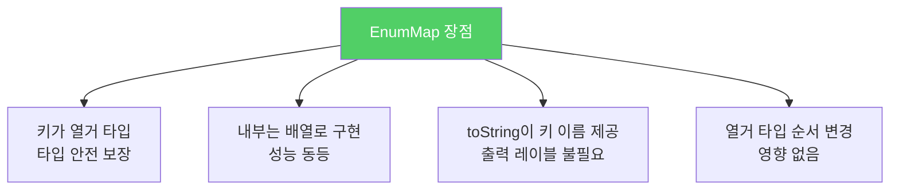
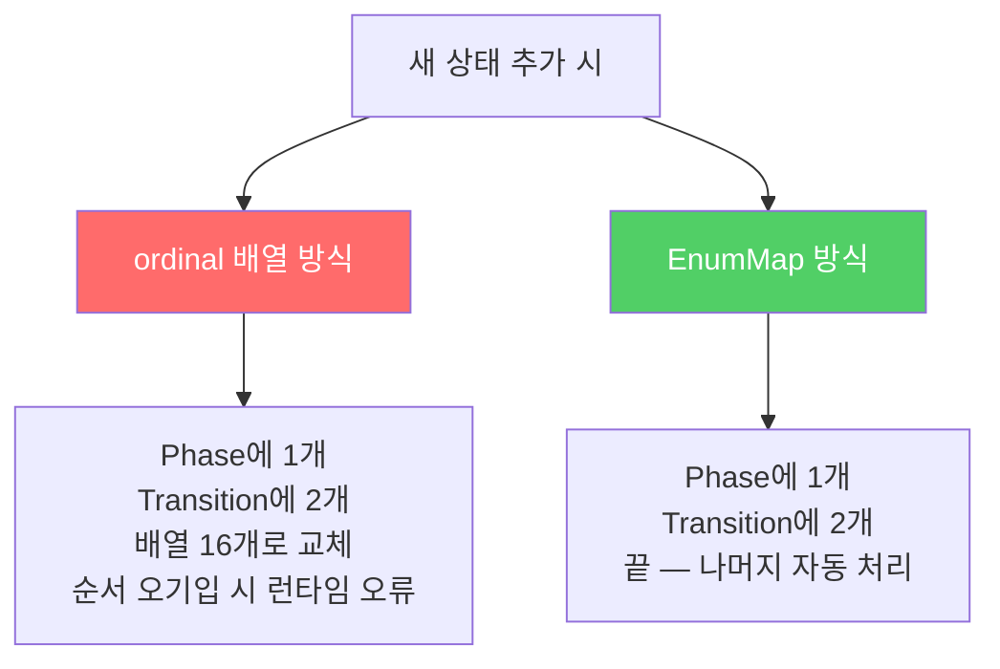

`ordinal()`로 배열 인덱스를 계산하는 패턴은 타입 안전하지 않고 유지보수가 어렵습니다. `EnumMap`이 훨씬 명확하고 안전하며 성능도 동등합니다.

---

## 1. ordinal 인덱싱 — 위험한 유혹

비유하자면 **직원 번호를 사물함 번호로 직접 쓰는 것**입니다. 1번 직원이 1번 사물함을 쓰도록 약속했는데, 직원 번호 체계가 바뀌면 사물함도 엉키고 맙니다.

```java
class Plant {
    enum LifeCycle { ANNUAL, PERENNIAL, BIENNIAL }

    final String name;
    final LifeCycle lifeCycle;

    Plant(String name, LifeCycle lifeCycle) {
        this.name = name;
        this.lifeCycle = lifeCycle;
    }

    @Override public String toString() { return name; }
}
```

```java
// ordinal()을 배열 인덱스로 사용 — 따라하지 말 것
Set<Plant>[] plantsByLifeCycle =
    (Set<Plant>[]) new Set[Plant.LifeCycle.values().length];
for (int i = 0; i < plantsByLifeCycle.length; i++)
    plantsByLifeCycle[i] = new HashSet<>();

for (Plant p : garden)
    plantsByLifeCycle[p.lifeCycle.ordinal()].add(p);  // ordinal로 인덱싱

for (int i = 0; i < plantsByLifeCycle.length; i++)
    System.out.printf("%s: %s%n",
        Plant.LifeCycle.values()[i], plantsByLifeCycle[i]);
```

**만약 이걸 쓰면?**
- 배열은 제네릭과 호환되지 않아 비검사 형변환 경고 발생
- `ordinal`과 배열 인덱스의 관계를 컴파일러가 모름 — 열거 타입 순서 변경 시 조용한 오동작
- 출력 레이블을 직접 달아야 함
- 잘못된 인덱스 사용 시 `ArrayIndexOutOfBoundsException`

---

## 2. 해결책 — EnumMap

비유하자면 **이름표 붙은 서랍장**입니다. 키가 열거 상수 자체이므로 순서가 바뀌어도 항상 올바른 서랍을 찾아갑니다.

```java
// EnumMap으로 데이터와 열거 타입을 매핑
Map<Plant.LifeCycle, Set<Plant>> plantsByLifeCycle =
    new EnumMap<>(Plant.LifeCycle.class);

for (Plant.LifeCycle lc : Plant.LifeCycle.values())
    plantsByLifeCycle.put(lc, new HashSet<>());

for (Plant p : garden)
    plantsByLifeCycle.get(p.lifeCycle).add(p);  // 타입 안전한 키!

System.out.println(plantsByLifeCycle);
```

비검사 형변환 없음, 출력 레이블 자동 포함, 배열 인덱스 오류 원천 차단.



`EnumMap` 생성자가 받는 `Plant.LifeCycle.class`는 **한정적 타입 토큰**입니다. 런타임 제네릭 타입 정보를 제공하여 내부 배열 크기를 결정합니다.

---

## 3. 스트림으로 더 간결하게

```java
// 스트림 사용 — EnumMap 명시
System.out.println(Arrays.stream(garden)
    .collect(groupingBy(p -> p.lifeCycle,
        () -> new EnumMap<>(LifeCycle.class), toSet())));
```

`Collectors.groupingBy`에 `mapFactory`로 `EnumMap`을 명시해야 합니다. 명시하지 않으면 일반 `HashMap`이 사용되어 성능 이점이 사라집니다.

스트림 버전과 `EnumMap` 단독 버전의 차이점이 하나 있습니다. `EnumMap` 버전은 생애주기별로 항상 맵 항목 3개를 만들지만, 스트림 버전은 해당 생애주기에 식물이 있을 때만 항목을 만듭니다.

---

## 4. 2차원 관계 — 중첩 EnumMap

두 열거 타입 값을 매핑할 때 `ordinal`로 2차원 배열을 만드는 코드를 종종 봅니다.

```java
// ordinal 2차원 배열 — 따라 하지 말 것
public enum Phase {
    SOLID, LIQUID, GAS;

    public enum Transition {
        MELT, FREEZE, BOIL, CONDENSE, SUBLIME, DEPOSIT;

        // 행: from의 ordinal, 열: to의 ordinal
        private static final Transition[][] TRANSITIONS = {
            { null, MELT,    SUBLIME  },
            { FREEZE, null,  BOIL     },
            { DEPOSIT, CONDENSE, null }
        };

        public static Transition from(Phase from, Phase to) {
            return TRANSITIONS[from.ordinal()][to.ordinal()];
        }
    }
}
```

`Phase`에 상태를 추가하면 `TRANSITIONS` 배열도 손으로 고쳐야 합니다. 크기가 맞지 않으면 `ArrayIndexOutOfBoundsException` 또는 조용한 오동작이 발생합니다.

---

## 5. 중첩 EnumMap으로 교체

```java
public enum Phase {
    SOLID, LIQUID, GAS;

    public enum Transition {
        MELT(SOLID, LIQUID),    FREEZE(LIQUID, SOLID),
        BOIL(LIQUID, GAS),      CONDENSE(GAS, LIQUID),
        SUBLIME(SOLID, GAS),    DEPOSIT(GAS, SOLID);

        private final Phase from;
        private final Phase to;

        Transition(Phase from, Phase to) {
            this.from = from;
            this.to = to;
        }

        // 상전이 맵 초기화
        private static final Map<Phase, Map<Phase, Transition>> m =
            Stream.of(values()).collect(
                groupingBy(t -> t.from,
                    () -> new EnumMap<>(Phase.class),
                    toMap(t -> t.to, t -> t,
                        (x, y) -> y,
                        () -> new EnumMap<>(Phase.class))));

        public static Transition from(Phase from, Phase to) {
            return m.get(from).get(to);
        }
    }
}
```

새 상태 `PLASMA`를 추가하려면 단 두 곳만 수정합니다.

```java
// PLASMA 추가 — Phase에 상수 하나, Transition에 두 개만 추가
public enum Phase {
    SOLID, LIQUID, GAS, PLASMA;  // PLASMA 추가

    public enum Transition {
        MELT(SOLID, LIQUID),    FREEZE(LIQUID, SOLID),
        BOIL(LIQUID, GAS),      CONDENSE(GAS, LIQUID),
        SUBLIME(SOLID, GAS),    DEPOSIT(GAS, SOLID),
        IONIZE(GAS, PLASMA),    DEIONIZE(PLASMA, GAS);  // 두 개 추가
        // 나머지 코드는 그대로
    }
}
```



내부적으로 맵들의 맵이 배열들의 배열로 구현되므로 성능도 비등합니다.

---

## 6. 요약

> 배열의 인덱스를 얻기 위해 `ordinal`을 쓰는 것은 일반적으로 좋지 않습니다. 대신 `EnumMap`을 사용하세요. 다차원 관계는 `EnumMap<..., EnumMap<...>>`으로 표현하세요.

---

> 참조: 이펙티브 자바 3/E — 조슈아 블로크
