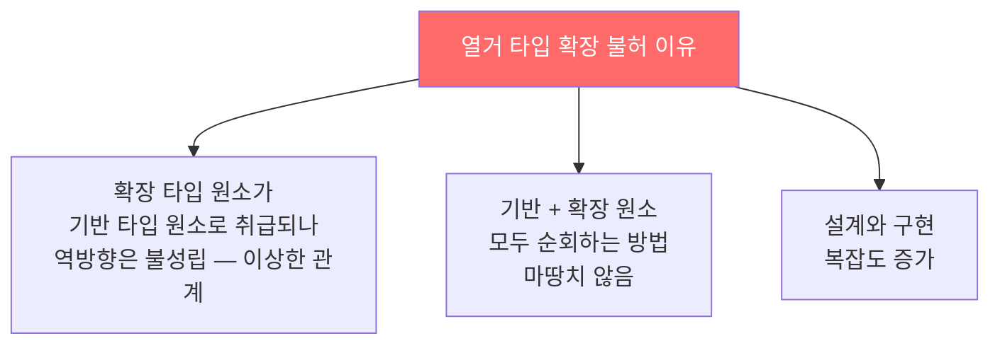
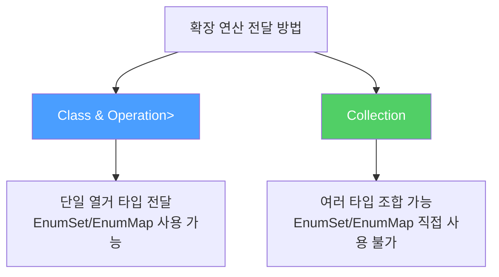
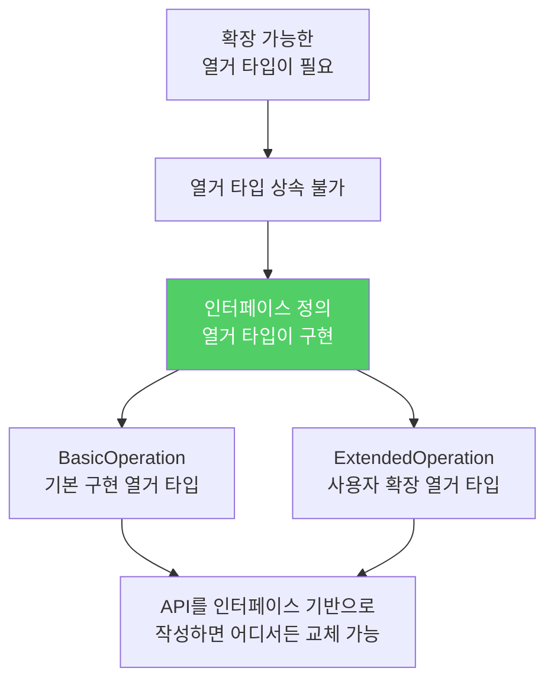

열거 타입은 상속으로 확장할 수 없습니다. 하지만 인터페이스를 이용하면 확장 가능한 열거 타입처럼 동작하는 구조를 만들 수 있습니다.

---

## 1. 열거 타입은 왜 확장할 수 없나?

비유하자면 **각인된 금속 도장**입니다. 한 번 만들어진 enum에는 새 상수를 상속받아 추가할 수 없습니다. 열거 타입 자체를 `extends`하는 것은 Java가 허용하지 않습니다.

확장을 허용하면 생기는 문제들이 있습니다.



대부분의 상황에서 열거 타입 확장은 좋은 생각이 아닙니다. 그러나 **연산 코드(operation code)** 에서는 확장이 유용합니다. API가 제공하는 기본 연산 외에 사용자 정의 연산을 추가할 수 있도록 열어줘야 할 때가 있습니다.

---

## 2. 해결책 — 인터페이스를 구현하는 열거 타입

비유하자면 **표준 계약서(인터페이스)를 서로 다른 팀(열거 타입)이 각자 채워 쓰는 것**입니다. `BasicOperation`은 기본 계약 이행 팀이고, `ExtendedOperation`은 추가 계약 이행 팀입니다. 둘 다 같은 계약서(`Operation`) 형식을 따릅니다.

```java
// 연산 코드용 인터페이스 정의
public interface Operation {
    double apply(double x, double y);
}

// 기본 열거 타입 — 인터페이스를 구현
public enum BasicOperation implements Operation {
    PLUS("+")  { public double apply(double x, double y) { return x + y; } },
    MINUS("-") { public double apply(double x, double y) { return x - y; } },
    TIMES("*") { public double apply(double x, double y) { return x * y; } },
    DIVIDE("/") { public double apply(double x, double y) { return x / y; } };

    private final String symbol;

    BasicOperation(String symbol) { this.symbol = symbol; }

    @Override public String toString() { return symbol; }
}
```

`BasicOperation`은 확장할 수 없지만 `Operation` 인터페이스는 확장할 수 있습니다. 이 인터페이스를 타입으로 사용하면 됩니다.

---

## 3. 열거 타입 확장하기

```java
// 확장된 열거 타입 — 지수, 나머지 연산 추가
public enum ExtendedOperation implements Operation {
    EXP("^") {
        public double apply(double x, double y) { return Math.pow(x, y); }
    },
    REMAINDER("%") {
        public double apply(double x, double y) { return x % y; }
    };

    private final String symbol;

    ExtendedOperation(String symbol) { this.symbol = symbol; }

    @Override public String toString() { return symbol; }
}
```

`BasicOperation`을 쓰던 코드가 `Operation` 인터페이스 기반으로 작성되어 있다면, `ExtendedOperation`의 상수를 그 자리에 그대로 넣을 수 있습니다.

---

## 4. 타입 수준에서 확장 연산 전달하기

두 가지 방법으로 확장된 열거 타입의 모든 원소를 전달할 수 있습니다.

**방법 1 — 한정적 타입 토큰 (`Class<T extends Enum<T> & Operation>`)**

```java
public static void main(String[] args) {
    double x = 4.0, y = 2.0;
    test(ExtendedOperation.class, x, y);
}

// T는 열거 타입인 동시에 Operation의 하위 타입이어야 함
private static <T extends Enum<T> & Operation> void test(
        Class<T> opEnumType, double x, double y) {
    for (Operation op : opEnumType.getEnumConstants())
        System.out.printf("%f %s %f = %f%n", x, op, y, op.apply(x, y));
}
```

`<T extends Enum<T> & Operation>`의 의미: `T`는 열거 타입(`Enum<T>`)이어야 원소를 순회할 수 있고, `Operation`이어야 연산을 수행할 수 있습니다.

**방법 2 — 한정적 와일드카드 (`Collection<? extends Operation>`)**

```java
public static void main(String[] args) {
    double x = 4.0, y = 2.0;
    test(Arrays.asList(ExtendedOperation.values()), x, y);
}

private static void test(Collection<? extends Operation> opSet,
        double x, double y) {
    for (Operation op : opSet)
        System.out.printf("%f %s %f = %f%n", x, op, y, op.apply(x, y));
}
```

방법 2가 더 유연합니다. 여러 구현 타입의 연산을 조합해 한 번에 전달할 수 있습니다. 단, `EnumSet`과 `EnumMap`을 직접 쓸 수 없다는 단점이 있습니다.



---

## 5. 사소한 단점 — 구현 코드 공유 불가

열거 타입끼리는 구현을 상속할 수 없습니다. `BasicOperation`과 `ExtendedOperation`이 공유하는 로직이 있다면 중복이 생깁니다.

공유 로직이 상태(필드)에 의존하지 않는다면, 인터페이스에 디폴트 메서드로 추가하는 방법으로 해결할 수 있습니다.

```java
// 공유 로직이 있다면 인터페이스 디폴트 메서드로
public interface Operation {
    double apply(double x, double y);

    default String describe(double x, double y) {
        return x + " " + this + " " + y + " = " + apply(x, y);
    }
}
```

---

## 6. 요약



> 열거 타입 자체는 확장할 수 없지만, 인터페이스와 그 인터페이스를 구현하는 기본 열거 타입을 함께 사용해 같은 효과를 낼 수 있습니다. API가 인터페이스 기반으로 작성되었다면 기본 열거 타입의 인스턴스가 쓰이는 모든 곳을 새로 확장한 열거 타입의 인스턴스로 대체할 수 있습니다.

---

> 참조: 이펙티브 자바 3/E — 조슈아 블로크
