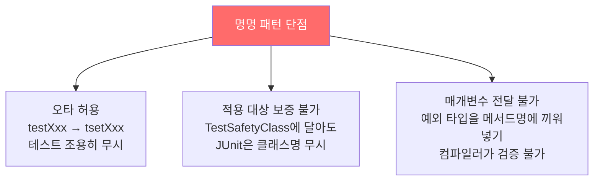
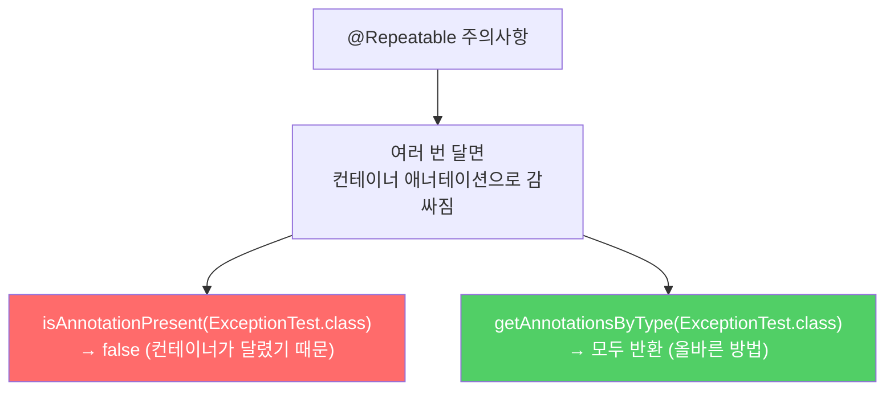
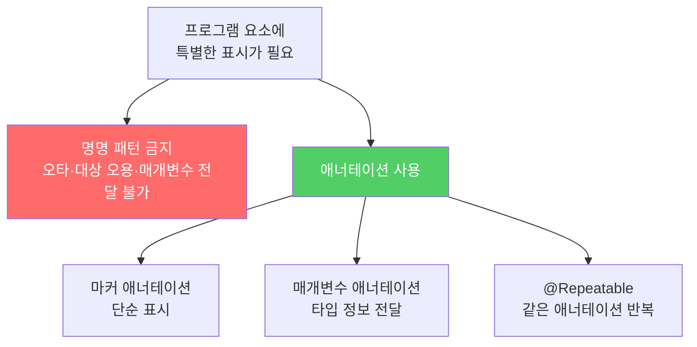

도구나 프레임워크가 특별히 처리해야 할 요소에 이름으로 표시하는 방식은 오타 하나로 조용히 실패합니다. 애너테이션이 이 모든 문제를 해결합니다.

---

## 1. 명명 패턴의 문제점

비유하자면 **직원에게 "이름을 test로 시작하게 바꾸면 자동으로 업무가 배정된다"고 구두로 전달하는 것**입니다. 오타가 나도 아무도 모르고, 팀 이름에 test를 붙여도 개인에게는 배정되지 않으며, 추가 정보를 이름에 끼워 넣기도 불편합니다.

JUnit 3까지는 테스트 메서드 이름을 `test`로 시작해야 했습니다.

```java
// 명명 패턴 — 오타 나면 조용히 무시됨
public void testSafetyOverride() { ... }   // 정상
public void tsetSafetyCheck() { ... }      // 오타 — JUnit 3은 그냥 무시
```

세 가지 단점이 있습니다.



---

## 2. 마커 애너테이션 — 가장 단순한 형태

비유하자면 **공식 도장(애너테이션)을 찍는 것**입니다. 도장 위치가 잘못되면(잘못된 요소에 사용) 컴파일러가 즉시 오류를 냅니다.

```java
import java.lang.annotation.*;

/**
 * 테스트 메서드임을 선언하는 애너테이션.
 * 매개변수 없는 정적 메서드 전용이다.
 */
@Retention(RetentionPolicy.RUNTIME)  // 런타임에도 유지
@Target(ElementType.METHOD)          // 메서드 선언에만 사용 가능
public @interface Test {
}
```

`@Retention`과 `@Target`처럼 애너테이션 선언에 다는 애너테이션을 **메타애너테이션**이라 합니다.

- `@Retention(RUNTIME)`: 생략하면 런타임에 애너테이션 정보가 사라져 도구가 인식 못함
- `@Target(METHOD)`: 클래스, 필드 등에 달면 컴파일 오류

```java
// 마커 애너테이션을 사용한 테스트 클래스
public class Sample {
    @Test public static void m1() { }                          // 성공
    @Test public static void m3() { throw new RuntimeException("실패"); } // 실패
    @Test public void m5() { }                                 // 잘못 사용 (인스턴스 메서드)
    @Test public static void m7() { throw new RuntimeException("실패"); } // 실패
    public static void m2() { }  // @Test 없음 — 도구가 무시
}
```

---

## 3. 애너테이션 처리기 — 리플렉션으로 @Test 발견

```java
public class RunTests {
    public static void main(String[] args) throws Exception {
        int tests = 0, passed = 0;
        Class<?> testClass = Class.forName(args[0]);

        for (Method m : testClass.getDeclaredMethods()) {
            if (m.isAnnotationPresent(Test.class)) {
                tests++;
                try {
                    m.invoke(null);
                    passed++;
                } catch (InvocationTargetException wrappedExc) {
                    // 테스트 메서드가 던진 실제 예외
                    System.out.println(m + " 실패: " + wrappedExc.getCause());
                } catch (Exception exc) {
                    // 인스턴스 메서드 등 잘못 사용한 경우
                    System.out.println("잘못 사용한 @Test: " + m);
                }
            }
        }
        System.out.printf("성공: %d, 실패: %d%n", passed, tests - passed);
    }
}
```

`InvocationTargetException` 외의 예외가 잡히면 `@Test`를 잘못 사용한 것입니다. 인스턴스 메서드, 매개변수가 있는 메서드 등이 해당됩니다.

---

## 4. 매개변수를 받는 애너테이션 — 특정 예외 기대

```java
// 특정 예외를 던져야만 성공하는 테스트용 애너테이션
@Retention(RetentionPolicy.RUNTIME)
@Target(ElementType.METHOD)
public @interface ExceptionTest {
    Class<? extends Throwable> value();  // 한정적 타입 토큰
}
```

`Class<? extends Throwable>`은 "Throwable을 확장한 모든 예외 타입을 수용한다"는 뜻으로, 한정적 타입 토큰의 활용 사례입니다.

```java
public class Sample2 {
    @ExceptionTest(ArithmeticException.class)
    public static void m1() {
        int i = 0;
        i = i / i;  // ArithmeticException 발생 → 성공
    }

    @ExceptionTest(ArithmeticException.class)
    public static void m2() {
        int[] a = new int[0];
        int i = a[1];  // ArrayIndexOutOfBoundsException → 실패 (다른 예외)
    }

    @ExceptionTest(ArithmeticException.class)
    public static void m3() { }  // 예외 없음 → 실패
}
```

---

## 5. 배열 매개변수 — 여러 예외 허용

```java
@Retention(RetentionPolicy.RUNTIME)
@Target(ElementType.METHOD)
public @interface ExceptionTest {
    Class<? extends Throwable>[] value();  // 배열로 변경
}

// 사용
@ExceptionTest({IndexOutOfBoundsException.class, NullPointerException.class})
public static void doubleBad() {
    List<String> list = new ArrayList<>();
    list.addAll(5, null);  // 둘 중 하나라도 던지면 성공
}
```

---

## 6. @Repeatable — 같은 애너테이션을 여러 번

Java 8부터 배열 대신 애너테이션을 반복해서 달 수 있습니다.

```java
// 반복 가능 애너테이션
@Retention(RetentionPolicy.RUNTIME)
@Target(ElementType.METHOD)
@Repeatable(ExceptionTestContainer.class)  // 컨테이너 애너테이션 지정
public @interface ExceptionTest {
    Class<? extends Throwable> value();
}

// 컨테이너 애너테이션 — 반드시 함께 정의해야 함
@Retention(RetentionPolicy.RUNTIME)
@Target(ElementType.METHOD)
public @interface ExceptionTestContainer {
    ExceptionTest[] value();
}

// 사용 — 같은 애너테이션을 두 번
@ExceptionTest(IndexOutOfBoundsException.class)
@ExceptionTest(NullPointerException.class)
public static void doublyBad() { ... }
```



처리 코드에서는 `isAnnotationPresent`로 단독 vs 컨테이너를 모두 검사하거나, `getAnnotationsByType`을 사용해야 합니다.

```java
// 반복 가능 애너테이션 처리 — 단독과 컨테이너 모두 확인
if (m.isAnnotationPresent(ExceptionTest.class)
        || m.isAnnotationPresent(ExceptionTestContainer.class)) {
    tests++;
    try {
        m.invoke(null);
        System.out.printf("테스트 %s 실패: 예외를 던지지 않음%n", m);
    } catch (Throwable wrappedExc) {
        Throwable exc = wrappedExc.getCause();
        int oldPassed = passed;
        ExceptionTest[] excTests = m.getAnnotationsByType(ExceptionTest.class);
        for (ExceptionTest excTest : excTests) {
            if (excTest.value().isInstance(exc)) {
                passed++;
                break;
            }
        }
        if (passed == oldPassed)
            System.out.printf("테스트 %s 실패: %s%n", m, exc);
    }
}
```

---

## 7. 요약



> 애너테이션으로 할 수 있는 일을 명명 패턴으로 처리할 이유는 없습니다. 일반 프로그래머가 애너테이션 타입을 직접 정의할 일은 드물지만, Java가 제공하는 애너테이션(`@Override`, `@SuppressWarnings` 등)은 반드시 활용하세요.

---

> 참조: 이펙티브 자바 3/E — 조슈아 블로크
