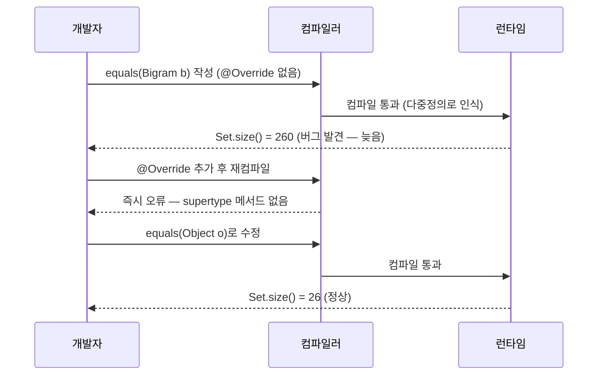
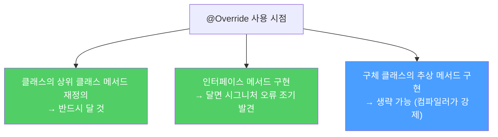

`@Override`는 상위 타입 메서드를 재정의했음을 컴파일러에게 알리는 선언입니다. 이 애너테이션 하나로 잡기 어려운 버그를 컴파일 시점에 잡아낼 수 있습니다.

---

## 1. @Override가 없으면 생기는 버그

비유하자면 **새 직원이 기존 업무 절차를 수정한다고 생각했는데 사실 새 절차를 만들어버린 것**입니다. 기존 절차는 여전히 살아있고 새 절차는 아무도 호출하지 않습니다.

```java
// 영어 알파벳 2개로 구성된 바이그램 클래스
public class Bigram {
    private final char first;
    private final char second;

    public Bigram(char first, char second) {
        this.first = first;
        this.second = second;
    }

    public boolean equals(Bigram b) {   // 버그: Object.equals 재정의 아님
        return b.first == first && b.second == second;
    }

    public int hashCode() {
        return 31 * first + second;
    }

    public static void main(String[] args) {
        Set<Bigram> s = new HashSet<>();
        for (int i = 0; i < 10; i++)
            for (char ch = 'a'; ch <= 'z'; ch++)
                s.add(new Bigram(ch, ch));
        System.out.println(s.size());  // 26을 기대했지만 260 출력!
    }
}
```

`equals(Bigram b)`는 `Object.equals(Object o)`를 **재정의(override)** 한 것이 아니라 **다중정의(overload)** 한 것입니다. `Object.equals`는 여전히 `==` 동일성 비교를 수행하므로, 같은 문자 쌍의 `Bigram` 인스턴스 10개가 각각 별개의 객체로 인식되어 260이 출력됩니다.

---

## 2. @Override로 즉시 발견

```java
@Override  // 추가
public boolean equals(Bigram b) {
    return b.first == first && b.second == second;
}
```

이렇게 하면 컴파일러가 즉시 오류를 냅니다.

```
Bigram.java: method does not override or implement a method from a supertype
    @Override public boolean equals(Bigram b) {
```

올바르게 수정하면 됩니다.

```java
@Override
public boolean equals(Object o) {
    if (!(o instanceof Bigram)) return false;
    Bigram b = (Bigram) o;
    return b.first == first && b.second == second;
}
```



---

## 3. 언제 @Override를 달아야 하나

**원칙: 상위 타입의 메서드를 재정의하는 모든 메서드에 달아라.**

예외가 하나 있습니다. 구체 클래스에서 상위 추상 클래스의 추상 메서드를 구현할 때는 생략해도 됩니다. 구현하지 않으면 컴파일러가 알려주기 때문입니다. 물론 달아도 나쁠 건 없습니다.



---

## 4. 인터페이스에서도 @Override를 달아라

Java 8부터 인터페이스에 디폴트 메서드가 추가될 수 있습니다. 인터페이스 메서드를 구현할 때도 `@Override`를 달면 시그니처가 올바른지 컴파일러가 검증해줍니다.

```java
// Set은 Collection을 확장하면서 새 메서드를 추가하지 않음
// 모든 메서드 선언에 @Override를 달아 실수로 메서드를 추가하지 않았음을 보장
public interface Set<E> extends Collection<E> {
    @Override int size();
    @Override boolean isEmpty();
    @Override boolean contains(Object o);
    // ...
}
```

---

## 5. 요약

> 재정의한 모든 메서드에 `@Override` 애너테이션을 의식적으로 달면, 실수했을 때 컴파일러가 즉시 알려줍니다. 예외는 단 하나, 구체 클래스에서 상위 클래스의 추상 메서드를 구현하는 경우에만 생략할 수 있습니다.

---

> 참조: 이펙티브 자바 3/E — 조슈아 블로크
