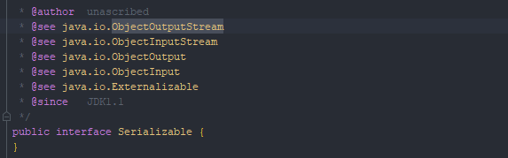

#### 🔗 마커 인터페이스(Marker Interface)

* **아무 메소드도 담고 있지 않고**, 단지 **자신을 구현하는 클래스가 특정 속성을 가짐을 표시**해주는 인터페이스를 **마커 인터페이스**라 한다.
  * ex) **Serializable** 인터페이스는 자신을 구현한 클래스의 인스턴스는 Objec tOutputStream을 통해 쓸(write) 수 있다고, 즉, 직렬화(serialization) 할 수 있다고 알려준다.




<hr>


##### 💎 마커 인터페이스는 구식이라고?

* **마커 애너테이션**이 등장하면서 **마커 인터페이스**는 구식이 되었다는 이야기를 들어보았을 것이다.

  * 하지만 사실이 아니다.

  

* **마커 인터페이스**는 <span style="color:red;">두 가지 면</span>에서 **마커 애너테이션보다 낫다**

  * 첫 번째, **마커 인터페이스**는 <span style="color:red;">이를 구현한 클래스의 인스턴스들을 구분하는 타입으로 쓸 수 있으나</span>, 마커 애너테이션은 그렇지 않다.

    * **마커 인터페이스는 어엿한 타입**이기 때문에 마커 애너테이션을 사용했다면 런타임에야 발견될 오류를 **컴파일타임에 잡을 수 있다.**

    

    * 자바의 직렬화는 **Serialzable** 마커 인터페이스를 보고 그 대상이 직렬화 할 수 있는 타입인지를 확인한다.

      * ex) **ObjectOutputStream.writeObject** 메소드는 당연히 인수로 받은 객체가 **Serializable**을 구현했을 거라고 가정한다.

      

      * 그런데 이 메소드는 **Serializable**이 아닌 **Object** 객체를 받도록 설계되었다.

    

    * 즉, 직렬화 할 수 없는 객체를 넘겨도 런타임에야 문제를 확인할 수 있다.

    

    * **마커 인터페이스를 사용하는 주요 이유가 <span style="color:red;">컴파일타임 오류 검출</span>인데**, 그 이점을 살리지 못한 것이다.


* 두 번째, **마커 인터페이스**는 <span style="color:red;">적용 대상을 더 정밀하게 지정할 수 있다.</span>

  * **적용 대상(@Target)**을 **ElementType.TYPE**로 선언한 애너테이션은 **모든 타입(클래스, 인터페이스, 열거 타입, 애너테이션)에 달 수 있다.**

  

  * 부착할 수 있는 타입을 더 세밀하게 제한하지는 못한다는 뜻이다.


<hr>


##### 💎 특정 인터페이스를 구현한 클래스에만 적용하고 싶은 마커가 있으면 어떡해?

* 이 마커를 인터페이스로 정의했다면 그냥 마킹하고 싶은 클래스에서만 그 인터페이스를 구현(인터페이스라면 확장)하면 된다.
  * 그러면 마킹된 타입은 자동으로 그 인터페이스의 하위 타입임이 보장된다.


<hr>


##### 💎 Set 인터페이스도 일종의 마커 인터페이스로 볼 수 있다고?

* 동의하지 않는 사람도 있겠지만, **Set** 인터페이스도 일종의 (제약이 있는) **마커 인터페이스**로 볼 수 있다.


* **Set은** **Collection**의 하위 타입에만 적용할 수 있으며, **Collection**이 정의한 메소드 외에는 새로 추가한 것이 없다.


* 보통은 **Set**을 마커 인터페이스로 생각하지 않는데, **add, equals, hashCode** 등 **Collection**의 메소드 몇 개의 규약을 살짝 수정했기 떄문이다.

  * <span style="color:red;">하지만</span> 특정 인터페이스의 하위 타입에만 적용할 수 있으며, 아무 규약에도 손대지 않은 마커 인터페이스는 충분히 있음직하다.

  

  * 이런 마커 인터페이스는 객체의 특정 부분을 불변식으로 규정하거나, 그타입의 인스턴스는 다른 클래스의 특정 메소드가 처리할 수 있다는 사실을 명시하는 용도로 사용할 수 있을 것이다


<hr>


##### 💎 마커 애너테이션이 마커 인터페이스보다 나은점은 뭔데?

* 마커 애너테이션이 마커 인터페이스보다 <span style="color:red;">나은 점</span>으로는 **거대한 애너테이션 시스템의 지원을 받는다는 점을 들 수 있다.**


* <span style="color:red;">따라서</span> **애너테이션을 적극 활용하는 프레임워크에서는 마커 애너테이션을 쓰는 쪽이 일관성을 지키는 데 유리할 것이다.**


<hr>


##### 💎 언제 마커 애너테이션, 언제 마커 인터페이쓰를 써야해 ?

* 클래스와 인터페이스 **외의 프로그램 요소(모듈, 패키지, 필드, 지역변수 등)** 에 마킹해야 할 때 **애너테이션을 쓸 수밖에 없다.**
  * 클래스와 인터페이스만이 인터페이스를 구현하거나 확장할 수 있기 때문이다.


* 마킹이 된 객체를 **매개변수로 받는 메소드를 작성할 일**이 있다면 **마커 인터페이스를 사용써야한다.**

  * 이렇게 하면 그 마커 인터페이스를 해당 메소드의 매개변수 타입으로 사용하여 컴파일타임에 오류를 잡아낼 수 있다.

  

  * 이런 메소드를 작성할 일은 절대 없다고 확신한다면 아마도 마커 애너테이션이 나은 선택 일 것이다.


* 애너테이션을 활발히 활용하는 프레임워크에서 사용하려는 마커라면 마커 애너테이션을 사용하는 편이 좋을 것이다.


<hr>


> 마커 인터페이스와 마커 애너테이션은 각자의 쓰임이 있다.
>
> 새로 추가하는 메소드 없이 단지 타입 정의가 목적이라면 마커 인터페이스를 선택하자.
>
> 
>
> 클래스나 인터페이스 외의 프로그램 요소에 마킹해야 하거나, 애너테이션을 적극 활용하는 프레임워크의 일부로 그 마커를 편입시키고자 한다면 마커 애너테이션이 올바른 손택이다.
>
>
> 적용 대상이 ElementType.TYPE인 마커 애너테이션을 작성하고 있다면, 잠시 여유를 갖고 정말 애너테이션으로 구현하는게 옳은지, 혹은 마커 인터페이스가 낫지는 않을지 생각해보자.


```
참조 - 이펙티브 자바 3/E - 조슈아 블로크
```

