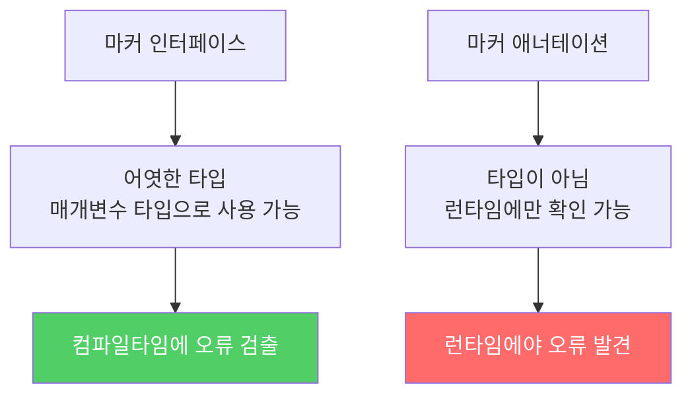
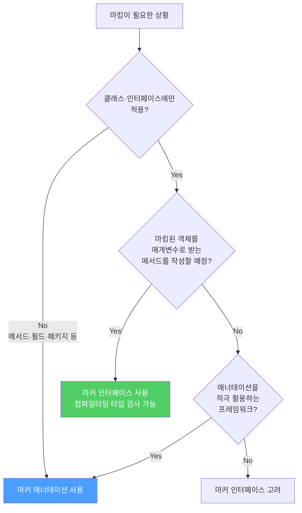

아무 메서드도 없이 클래스에 특정 속성을 부여하기 위한 수단으로 마커 인터페이스와 마커 애너테이션 중 어떤 것을 선택할지 기준이 있습니다.

---

## 1. 마커 인터페이스란?

비유하자면 **"이 박스는 깨지기 쉬운 물건"이라는 공식 라벨**입니다. 내용(메서드)은 없지만 그 라벨 자체가 타입 시스템의 일부가 됩니다.

```java
// Serializable — 메서드 없이 직렬화 가능함을 표시하는 마커 인터페이스
public interface Serializable {
}

// 사용
public class User implements Serializable {
    private String name;
    private int age;
}
```

`Serializable`을 구현한 클래스의 인스턴스는 `ObjectOutputStream`으로 직렬화할 수 있습니다. 마커 인터페이스는 이를 **타입 수준에서** 표현합니다.

---

## 2. 마커 인터페이스가 마커 애너테이션보다 나은 점

**장점 1 — 타입으로 사용 가능해 컴파일타임 오류 검출**


```mermaid
graph TD
    A["마커 인터페이스"] --> B["어엿한 타입\n매개변수 타입으로 사용 가능"]
    B --> C["컴파일타임에 오류 검출"]
    D["마커 애너테이션"] --> E["타입이 아님\n런타임에만 확인 가능"]
    E --> F["런타임에야 오류 발견"]
    style C fill:#51cf66,color:#fff
    style F fill:#ff6b6b,color:#fff
```

실제로 Java의 직렬화(`ObjectOutputStream.writeObject`)는 이 장점을 살리지 못한 반례입니다. 메서드 시그니처가 `Object`를 받도록 설계되어 직렬화 불가능한 객체를 넘겨도 런타임에야 `NotSerializableException`이 발생합니다. 마커 인터페이스를 매개변수 타입으로 활용했다면 컴파일 시점에 잡을 수 있었을 것입니다.

```java
// 현재 (컴파일타임 검증 없음)
public final void writeObject(Object obj) throws IOException { ... }

// 이렇게 설계했다면 더 좋았을 것
public final void writeObject(Serializable obj) throws IOException { ... }
// Serializable이 아닌 객체 전달 시 컴파일 오류!
```

**장점 2 — 적용 대상을 더 정밀하게 지정 가능**

`@Target(ElementType.TYPE)`으로 선언한 애너테이션은 모든 타입(클래스, 인터페이스, 열거 타입, 애너테이션)에 달 수 있습니다. 특정 인터페이스를 구현한 클래스에만 적용하고 싶다면 마커 인터페이스를 그 인터페이스의 하위 인터페이스로 정의하면 됩니다.

```java
// 특정 인터페이스를 구현한 클래스에만 마킹하고 싶은 경우
public interface FancyList extends List {
    // 아무 메서드 없음 — 그냥 List 구현체 중 "고급 목록"임을 표시
}

// FancyList를 구현한 클래스는 자동으로 List의 하위 타입임이 보장됨
```

---

## 3. 마커 애너테이션이 마커 인터페이스보다 나은 점

마커 애너테이션은 **거대한 애너테이션 시스템의 지원을 받습니다.** Spring, JPA 같은 프레임워크가 애너테이션 기반으로 작동하는 경우, 마커 애너테이션을 쓰는 쪽이 일관성을 유지하는 데 유리합니다.

또한 클래스·인터페이스 외의 요소(메서드, 필드, 패키지, 모듈, 지역변수)에 마킹해야 할 때는 인터페이스를 구현할 수 없으므로 **애너테이션을 쓸 수밖에 없습니다.**

---

## 4. 선택 기준


```mermaid
graph TD
    A["마킹이 필요한 상황"] --> B{"클래스·인터페이스에만\n적용?"}
    B -->|"No\n메서드·필드·패키지 등"| C["마커 애너테이션 사용"]
    B -->|"Yes"| D{"마킹된 객체를\n매개변수로 받는\n메서드를 작성할 예정?"}
    D -->|"Yes"| E["마커 인터페이스 사용\n컴파일타임 타입 검사 가능"]
    D -->|"No"| F{"애너테이션을\n적극 활용하는\n프레임워크?"}
    F -->|"Yes"| C
    F -->|"No"| G["마커 인터페이스 고려"]
    style E fill:#51cf66,color:#fff
    style C fill:#4a9eff,color:#fff
```

핵심 질문은 "마킹된 객체를 매개변수로 받는 메서드를 언젠가 작성할 것인가?"입니다. 그렇다면 마커 인터페이스를 사용해 컴파일타임 타입 검사의 이점을 누려야 합니다.

---

## 5. 요약

> 마커 인터페이스와 마커 애너테이션은 각자의 쓰임이 있습니다. 새로 추가하는 메서드 없이 단지 타입 정의가 목적이라면 마커 인터페이스를 선택하세요. 클래스나 인터페이스 외의 요소에 마킹해야 하거나 애너테이션을 적극 활용하는 프레임워크의 일부로 편입시키려면 마커 애너테이션이 올바른 선택입니다.

---

> 참조: 이펙티브 자바 3/E — 조슈아 블로크
