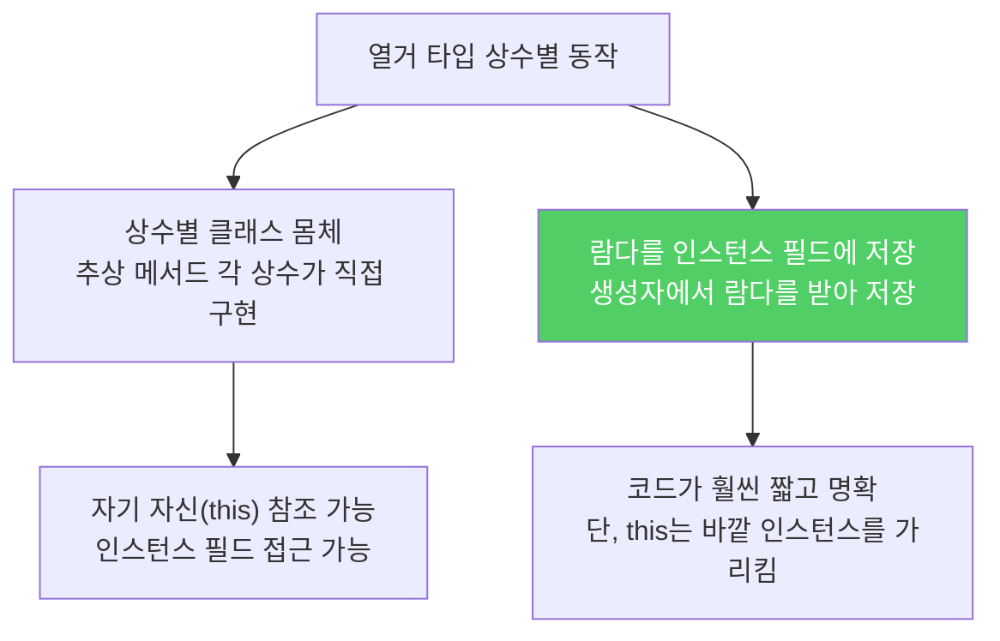
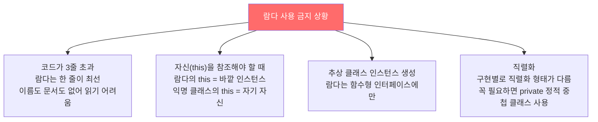

Java 8 이전에는 함수 객체를 익명 클래스로 만들었습니다. 이제는 람다가 그 역할을 훨씬 간결하게 수행합니다.

---

## 1. 익명 클래스 — 너무 장황하다

비유하자면 **심부름 하나를 시키려고 계약서를 한 장 작성하는 것**입니다. "두 문자열을 길이 순으로 비교해줘"라는 한 줄짜리 로직을 위해 클래스 선언 전체를 써야 했습니다.

```java
// 익명 클래스로 Comparator 구현 — 낡은 기법
Collections.sort(words, new Comparator<String>() {
    public int compare(String s1, String s2) {
        return Integer.compare(s1.length(), s2.length());
    }
});
```

전략 패턴처럼 함수 객체를 사용하는 설계에 익명 클래스가 충분했지만, 코드가 너무 길어서 Java는 함수형 프로그래밍에 적합하지 않았습니다.

---

## 2. 람다 — 간결하고 타입은 추론으로

```java
// 람다로 대체 — 타입은 컴파일러가 추론
Collections.sort(words,
    (s1, s2) -> Integer.compare(s1.length(), s2.length()));

// 비교자 생성 메서드로 더 간결하게
Collections.sort(words, comparingInt(String::length));

// List.sort()로 한층 더 짧게
words.sort(comparingInt(String::length));
```

람다의 타입(`Comparator<String>`), 매개변수 타입(`String`), 반환 타입(`int`)은 코드에 없지만 컴파일러가 추론합니다. **타입을 명시해야 코드가 더 명확할 때만 명시하고, 그렇지 않으면 생략하세요.**

타입 추론에 필요한 정보 대부분은 제네릭에서 옵니다. `words`가 `List<String>`이 아닌 로 타입 `List`였다면 컴파일 오류가 납니다.

---

## 3. 람다를 인스턴스 필드에 — 열거 타입에 적용



```java
// 람다를 인스턴스 필드에 저장 — 상수별 동작 구현
public enum Operation {
    PLUS  ("+", (x, y) -> x + y),
    MINUS ("-", (x, y) -> x - y),
    TIMES ("*", (x, y) -> x * y),
    DIVIDE("/", (x, y) -> x / y);

    private final String symbol;
    private final DoubleBinaryOperator op;

    Operation(String symbol, DoubleBinaryOperator op) {
        this.symbol = symbol;
        this.op = op;
    }

    @Override public String toString() { return symbol; }

    public double apply(double x, double y) {
        return op.applyAsDouble(x, y);
    }
}
```

상수별 클래스 몸체 방식보다 훨씬 간결합니다. 단, 열거 타입 생성자에서의 람다는 열거 타입의 인스턴스 멤버에 접근할 수 없습니다. 인스턴스는 런타임에 만들어지지만 생성자 인수 타입은 컴파일타임에 추론되기 때문입니다.

---

## 4. 람다를 쓰면 안 되는 경우



상수별 동작이 복잡하거나 인스턴스 필드·메서드를 써야 한다면 상수별 클래스 몸체를 사용해야 합니다.

---

## 5. 요약

> 자바 8부터 작은 함수 객체를 구현하는 데 람다를 사용하세요. 익명 클래스는 함수형 인터페이스가 아닌 타입의 인스턴스를 만들 때만 사용하세요. 람다는 1줄, 최대 3줄 이내로 유지하고, 길어진다면 별도 메서드로 추출하세요.

---

> 참조: 이펙티브 자바 3/E — 조슈아 블로크
